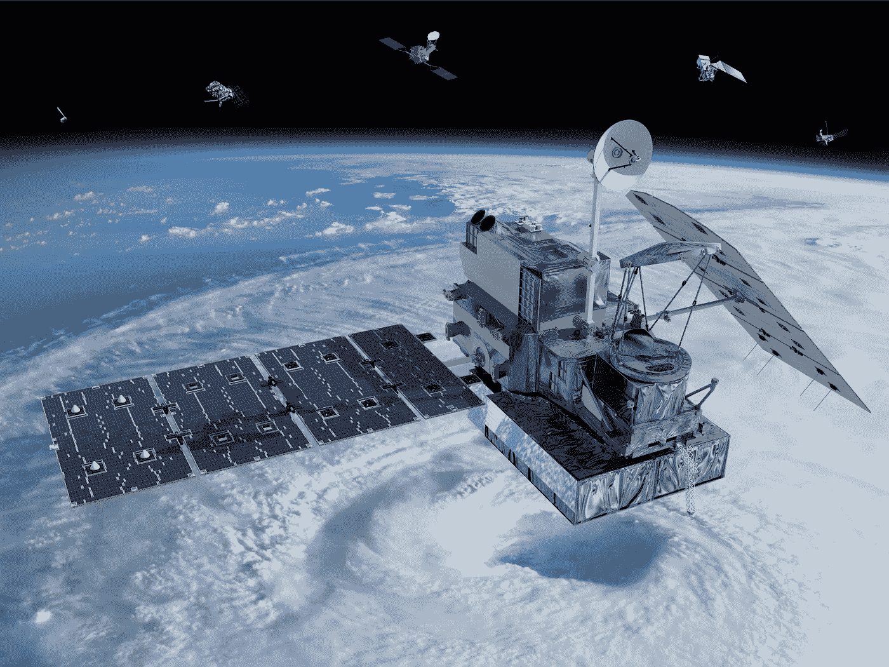
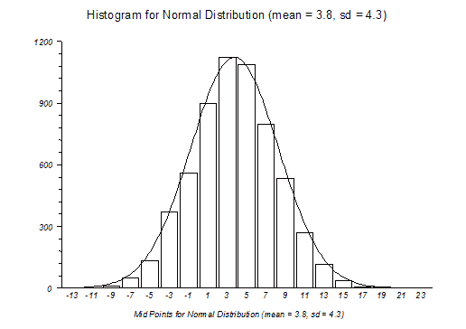
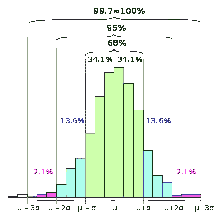
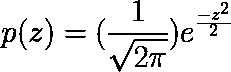
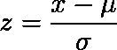
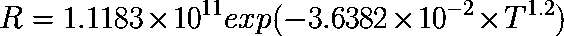
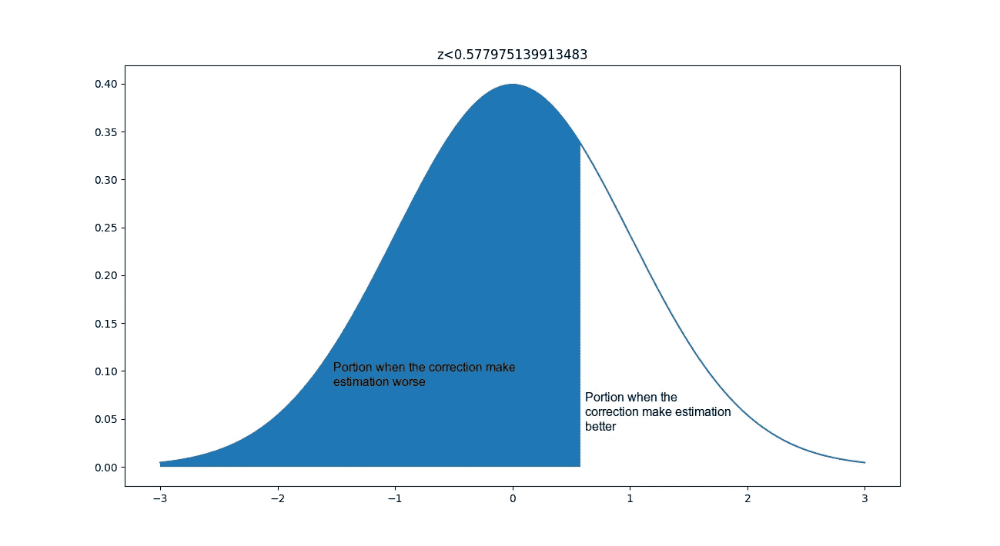

# p 值在起作用:可以肯定地说视差校正真的提高了卫星雨估计算法的精度吗？

> 原文：<https://towardsdatascience.com/p-value-in-action-is-it-safe-to-say-that-parallax-correction-really-improve-the-accuracy-of-1f388626d037?source=collection_archive---------20----------------------->



source: [https://planetary.s3.amazonaws.com/assets/images/spacecraft/2014/20140227_nasa_gpm.jpg](https://planetary.s3.amazonaws.com/assets/images/spacecraft/2014/20140227_nasa_gpm.jpg)

p 值到底是什么？我真的花了很长时间才搞清楚这个值的概念。根据我的经验，我认为了解 p 值的最佳方法是通过一个真实的例子。这就是为什么在这篇文章中，我将使用一个真实的例子来解释 p 值，我真的想证明这一点。但在此之前，我将解释一下关于**另一个使 p 值相关的概念或理论，即零假设和正态分布**。还将解释卫星降雨估计算法和视差校正的概念。

## 虚假设

零假设是一个假设，暗示我们非常怀疑我们的假设**又名魔鬼代言人**。零假设的反义词是另一个假设，或者说我们的假设是正确的。因此，在这种情况下，我们的零假设是**视差校正没有提高卫星雨估计算法**的精度，而另一个假设是**视差校正提高了卫星雨估计算法**的精度。

## 正态分布

在我个人的理解中，正态分布就是在任何常态下都会正常发生的**分布。如果我们正在收集足够的数据，数据**的直方图将会以数据**的平均值为中心形成一个钟形。**



source: [https://www.statsdirect.com/help/resources/images/normalhistogram.gif](https://www.statsdirect.com/help/resources/images/normalhistogram.gif)

正态分布**有两个属性，均值(μ)和标准差(σ)** 。从一个经验实验来看，**如果我们获取一个非常大的数据，并根据它制作一个直方图**，它将向我们显示:

*   大约 68%的值落在平均值的一个标准偏差内。
*   大约 95%的值落在平均值的两个标准偏差范围内。
*   大约 99.7% —在平均值的三个标准偏差范围内。



source: [https://upload.wikimedia.org/wikipedia/commons/thumb/2/22/Empirical_rule_histogram.svg/450px-Empirical_rule_histogram.svg.png](https://upload.wikimedia.org/wikipedia/commons/thumb/2/22/Empirical_rule_histogram.svg/450px-Empirical_rule_histogram.svg.png)

## p 值

在正态分布中，超过 3σ如果您想知道数据的百分比，您可以使用此公式，其原理是考虑正态分布钟形曲线的形状:



这就是 p 值的定义。在正态分布环境中， **p 值只是基于 z 值**的钟形曲线中的一部分数据。z 值是在标准偏差单位中重新调整的真实数据的**值。**



x is a real data

因此，当您将数据转换为 z 值时，**钟形曲线的中心不再是数据的平均值，而是零**。现在，我们知道了 p 值的概念，但在没有实际例子的情况下仍然有些模糊。在我们开始真正的例子之前，我将稍微解释一下卫星的视差校正和卫星降雨估计算法。

## 卫星雨量估计算法

这是一套算法，用来估计在气象卫星范围内某处的降雨量。气象卫星是一种捕捉地球上各种频率电磁波的卫星(所有温度高于 0 开尔文的物质实际上都在辐射各种频率的电磁波，这取决于该物质的温度)。从地球辐射出来的电磁波代表了地球的外部温度。**当地球顶部是一朵云时，卫星实际上捕捉到了云的温度**。但是当没有云的时候，它会捕捉陆地或海洋的温度(云的温度会比陆地或海洋冷)。

**气象卫星捕捉云层的能力被用来估计云层下面的降雨量**。一种最简单的降雨量估算算法叫做自动估算器。基于这篇论文，我们可以根据这个公式来估算某个地区的降雨量。



其中 T 是卫星捕获的温度，基于红外通道**。**

## 视差修正

粗略地说，为了计算校正，我们需要**大气递减率来估计云的高度、云相对卫星的位置以及观测云的卫星的倾斜角**。为什么我们需要视差纠正？简而言之，地球的曲率使一切变得复杂，云不只是一些简单的扁平物体，它有高度，这些**导致一切都变得有点错位**。反正如果你想了解更多关于视差纠正的知识，可以[查看这个参考文献](https://www.academia.edu/35505495/Teknis_Koreksi_Parallaks_Satelit_Himawari)(印尼语)。作者是我工作单位的资深同事，他对气象卫星的估计算法和视差纠正非常有经验。事实上，我后来在实验中做视差纠正计算的那部分脚本就是来自于他。

## 实验

在这个实验中，我将把卫星的范围从一个区域限制到仅仅一个点。因为这个实验的验证是用雨量计。实验开始前，我们必须:

1.  定义零假设，那就是"**视差改正不提高卫星雨估计算法的精度"**所以**另一个假设是**"视差改正提高卫星雨估计算法的精度"。****
2.  定义**阿尔法值**。常见的 alpha 值是 0.05 和 0.01，但实际上，这取决于您的实验。我不知道这个选择是否正确，但在这个实验中，我选择 **0.05** 。

最后，也是最重要的，但在执行 p 值测试的义务之外，是我们如何进行计算，以确定修正后估计变得更好还是更差。很简单，首先我们**计算自动估计器的估计值和自动估计器在雨量计**校正后的估计值之间的差值的绝对值(真实数据)。如果**值为正(> 0)，估计的降雨量变得更好**，否则，如果**值为负(< 0)，估计变得更差**。

在数据科学中，**原始数据总是非常“脏”**因此，我在这个实验中的全套脚本(用于清理和合并数据)充满了“幻数”，也就是一个非常有条件的常数，它只是为了这个实验而存在。所以在这里，我只是分享一个已经清理的数据和脚本来做自动估计计算和视差纠正。

你可以在这里下载[‘干净’的数据](https://github.com/genomexyz/p-value_experiment/blob/master/alldatastat.xlsx)。自动估算器和视差纠正脚本可以在这里下载[。自动估算器和视差脚本的输入是来自高知大学的 PGM 数据。下载一批数据的指令也可以在他们的网站上。](https://github.com/genomexyz/p-value_experiment/blob/master/AEcor.py)

在我之前已经提到的干净数据中，我已经进行了获得 z 值 0 所需的所有计算，即 **0.5779751399** 。这个值远远大于我们的 alpha 值。所以结果是**我们不能拒绝零假设**。我们不能消除我们的疑虑，说视差校正真的提高了自动估算器算法的准确性是不安全的。

如果我们基于正态分布画出 0 及以下的 z 值，会得到如下图。



这是制作上图的脚本。

```
#!/usr/bin/python3from scipy.stats import norm
import numpy as np
import matplotlib.pyplot as plt def draw_z_score(x, cond, mu, sigma, title):
 y = norm.pdf(x, mu, sigma)
 z = x[cond]
 plt.plot(x, y)
 plt.fill_between(z, 0, norm.pdf(z, mu, sigma))
 plt.title(title)
 plt.show()x = np.arange(-3,3,0.001)
z0 = 0.577975139913483
draw_z_score(x, x<z0, 0, 1, 'z<%s'%(str(z0)))
```

这就是实验的结论。你觉得怎么样？是我的脚本有错误还是计算视差修正的假设有错误。我已经提到脚本计算自动估计器和视差纠正之前，你可以阅读它，并告诉我，如果在计算中有错误。

## 参考:

[https://www . statistics show to . data science central . com/experimental-rule-2/](https://www.statisticshowto.datasciencecentral.com/empirical-rule-2/)，2019 年 7 月 16 日访问

https://www.statsdirect.com/help/distributions/normal.htm，2019 年 7 月 16 日进入

https://goodcalculators.com/p-value-calculator/[，2019 年 7 月 16 日接入](https://goodcalculators.com/p-value-calculator/)

[https://www . academia . edu/35505495/tek NIS _ Kore ksi _ Parallaks _ Satelit _ hima wari](https://www.academia.edu/35505495/Teknis_Koreksi_Parallaks_Satelit_Himawari)，2019 年 7 月 18 日访问

[http://weather.is.kochi-u.ac.jp/archive-e.html](http://weather.is.kochi-u.ac.jp/archive-e.html)，2019 年 8 月 16 日接入

Rani、Nurhastuti Anjar、Aulia Khoir 和 Sausan Yulinda Afra。"使用基于 Himawari 8 卫星云顶温度的自动估算器进行的降水估算与旁卡平站的降水观测的比较."*可持续人类圈国际研讨会论文集*。2017.