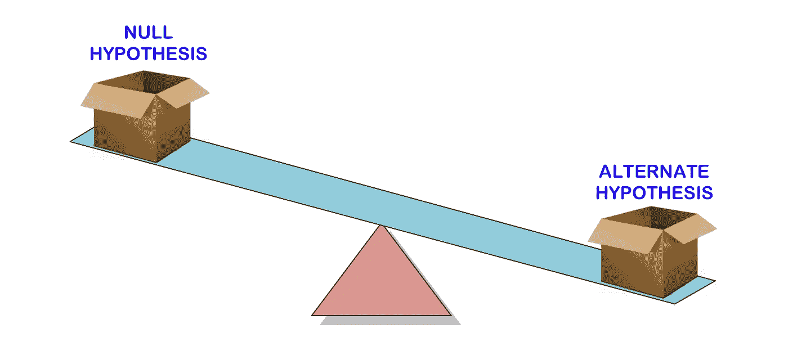
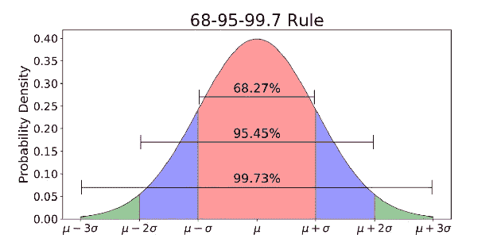
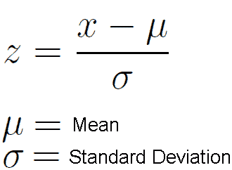
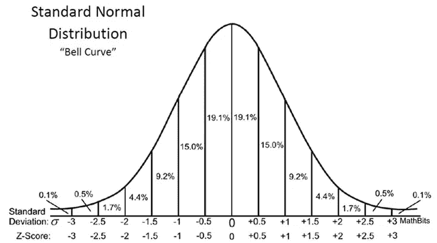
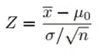

# 数据科学家解释的 p 值

> 原文：<https://towardsdatascience.com/p-values-explained-by-data-scientist-f40a746cfc8?source=collection_archive---------0----------------------->

## 对于数据科学家来说

我记得当我作为暑期学生在 CERN 进行我的第一次海外实习[时，在确认希格斯玻色子](/my-journey-from-physics-into-data-science-5d578d0f9aa6)满足[【五西格马】阈值](https://blogs.scientificamerican.com/observations/five-sigmawhats-that/) **(这意味着 p 值为 0.0000003)后，大多数人仍在谈论希格斯玻色子的[发现。](https://home.cern/science/physics/higgs-boson)**

当时我对 p 值、假设检验甚至统计学意义一无所知。

你是对的。

我去谷歌搜索了 p 值这个词，我在维基百科[上找到的东西让我更加困惑…](https://en.wikipedia.org/wiki/P-value)

> 在统计假设检验中，***p*-值**或**概率值**是对于给定的统计模型，当零假设为真时，统计汇总(如两个比较组间样本均值差的绝对值)大于或等于实际观察结果的概率。
> 
> — [维基百科](https://en.wikipedia.org/wiki/P-value)

干得好维基百科。

好吧。我最终没有真正理解 p 值的真正含义。

直到现在，在进入数据科学领域后，我终于开始理解 p 值的意义以及它如何在某些实验中用作决策工具的一部分。

因此，我决定**在本文中解释 p 值以及如何在假设检验中使用它们**，希望能让你对 p 值有一个更好更直观的理解。

虽然我们不能跳过对其他概念的基本理解和 p 值的定义，但我保证我会以直观的方式进行解释，而不会用我遇到的所有技术术语来轰炸你。

本文共有四个部分，从构建假设检验到理解 p 值并以此指导我们的决策过程，向您展示一幅完整的画面。我强烈建议您通读所有这些内容，以便对 p 值有一个详细的了解:

1.  **假设检验**
2.  **正态分布**
3.  **什么是 P 值？**
4.  **统计显著性**

会很有趣的。😉

我们开始吧！

# 1.假设检验

[Hypothesis Testing](https://www.crazyegg.com/blog/glossary/hypothesis-testing/)

在我们谈论 p 值意味着什么之前，让我们先来了解一下**假设检验**，其中 **p 值**用于确定我们结果的**统计显著性**。

我们的最终目标是确定结果的统计意义。

统计学意义建立在这三个简单的概念上:

*   假设检验
*   正态分布
*   p 值

[**假设检验**](https://www.statisticshowto.datasciencecentral.com/probability-and-statistics/hypothesis-testing/#HTMean) 用于检验利用样本数据对一个总体作出的断言*(***)*的有效性。 ***替代假设*** 是当零假设被断定为不真实时，你会相信的假设。*

*换句话说，我们将做出一个断言*(零假设)*，并使用一个样本数据来检验该断言是否有效。如果这个主张无效，那么我们将选择我们的*替代假设*。就这么简单。*

*为了知道一个声明是否有效，我们将使用 p 值来衡量证据的强度，以查看它是否具有统计显著性。如果证据支持*替代假设*，那么我们将拒绝*零假设*并接受*替代假设*。这将在后面的部分中进一步解释。*

*让我们用一个例子来使这个概念更清楚，这个例子将在本文中用于其他概念。*

*🍕 🍕 [**举例**](https://www.dummies.com/education/math/statistics/what-a-p-value-tells-you-about-statistical-data/) **:** 假设一家披萨店声称他们的送货时间平均为 30 分钟或更短，但你认为时间比这还长。因此，您进行了假设检验，并随机抽取了一些交货时间来检验这一说法:*

*   ***零假设** —平均交付时间为 30 分钟或更少*
*   ***替代假设** —平均交货时间大于 30 分钟*

*这里的目标是确定从我们的样本数据中找到的证据更好地支持了哪一种主张——无效的还是替代的。*

*我们将使用 [**单尾检验**](https://stats.idre.ucla.edu/other/mult-pkg/faq/general/faq-what-are-the-differences-between-one-tailed-and-two-tailed-tests/) ，因为我们**只关心平均交付时间是否大于 30 分钟**。我们将忽略另一个方向的可能性，因为平均交付时间低于或等于 30 分钟的结果更可取。我们在这里想要测试的是，平均交付时间是否有可能大于 30 分钟。换句话说，我们想知道披萨店是否对我们撒了谎。😂*

*进行假设检验的一种常见方法是使用 [**Z-test**](https://www.analyticsvidhya.com/blog/2015/09/hypothesis-testing-explained/) 。在这里，我们不会进入细节，因为我们想有一个高层次的了解表面上正在发生的事情，然后我们潜入更深。*

# *2.正态分布*

**

*[Normal Distribution with mean μ and standard deviation σ](/understanding-the-68-95-99-7-rule-for-a-normal-distribution-b7b7cbf760c2)*

*正态分布是一个[概率密度函数](/how-to-find-probability-from-probability-density-plots-7c392b218bab?source=friends_link&sk=086eae07d154a0e263f3bb7bc85ac2c8)用于查看数据分布。*

*正态分布有两个参数—平均值(μ)和标准差，也称为σ。*

***平均值**是分布的中心趋势。它定义了正态分布的峰值位置。**标准偏差**是可变性的度量。它决定了这些值与平均值的差距。*

*正态分布通常与`[**68-95-99.7 rule**](https://en.wikipedia.org/wiki/68%E2%80%9395%E2%80%9399.7_rule)`(上图)相关联。*

*   *68%的数据在平均值(μ)的 1 个标准偏差(σ)内*
*   *95%的数据在平均值(μ)的 2 个标准偏差(σ)以内*
*   *99.7%的数据在平均值(μ)的 3 个标准偏差(σ)内*

*还记得我在开头提到的发现希格斯玻色子的[“五西格马”阈值](https://blogs.scientificamerican.com/observations/five-sigmawhats-that/)吗？5 西格玛大约是***99.9999426696856%***的数据，以在科学家证实发现希格斯玻色子之前命中。这是为避免任何潜在的错误信号而设定的严格阈值。*

*酷毙了。现在你可能想知道，“正态分布如何应用于我们之前的假设检验？”*

*因为我们使用 Z-test 来进行假设检验，所以我们需要计算**(将在我们的 [**检验统计**](https://www.statisticshowto.datasciencecentral.com/test-statistic/) 中使用)，这是数据点平均值的标准偏差数。在我们的例子中，**每个数据点都是我们收集的披萨配送时间。*****

******

***[Formula to calculate Z-score](https://www.thoughtco.com/z-scores-worksheet-3126534) for each data point***

***请注意，当我们计算了每个披萨配送时间的所有 Z 分数并绘制了如下的**标准正态分布**曲线时，X 轴上的单位将从分钟变为标准偏差单位，因为我们已经通过减去平均值并除以其标准偏差对变量进行了**标准化(参见上面的公式)。*****

***查看标准正态分布曲线非常有用，因为我们可以将测试结果与标准偏差中具有标准化单位的“正常”总体进行比较，尤其是当我们有一个具有不同单位的变量时。***

******

***[Standard Normal Distribution for Z-scores](https://mathbitsnotebook.com/Algebra2/Statistics/STzScores.html)***

***Z 分数可以告诉我们总体数据与平均人口相比的位置。***

***我喜欢 Koehrsen 这样说—**Z 值越高或越低，结果就越不可能是偶然发生的，结果就越有可能是有意义的。*****

> ***但是，有多高(或多低)被认为有足够的说服力来量化我们的结果有多大意义呢？***

## ***👊🏼**笑点*****

***这就是我们需要解决这个难题的最后一个项目——**p 值**，并检查我们的结果是否基于 [**显著性水平**(也称为*α*)](https://blog.minitab.com/blog/adventures-in-statistics-2/understanding-hypothesis-tests-significance-levels-alpha-and-p-values-in-statistics)在我们开始实验之前，我们设置了*。****

# ***3.什么是 P 值？***

***p-value beautifully explained by [Cassie Kozyrkov](https://medium.com/u/2fccb851bb5e?source=post_page-----f40a746cfc8--------------------------------)***

***最后……这里说的是 p 值！***

***前面所有的解释都是为了搭建舞台，把我们引向这个 p 值。我们需要之前的上下文和步骤来理解这个神秘的(实际上并不神秘)p 值，以及它如何导致我们对假设检验的决策。***

***如果你已经做到了这一步，请继续阅读。因为这部分是最令人兴奋的部分！***

***与其用[维基百科](https://en.wikipedia.org/wiki/P-value)(对不起维基百科)给出的定义来解释 p 值，不如用我们的上下文来解释——披萨配送时间！***

***回想一下，我们随机抽样了一些比萨饼的交付时间，目标是检查平均交付时间是否大于 30 分钟。如果最终证据支持比萨饼店的说法(平均送货时间为 30 分钟或更少)，那么我们不会拒绝零假设。否则，我们会拒绝无效假设。***

***因此，p 值的任务是回答这个问题:***

> *****如果我生活在一个披萨外卖时间不超过 30 分钟的世界里(零假设成立)，我在现实生活中的证据会有多令人惊讶？*****

***p 值用一个数字来回答这个问题——**概率**。***

***p 值越低，证据越令人惊讶，我们的零假设看起来就越荒谬。***

***当我们对自己的无效假设感到可笑时，我们该怎么办？我们拒绝这一点，而是选择我们的替代假设。***

***如果 p 值低于预定的**显著性水平**(人们称之为 *alpha* ，我称之为*荒谬的阈值—* 不要问我为什么，我只是觉得我更容易理解)，那么我们拒绝零假设。***

***现在我们明白 p 值是什么意思了。让我们将这一点应用到我们的案例中。***

## ***🍕披萨配送时间的 p 值🍕***

***现在我们已经收集了一些交货时间样本，我们进行计算，发现平均交货时间**增加了 10 分钟，p 值为 0.03** 。***

***这意味着**在一个披萨交付时间为 30 分钟或更少的世界**(**零假设为真**)，有 **3%的几率**我们会看到由于随机噪声导致平均交付时间**至少延长 10 分钟。*****

***p 值越低，结果越有意义，因为它不太可能是由噪声引起的。***

***在我们的案例中，大多数人对 p 值有一个普遍的误解:***

> ***p 值为 0.03 意味着有 3%(概率百分比)的结果是由于偶然的**，这不是真的**。***

***人们常常希望有一个明确的答案(包括我)，这就是我如何让自己困惑了很长时间来解读 p 值。***

> ***p 值不能证明任何事情。这只是一种利用惊喜作为做出合理决定的基础的方式。***
> 
> ***卡西·科济尔科夫***

## *****下面是我们如何使用 p 值 0.03 来帮助我们做出合理的决定(重要):*****

*   ***想象一下，我们生活在一个平均送货时间总是 30 分钟或更少的世界——因为我们相信比萨饼店(我们最初的信念)！***
*   ***在分析了收集到的样本交付次数后，p 值 0.03 低于显著性水平 0.05(假设我们在实验之前设置了这个)，我们可以说结果是 ***统计显著*** 。***
*   ***因为我们一直相信比萨饼店能够履行其承诺，在 30 分钟或更短时间内交付比萨饼，我们现在需要思考这一信念是否仍然有意义，因为结果告诉我们比萨饼店未能履行其承诺，并且结果是 ***统计显著性*** *。****
*   ***那我们该怎么办？首先，我们试图想出每一种可能的方法来使我们最初的信念(零假设)有效。**但是因为比萨饼店慢慢地得到了其他人的差评，而且它经常给出糟糕的借口导致交货延迟，甚至我们自己都觉得为比萨饼店辩护是荒谬的，因此，我们决定拒绝零假设。*****
*   ***最后，随后合理的决定是，选择不再购买那个地方的任何披萨。***

***到现在为止，你可能已经意识到了一些事情…根据我们的上下文，p 值不用于证明或证明任何事情。***

***在我看来， **p 值是在结果*具有统计显著性*** 时，用来挑战我们最初信念(零假设)的工具。当我们对自己的信念感到可笑时(假设 p 值显示结果具有统计学意义)，我们会抛弃最初的信念(拒绝零假设)并做出合理的决定。***

# ***4.统计显著性***

***最后，这是最后一个阶段，我们将所有内容放在一起，测试结果是否具有 ***统计显著性。******

***仅有 p 值是不够的，我们需要设置一个阈值(又名**显著性水平——阿尔法**)。阿尔法应该总是在实验前设置，以避免偏见。如果观察到的 p 值低于α，那么我们得出结论，结果是 ***具有统计显著性。******

***经验法则是将 alpha 设置为 0.05 或 0.01(同样，该值取决于您手头的问题)。***

***如前所述，假设我们在开始实验前将α设置为 0.05，由于 0.03 的 p 值低于α，因此获得的结果具有统计学意义。***

*****作为参考，下面是整个实验的******:**的基本步骤*****

1.  *****陈述无效假设*****
2.  *****陈述另一个假设*****
3.  *****确定要使用的α值*****
4.  *****找到与你的阿尔法水平相关的 Z 分数*****
5.  *****使用此公式查找测试统计*****
6.  *****如果检验统计值小于α水平的 Z 得分(或 p 值小于α值)，则拒绝零假设。否则，不要拒绝零假设。*****

**********

*****Formula to calculate test statistic for Step 5*****

*****如果你想了解更多关于统计学意义的知识，可以看看这篇文章——由[威尔·科尔森](https://medium.com/u/e2f299e30cb9?source=post_page-----f40a746cfc8--------------------------------)撰写的[统计学意义解释](/statistical-significance-hypothesis-testing-the-normal-curve-and-p-values-93274fa32687)。*****

# *****最后的想法*****

**********

*****[(Source)](https://unsplash.com/photos/JfolIjRnveY)*****

*****感谢您的阅读。*****

*****这里有很多东西要消化，不是吗？*****

*****我不能否认，p 值对许多人来说是天生的困惑，我花了很长时间才真正理解和欣赏 p 值的意义，以及作为一名数据科学家，它们如何应用于我们的决策过程。*****

*****但是不要过于依赖 p 值，因为它们只帮助整个决策过程的一小部分。*****

*****我希望你已经发现 p 值的解释是直观的，并有助于你理解 p 值的真正含义以及它们如何用于假设检验。*****

*****归根结底，p 值的计算很简单。当我们想要解释假设检验中的 p 值时，困难就来了。希望最难的部分现在对你来说至少变得稍微容易一点。*****

*****如果你想了解更多关于统计学的知识，我强烈推荐你读这本书(我现在正在读这本书！)— [**数据科学家实用统计学**](https://amzn.to/2l9vhF1) 专为数据科学家理解统计学的基本概念而编写。*****

*****一如既往，如果您有任何问题或意见，请随时在下面留下您的反馈，或者您可以随时通过 [LinkedIn](https://www.linkedin.com/in/admond1994/) 联系我。在那之前，下一篇文章再见！😄*****

## *****关于作者*****

*****[**Admond Lee**](https://www.linkedin.com/in/admond1994/) 目前是[**Staq**](https://www.trystaq.com)**—**的联合创始人/首席技术官，该平台是东南亚首屈一指的商业银行应用编程接口平台。*****

*****想要获得免费的每周数据科学和创业见解吗？*****

*****[**加入 Admond 的电子邮件简讯——Hustle Hub**](https://bit.ly/3pGF8jv)，每周他都会在那里分享可行的数据科学职业技巧、错误&以及从创建他的初创公司 Staq 中学到的东西。*****

*****你可以在 [LinkedIn](https://www.linkedin.com/in/admond1994/) 、 [Medium](https://medium.com/@admond1994) 、 [Twitter](https://twitter.com/admond1994) 、[脸书](https://www.facebook.com/admond1994)上和他联系。*****

***** [## 阿德蒙德·李

### 让每个人都能接触到数据科学。Admond 正在通过先进的社交分析和机器学习，利用可操作的见解帮助公司和数字营销机构实现营销投资回报。

www.admondlee.com](https://www.admondlee.com/)*****