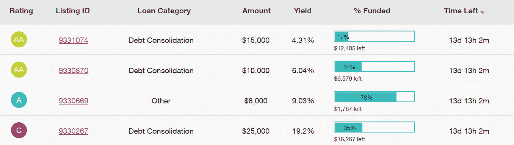
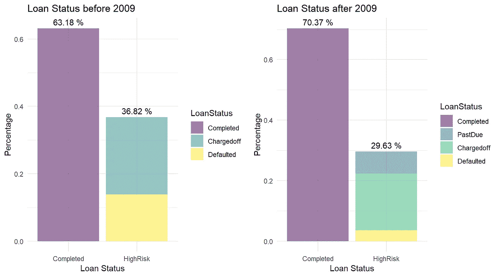
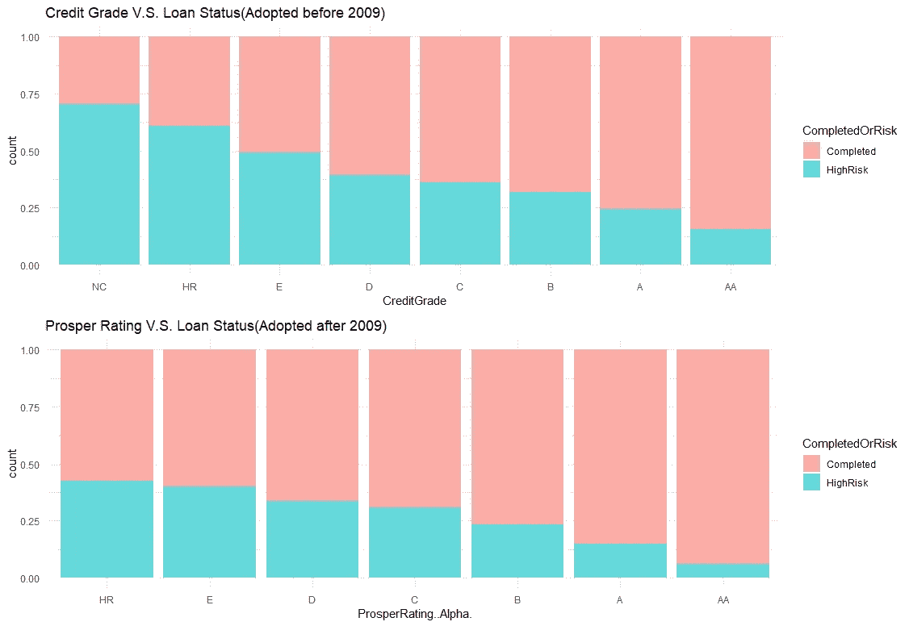
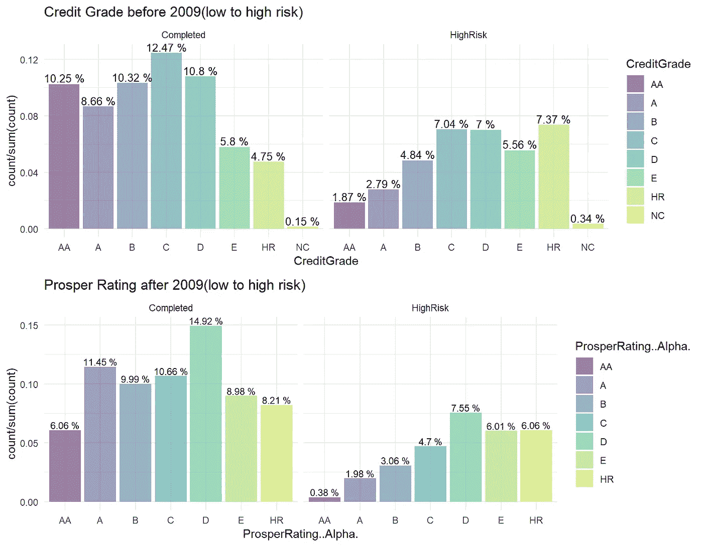
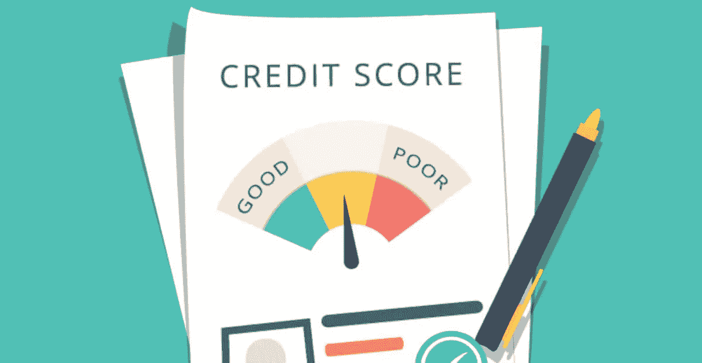
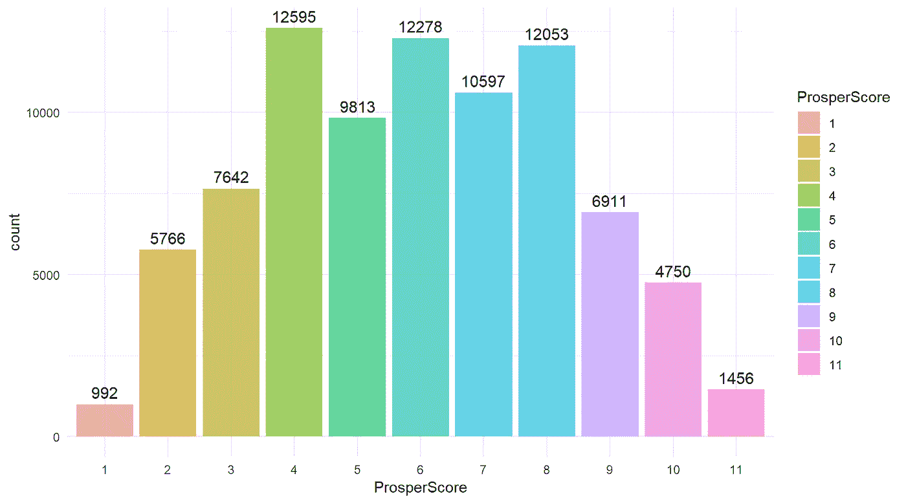
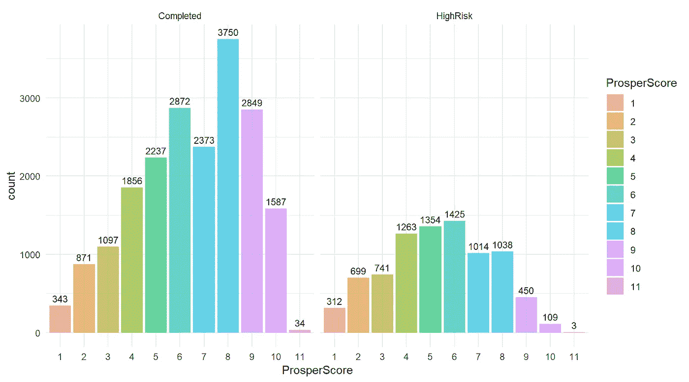
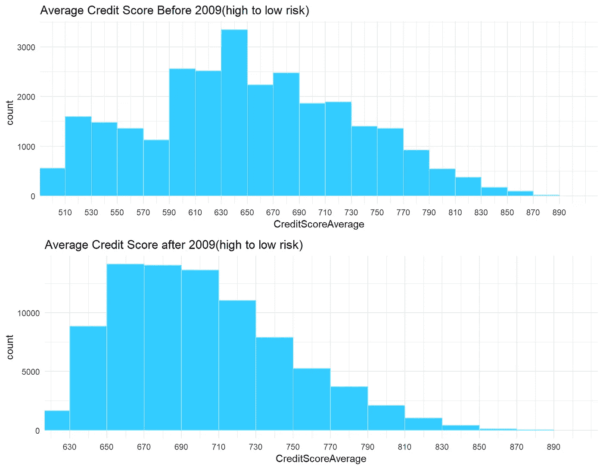
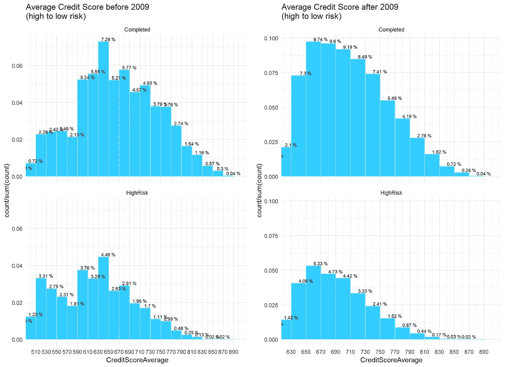
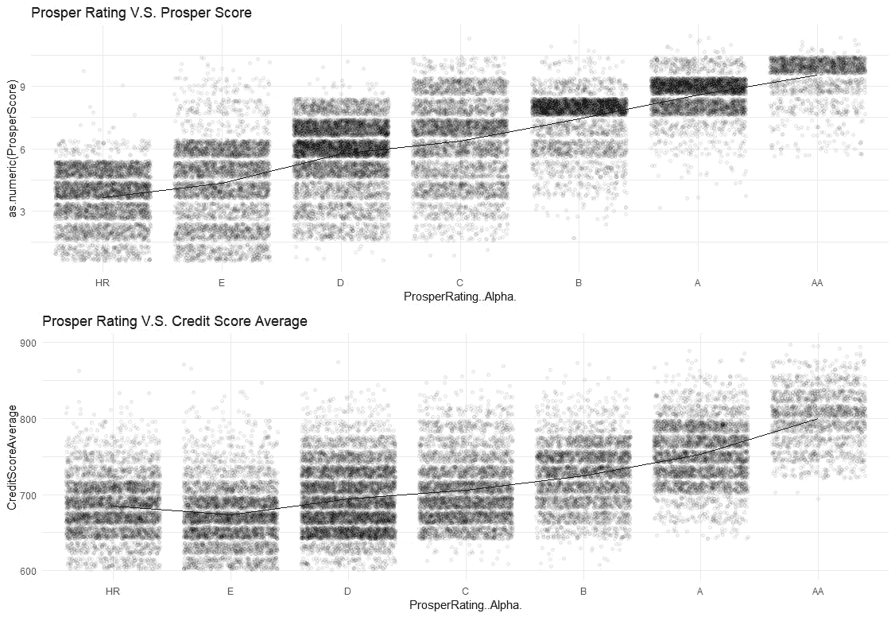

# P2P 借贷平台数据分析:R 中的探索性数据分析—第一部分

> 原文：<https://towardsdatascience.com/p2p-lending-platform-data-analysis-exploratory-data-analysis-in-r-part-1-32eb3f41ab16?source=collection_archive---------10----------------------->

## *对 Prosper 贷款数据的探索*

P 近年来，P2P 借贷平台行业蓬勃发展。成千上万的投资者通过这些平台获利；成千上万的借款人更容易拿到钱。尽管这些平台提供借款人的信用评分和基本信息，以确保借贷交易处于安全的环境中，但仍有成千上万的人面临亏损的风险。

即使是领先的金融 P2P 贷款平台公司 Prosper，也仍然受到信用风险问题的困扰。但经过他们的重建和新的信用体系的推出，信用风险得到了改善。这让我想找出幕后的故事。在这里，我将探索这个 Prosper 数据集，并试图找出借款人财产背后的一些模式，不同的评级类型，以及它们如何链接到违约贷款或已完成贷款。

此外，我还将分享一些关于变量探索动机的想法。毕竟，在如此庞大的数据集中，如果我们从了解一些基本的领域知识开始，就更容易在这个大数据中挖掘出有价值的特征。

# Prosper 贷款数据

该 Prosper 数据集由 Udacity 提供，作为数据分析师 Nanodegee 的一部分(最后更新于 2014 年 3 月 11 日)，可点击此处下载[。它包含 2005 年至 2014 年期间每个贷款列表数据的 81 个变量和 113，979 个观察值，这些数据可以大致分为四种变量类别:](https://www.google.com/url?q=https://s3.amazonaws.com/udacity-hosted-downloads/ud651/prosperLoanData.csv&sa=D&ust=1544172248160000)

*   **贷款状态**:贷款列表的状态，如已取消、已核销、已完成、当前、已拖欠、尾款进行中、逾期。
*   **借款人数据**:借款人的基本属性，如收入、职业、就业状况等。
*   **贷款数据**:贷款的基本属性，如贷款期限、借款人年利率等。
*   **信用风险指标**:衡量贷款风险的指标，如信用等级、Prosper 评分、银行卡使用率等。

变量定义见[链接](https://www.google.com/url?q=https://docs.google.com/spreadsheets/d/1gDyi_L4UvIrLTEC6Wri5nbaMmkGmLQBk-Yx3z0XDEtI/edit?usp%3Dsharing&sa=D&ust=1544172608919000)。

# 感兴趣的初始问题

我以前从未使用过 P2P 贷款平台，但我总是很好奇为什么投资者总能从这些高风险的贷款中获利？

我对这个问题的第一个猜测是，P2P 借贷平台上的**信用评估指标**具有一定的参考价值，尤其是对于 Prosper 或 LendingTree 这样业绩良好的平台。原因是，在 P2P 借贷平台上，我们无法获得大量关于借款人的信息，唯一的参考来源是 P2P 借贷平台提供的指标。而这些信息为投资者提供了更可靠的赚钱机会。据此，我的问题可以是——**好的 P2P 借贷平台——比如 Prosper——的评级指标的性质是什么，它们是如何与违约和已完成贷款联系在一起的？**如果我能找到与违约和已完成贷款有某种趋势的特征，也许这些特征是评估贷款好坏的关键因素。

在继续探索贷款数据以找到答案之前，让我们先了解一下 P2P 借贷平台的基本属性。

# P2P 借贷平台:繁荣展望

总的来说，P2P 借贷平台的属性与传统借贷渠道——银行有很大不同，银行总是根据独立征信机构对借款人的信用评分来评估贷款。但是我们知道在 P2P 借贷平台上，贷款总是高风险的。**如果他们通过信用报告机构对这些贷款进行评级，这些贷款将总是被评为高风险。**这种情况会影响投资者对 P2P 借贷平台的判断。因此，可能存在一些不同于传统信用度量的风险度量，它们可以正确地评估 P2P 贷款。

让我们看看 Prosper page，从投资者的角度来看看他们的风险评级指标。如果我们查看贷款列表页面，我们可以看到“评级”列，每个贷款列表都在左侧。此外，我们可以看到每笔贷款的其他基本信息，如类别或金额。因此，如果投资者决定是否投资一笔贷款，那么“**评级**指标就成了对平台信用风险的主要评估。

Source: [https://www.prosper.com/listings](https://www.prosper.com/listings)

那么评级是什么，评级表现如何？我翻了翻亨通的[**表格 S-1**](https://www.sec.gov/Archives/edgar/data/1416265/000110465907078072/0001104659-07-078072-index.htm)[**年报**](https://www.sec.gov/cgi-bin/browse-edgar?action=getcompany&CIK=0001416265&type=10-K&dateb=&owner=include&count=40)****[**维基**](https://en.wikipedia.org/wiki/Prosper_Marketplace) ，做了一个总结:****

> ****在 2009 年之前，向投资者展示的主要信用风险指标是**信用等级**，这是基于独立信用报告机构对借款人的信用评分。但当时 Prosper 上的贷款业绩并不是很好。在 SEC 要求暂时关闭和重组后，Prosper 推出了自 2009 年 7 月以来显示的新信用风险指标— **Prosper Rating** ，这被视为对借款人更严格的信用准则。新的贷款业绩显示，Prosper 的贷款违约率已大幅降低。****

****看起来**繁荣评级**比旧的**信用等级**表现得更好，后者像银行一样评估贷款。这让我想比较一下 Prosper 贷款数据中 2009 年前后的`**Loan Status**`。****

## *****了解数据背景知识的一些小技巧…*****

****在进入下一部分之前，我想介绍一些关于如何快速理解目标数据的基本领域知识的技巧。****

****作为一名经验丰富的投资银行家，快速了解基础领域知识并进行总结是我们主要的日常工作。当我们开始了解一个全新的行业知识时，找到公司的**上市文件，如** [**SEC 备案**](https://en.wikipedia.org/wiki/SEC_filing) 非常有用。最知名的上市文件叫做 [**年报**](https://en.wikipedia.org/wiki/Annual_report) **。**如果感兴趣的公司以前没有在股票市场上市，也可以搜索已经上市的**同行业领先公司**的文档。****

****以下是快速了解一个公司/行业的新行业知识和历史的主要来源:****

*   ******上市文件**:表格 S-1、表格 10-K、年度报告等。他们提供基本的公司背景和历史，行业信息和竞争，主要产品和服务介绍，财务业绩等。如果该公司已经在股票市场**进行首次公开募股，可以很容易地在** **投资者关系(IR)** 的**公司网页上找到它们。******
*   ******行业报告**:我们可以在行业报告上找到丰富的行业趋势和参与者。知名信源如 [IBISWorld](https://www.ibisworld.com/industry-trends/) 、 [IDC](https://www.idc.com/) 、[MarketResearch.com](https://www.marketresearch.com/)等。注:大多数行业报告来源需要付费账户，但他们总是提供一份报告摘要，让我们可以获得一些基本信息。****
*   ******统计来源**:调查一段时间内的数量表现很有用。大多数上市文件都提供财务报告。如果你想要一个更完整的统计来源，最推荐的来源是 [Statista](https://www.statista.com/) 。****
*   ****维基百科和谷歌搜索:几乎一切的灵丹妙药。****

# ****2009 年前后的贷款表现****

****在数据集中，我定义了**高风险**贷款被贷款有***逾期，已收贷款*** 或 ***拖欠*；完成**的贷款被**的贷款被*完成，完成*的贷款被**和**的贷款被取消**。****

********

****上面的条形图显示，高风险贷款的比例在 2009 年后从大约 37%下降到 30%。****

****让我们比较一下从 HR 到 AA(高到低风险)的**信用等级和 Prosper 评级**与**贷款状况**之间的关系。我想知道 Prosper Rating 和 Credit Grade 如何评估不良贷款和良好贷款。****

********

****随着风险水平的降低，高风险贷款的**百分比与**繁荣等级**和**信用等级**均呈反比关系。高风险贷款的百分比越低，**评级**越好。**我们可以看到，在 Prosper Rating 推出后，整个高风险贷款(绿色)实际上减少了。********

**在高风险和已完成贷款中，我进一步将贷款按照从 AA 到 HR(低风险到高风险)的每个信用级别分组:**

****

**上图显示，2009 年前评级为良好的贷款数量在 2009 年后有所减少**，无论是已完成贷款还是高风险贷款，这意味着 **Prosper 在 2009 年**后进行了更加严格的贷款审计。此外，**高风险贷款**总计**与 2009 年**之前的贷款相比有所下降，如前图所示**，而评级为 D 和 E 的高风险贷款在 2009 年**之后仍有所上升。****

**可以推断出:**

*   **Prosper 在 2009 年后进行更严格的贷款审计。**
*   **与 2009 年之前应用的信用等级相比，Prosper 评级的能力在评估高风险贷款方面表现更好。**

# **Prosper 评级的组成部分**

****

**我们从 Prosper 数据**中看到了 **Prosper 评级**的良好表现。那么，如何衡量繁荣等级呢？****

**根据这个[页面](https://www.prosper.com/plp/general-estimated_loss_rates/) , **Prosper 评级**由**估计损失率**决定，这个**估计损失率**由两个分数决定:1)一个自定义的 **Prosper 评分**和 2) **一个来自消费者信用报告机构(如 Experian)的信用评分**。所以我会在 **Prosper 评分**和**信用评分**里多调查一下，看看他们是怎么让 Prosper 评分比信用等级更准确的。**

## **1.Prosper 得分**

**据 Prosper 网站介绍， *Prosper Score 是使用历史 Prosper 数据构建的，用于评估 Prosper 借款人上市的风险。*范围从 1 到 11，11 为最低风险，1 为最高风险。**

****

**上图显示 Prosper 得分呈钟形分布，得分峰值为 4、6、7，Prosper 数据中风险最低和最高的得分较少。**

****

**对每个贷款状态进行分组 Prosper 评分，我们可以看到它们在已完成贷款中呈**左偏**形分布，这意味着已完成贷款主要位于良好评级。然而，Prosper score 在高风险贷款中呈钟形分布。**与之前显示的左倾形状的 Prosper 评级相比，Prosper Score 似乎检测高风险贷款的能力较低**。**

****Prosper 评级**的另一个组成部分是来自报告机构的**信用评分。在这个数据集中，我发现与这类分数相关的变量是***CreditScoreRangeLower***和***CreditScoreRangeUpper***。我创建了一个新变量， ***CreditScoreAverage，*** 对这两个变量进行平均，作为**信用评分**的代表变量。****

## **2.信用评分平均值**

**2009 年之前，Prosper 不允许信用评分(Experian Scorex PLUS)低于 520 的个人在平台上发布房源。2009 年后，Prosper 将信用评分的最低门槛提高到 640 分，但在某些情况下，如果借款人之前完成了 Prosper 贷款，他们允许评分最低值为 600 分。因此，我将图表分为两个时期，并将 x 轴上得分的最小值限制为 510 和 630，以排除特殊情况的异常值。**

****

**2009 年前后的*均为右偏分布，2009 年前多数计数在 610 至 670，2009 年后多数计数在 670 至 710。与 2009 年之前的贷款相比，2009 年之后的总体平均信用评分明显更高。原因是 Prosper true**在 2009 年**之后对借款人的信用评分设置了更高的门槛，这也与 Prosper 评级前一节的观察结果相吻合。***

***但是**信用评分平均值**和 **Prosper 评分**如何让 Prosper 评级更准确呢？2009 年前后**信用评分平均值**对**已完成**和**高风险**贷款有影响吗？我将 2009 年前后**已完成**和**高风险**的平均信用评分与贷款状态进行了分组:***

******

***对比**已完成**和**高风险**贷款的分布，上图出现了**几乎相似的分布**，在两个时期都呈右偏形状。似乎***credit score average***对检测 2009 年前后**完成**和**高风险**贷款没有区别，只是门槛的变化。***

***事实证明:如果 Prosper **仅**使用**信用评分**进行审核，在 2009 年后**更严格**评估(更高门槛)的情况下，**当时整体借款人的信用评分将主要位于高风险等级，即使是完成概率很高的贷款。**但是，由于 Prosper **也结合了 Prosper 评分**，这使得 Prosper 评级呈现出更好的衡量能力，并在已完成贷款和高风险贷款之间表现出更好的区分。***

# ***调查到目前为止…***

******

***我们来简单总结一下。2009 年后，Prosper 将 **Prosper 评分**应用到**中，使得 Prosper 评级在 2009 年**后更严格的局分门槛评定标准下，对不良贷款和已完成贷款、**有了更多的区分。因此，我们可以说 **Prosper 得分**在 **Prosper 评级**指标中发挥了重要作用。*****

***让我们用数据来阐述这个假设:***

******

***上图显示**繁荣等级**与**繁荣分数**之间的趋势呈略正的形状，各繁荣等级中**繁荣分数**的**方差**更为集中。与**信用评分平均值**相比，每个 Prosper 评级中**信用评分平均值**的**方差**比 **Prosper 评分的**稍大**。似乎 Prosper 在他们自己的 Prosper 评级模型中使用的 Prosper 评分的线性权重多于信用评分平均值。*****

# ***下一步:揭开**繁荣得分**的面纱***

***那么**成功得分**的主要要素是什么呢？我翻阅了 2010 年和 2013 年的 Prosper 年度报告，发现了一些关于 Prosper Score 的信息:***

> ***Prosper Score 用于评估贷款逾期 61 天以上的可能性。**与从信用报告机构获得的信用评分基于更广泛的人群不同，Prosper Score 基于更小的借贷平台子集的更精确的图像。*****

***兴趣。我推断，如果 Prosper 只是通过传统的局机构来衡量借款人的信用，实际上它只是一种类似于银行或其他官方贷款机构的衡量方式。 **Prosper Score** 考虑在平台人群中独一无二的**借款人行为**。也许这样的定制评估**更适合借贷平台市场**，因为它是专门由繁荣的借款人和申请人群体来衡量的。因为我们知道，当借款人无法从信用评分更严格的银行贷款时，贷款平台会为借款人提供额外的平台。借贷平台**将风险分散**给许多投资者，这使得衡量方法大不相同。***

***因此，我搜索了成功得分的主要因素。我发现一些不同的来源表明，随着时间的推移，Prosper Score 是由不同的元素组成的，如[网站](https://www.prosper.com/plp/general-prosper_score/)或这个[网站](https://www.doughroller.net/p2p-lending/prosper-vs-lending-club-smackdown-who-has-the-best-interest-rates/)。为了避免报告太长，我不打算探究 Prosper 数据中的所有相关特性。相反，我将选择一些我认为重要的变量，这些变量也包含在这些来源的变量列表中。***

***在下一部分中，我将探讨可能与 **Prosper 评分**相关的主要特征，这些特征有可能使 **Prosper 评级**在评估贷款质量**时更具**辨别力**。*****

***注:更详细的探索结果请见我的[报告](http://rpubs.com/onpillow/446310)中的 Rpubs 和 [GitHub](https://github.com/onpillow/Exploratory-Data-Analysis-Prosper-Loan-Data) 中的代码！***