# P2P 借贷平台数据分析:R 中的探索性数据分析—第二部分

> 原文：<https://towardsdatascience.com/p2p-lending-platform-data-analysis-exploratory-data-analysis-in-r-part-2-bd0aa04fab99?source=collection_archive---------16----------------------->

## 发现 P2P 数据特征如何与贷款质量相关联

在上一篇文章中，我们发现 **Prosper** 采用了一个更好的信用风险指标——**Prosper 评级，**用于 Prosepr 借贷平台。我们知道 Prosper 评级由 **Prosper 评分**和**征信机构评分**组成，我们还发现 **Prosper 评分**起着关键作用，这使得 **Prosper 评级**比征信机构评分本身更具歧视性。

在这篇文章中，我将调查 **Prosper Score** 与该贷款数据**中的其他特征之间的关系，以了解这些特征如何链接到 Prosper Score、**和**这些特征如何在该 P2P 借贷平台中区分已完成贷款和高风险贷款**。

# 第一步:相关矩阵

在这个包含 81 个变量的庞大数据集中，为了避免这篇文章太长，我不会开始逐一寻找潜在的有用特性。相反，我将从一个带有`ggcorrplot`的相关矩阵开始，以便在深入研究之前快速了解特性之间的线性关系。通过相关矩阵，我们可以关注我们感兴趣的变量——Prosper Score，并查看其他变量是否与之相关。

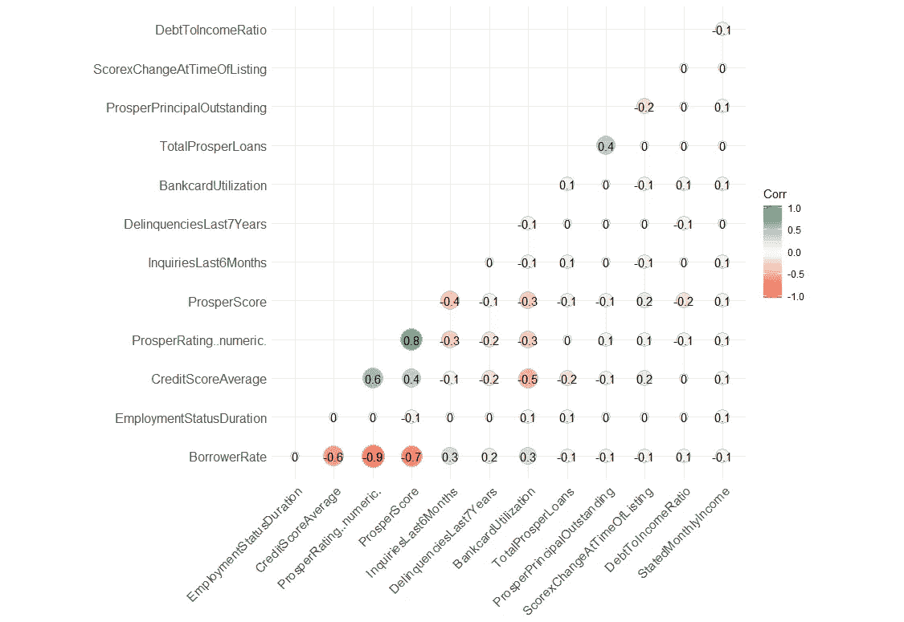

我们可以看到**繁荣评级**与**借款人利率**有很强的负相关关系，这是有道理的，因为**借款人利率**主要由**繁荣评级**决定。此外， **Prosper 评级**与 **Prosper 评分有很强的相关性，相关系数为 0.8** ，而**信用评分平均值为 0.6** 。这再次表明**可能 Prosper 对 Prosper 评分比对信用评分平均值更重视，以便从线性角度对 Prosper 评级进行建模。**

此外，我们可以看到 **Prosper Score** 与***scorexchangeattimeflisting***、***inquiries last 6 个月*** 、 ***银行卡使用率*** 、***debttoincommeratio****和***statedmonthyincome***呈弱线性关系，相关系数范围为+- 0。虽然这些特征与 **Prosper Score 呈弱线性关系，但**我认为这些特征中可能仍然存在一些信息。通过使用相关矩阵作为参考，我将选取这五个特征，然后绘制散点图，以进一步研究这些特征之间的更多趋势。*

*我通过剧情的调查包括两部分:一是看这些特征如何与 **Prosper Score 挂钩；另一个是看这些特征是否能区分完整贷款和高风险贷款。***

# ***得分 X 上市时的变化***

**scorexchangeattimeflisting*测量提取信用档案时借款人的信用评分变化，其中**变化相对于借款人的最后一笔 Prosper 贷款**。*scorexchangeattimeflisting*的值可以是正的也可以是负的，因为它评估信用评分的值“变化”。*

**

*上图显示，Prosper 得分和*scorexchangeattimeflisting*之间的线性趋势很明显，随着 Prosper 得分的一个点的增加而增加。我推断 Prosper Score see*scorexchangeattimeflisting*是一个重要的信号，并将其与线性增量一起用于模式 Prosper Score。*

*它与贷款状态有什么联系？*

*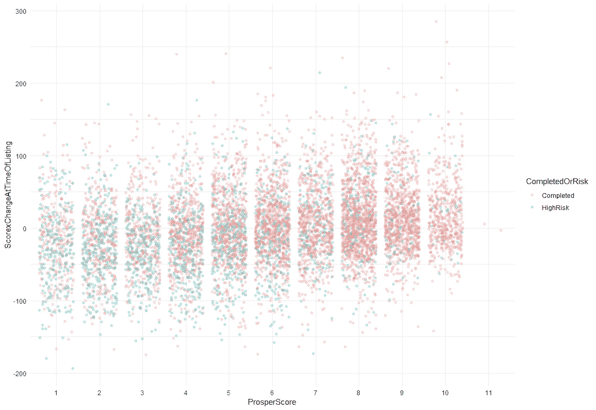*

*在 Prosper Score 和*scorexchangeattimeflisting、*中对贷款状态进行分组，我们可以看到趋势很明显。**高风险**贷款往往有**较低的 Prosper 评分**为 1 到 6，而**较低的*scorexchangeattimeflisting***范围为-100 到 50。**已完成的贷款**往往具有从 6 到 10 的**较高的 Prosper 得分**和从-50 到 100 的**较高的*scorexchangeattimeflisting***。似乎 Prosper Score 可以**区分***scorexchangeattimeflisting****中不同级别的已完成和高风险贷款***。*

*这个探索结果有点有趣，因为*scorexchangeattimeflisting*考虑了借款人相对于借款人最近一次 Prosper 贷款的信用评分**，**，这意味着该指标不仅考虑了借款人的信用评分，还考虑了 Prosper 数据的历史记录。基于这一概念，我对 Prosper 充分利用**信用评分**和 **Prosper 数据**印象深刻，它确实在已完成和高风险贷款中呈现出这样的趋势。*

# ***最近 6 个月的调查***

*此变量评估过去六个月提取信用档案时的查询数量。查询是指机构向信用机构请求信用信息。一般来说，当某人频繁申请信用卡等信用账户时，就会在短时间内出现大量查询，这意味着他或她有很高的资金需求。*

*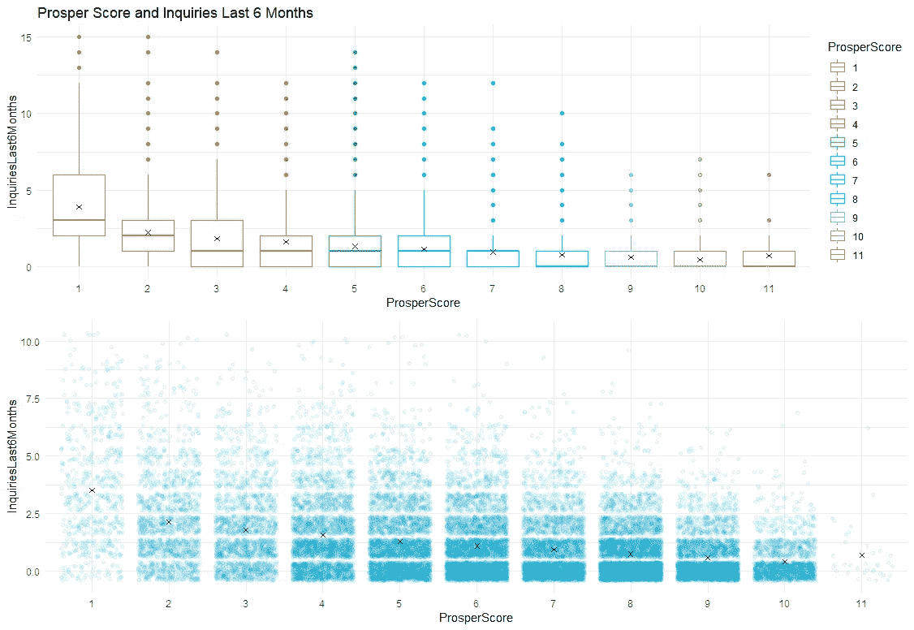*

*在散点图中我们可以看到这种关系并不明确，大多数贷款位于第 1 到 2 次*的 InquiriesLast6Months 个月*中，跨越 Prosper 得分 2 到 10。但是随着 Prosper 得分的增加，持续 6 个月的*调查的**上限债券**下降的趋势仍然存在。**

*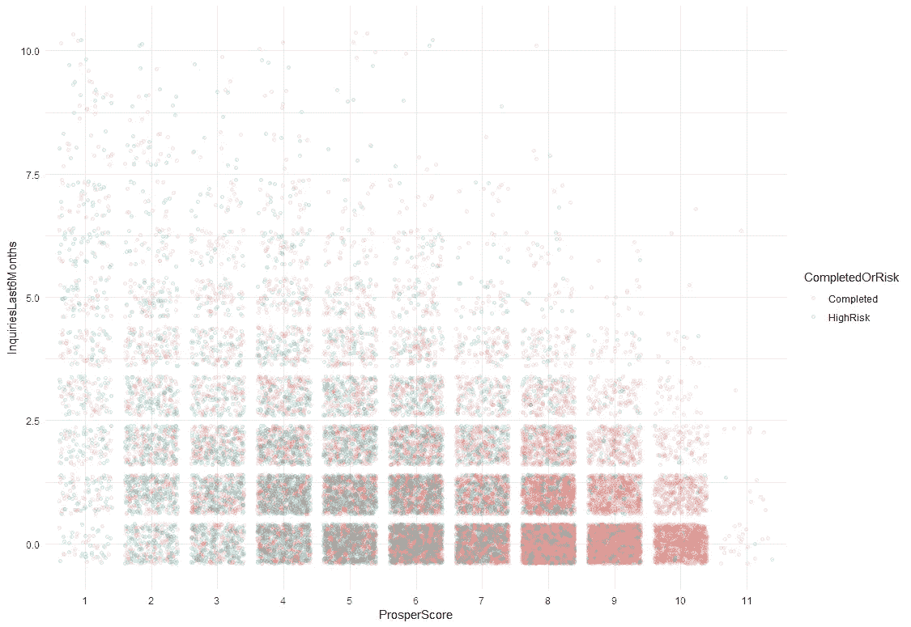*

*尽管如此，在 Prosper Score 和*调查中，过去 6 个月*的贷款状况趋势仍不明朗。我们可以看到，大多数高风险贷款主要位于 Prosper 得分较低的级别，但它们广泛分布在每个级别的*调查中，过去 6 个月*Prosper 得分保持不变。*

*只调查过去 6 个月贷款状况的差异如何？*

*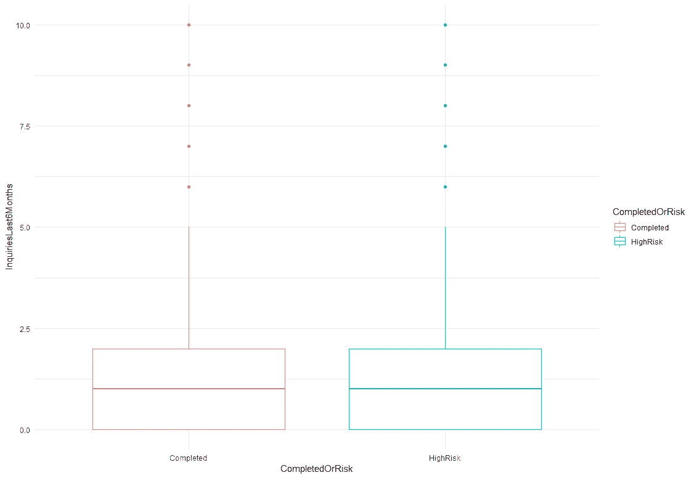*

*从上图中我们可以看到，在高风险贷款和已完成贷款之间，过去 6 个月的*查询没有显著差异。**

*这个结果是合理的，因为借款人过去 6 个月的高询问率并不直接暗示他或她有不良信用。它可能有潜在的风险，但至少在这个数据集中不是必要的。*

# ***银行卡使用情况***

**银行卡利用率*衡量借款人在提取信用档案时使用的信用限额总额。比率越低，一个人的金融流动性越大。*

*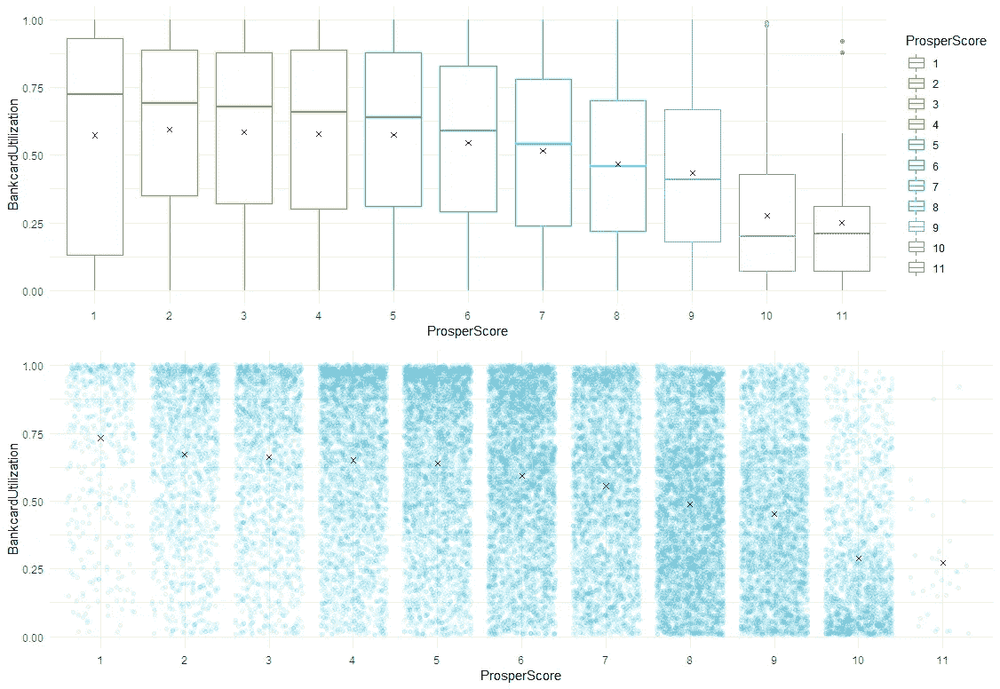*

*从箱线图来看，*银行卡使用率*的分布随着 Prosper 得分的增加而向下移动，但是*银行卡使用率*的方差在各个 Prosper 得分上都很高，这使得 Prosper 得分和*银行卡使用率*之间的趋势不明显*。但是大致相反的趋势仍然存在，尤其是 Prosper 得分的高端和低端水平。也许 Prosper Score 在他们的模型中使用了一些更复杂的方式。**

*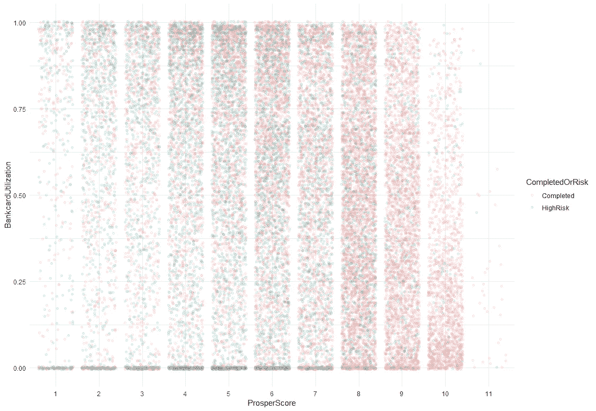*

*Prosper Score 和*银行卡使用率*之间的贷款状态趋势不明确。我们可以看到，大多数**高风险**贷款主要位于 1 至 6 的 Prosper 评分较低的级别，但它们广泛分布在保持 Prosper 评分不变的*银行卡使用*的各个级别。*

*尽管如此，这个结果并没有让我感到惊讶，因为有时高的银行卡使用率对一个信用不良的人来说并不必要。他或她可能只是在那个时候有一个高债务信用，但仍然会按时付款。*

*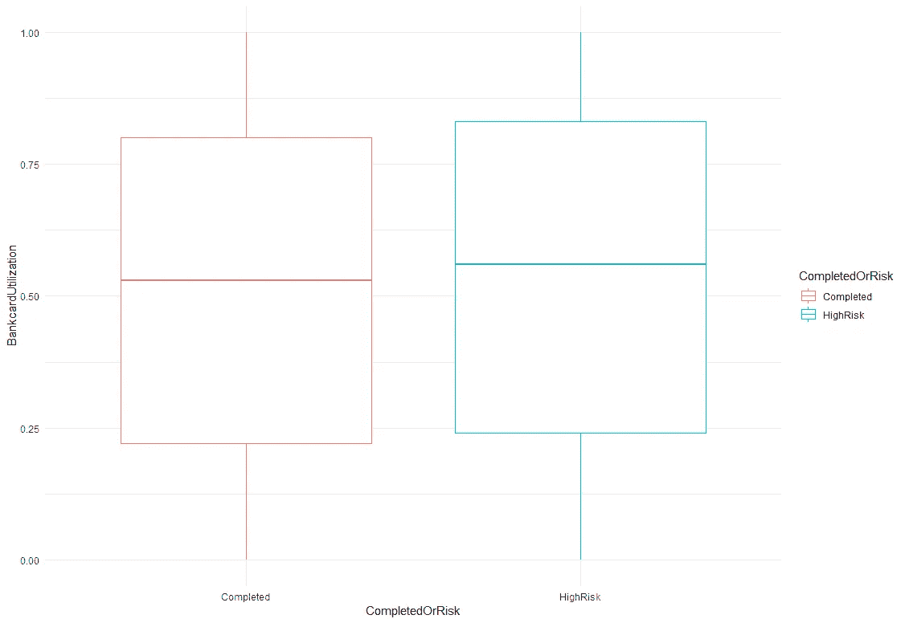*

*上图显示*银行卡使用率*在高风险贷款中的分布略高于已完成贷款，但两者的*银行卡使用率、*的方差都很大，使得两者没有显著差异。*

# ***债务收入比***

*一般来说，较高的债务收入比表明如果一个人的债务超过了他或她的收入。相反，较低的债务收入比意味着债务和收入之间的良好平衡。*

*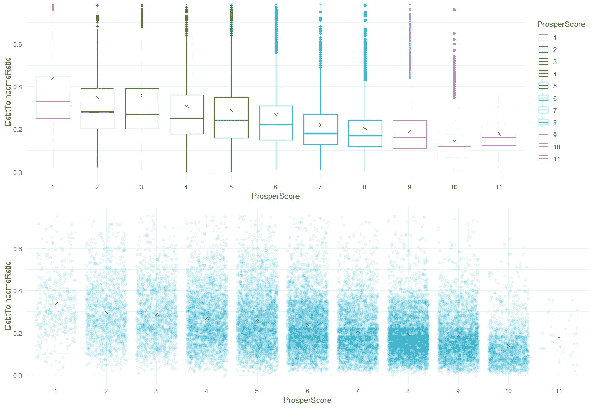*

*在这里，我们可以看到，随着 Prosper 得分的增加，当*debttoincommeratio*下降时，上图呈现出明显的线性反向趋势。*

*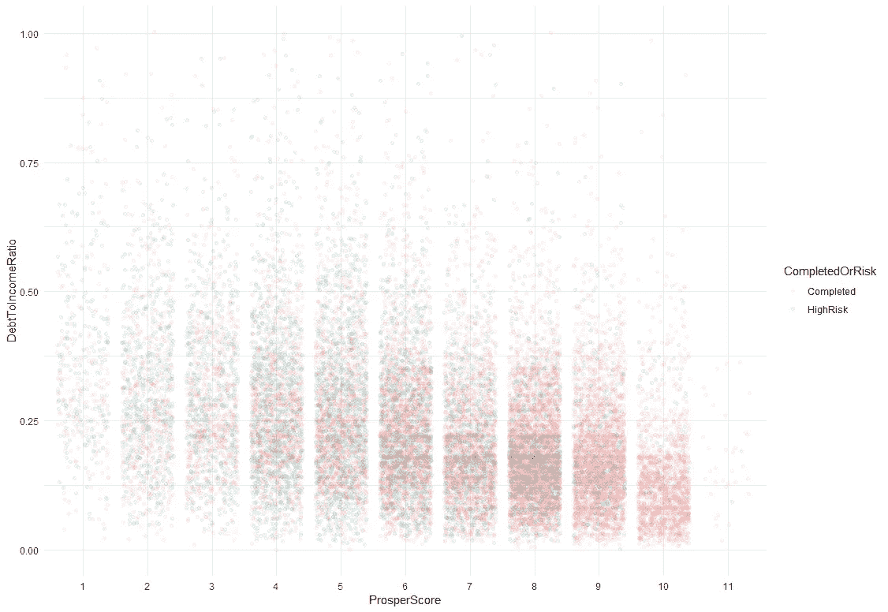*

*上图显示了 Prosper Score 中贷款状态和*debttoincommeratio*的明显趋势。高风险贷款的 Prosper 得分往往较低，为 1 比 6，债务与收入比率为 0.5 比 1。已完成的贷款往往具有较高的 Prosper 评分，在 6 到 10 之间，而*debttoincommeratio*在 0.1 到 0.6 之间。似乎 Prosper Score**可以区分*debttoincommeratio*和*中不同级别的已完成和高风险贷款***。*

*这个结果看起来是合理的，因为 T42 是衡量一个人偿还能力的直接信号。*

# ***规定月收入***

*作为收入数据，*的统计月收入*的分布从直方图中呈现出右偏的形状(此处未显示)，所以我去掉了*统计月收入*变量*的前 1%。**

*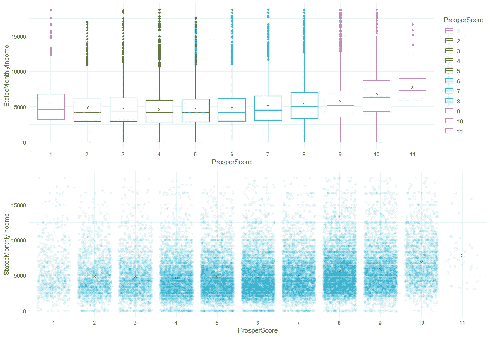*

*上图显示，Prosper 得分和*月收入*之间的趋势呈上凹状。这是合理的，因为收入也是衡量偿债能力的一个直接指标，显然收入数据的特点使衡量 Prosper 得分呈指数级递增。多一分的财富分数需要更高的收入水平。*

*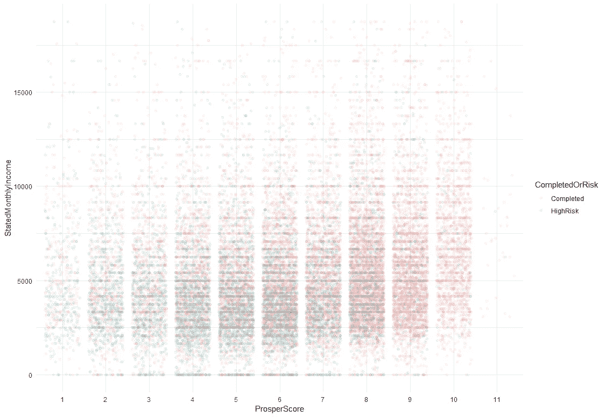*

*上图显示，Prosper 得分和*月收入*与贷款状态之间存在明显的趋势。高风险贷款的 Prosper 评分往往较低，在 1 至 6 分之间，并且*的月收入水平较低，在 2，000 美元至 5，000 美元之间。相反，已完成贷款的 Prosper 评分更高，在 7 到 10 分之间，月收入更高，在 5，000 美元到 10，000 美元之间。与*debttoincommeratio*和*scorechangeattimeflisting 类似，*Prosper 得分很可能**能够区分*月收入*和*不同级别的已完成或高风险贷款***。**

# *探索总结*

*我们挑选了五个特征，看看它们是否具有与 **Prosper Score** 或**、**相关的趋势，并看看它们是否能够区分已完成贷款和高风险贷款。勘探结果表明:*

*   ****scorexchangetimeflisting****和***DebtToIncomeRatio***均与 **Prosper 得分呈线性趋势。**前者呈现正相关关系；后者与 **Prosper 得分呈负相关。****
*   *****scorexchangeattimeflisting****和***DebtToIncomeRatio***在不同的 Prosper 评分水平上，完成的**和高风险的**都有明确的模式。**高风险贷款**倾向于具有较低的 Prosper 评分水平，并且具有较低的***scorechangeattimeflisting****和较高的****debttoincommeratio****保持 Prosper 评分不变*；* **完成贷款**往往具有较高的 Prosper 水平，并且具有较高的***scorechangeattimeflisting****和较低的****debttoincommeratio****持有 Prosper 得分不变。*******
*   ******StatedMonthlyIncome****也随着 **Prosper Score** 呈现出一种趋势，但这种趋势是一种递增的上凹趋势，而不是线性的。这表明 **Prosper Score** 的**多一分**需要更高等级的 *StatedMonthlyIncome。*****
*   *****StatedMonthlyIncome****在**完成和高风险**两个不同等级的 Prosper 评分中也有明确的模式。**高风险贷款**倾向于具有较低的 Prosper 得分水平，并且具有较低的*月收入*保持 Prosper 得分不变。***
*   *****调查对象最近 6 个月*** 和***银行卡使用率*** 与 Prosper 评分和贷款状况不呈现显著趋势。**

**到目前为止，我们已经看到了一些与 Prosper 得分和贷款状态相关联的利息模式，我们发现***scorexchangeattimeflisting、debttoincominratio***和***StatedMonthlyIncome****与 **Prosper 得分有明显的趋势。**将这三个特征考虑到不同级别的 Prosper 得分中，我们可以看到它们在**已完成贷款和高风险贷款**之间呈现出清晰的模式，保持 Prosper 得分不变。***

***毫不奇怪，*和 ***表示的月收入*** 呈现这样的趋势，因为这两者是对偿债能力的直接衡量。但令我印象深刻的是，***scorexchangeattimeflisting***用 **Prosper Score 呈现出一种趋势，也显示出区分已完成贷款和高风险贷款的能力。******

**P2P 贷款是一个新概念，其信用风险衡量也是如此。在整个项目中，我们一直在挖掘一些关于 Prosper 的背景知识，使用 EDA 基本工具找出一些与 Prosper 的信用风险衡量相关联的特征— **Prosper Rating** 和 Prosper score。与传统的衡量方法——信用局评分不同，这些特征展示了在借贷平台中高风险贷款和已完成贷款之间的**不错的**评估能力。并且这些特征也被建模，其利用了**信用局分数**和**平台贷款数据**。我认为这样一个有趣的概念可以用于 P2P 借贷平台中进一步的数据科学应用，如预测违约率或不良贷款。**

**希望你喜欢这种基于概念的探索性数据分析！**

****

**注:更多详细探索结果，请参见我的[报告](http://rpubs.com/onpillow/446310)中的 Rpubs 和代码 [GitHub](https://github.com/onpillow/Exploratory-Data-Analysis-Prosper-Loan-Data) ！**