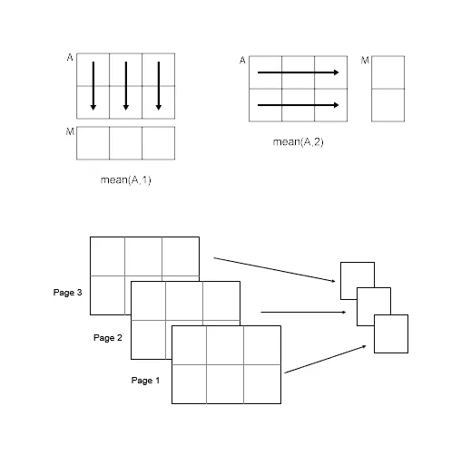
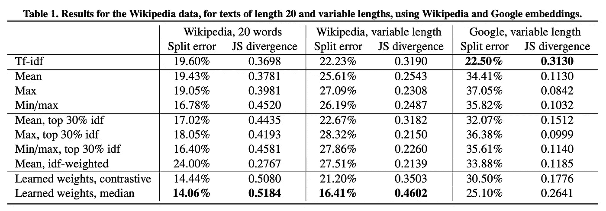
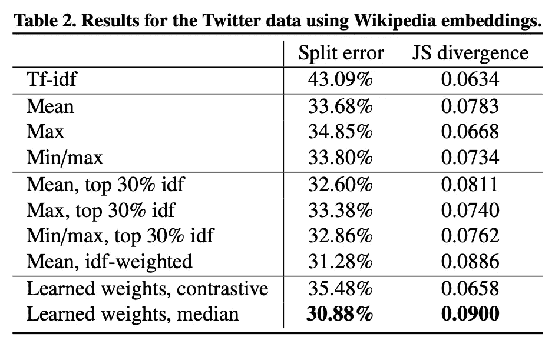

# 用简单的文档编码填充 Word2Vec 嵌入

> 原文：<https://towardsdatascience.com/padding-sequences-with-simple-min-max-mean-document-encodings-aa27e1b1c781?source=collection_archive---------26----------------------->

## 弱监督学习的快照(O'Reilly，2020)

在本帖中，我们将讲述如何用三个性能惊人的值填充文本序列:最小值/最大值和平均值。这是文档编码的一种简单形式，它描述了整个文档的大致含义。它们往往比在所有文档中输入单个静态值表现得更好。

这是一系列帖子的第 1 部分，我将使用来自[堆栈交换数据转储](https://archive.org/details/stackexchange)的[堆栈溢出问题](https://data.stackexchange.com/stackoverflow/query/new)来演示弱监督学习的技术，作为我即将出版的书*弱监督学习(O'Reilly，2020)* 的一部分。这些技术*包括迁移学习、半监督学习、远程监督*和*弱监督*。在这些帖子中，我将展示技术配方，而这本书将通过解决现实世界的问题，对该领域进行有凝聚力的概述。

Fun with vector means. Source: [Mathworks Documentation](https://www.mathworks.com/help/matlab/ref/mean.html)

# 跳过这一段(除非你感到困惑)

大多数人可以跳过，但如果你是深度学习和自然语言处理的新手，你需要理解文本嵌入和序列填充才能前进。简而言之，在这篇文章中，我们根据单词的含义对文档中的单词进行编码(这就是 Word2Vec 所做的)，并使它们长度相同，这样我们就可以使用线性代数来处理它们。这篇文章是关于使用什么值来使短文档和长文档一样长。

看看 Adrian Colyer 的帖子[单词向量的惊人力量](https://blog.acolyer.org/2016/04/21/the-amazing-power-of-word-vectors/)，然后回来从这里开始。

# 填充和插补

填充编码文档时不同插补方法的性能在论文[使用加权单词嵌入聚合的极短文本表示学习](https://arxiv.org/pdf/1607.00570.pdf)中有所描述，该论文[参考了](https://stats.stackexchange.com/a/239071/35715)该堆栈溢出答案。关于插补的更多信息，请查看[这篇由](/6-different-ways-to-compensate-for-missing-values-data-imputation-with-examples-6022d9ca0779) [Will Badr](https://medium.com/u/551ba3f6b67d?source=post_page-----aa27e1b1c781--------------------------------) 撰写的帖子。

用户 [D.W.](https://stats.stackexchange.com/users/2921/d-w) 写道:

> 一种对短文本(例如，一个句子或一条推文)相当有效的简单技术是计算文档中每个单词的向量，然后使用坐标方式的平均值、最小值或最大值来聚合它们。

该论文使用平均值、最大值和最小/最大值作为基线，并与作者的算法相比，测量语义相似性任务的性能。

Source: Representation learning for very short texts using weighted word embedding aggregation, De Boom, Van Canneyt et al, 2016

Source: Representation learning for very short texts using weighted word embedding aggregation, De Boom, Van Canneyt et al, 2016

虽然当时不是最先进的，但 min/max/mean 很容易计算，可以作为一个很好的基线，这就是为什么它们被用于本书的原因(尽管我最终选择了一个简单的 Conv1D 模型作为基线，它使用了自己的嵌入)。

注意，用交替的最小值/最大值填充是`[keras.preprocessing.sequence.pad_sequences](https://keras.io/preprocessing/sequence/#pad_sequences)`做不到的，因为它只接受单个浮点/字符串作为填充值的参数。Keras 有很多像这样的限制，因为它的目标是简单和可访问性，而不是艺术表现的状态。我发现，随着我对深度学习和自然语言处理的深入，keras 的局限性驱使我在提炼模型时使用 keras internals、raw Tensorflow 和 [PyTorch](https://pytorch.org/) 。

# 用 Word2Vec 对文档进行密集编码

我们使用 Gensim 的[型号。Word2Vec](https://radimrehurek.com/gensim/models/word2vec.html) 对我们的标记化文本进行编码。这里没什么新鲜的。首先，我们检查模型是否被加载，如果没有，我们重新创建并保存它。然后，作为健全性检查，我们通过预测一个示例单词的语义相似性来测试嵌入模型。我们将模型一个接一个地应用于文档，一个接一个地，创建一个新的列表`numpy.arrays`，每个文档一个。注:如果你是 Word2Vec 的新手，可以看看 [Suvro Banerjee](https://medium.com/u/ac3247b15c91?source=post_page-----aa27e1b1c781--------------------------------) 的[这篇文章](https://medium.com/explore-artificial-intelligence/word2vec-a-baby-step-in-deep-learning-but-a-giant-leap-towards-natural-language-processing-40fe4e8602ba)。

Encoding tokenized documents into Word2Vec a dense vector representation

我们现在将计算位置方向的最小值、最大值和平均值，连接前两个值，并使用 min/max 或 mean 来填充少于`MAX_LENGTH`个单词的任何文档。我们将同时截断任何超过`MAX_LENGTH`个单词的文档。如果该行有奇数个值，并且最小/最大填充超出了文档的`MAX_LENGTH`，我们将去掉多余的值使其为偶数。

Manually padding with custom values: min/max or mean

Tada！这是一个制作简单东西的不错的方法:)我用它和 scikit-learn 的 [RandomForestClassifier](https://scikit-learn.org/stable/modules/generated/sklearn.ensemble.RandomForestClassifier.html) 一起创建了一个基线模型，但是我发现我需要一些非线性的东西作为基线。

# 弱监督学习的下一个快照

在下一篇文章中，我们将看看我如何使用 CuPy 和 CUDA 来加速将这些编码/填充的数据从 3D 向量重新整形为长 2D 向量，以供随机森林模型使用。

# 关于作者

[Russell Jurney](http://linkedin.com/in/russelljurney) 是 [Data Syndrome](http://datasyndrome.com) 的机器学习和可视化顾问，他专门研究弱监督学习(用更少的数据做更多的事)、端到端机器学习产品开发、数据标记、[敏捷数据科学辅导](http://datasyndrome.com/training)和预测性线索生成。