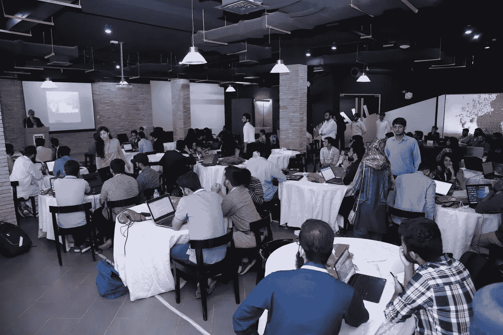

# 巴基斯坦举办了首次 30 小时数据科学黑客马拉松

> 原文：<https://towardsdatascience.com/pakistan-hosts-its-very-first-30-hour-data-science-hackathon-5f60628bfc54?source=collection_archive---------11----------------------->

4 月 20 日，卡拉奇的工商管理学院( [**IBA**](https://www.iba.edu.pk/) )向来自巴基斯坦各地的 100 多名学生敞开大门，让他们参加由总部位于纽约的人工智能初创公司 [Inqline](http://ai.inqline.com) 赞助和协办的 30 小时数据科学黑客马拉松。组织这一盛大的技术活动的目的是让全国各地最优秀、最聪明的黑客通过数据科学、机器学习来解决社会问题，并通过利用人工智能和机器学习等新技术来实现该国的数字社会创新。

Team Flash from Habib University & DHA Suffa University

# 眼前的问题

在巴基斯坦这样的国家，并不缺少未解决的问题。这就是在捐献的血液中发现输血传播疾病的痕迹，而不必花费数百美元进行筛选测试的困境。输血的过程并不像看起来那么简单。从献血者身上抽取的血液在被认为“有用”和健康之前，必须经过多次筛选测试。这不仅是一个耗时的过程，也是一个非常昂贵的过程。为了帮助解决这个问题，Inqline 和 IBA 与 Husaini 血库(HBB)合作，帮助提出一个最佳解决方案，通过使用 HBB 提供的献血者医疗数据来判断捐献的血液是好的还是坏的。

# 巴基斯坦青年的强烈反应

关于 Inqline 与 IBA 合作在卡拉奇举办首届 30 小时数据科学黑客马拉松的消息在社交媒体上受到了巴基斯坦年轻人的欢迎。来自巴基斯坦 12 所不同大学的 100 多名学生组成的超过 28 个团队注册参加了此次活动。

12 notable universities including NED, FAST, Karachi University, IBA, Habib University, Mehran University Jamshoro, Muhammad Ali Jinnah University, SZABIST and Bahria University all participated in the hackathon

# Inqline IBA 数据科学黑客马拉松

在巴基斯坦，这是第一次，学生们被提供了一个真实世界的问题，他们必须在 30 小时内使用从 HBB 获得的真实数据集来解决这个问题。可以说，像这样的黑客马拉松通常会加速通常需要几个月的工作才能实现或复制的结果。学生们被要求分析一个基于献血者医疗数据的数据集。在黑客马拉松结束时，他们提供了一个解决方案，可以预测血液样本中任何输血传播疾病的流行率。

此次活动首先由国际律师协会计算机科学学院副院长 Sayeed Ghani 博士做主旨发言，随后是 Inqline 首席执行官兼创始人 Atif Muhammad。数据科学黑客马拉松包括两轮；第一轮持续了 7 个多小时，学生们被分配了一个描述性的现实世界问题，以及一个必须用数据科学和机器学习算法进行清理和分类的数据集。在整个活动中，我们维护了一个排行榜，所有团队都根据其提交的内容进行了排名。结构、评分和设计流程保持竞争性，以确保学生尽最大努力。

第二轮围绕着一个长达 23 小时的棘手挑战，所有参与者都被要求留在校园里过夜——黑客和构建代码。所有进入第二轮的团队整晚都在分析、评估和编码。在第二轮比赛结束后，参赛队还需要在两分钟的演讲中向评委团介绍他们在血库中实施 ML 模型的商业案例。

Dr. Sayeed Ghani, Associate Dean, Faculty of Computer Science, IBA in the opening ceremony

# 获胜的队伍

尊敬的评委团由资深大学教授和业内著名的数据科学专家组成，包括 Mandi Xpress 的首席执行官兼创始人 Jehanzaib Chaudhry 和 Bitwits 的首席技术官 Ali Raza Bhayani，他们在经过全面评估后，宣布来自 N **ED 工程大学&技术**的**数据小组**为获胜团队，来自 **Habib 大学**的 **FAST** 为亚军。获胜团队获得了 100，000 卢比的现金奖励，以及一名团队成员在 Inqline 纽约总部的带薪实习机会；第二名团队获得了 60，000 卢比的现金奖励

The winning team — Data Squad from NED University

# 愿景

Inqline 很荣幸在巴基斯坦率先举办了第一届以学生数据科学为主题的通宵黑客马拉松。这次黑客马拉松的目的是在巴基斯坦建立一个数据科学人才库，共同关注一个社会问题，并提出一个基于技术的最佳解决方案，将数据科学算法的魔力与医学科学的世界联系起来。

Inqline 相信巴基斯坦的每一个工程师都充满了想法和激情。在世界的这一部分，有许多人才有待发掘，我们坚信，像这样的活动可以让学生对新的和即将到来的技术产生更多的兴趣。我们对巴基斯坦的愿景很明确:我们将巴基斯坦视为数据科学的下一个领导者。

With Team Data Developers from University of Karachi