# 2019 煎饼日——推特和自然语言处理分析

> 原文：<https://towardsdatascience.com/pancake-day-2019-tweets-and-nlp-analysis-5de38f3fdd90?source=collection_archive---------15----------------------->

## 你喜欢煎饼吗？推特分析& 70k 条推特的自然语言处理！

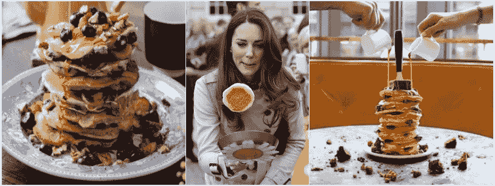

# 介绍

2019 年 3 月 5 日星期二是煎饼日！煎饼日，在英联邦国家和爱尔兰也被称为忏悔星期二，是灰烬星期三的前一天。许多基督徒遵守的特定习俗是吃煎饼来庆祝这一天，这样就吃完了在四旬斋期间(复活节前 40 天)要避免的所有黄油、鸡蛋和脂肪。

我知道英国人总是有迷人的方式来庆祝特殊场合，但我仍然惊讶地看到煎饼日的到来。不仅是烘焙业的业余爱好者和厨师专家都在深入思考他们的下一个创作，包括奇妙和复杂的浇头，而且所有年龄的勇敢的男人、女人和孩子也在训练自己在街上跑来跑去，把煎饼抛向空中，热切地争夺煎锅。

事实上，煎饼日是一个快乐的日子，因此，这是每个人在社交媒体上活跃起来的绝佳时机！有什么比良好的情绪和积极的感觉更能吸引人们的注意力吗？

为了了解庆祝活动的程度，我决定收集从 3 月 1 日(前一天的五天)到 3 月 6 日(灰星期三)带有#PancakeDay 标签的推特。本文报告了我的分析结果。

# 数据和方法

这篇博文的数据是通过[推特应用编程接口](https://developer.twitter.com/en/docs/basics/getting-started)收集的。#PancakeDay 发生在 3 月 5 日，我提前 4 天(3 月 1 日)开始收集推特，并在 Ash 星期三(3 月 6 日)结束时停止。使用标签#PancakeDay，总共记录了 70，969 条推特。其中，66.2% (46，967)为转发推特。

一旦推特被收集，我就在 python 笔记本中对推特进行预处理和清理(删除所有重复的推特)，并执行一些统计探索性分析。然后我尝试了自然语言处理(NLP)来获取更多关于推特内容的细节。(这是我第一次涉足这些模特！)这些方法在试图了解人们将哪些单词与煎饼日联系起来时特别有吸引力。

我使用来自 [gensim 库](https://radimrehurek.com/gensim/models/word2vec.html)的 Word2Vec 模型进行了 NLP 分析。这个机器学习模型用于产生单词嵌入。这将词汇表(大量单词列表)中的单词映射到实数向量，从而允许计算两个单词之间的相似度，并最终找出在同一上下文中频繁使用的单词。如果你想要一个精彩而快速的解释，看看[卡维塔·加内桑](https://medium.com/u/cd869a6dee38?source=post_page-----5de38f3fdd90--------------------------------)的[文章](https://medium.freecodecamp.org/how-to-get-started-with-word2vec-and-then-how-to-make-it-work-d0a2fca9dad3)。你也可以通过阅读[托马斯·米科洛夫(Tomas Mikolov)的谷歌团队](https://arxiv.org/pdf/1301.3781.pdf)关于 Word2Vec 实现的原创研究论文来获得更深入的观点。

正如 [Vijay athithya](https://medium.com/u/ae424245b4b?source=post_page-----5de38f3fdd90--------------------------------) 提出的和 [Vishal Kumar](https://medium.com/u/2390882c92aa?source=post_page-----5de38f3fdd90--------------------------------) 在他的[伦敦灯光节分析](/analyzing-the-lumiere-london-2018-light-festival-part-2-98eb3769e267)中很好地陈述的，我继续使用 [Scikit-learn 库](https://scikit-learn.org/stable/modules/generated/sklearn.decomposition.PCA.html)对“PancakeDay”和“pancakes”进行主成分分析(PCA)。这个步骤降低了单词向量矩阵的维度，从而允许我们在二维图中可视化最近的单词。

# 推文分析

以下图表说明了为更好地理解围绕#PancakeDay 的讨论而进行的分析。

在这里，我将介绍以下结果:

*   每天的推文数量
*   前 10 名推特用户(按关注人数)
*   转发量最高的 10 条推文
*   推文中排名前 10 的单词和标签
*   基于语言相似性的“煎饼”的最接近单词

**每天的推文数量**

下图显示了从忏悔星期二之前的星期五到煎饼日之后的圣灰星期三，每天的推文数量和转发量。毫不奇怪，最活跃的一天是 3 月 5 日星期二，有近 5 万条推文，正确的是 49648 条。你和我一样惊讶吗？

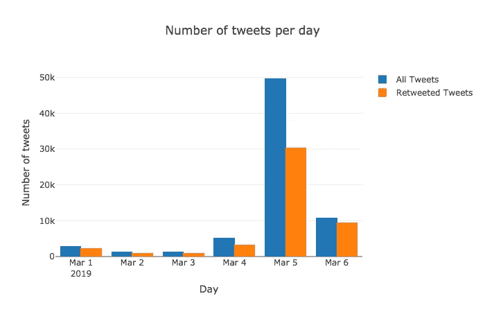

The bar chart shows the number of tweets and retweets by day, Tuesday 5th of March being the official Pancake Day!

**十大推特账号:名人**

看看标签为#PancakeDay 的十个最受欢迎的账户推文，就可以了解这一事件的程度。下图显示了粉丝数量最多的十个 Twitter 账户。

令人惊讶的是，关于#PancakeDay 的前两个账户分别由曼联(@ManUtd)和切尔西(@ChelseaFC)占据。来自两个队的球员显然玩得很开心，在煎饼旋转挑战中互相竞争。如果你想看看安东尼·马夏尔、李·格兰特和维克多·林德洛夫的表现，那就看看这个小视频吧！

其他名人包括媒体(BBC 新闻，BBCSport，AppStore 或 Crowdfire)，著名厨师(戈登·拉姆齐和杰米·奥利弗)，甚至传奇音乐家保罗·麦卡特尼。煎饼日庆典是这些演员推销产品的绝佳机会。BBC Sport 利用这次活动宣传其跑步应用程序，App Store 支持三个烹饪应用程序，戈登·拉姆齐展示了他独特的餐厅@breadskitchen。

各种各样的名人积极参与煎饼日，显示了对这一事件的不可思议的魅力，并证明讨论跨越人口的大群体。

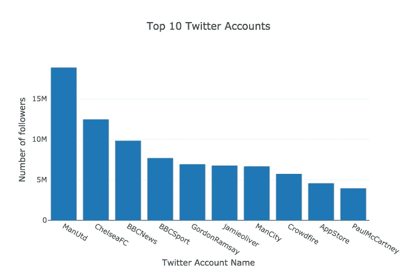

The bar chart shows the most famous accounts by the number of followers

看看下表，发现这些演员的推文是什么！

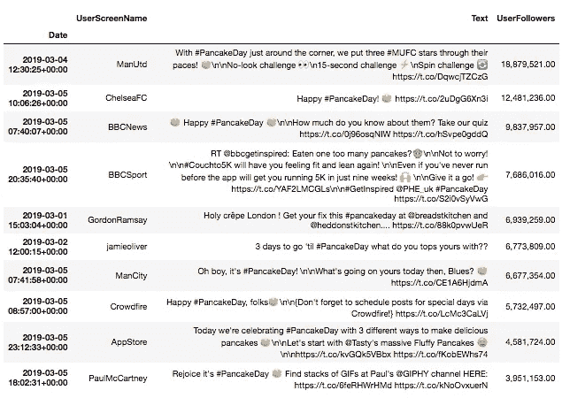

The table shows the top ten most famous tweeters

**十大转发推文**

推文总数中的转发数量特别高，因为 66.2%的推文实际上不是新推文，而是被转发的推文。尤其是观察它们，可以让你对推特用户的兴趣，或者换句话说，对人们的行为有一个有趣的了解！下表列出了被转发次数最多的 10 条推文，以及它们来自哪些 Twitter 账户。

对于公司来说，为了吸引更广泛的受众和建立更牢固的关系，社交媒体是一个很好的地方，这已经不是什么秘密了。因此，不足为奇的是，一半的转发量吸引了 Twitter 用户转发公司的推文，从而参与竞争赢得免费的东西！在亚马逊代金券、Nutella jar、厚脸皮的围裙、案板或者煎饼机之间，每个人都应该找到它的兴趣所在！

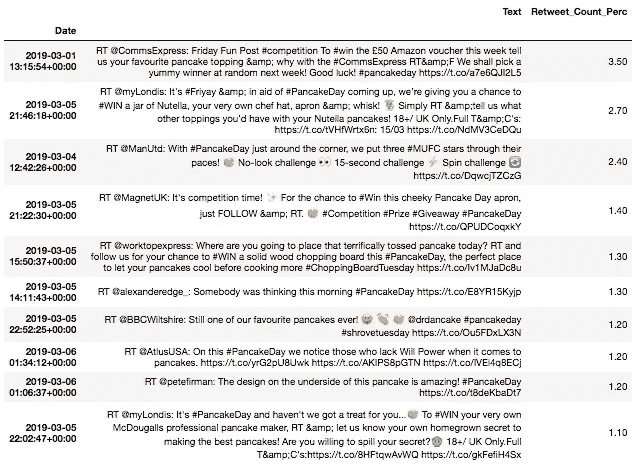

The table shows the ten most retweeted tweets (percentage retweet for all retweeted tweets)

自然，Twitter 也是一个分享意想不到的、有趣的生活惊喜的地方。如果你错过了圣潘克拉斯车站的更名，那么感谢亚历克斯·埃奇及时捕捉到了英式幽默！

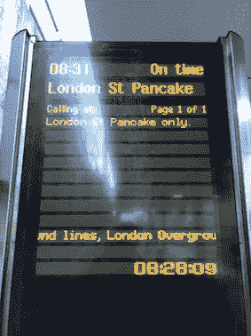

@alexanderedge_ Do you fancy travelling to St. Pancake?

**十大热门词汇和标签**

下面的图表显示了推文中最受欢迎的标签和单词的出现频率(没有重复的推文)。

最著名的词毫无意外:“煎饼”、“日”、“星期二”。有趣的是，当推特上谈论#PancakeDay 时，像“快乐”、“制造”、“我们”和“喜欢”这样的词被推特用户大量使用。据推测，这可以反映出与这一天相关的喜悦和分享感！

不出所料，“煎饼日”是最受欢迎的标签，出现在每条推文中。“忏悔星期二”、“烤饼星期二”、“脂肪星期四”和“狂欢节”也是受欢迎的标签，分别出现在 22.1%、9.4%、1.7%和 1.4%的案例中。这表明推文也提到了一年中这个特定星期二的庆祝活动和传统。

在这些排名的底部，出现了一些更具体地与食物相关的词和标签。在这里，我们可以猜测“柠檬”、“糖”和“坚果”是与煎饼制作和食用相关的最受欢迎的配料。此外，“纯素食主义者”和“无谷蛋白”是更能体现食品行业趋势的词汇。

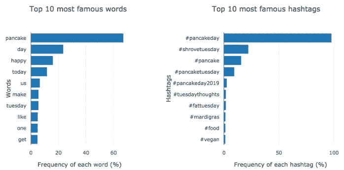

The bar graphs show the 10 most popular hashtags and words

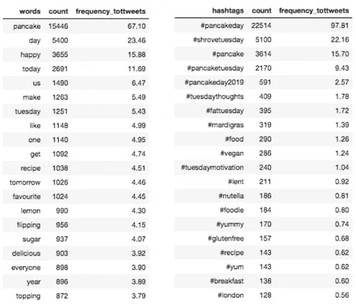

The tables show the 20 most popular hashtags and words and their percentage of appearance in all tweets

**相似词——最近邻**

如前所述，为了找出 tweetsers 与“PancakeDay”相关联的单词，我对 23，019 条非重复的 tweet 使用了 Word2Vec Gensim 模型。这个模型假设空间上相互靠近的词，相互关联，从而表现出相似性。换句话说，任何特定单词的意思都受到它周围的单词(它的邻居)的影响。最近的邻居更有可能与该单词相关联。让我给你举个例子:

*“在忏悔星期二，饥饿的孩子们在一场难忘的比赛中相互竞争后，吃到了美味的蓝莓煎饼！”*

在上面的句子中,“蓝莓”和“薄煎饼”是直接相邻的，而“儿童”和“薄煎饼”相距 5 个单词。因此，在这个句子中，“煎饼”和“蓝莓”比“孩子”和“煎饼”更相似。

**煎饼最近的话(最近的邻居)**

下面的两个散点图显示了与“煎饼”最接近的词。第一张图只考虑了推文中的单词，而第二张图包括了标签！可能会注意到诸如“甜点”、“自制”或“款待”等词出现在两个输出中。

这些词大多与其他食物成分或描述食物质地或味道的形容词有关。例如，“榛子”、“浆果”、“苹果”以及“菠菜”、“火腿”、“蘑菇”等配料经常与“煎饼”联系在一起。此外，“美味的”和“美味的”形容词被用来大概描述人们吃煎饼时的期望或情绪！

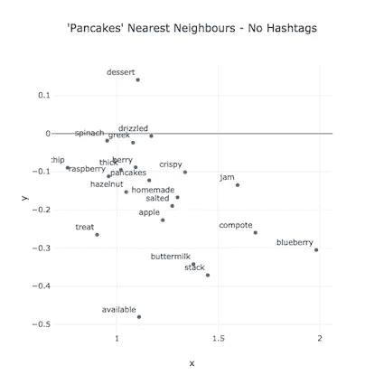

The graph shows the PCA results of the Word2Vec model for the closest words to ‘pancakes’

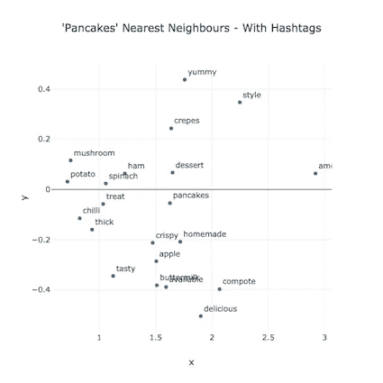

The graph shows the PCA results of the Word2Vec model for the closest words to ‘pancakes’

**#PancakeDay 最近的单词(最近的邻居)**

最后是与#PancakeDay！相关的单词或标签的结果。下图总结了#PancakeDay 的主要活动，即庆祝日(带有“shrovetuesday2019”等标签)、饮食和烹饪日(带有“餐厅”或“煎饼食谱”等词)以及分享日(“提供”)！然而，这种分析的输出并没有给出许多描述人们感受的词语和形容词。这里需要更深入的分析。

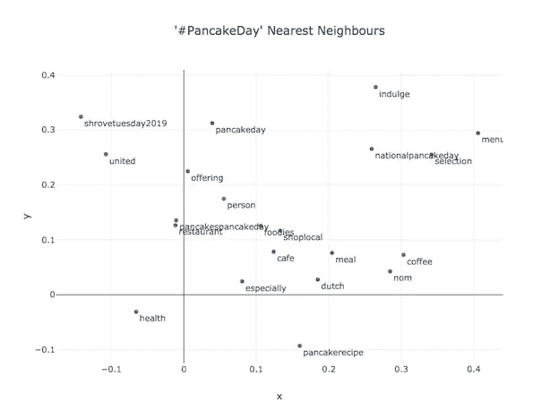

The graph shows the PCA results of the Word2Vec model for the closest words to ‘#PancakeDay’

对推文的其他有趣探索将是分析每条推文的情绪或尝试其他 Word2Vec 模型(Tensorflow，GloVe)。

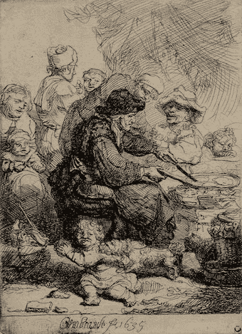

Rembrandt 1635, Crowd eagerly awaiting pancakes. [The British Museum](https://medium.com/u/b53b6b669793?source=post_page-----5de38f3fdd90--------------------------------)

**结论**

该结束了！:-)这篇文章探索了 2019 年 PancakeDay 的大约 70，969 条推文。我很想知道，你对“煎饼”有什么看法，以及你今年是否参加过任何煎饼比赛！我非常渴望明年能加入你们！

我希望你喜欢这篇文章，如果你想留下任何意见，建议或想法，我真的很感激！所以，请随时伸出手来！

还有，如果你想自己试试，我的代码可以在下面的 [Github](https://github.com/audevuilli/pancake-day) repo 中找到。

**收盘前……**

我要感谢 Medium 的成员分享他们的工作，并提供有趣的教程，让我能够接触到有用的工具和方法！

感谢您的宝贵时间！

奥德

*我是* [*数据和植物科学家*](http://www.audevuilli.com) *在* [*垂直未来*](https://www.verticalfuture.co.uk/) *，以前在*[*WBC SD*](https://www.wbcsd.org/)*。理学硕士。来自 UCL 的城市分析和智能城市来自伦敦的 Bartlett*[*CASA*](https://www.ucl.ac.uk/bartlett/casa/)*和 BSc。在食品科学方面来自* [*苏黎世联邦理工学院*](https://ethz.ch/en.html) *。对城市、美食、健康充满热情通过*[*Twitter*](https://twitter.com/audevuilli)*或*[*LinkedIn*](https://www.linkedin.com/in/aude-vuilliomenet-69248711a/)*联系。*