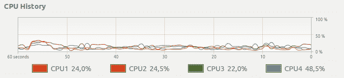
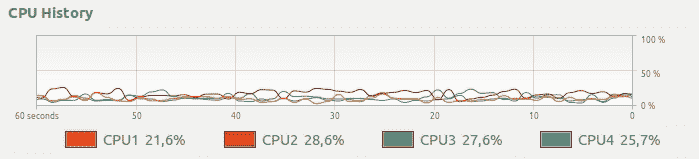
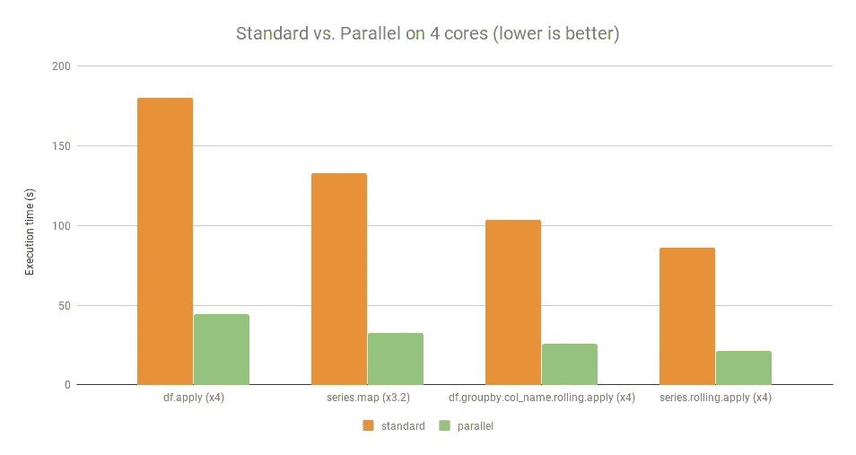

# pandarallel——一个简单有效的工具，可以在所有 CPU 上并行处理 pandas 计算

> 原文：<https://towardsdatascience.com/pandaral-lel-a-simple-and-efficient-tool-to-parallelize-your-pandas-operations-on-all-your-cpus-bb5ff2a409ae?source=collection_archive---------5----------------------->

## 如何仅用一行代码显著加快熊猫的计算速度？

完整的 **Pandaral lel** 存储库和文档可在此 [GitHub 页面](https://github.com/nalepae/pandarallel)上获得。

本文中介绍的库只在 Linux & MacOS 上受支持。

# 什么问题困扰着我们？

用[熊猫](https://github.com/pandas-dev/pandas)，当你运行下面一行:

您会得到以下 CPU 使用率:

Standard Pandas apply — Only 1 CPU is used.

即使你的计算机有几个 CPU，也只有一个完全专用于你的计算。

我们希望**用一种简单的方法**得到类似这样的结果，而不是 CPU 的使用量:

Parallel Pandas apply — All CPUs are used.

# Pandaral lel 如何帮助解决这个问题？

Pandaral lel 的想法是将你的熊猫计算分布到你计算机上所有可用的 CPU 上，以获得显著的速度提升。

## 安装:

在 Windows 上， **Pandaral lel** 只有在 Python 会话(`python`、`ipython`、`jupyter notebook`、`jupyter lab`)时才起作用，...)从[Linux 的 Windows 子系统(WSL)](https://docs.microsoft.com/en-us/windows/wsl/install-win10) 执行。

在 Linux & macOS 上，不需要做什么特别的事情。

## 导入和初始化:

## 用法:

有一个简单的用例，有一个熊猫数据帧`df`和一个应用函数`func`，只需用`parallel_apply`替换经典的`apply`。

你完了！

*注意，如果不想并行化计算，仍然可以使用经典的* `*apply*` *方法。*

您也可以通过在`initialize`函数中传递`progress_bar=True`来显示每个工作 CPU 的进度条。

Parallel apply with a progress bar

还有一个更复杂的用例，有一个 pandas 数据帧`df`，这个数据帧的两列`column1`和`column2`，以及一个要应用的函数`func`:

# 基准

对于四个可用的示例[此处](https://github.com/nalepae/pandarallel/blob/master/docs/examples.ipynb)，在以下配置上:

*   操作系统:Linux Ubuntu 16.04
*   硬件:英特尔酷睿 i7 处理器，3.40 GHz，4 核

Standard vs. Parallel on 4 cores (lower is better)

除了`df.groupby.col_name.rolling.apply`的速度只提升了 3.2 倍，平均速度提升了大概 4 倍，也就是所用电脑上的核心数量。

# **它是如何在引擎盖下工作的？**

当`parallel_apply`被调用时， **Pandaral lel:**

*   实例化一个 [Pyarrow 等离子共享内存](https://arrow.apache.org/docs/python/plasma.html)，然后
*   为每个 CPU 创建一个子进程，并要求每个 CPU 处理数据帧的一个子部分，然后
*   组合父流程中的所有结果

与其他进程间通信介质相比，使用共享内存的主要优点是没有串行化/解串行化，这可能会非常耗费 CPU。

如果您发现此工具有用，但如果缺少某个功能，请在此处写下新的功能请求[。](https://github.com/nalepae/pandarallel/issues)