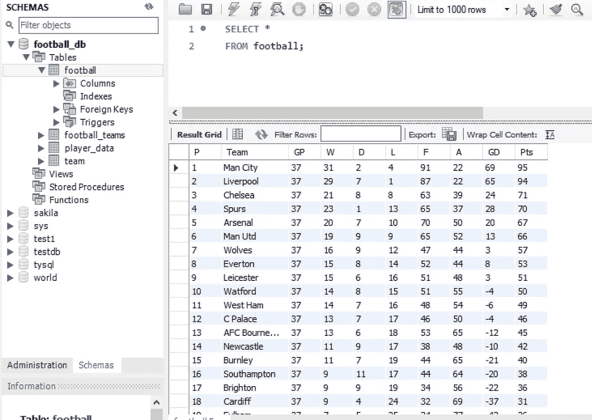
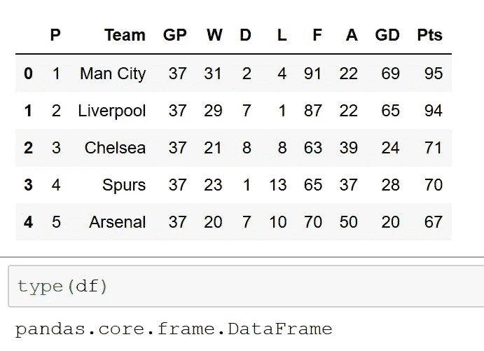
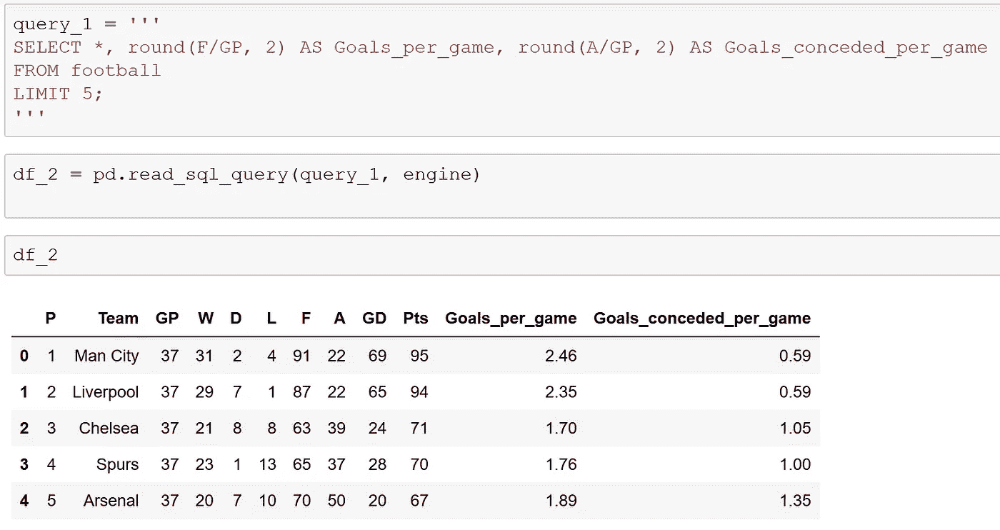
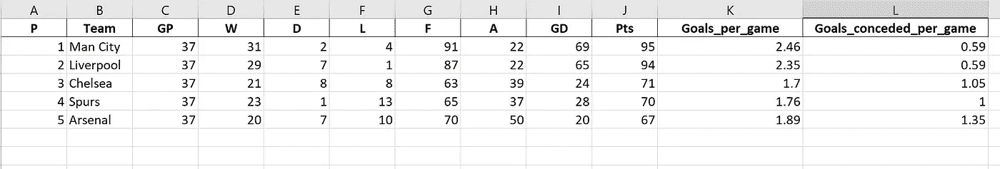
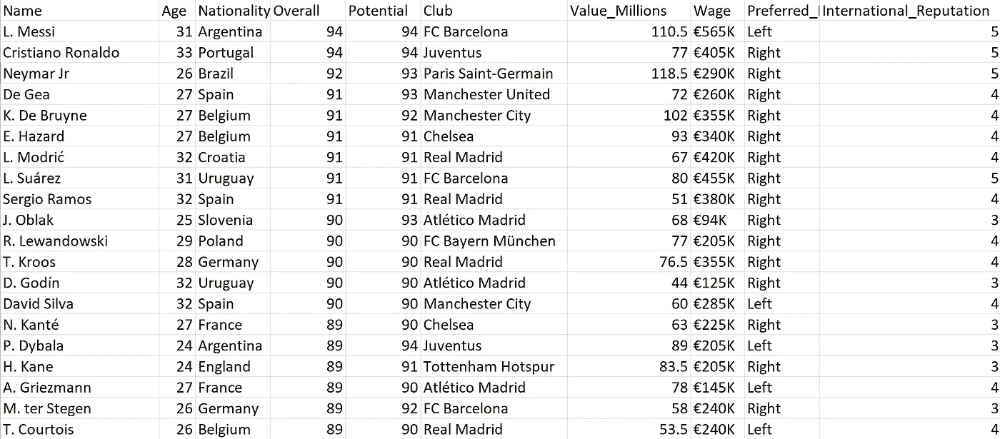
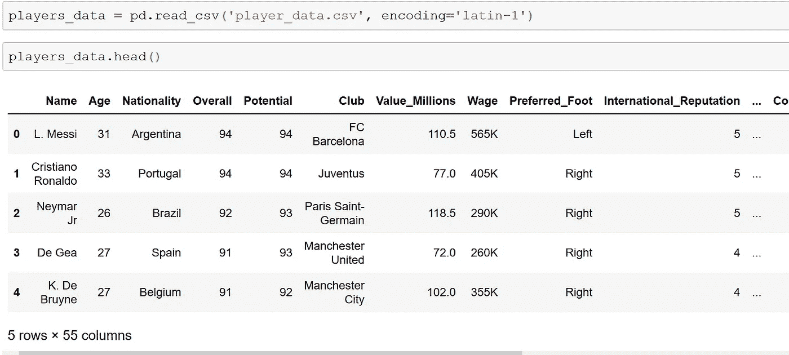
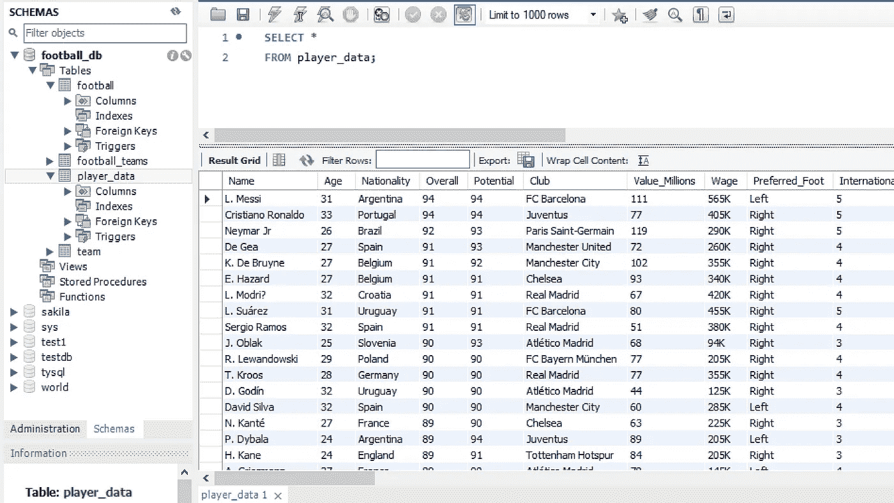
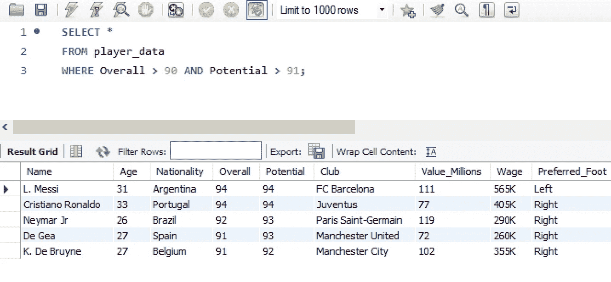
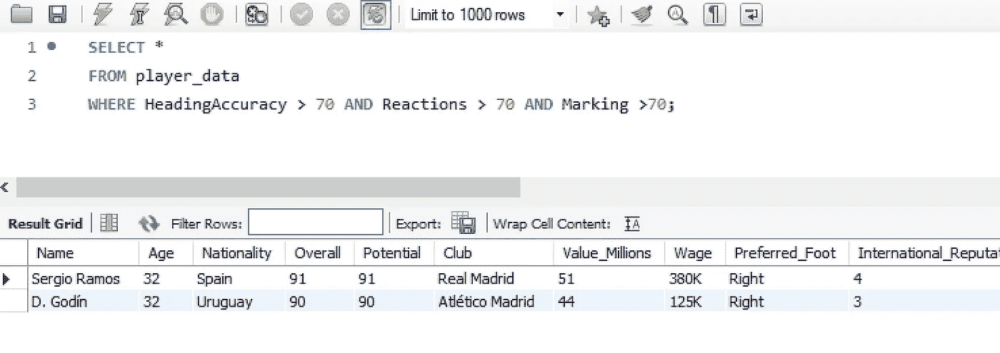
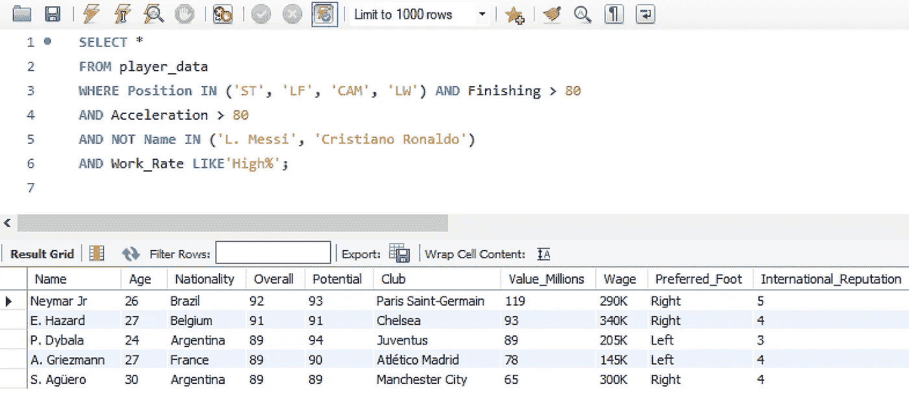

# 熊猫和 SQL 一起，一个英超联赛和球员球探的例子

> 原文：<https://towardsdatascience.com/pandas-and-sql-together-a-premier-league-and-player-scouting-example-b41713a5dd3e?source=collection_archive---------15----------------------->

## 熊猫，SQL，Excel 数据传输

Image Courtesy of Md Madhi via [Unsplash](https://unsplash.com/photos/lQpFRPrepQ8)

Python Pandas 库使得将表格数据从一个平台转移到另一个平台变得简单。本教程旨在向您展示如何通过使用 Pandas 在 Pandas 数据框架、SQL 数据库和 Excel 电子表格之间移动数据。因此，无论您的数据最初驻留在哪里，您都可以将它转换成一种您觉得可以轻松分析和操作的格式。

# **将 SQL 表转换/读取为 Pandas 数据帧**

经常需要将数据从一个平台转移到另一个平台。将 SQL 表/查询转换成 Pandas 数据框架可能是有用的。首先，必须安装 3 个模块。这些包括:熊猫、sqlalchemy 和 PyMySQL。

这里，英超联赛表在 MySQL 的“足球”表中。目标是将这个表转换成熊猫数据框架。

首先，按照惯例导入 Pandas 模块作为别名 pd，然后导入 sqlalchemy 模块。接下来，有必要在 Python 和 MySQL 数据库之间建立一个连接。幸运的是，sqlalchemy 模块提供了一个名为**的函数。create_engine()** 使这个连接能够被建立。

**里面的弦。create_engine()** 函数被称为连接字符串。

**create_engine()** 函数基于 URL 生成一个引擎对象。这些 URL 通常带有用户名、密码、主机名和数据库名。数据库 URL 的典型格式是:

为了清楚起见，“mysql+pymysql”表示我正在使用 mysql 作为我的数据库管理系统，并且在模块 pymysql 内的函数与这个数据库管理系统(DBMS)接口。

用户名= root，密码=****，主机名= localhost，数据库名= football_db。

为了匹配使用您的特定 DBMS 的引擎配置，您应该咨询[https://docs.sqlalchemy.org/en/13/core/engines.html](https://docs.sqlalchemy.org/en/13/core/engines.html)关于连接字符串格式的细节。现在，当我运行 Jupyter 笔记本中的代码时，数据框出现了。为了确认，我可以简单地使用**类型**函数，这表明我有一个熊猫数据帧。

这里一个有用的问题是:为什么我们要将 SQL 足球表转换成熊猫数据框架？

举例来说，这是许多可能的原因之一，现在可以对数据帧进行样式化，从而增强其对目标受众的可读性。这里定义了两个有用的函数；其中一个使用条件格式为目标差异列着色，如果目标差异为正，则为绿色，如果目标差异为负，则为红色。我们甚至可以更进一步，定义一个当用户滚动单元格时放大单元格的函数。这在 MySQL 中是不可能的。

# **将 SQL 查询读入熊猫数据帧**

为了将一个查询从 SQL 读入 Pandas 数据帧，我们首先用它的母语编写查询，这里是 SQL。我将这个查询的变量名指定为 query_1，因为它跨越了多行，所以我将这个查询放在了三重引号中。然后，可以通过将其变量名和引擎作为参数添加到 **pd.read_sql_query()** 方法来读取该查询。如下所示，查询现在是一个熊猫数据框架。

# **将足球数据帧导出到 Excel 文件**

使用 **pd.to_excel()** 方法可以导出新创建的数据帧。指定你选择的文件名，这里我选择了“goals_game_stats.xlsx”，因为这似乎是合适的。包括文件扩展名。xls(如果您安装了 xlwt 模块)或。xlsx 扩展名，如果您安装了 openpyxl 模块。

似乎没有必要包含用 Pandas DataFrame 指定的索引，所以我简单地将可选参数 index 设置为 False，然后从相应的 Excel 文件中省略该索引。熊猫解析器真的让数据传输变得更容易了！

# **使用熊猫从 Excel 到 MySQL】**

*…还为巴塞罗那足球俱乐部做了一些球探工作*

总而言之，我想我会通过演示如何使用 Pandas 将 Excel 文件导出到 MySQL 进行查询来结束本教程。由于所有的例子都是基于英超联赛，我认为使用一个新的数据集会很好。为此，让我们调查一下世界上最好的足球运动员。下面是对球员和 Excel 电子表格中的一些栏目的简要介绍。

[下面的数据集来自 Kaggle](https://www.kaggle.com/karangadiya/fifa19) 。

我将这个数据集保存为逗号分隔值(CSV)文件，并使用 **pd.read_csv()** 方法，将编码设置为‘Latin-1’来解析 Excel 文件。为了确认解析有效，我在 players_data 数据帧上使用了 head 方法。下面显示的数据框跳过了中间的列。如果我们想检查所有 55 列是否都存在，一个很好的方法是使用 **pd.set_options()** ，其中我将“display.max_columns”设置为 60 以包含我的所有列。视频现在显示所有的列都包含在内，并且已经被正确解析。

我现在可以通过我的 Python 脚本连接到我的‘football _ db’了。然后，我编写一个查询来创建一个表。表名 player_name 似乎很合适。接下来，在使用游标执行该查询之前，我指定了列及其对应的数据类型。

现在是魔法！

我使用了 **DataFrame.to_sql ()** 方法，在我的例子中是 **players_data.to_sql()** 方法，并将这个数据帧写入新创建的表“player_data”，连接前面提到的引擎，省略索引，并将“if_exists”参数设置为“append”以将数据添加到表中。

最初来自 Excel 的表现在已经导入到 MySQL 数据库中。现在已经为查询设置好了。

# 最好的球员，最好的后卫和昂贵的巴塞罗那目标…

让我们根据他们的“总体”和“潜在”指标来看看谁是世界上最好的 5 名球员。

或者也许我们想知道谁是最令人印象深刻的防守者。理想状态下，理想的防守者应该有良好的头球准确性，反应和盯人属性！

随着巴塞罗那在冠军联赛中被利物浦击败，夏季引援将是加泰罗尼亚俱乐部的一个关键目标。由于我给了自己在巴塞罗那的临时首席球探身份，招募一名具有巴塞罗那核心特质的球员将是理想的。因此，我需要查询一个球员，有很高的工作率，有攻击意识，完成和加速超过 80。为了运行这个查询，我省略了梅西，因为他已经在巴塞罗那，并排除了罗纳尔多，因为他注定要留在尤文图斯足球俱乐部

巴塞罗那，如果你需要首席球探，请联系我！

查询结果显示有 5 名玩家。

根据我们的数据，随着巴萨今年夏天重燃对安托万·格里兹曼的兴趣，以提升他们明年冠军联赛的雄心，他可能会以 7800 万欧元的价格被证明是一笔昂贵的转会。

# **总结**

本教程重点介绍了表格数据如何在 SQL 数据库、Pandas 数据框架和 Excel 之间移动。Python Pandas 库使移动数据变得简单，特别是当我需要将数据从 DataFrame/SQL 数据库导入 Excel 时，我喜欢使用 Pandas。希望本教程演示了如何实现数据传输。

如果你喜欢这里展示的例子，或者我是否应该在接下来的教程中切换到更多基于金融/医疗保健的例子，请告诉我。