# 熊猫足球分析

> 原文：<https://towardsdatascience.com/pandas-for-football-analysis-42c23b252995?source=collection_archive---------9----------------------->

## 一个利用足球联赛数据合并和抓取数据帧的例子

Image Courtesy of [Donnycocacola](https://unsplash.com/@donnycocacola)

# 介绍

本教程将集中在如何合并从不同的网上来源搜集的数据帧。首先，我将把可从[维基百科](https://en.wikipedia.org/wiki/2018%E2%80%9319_Premier_League)获得的英超联赛表格，与一支球队在一个赛季中领先、追平或落后的平均时间相关的统计数据合并起来。这些信息将从一个独立的来源搜集而来，即[足球统计](https://www.soccerstats.com/table.asp?league=england&tid=t)。

2018-19 英超赛季刚刚结束。虽然冠军争夺和降级之战占据了大部分头条，但知道一支球队在整个赛季的英超比赛中平均需要领先多少分钟才能确保欧洲足球，这将是一件有趣的事情。

当每个英超联赛结束时，奖金会根据球队在联赛中的排名在球队之间分配。通过收集数据，并将其列表成数据框，你可以清楚地看到托特纳姆热刺队在赛季最后一天与埃弗顿队打平的影响，这使他们失去了第三名的成绩。

# **刮痧**

我按照惯例导入 Pandas 模块作为它的别名 pd。Pandas 有一个内置函数， **read_html** ，它使用 lxml 和 BeautifulSoup 之类的库来自动解析 html 文件中的表格，作为 DataFrame 对象。默认情况下， **pandas.read_html** 函数搜索并尝试解析包含在 **< table >** 标签中的所有表格数据。结果是 DataFrame 对象的列表。

我使用 pandas 函数 **pd.read_html()** 从维基百科中删除英超联赛表，从 soccerstats 中删除 leading_level_trailing 表。快速回顾如何做到这一点和基本的清理(这很简单)，请参阅我的文章；[英超熊猫](/pandas-in-the-premier-league-78f1d0c21b4f)。

这导致了下面描述的两个数据帧。为了节省空间，我只使用。head()方法。

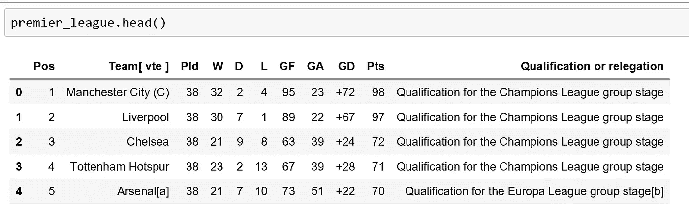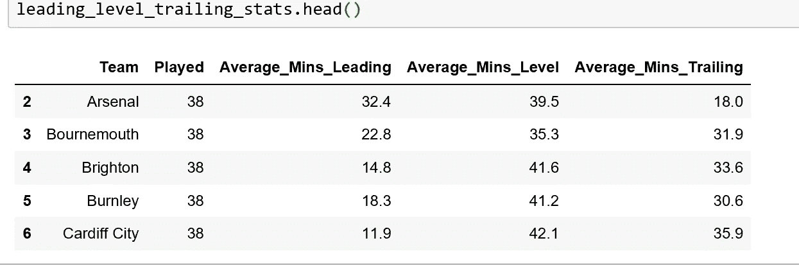

# **合并两个数据帧**

“Premier_league”表和“leading_level_trailing”表现在可以合并了。在这种情况下，为了合并，我创建了一个在两个数据帧之间共享的新列。我本来可以选择使用现有的团队名称列，但是许多条目的名称和填充实际上略有不同。

例如，“曼城(C)”是 premier_league 表中的列值，但“曼城”列在 leading_level_trailing 表中。由于有许多不同名称的实例，我选择为每个团队插入一个新列，用简单的三个字母缩写。这省去了重命名每个团队的时间，因此相应的行将在两个数据帧之间匹配，但是有许多方法可以做到这一点。

名词（noun 的缩写）b:当我用球队简写创建新列时，条目必须与他们的球队结合，例如“leading_level_trailing”表中的第一个球队是阿森纳，因此我的球队简写列表中的第一个元素是“ARS ”,等等。

我在 Premier_league 表中创建了相同的 Team _ 缩写。我现在可以合并两个数据帧。

我为合并的表决定一个新的变量名，并使用 **pd.merge** 函数进行合并。我在括号中列出了这两个表，使用 **on=** 参数选择匹配哪一列，使用 **how=** 参数保留左侧 Premier_league 表中的所有行。

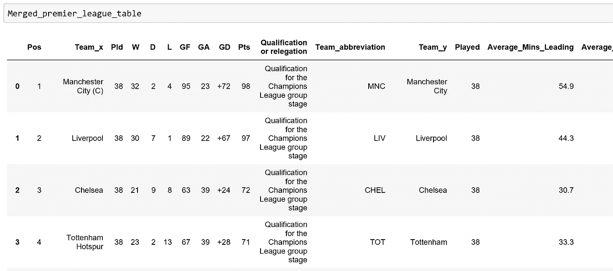

在更彻底地组织数据帧之后，例如删除重复的列名(例如 Team_y)，我检查合并表‘leading _ level _ trailing _ stats’中列的数据类型，并将‘object’类型的列(python 字符串)转换为我们可以应用数字过滤条件的数字数据类型。

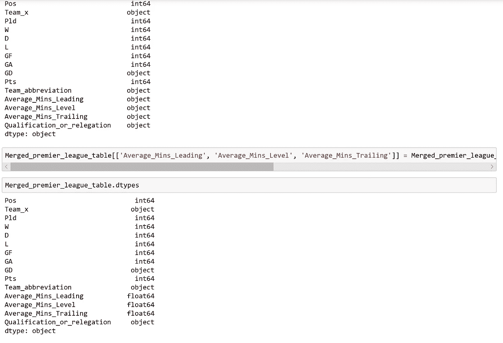

为了回答最初的问题，我们对表应用过滤标准。这告诉我们，一支球队需要平均领先 31.7 分钟才能确保欧洲足球！

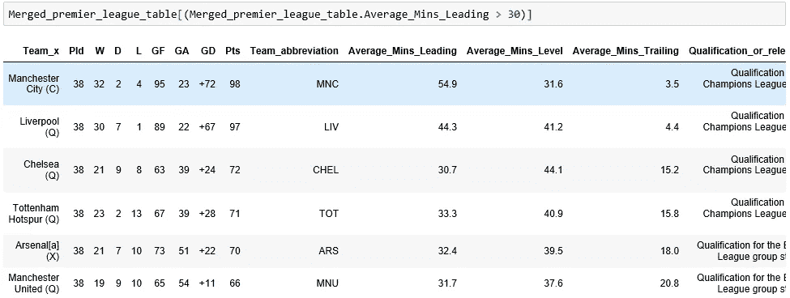

# **将新构建的数据帧与刮除的非表格数据合并**

在这个新成立的“合并英超联赛表”中增加一个奖金栏将会使它更具知识性。我们可以开始绘制英超比赛中平均领先时间和奖金之间的关系。

然而，在这种情况下，当我访问一个网站时，例如 RadioTimes，我需要的数据不是我可以使用 pd.read_html 抓取的表格格式。

这意味着我有两个目标。首先，收集数据，其次，我需要把它转换成一个数据帧，我可以合并到新成立的'合并 _ 英超 _ 联赛 _ 表'。

我首先从《广播时报》找到我需要的数据。

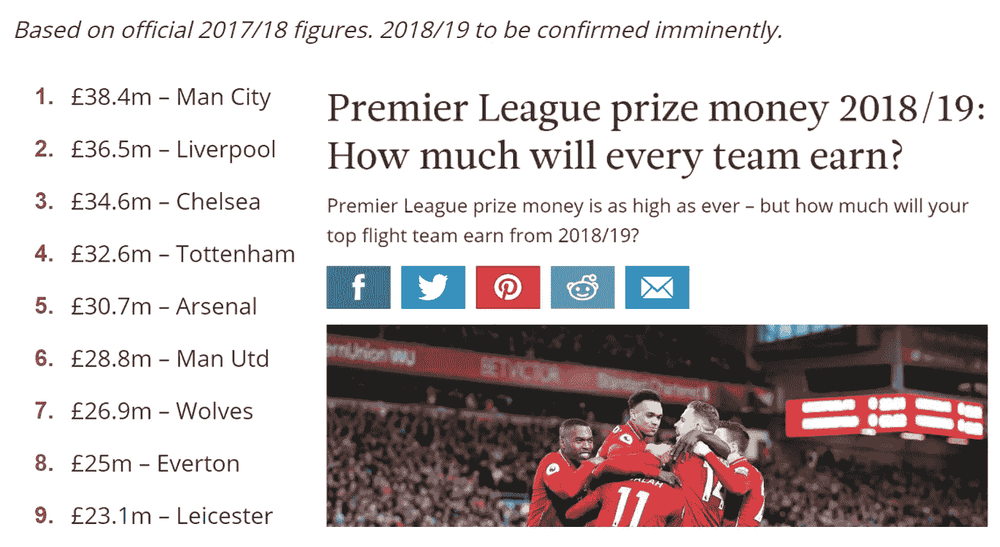

[Sourced from RadioTimes](https://www.radiotimes.com/news/sport/2019-05-12/premier-league-prize-money-2018-2019/)

当我右键单击并选择 inspect 时，我可以看到底层的 HTML 源代码。我需要的信息嵌套在代表列表项的标签中。这些 li 标签位于一个 **HTML < ol >标签中。**

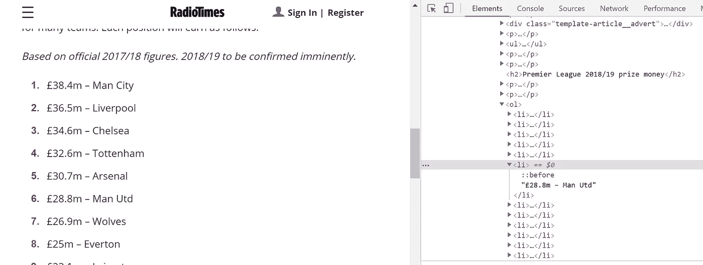

为了开始抓取这些数据，我导入了 requests 模块，并将感兴趣的 URL 放在 requests.get 方法的括号中。接下来，我导入 BeautifulSoup 来解析这个 HTML 代码，并将解析器参数设置为“html.parser”。然后，我使用 soup 对象的 **findall** 方法来查找所有出现的“ol”。这将返回一个结果集对象，其行为类似于一个列表长度为 2 的 python 列表。我检查这两个列表，以找到我的信息所在的位置。我在变量名 prize_money_scrape 下索引第二个列表。为了查看这个列表的内容，我使用了 contents 属性。

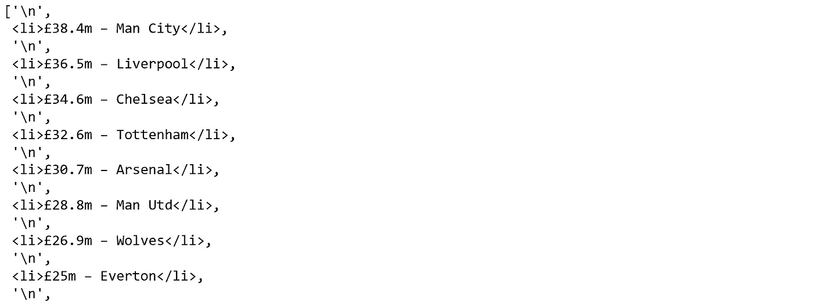

虽然这个列表提供了我需要的信息，但是每个列表项都由换行符分隔。由于这遵循一种常规模式，我可以使用索引符号来提供跳过这些换行符的步骤。我从元素 2 (python 的列表 1)开始我的新收入列表，并以步长 2[1::2]递增。

既然换行符已经从列表中删除，我需要从

*   标签中提取数据。为此，我创建了一个名为 records 的新的空列表，遍历收入列表中的元素，并从结果集对象中提取文本，然后追加到新列表中。为了确认这些工作正常，我打印了新的记录列表。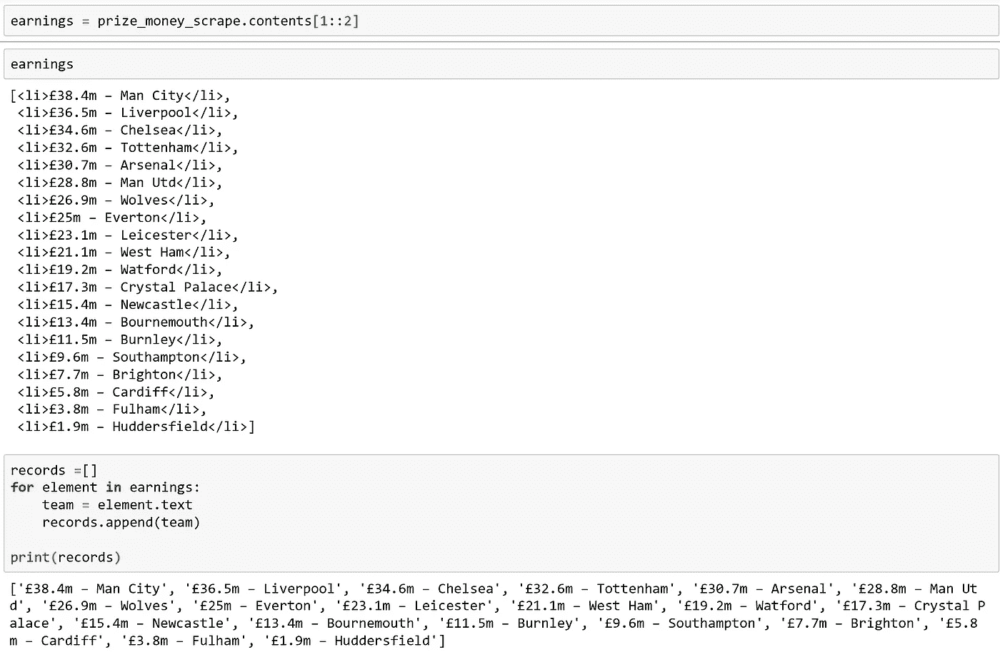

我很喜欢熊猫的一点是，你可以把列表变成数据框。这样做很简单。现在，我可以通过将记录列表传递给 pd，将它转换成数据帧。DataFrame 方法。我在引号中的花括号内创建了一个新的列标题，用分号分隔，然后在结束花括号之前传入我的列表。当我可视化我的一列数据框架时，我可以看到它已经如预期的那样工作了。

新的数据框架有一列，将所有的信息转储在里面。理想的情况是“收入”和“团队”在不同的列中。为此，我在公共的 hypen (-)上拆分字符串，并使用 get 方法提取收入的第一个元素和团队的第二个元素，如下所示。

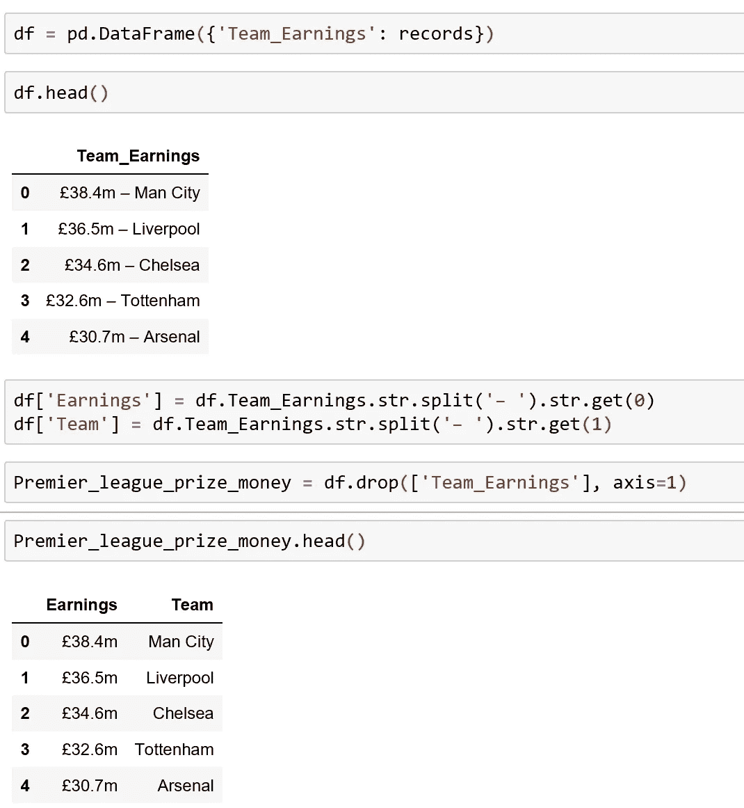

为了与现有的 Premier League 表合并，我创建了一个新的公共列，它将在新抓取的 Premier_league_prize_money 数据框架和“Merged_premier_league_table”之间共享。我还删除了前缀“”符号和后缀“m”字符，将“收入”列转换为数字数据类型。

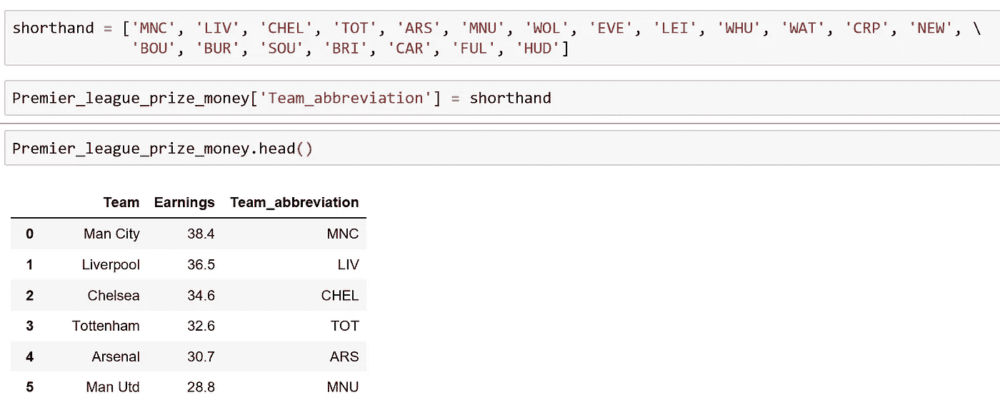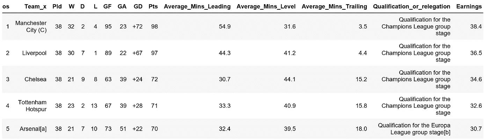

最后，我将 Team_x 列的名称改为 Team，并将“收入”列改为“奖金 _ 金钱 _ 百万”,这样就可以清楚地看出该列中的数值代表什么。

最后，在连续变量‘奖金 _ 百万’和‘平均 _ 分钟 _ 领先’之间建立一个关系是有用的。在英超联赛中领先的平均上场时间和获得的奖金之间有很强的相关性是合理的，但为了明确起见，我可以使用下面显示的代码片段使用海运库中的 **regplot** 函数绘制一个带有回归线的散点图(*这里，确保 seaborn 和 matplotlib 是通过 pip 命令安装的，并导入到您的 python 脚本*)。

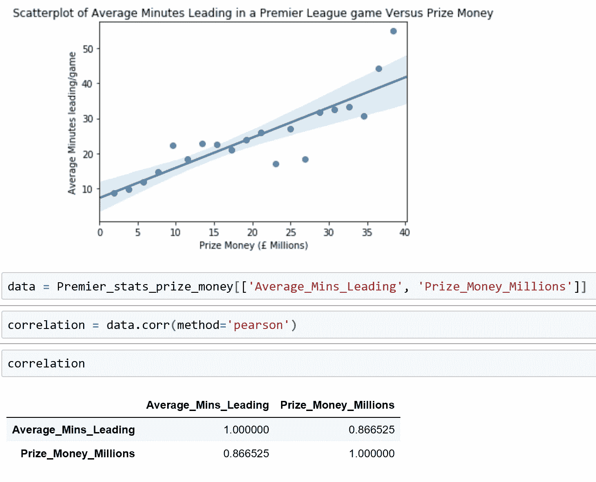

为了确定相关性，我使用了 **DataFrame.corr** 方法。我已经将可选的方法参数设置为' *pearson* '，但是也可以将 *kendall '和' spearman'* 作为可选参数提供，以覆盖默认参数' *pearson* '。

正如所料，这两个变量之间的相关性很强。正如可以合理预期的那样，你花在领导上的时间越多，获得的奖金就越多。

最后，作为总结，让我们看看最后一天的抽签对托特纳姆奖金的影响。

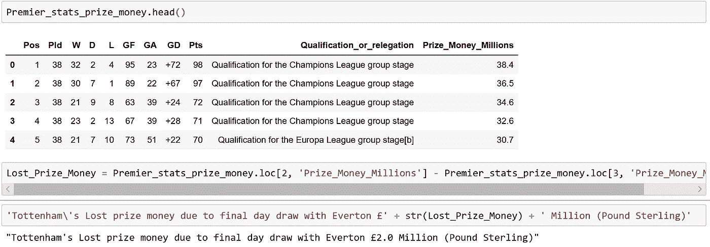

200 万！

足球*真的*是个结果生意！