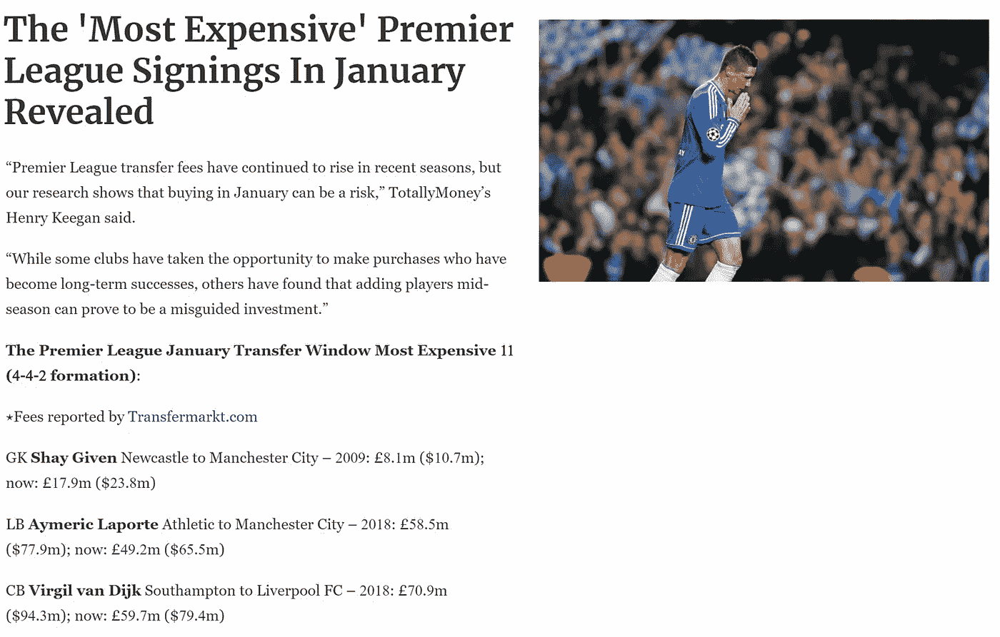
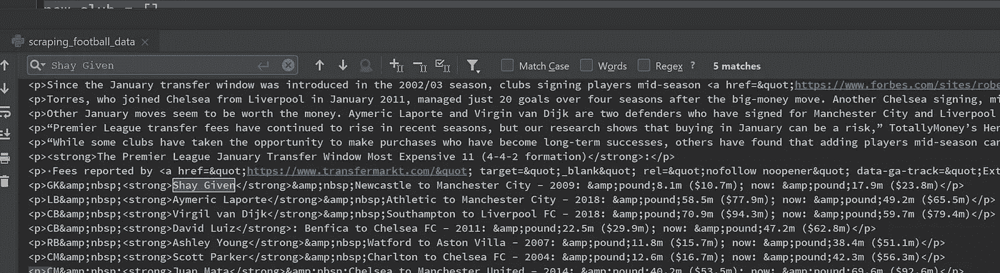
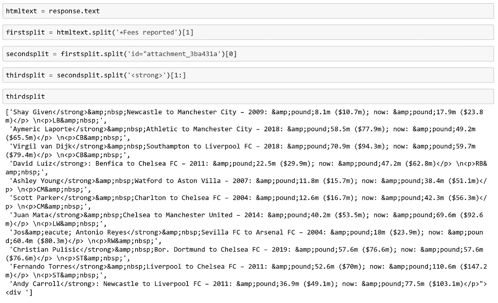
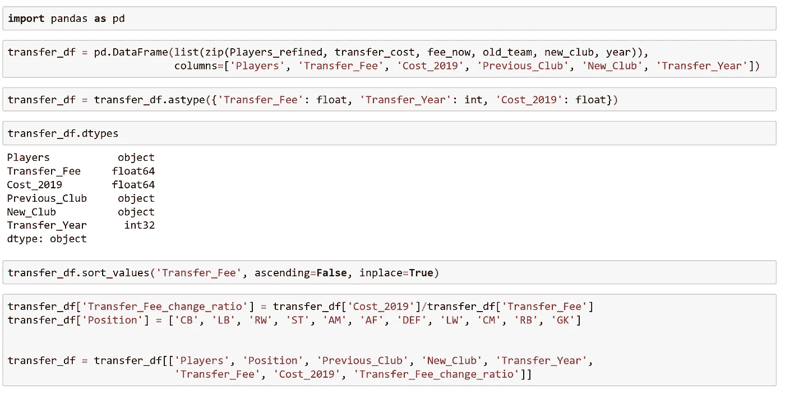
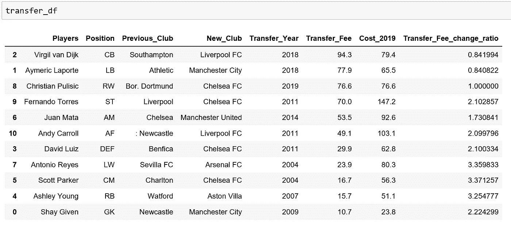
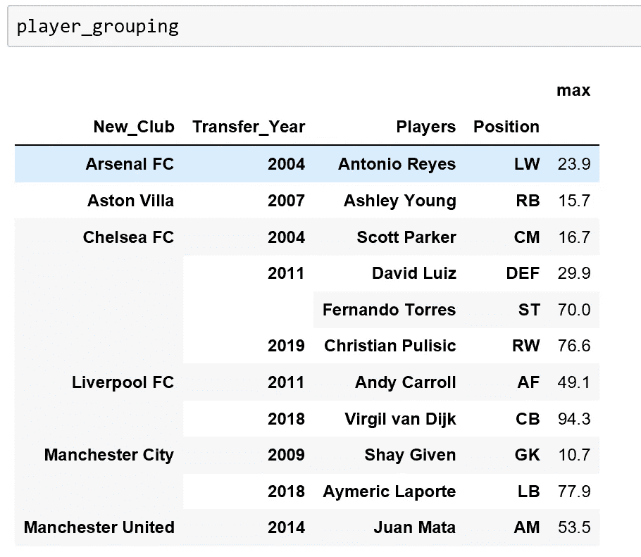
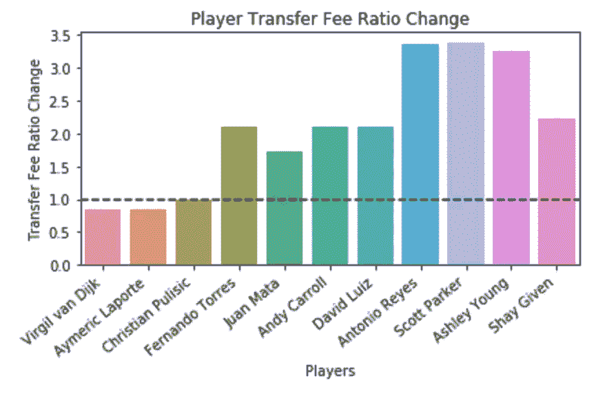

# 熊猫对足球运动员的价值

> 原文：<https://towardsdatascience.com/pandas-for-football-player-value-936c3243bd9a?source=collection_archive---------19----------------------->

## **一个网页抓取和熊猫指导教程**

Image Courtesy of Joshua Hoehne via [Unsplash](https://unsplash.com/photos/1Nu_qjXO5-0)

在足球方面，一月为联赛中的球队提供了一个改变阵容的机会。

考虑到这一点，本教程将重点介绍如何在标准的 4-4-2 阵型中，为每个位置收集有史以来最昂贵的一月英超签约信息。

一旦抓取完成，本教程将展示如何转换 Pandas 数据框架中的抓取数据，并演示这种格式的数据结构如何对初始数据分析有用。

[下面显示的福布斯网页将在这里使用和提供。这个网页有你感兴趣的所有信息。](https://www.forbes.com/sites/robertkidd/2019/02/28/the-most-expensive-premier-league-signings-in-january-revealed/#5614d28fb095)

值得注意的是，所有位置的所有一月签约，球员转出的俱乐部，以及他们转入的俱乐部。此外，发生转会的年份，他们最初购买球员时的转会费，以及基于“*足球运动员通货膨胀率”*的他们现在的价值。

首先，我导入请求库。然后，我创建一个' **url** '变量，并将福布斯网站的 url 链接分配给这个变量。这个链接包含了一月转会窗口中最昂贵的转会的相关信息。

我使用请求库中的 get 方法开始提取数据。为了确认从我的 python 环境到网页的连接，我打印了 **status_code** ，它返回 200。

200 是“OK”的 HTTP 状态代码，表示成功响应。(其他你可能比较熟悉的代码有 404 找不到，403 禁止，500 内部服务器错误。)

一旦连接通过验证，我就使用 text 属性来检索 Forbes 网页的底层 html 源代码。当我打印 html 文本时，我的控制台中的输出非常大。为了帮助缩小我感兴趣的领域，我在控制台中使用“CTRL-F ”,搜索我知道会引导我到我想要提取数据的地方的玩家的名字。

这个搜索引导我找到我需要的信息，紧跟在 **<强>** 标签之后。从源输出的一瞥中，我可以看到吉文，纽卡斯尔到曼城，他的转会费是美元和美元，当球员最初被购买时，他的价值是美元和美元。

在这种情况下特别有用的是底层 HTML 源代码的规律性。例如，每个玩家的名字都以同样的方式嵌入到一个 **<强>** 标签中。另外，球员转出的球队总是在'**之后 nbsp**的字符，以及前面的单词**到**。这种模式意味着我可以创建一个 for 循环来迭代我的代码并提取相关信息。

最初，我喜欢缩小搜索范围。htmltext = response.text 的输出返回一个巨大的字符串，我可以使用 split string 方法来拆分它。我在“*Fees reported”上进行拆分，通过索引为 1 获取该字符串之后的所有内容，并在一个唯一的字符串上再次拆分，通过索引为 0 获取之前的字符串。

这给我留下了一个缩短的字符串。为了将字符串“secondsplit”转换成一个列表，我在一个强标记处对其进行了拆分，并获取第二个元素(python index 1)之后的所有内容，直到列表的末尾。

这给我留下了一个列表(thirdsplit ),其中包含了我想要提取的每个玩家的所有信息。

我现在可以迭代我的列表。例如，为了找到原始的转让费，我使用 split 方法来拆分我的 thirdsplit 列表中的每个元素，并通过使用子串符号来提取'($ '符号之后和' m '字符之前的字符串。

然后，我将每笔转让费附加到一个新构建的名为转让费的列表中。我重复同样的过程，以获得球员，他们的前俱乐部，转会年份，新俱乐部，以及截至 2019 年的费用，当足球运动员通货膨胀率适用时。

在某些情况下，for 循环中特定变量的 **split** 方法并不能完全删除所有必要的字符。当我运行如下所示的 for 循环时，前缀'**Jos&amp；eacute 出现在球员安东尼奥·雷耶斯面前。**

要创建新的玩家列表，我只需添加一个条件来删除这些字符，并生成一个新的列表。这包括检查前导字符并用空字符串替换它们，如所附 GitHub gist 代码片段所示。同样的验证也适用于 Old_team 列表。

一旦列表被收集和整理，我就可以创建一个熊猫数据框架。为此，我导入熊猫，并将我的列表一起压缩到 **pd 中。DataFrame** 方法。我为列表分配了适当的带标签的列名，这样它们就代表了列表的内容，例如“玩家”列指的是列表“玩家 _ 精炼”。

使用**将 transfer_df 数据帧列、Transfer_Fee、Transfer_Year 和 Cost_2019 的数据类型更改为适当的数字类型。astype()** 方法，在使用**根据最高 Transfer_Fee 对数据帧进行排序之前。sort_values()** 方法。

最后，我创建了另外两列。一个决定 2019 年球员成本(基于球员通货膨胀率)和他们在购买时的转会费之间的比率。第二列是指玩家各自的位置。

我实现的另一个步骤是对列进行重新排序。例如，如果球员名字后面跟着球员各自的位置，读起来会更好。

查看 transfer_df 数据帧时，所有必要的更改均已实施。

数据已经成功地从福布斯网页中提取出来，并输入到熊猫数据框架中！

熊猫图书馆中我非常喜欢的一个方面是用 T3 方法进行的 T2 分组。在这里，数据是非常清晰易读的形式。

很明显，在一月份，阿森纳以 2390 万美元的价格签下了最昂贵的左边锋安东尼奥·雷耶斯。除此之外，切尔西还签下了一月份 11 笔最昂贵的签约中的 4 笔(基于 4-4-2 阵型)，其中 2 笔是在 2011 年。出于比较目的，这些数据比网页上显示的原始文本更容易解释。

现在可以制作一个柱状图来帮助可视化从最初购买时间到现在的市场价值的相对变化。

转账费用变化栏和图表比福布斯网页上的原始文字更清楚地说明了这一点。

这张示意图显示，如果费尔南多·托雷斯在今天的转会市场上被购买，他的价格将是 2011 年的 2.10 倍。然而，从我们的表格和示意图中我们可以清楚地看到，埃梅里克·拉波尔特的成本会更低，是 2018 年支付给他的 0.84 倍。在极端的情况下，如果斯科特·帕克今天被买走，他将比他 2004 年最初的转会费高出 3.37 倍。

*在 y 轴的 1.0 处添加了一条标准化虚线，以显示比率的相对变化。*

# 结论

这个介绍性的例子描述了我们如何抓取数据并将其转换成 pandas 数据帧。通过这样做，可以很容易地处理和分析数据。在这种情况下，现在很容易根据俱乐部分组，创建一个新列来计算原始购买和当前市场价值之间的转会费变化率。除此之外，我们还可以创建信息图，如本文中显示的条形图。