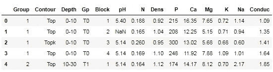
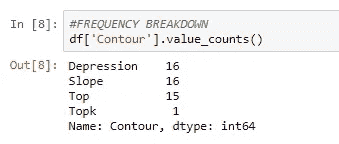

# 熊猫给匆忙的人

> 原文：<https://towardsdatascience.com/pandas-for-people-in-a-hurry-59d966630ae0?source=collection_archive---------5----------------------->

## 满足您所有数据探索需求的数据框架


Photo by [Pascal Müller](https://unsplash.com/@millerthachiller?utm_source=medium&utm_medium=referral) on [Unsplash](https://unsplash.com?utm_source=medium&utm_medium=referral)

Pandas 是最流行的用于数据操作和数据分析的 Python 库。这是所有数据科学家必须知道的！

两只熊猫的数据结构是:

1.  熊猫数据框
2.  熊猫系列

我喜欢把熊猫数据框想象成一个 excel 表格。你有许多行和列的数据。然而，在 Pandas 中，列中的数据必须是相同的数据类型。熊猫系列只是熊猫数据框架中的一列。

这篇文章将为您提供大量有用的 Pandas 信息，告诉您如何使用 Pandas 中的不同方法进行数据探索和操作。这是一个很好的熊猫入门指南，也是一个很好的复习工具，如果你有一段时间没有使用熊猫的话。本概述将详细介绍如何导入数据集，以及如何探索、选择、清理、操作、聚合、组合和导出数据，以便您能够顺利完成下一个数据科学项目。

> 我在整篇文章中加入了一些“专家提示”,与你分享我在使用熊猫期间学到的一些有用的东西。如果你有一些很酷的建议要分享，我很想听听！下面掉个评论！

你可以在这里下载我的 Jupyter 笔记本[并跟随。下面描述的方法将以土壤数据集为例。我建议您打开 Jupyter 笔记本，以便可以看到代码的输出。](https://github.com/julia-git/Soils_DataSet)

# 开始提示

首先，确保您首先导入 Pandas 库。

`import pandas as pd`

我也喜欢在开始之前修改默认的熊猫选项。参见下面的专家提示。

> **专家提示:**默认情况下，如果数据框架中有许多列，并非所有的列都会显示在输出显示中。您可以使用这行代码来加宽输出显示中的列:

`pd.set_option('display.max_columns', 500)`

值 500 表示以字符为单位的列的最大宽度。也就是说，值 500 意味着您希望在调用 dataframe 时显示多达 500 列。默认值仅为 50。

此外，您可以使用类似的代码行来加宽输出显示中的行。这将允许显示多达 500 行。

`pd.set_option('display.max_rows', 500)`

# 进口到熊猫

导入数据将是项目的第一步。无论你有一个 excel 文件或 csv 文件，他们可以很容易地导入到熊猫。

要导入逗号分隔值(CSV)文件，请使用这行代码。

`pd.read_csv("Soils.csv")`

在括号内，`"Soils.csv",`是我上传的文件的名字。对于 excel 文件，使用这行代码。

`pd.read_excel("Soils.xls")`

为了成功导入您的文件，上面的代码假设数据文件位于您当前的工作目录中。

> **专家提示:**如果你不确定你的工作目录在哪里，在你的 Jupyter 笔记本里，你可以使用`!pwd`来得到你的工作目录。`!`字符告诉 Jupyter Notebook 将代码视为 OS shell 命令。
> 
> **专家提示:**如果您碰巧有任何日期时间类型的列，请在括号内添加`parse_dates = [column_name]`作为参数，以便 Pandas 可以将该列识别为日期。例如，如果您有一个名为 Collection_Date 的日期列，您会使用`pd.read_excel("Soils.xls", parse_dates = ['Collection_Date'])`吗

这是我成功导入后的数据帧片段。



# 探索您的数据

现在您的数据已经在 Pandas 的数据框架中，您已经准备好进行调查了。这里有几个有用的方法，每次引入数据集时都可以调用。这些步骤应该有助于您了解您的数据中有哪些内容。

## 探索数据框架

`df.head()`返回数据帧的前 5 行。要覆盖默认值，可以在括号之间插入一个值来更改返回的行数。示例:`df.head(10)`将返回 10 行。

`df.tail()`返回数据帧的最后 5 行。您可以在括号之间插入一个值来更改返回的行数。

`df.shape`返回表示维度的元组。例如,( 48，14)的输出代表 48 行和 14 列。

`df.info()`提供数据摘要，包括索引数据类型、列数据类型、非空值和内存使用情况。

`df.describe()`提供描述性统计数据，总结集中趋势、分散和形状。

## 浏览列

我最喜欢的方法之一就是`.value_counts()`。此方法为所选列中的每个唯一值提供计数。



> **专家提示:**如果你更希望看到百分比而不是绝对数字的细分，试试`.value_counts(1)`吧。

这里有几个更有用的方法来看看你的数据框里有什么。

`df['Contour'].isnull().sum()`返回列“轮廓”中空值的计数

`df['pH'].notnull().sum()`返回列“pH”中非空值的计数

`df['Depth'].unique()`返回“深度”列中的唯一值

`df.columns`返回所有列的名称

# 选择数据

有许多不同的方法来选择您感兴趣的数据。以下是我常用的一些最有用的方法。

## 列选择

如果你想只选择一列，你可以使用`df['Group'].`这里‘组’是列名。

要选择多列，您可以使用`df[[‘Group’, ‘Contour’, ‘Depth’]]`。注意，选择多列时会使用双括号。只需传入您想要的列名。

## 子集选择/索引

为了选择特定的数据子集，我们依赖于`.loc`或`.iloc`方法。我建议您尝试一下这两种方法，以便更好地理解它们是如何工作的。

我们可以使用`df.loc[]`通过行和列的标签进行选择。

`df.loc[:,[‘Contour’]]`选择所有行和列的‘轮廓’。单冒号`:`选择所有的行。在逗号的左边，指定所需的行，在逗号的右边，指定列。

`df.loc[0:4,[‘Contour’]]`选择我们的索引 0 到 4 和列‘轮廓’。

另一方面，我们使用`df.iloc[]`按位置选择行和列。我们会传入整数位置。

`df.iloc[:,2]`选择位置 2 的所有行和列。

`df.iloc[3,:]`选择位置 3 的行和所有列。

## 过滤

此外，我们可以使用掩码来帮助我们在数据帧中选择符合特定标准的特定行。在下面的掩码中，根据语句计算列中的每个值。即值是否等于“顶”。

```
mask = df[‘Contour’] == “Top”
df[mask]
```

代码`df[‘Contour’] == “Top”`返回布尔值 True 或 False。当我们在`df[mask]`中使用布尔掩码时，它将只打印掩码为真的行。

该掩码也可用于计算数值列。在下面的示例中，当“Conduc”列中的值大于 10 时，将返回布尔值 True。

```
mask2 = df[‘Conduc’] > 10
mask2
```

使用掩码的另一个有用的方法是过滤列表中的项目。

```
mask3 = df[‘Contour’].isin([‘Depression’, ‘Slope’])
df[mask3]
```

> **专家提示**:如果你想选择你蒙版的反面，可以用蒂尔达符号。例如，`df[~mask3]`将选择“轮廓”列中既不包含凹陷也不包含坡度的所有行。

# 清理数据

只有数据本身是好的，一个数据科学项目才能是好的。也就是说，我们希望在将数据插入机器学习算法之前，数据质量良好。以下是一些有助于加速数据清理的有用方法。注意，我为下面的许多方法传入了`inplace=True`。这确保了更改发生在实际的数据帧中。如果您不传入这一行代码，数据帧中的更改实际上不会发生。

## **替换怪异字符**

`df.replace({‘Topk’: ‘Top’}, inplace=True)`

## 删除空值

`df[‘pH’].dropna(inplace=True)`

## 输入空值

`df[‘pH’].fillna(df[‘pH’].mean(), inplace=True) #nulls are imputed with mean of pH column`

## 删除行和列

`df.drop(columns = [‘Na’], inplace = True) #This drops the 'Na' column`

`df.drop(2, axis=0, inplace=True) #This drops the row at index 2`

需要注意的是，axis=0 告诉熊猫逐行下降。您可以使用 axis=1 来删除列。这适用于许多其他可用的熊猫方法。

## 更改列名

`df.rename(columns = {‘Conduc’ : ‘Cond’, ‘Dens’ : ‘Density’}, inplace = True)`

## 操纵数据

您可以使用`.apply`在数据框的行或列上应用一个函数。下面的代码将平方根应用于“Cond”列中的所有值

`df[‘Cond’].apply(np.sqrt)`

# 分组数据，数据聚合

有时，如果我们将数据分组进行观察，可以更好地识别差异和模式。

这里有几种不同的方法可以对数据进行分组。以下示例按“轮廓”列对数据进行分组，并计算“Ca”列中记录的平均值、总和或计数。请参阅 Jupyter Notebook 中的输出，以便更好地理解代码返回的内容。

`df.groupby(by=[‘Contour’])[‘Ca’].mean()`

`df.groupby(by=[‘Contour’])[‘Ca’].count()`

`df.groupby(by=[‘Contour’])[‘Ca’].sum()`

您也可以按多个列进行分组。

`df.groupby(by=[‘Contour’, ‘Gp’])[‘Ca’].mean()`

# 组合多个数据帧

有多种方法可以将两个数据帧组合在一起，根据您的特定任务，可能更适合使用其中一个来执行该任务。我倾向于使用的前两个是 concat 和 merge。

Concat 适用于堆叠多个数据帧的行。

**按列连接数据**

`pd.concat([df, df2], axis=1)`

**按行连接数据**

`pd.concat([df, df2], axis=0)`

当数据帧之间有公共列时，合并适合于合并数据帧。

**合并数据**

`pd.merge(df, df2, left_on=’Contour’, right_on=’Contour’, how=’outer’)`

关于合并，我不会讲太多细节，但是你可以在这里找到关于如何更好地利用它的很好的例子。

# 输出数据帧

一旦你清理和处理完你的数据。您可以将其输出到 csv 或 excel 文件来工作。

要将数据输出到由制表符分隔的 csv 文件，请使用下面的代码。`'\t'`表示您希望它用制表符分隔。如果你喜欢用`,`代替，你可以用`','`

`df.to_csv(‘myDataFrame.csv’, sep='\t')`

要输出到 excel:

```
writer = pd.ExcelWriter(‘myDataFrame.xlsx’) 
df.to_excel(writer, ‘DataFrame’) 
writer.save()
```

感谢阅读。如果你有一些关于熊猫的小贴士可以分享，别忘了发表评论。干杯。