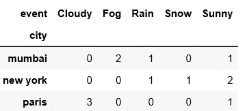

# 数据科学家从基础到高级的熊猫

> 原文：<https://towardsdatascience.com/pandas-from-basic-to-advanced-for-data-scientists-aee4eed19cfe?source=collection_archive---------17----------------------->

## 熊猫让任何数据科学家的生活更轻松

> 数据科学家是能够获取、筛选、探索、建模和解释数据的人，融合了黑客技术、统计学和机器学习——希拉里·梅森


image by [Ilona Froehlich](https://unsplash.com/@julilona)

> 哪里有烟，哪里就有火。同样，如果你在处理数据，熊猫也不会休假。它帮助您尽可能快地探索和解释数据。

> Pandas 是最常用的 python 库，用于数据操作和数据分析。

在这篇文章中，我将尝试解决熊猫的概念或技巧，使我们的生活更容易。让我们从基础到高级。我将在天气数据的帮助下穿过熊猫。

# 导入熊猫并创建数据框

使用文件、列表、字典等创建数据框的方法有很多种。这里，我通过从 CSV 文件中读取数据创建了一个数据框。

```
import pandas as pddf = pd.read_csv("weather.csv")
df
```

> 输出


Weather data

# 选择特定的列

有时您只需要操作或操纵特定的列。让我们假设你想分析温度每天是如何变化的。在这种情况下，我们将选择温度和日期。

```
df[[‘temperature’,’day’]]
```

# 重命名该列

Pandas 为您提供了一个简单的功能(重命名),可以更改一个或一组列的名称，从而简化工作。

```
df.rename(columns = {‘temperature’: ‘temp’, ‘event’:’eventtype’})
```

# 过滤数据帧

假设你想看看随着日期的推移越来越热的城市。

```
df[[‘day’,’city’]][df.event==’Sunny’]
```

> 输出


Filtered data

> 到目前为止，我们已经看到了一些基础知识，让我们深入了解，真正的熊猫从这里开始。正如我所说，熊猫永远不会休假，即使你想有复杂的问题。

# 分组

假设你想操作一组特定的数据。在这种情况下，让我们只获取属于纽约的行。使用 group object，您可以同时获得所有组的总和、平均值和中值。

> **按城市分组**

```
city_group = df.groupby(‘city’)
```

一个组对象被创建，如果你想看到特定的组数据，只需要得到组。

```
city_group.get_group(‘new york’)
```

> **输出**


new york group

# 聚集

在上面的部分中，我们只是按城市对数据进行了分组，但是如果我想查看平均温度和平均风速呢？？？。我们将在这里使用聚合。

> 分组依据和聚合

```
df.groupby(‘city’).agg({‘temperature’:’mean’, ‘windspeed’:’mean’})
```

> 输出


Mean temperature and wind speed

# 合并

在以上各节中，我们讨论了拥有单个数据框的问题。如果有两个数据框，并且您想一起分析它们！！！。在这种情况下，合并起着关键作用，并简化了两个数据框的连接。

## 创建两个数据框

```
df1 = pd.DataFrame({
 “city”: [“new york”,”florida”,”mumbai”],
 “temperature”: [22,37,35],
})
df2 = pd.DataFrame({
 “city”: [“chicago”,”new york”,”florida”],
 “humidity”: [65,68,75],
})
```

**简单合并:**这给了你两个数据框中匹配的行

```
pd.merge(df1,df2,on=’city’)
```

> 输出


Matching rows of two data frames

**Outer:** 从两个数据帧中获取所有行。添加新参数(如何)。

```
pd.merge(df1,df2,on=”city”,how=”outer”)
```

> 输出


Outer join

类似地，我们可以获得所有匹配的行以及左数据框(左连接)和右数据框(右连接)。*通过指定参数 how 与值 left/right。*

# 交叉表

假设您想要查看每个城市中事件类型(雨天/晴天)的频率计数。十字标签使这些事情变得更容易。

```
pd.crosstab(df.city,df.event)
```

> 输出



Frequency count of the event by city

注意:我们可以得到任何聚合平均值、中位数等。我们只需要给函数传递一个额外的参数。

# 用熔体重塑

如果您希望将列作为值的行，假设对于每个城市，我希望将温度和风速放在单独的值列中。在这种情况下，温度、风速保存一列，它们的值保存另一列。

```
pd.melt(df,id_vars=[‘day’,’city’,’event’],var_name=’attribute’)
```

> 输出


Reshaped data

## 参考

代码基础知识，【https://www.youtube.com/channel/UCh9nVJoWXmFb7sLApWGcLPQ 

> 希望你喜欢它！！！你也可以看看关于熊猫戏法的文章，这将会更有趣[数据科学家的熊猫戏法](/pandas-tricks-for-data-scientists-465902163545)！！！敬请期待！！！！请对任何疑问或建议发表评论！！！！！

[](/pandas-tricks-for-data-scientists-465902163545) [## 数据科学家的熊猫把戏

### 熊猫让任何数据科学家的生活更轻松

towardsdatascience.com](/pandas-tricks-for-data-scientists-465902163545)