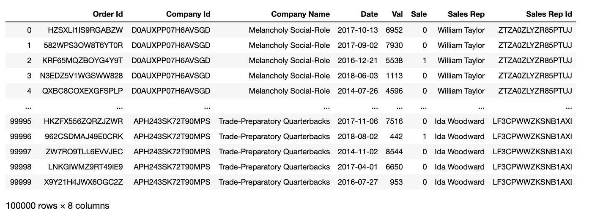
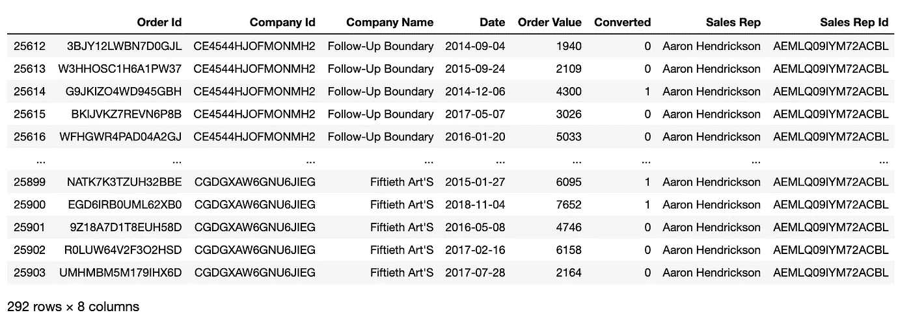
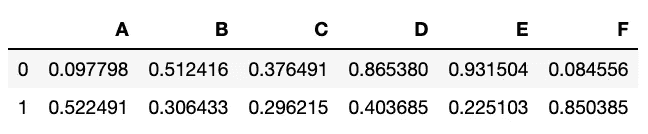
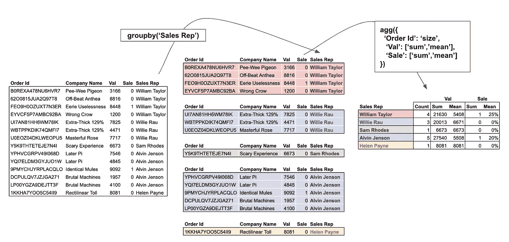
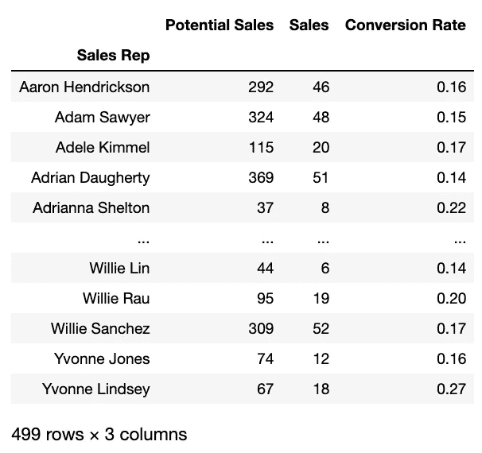
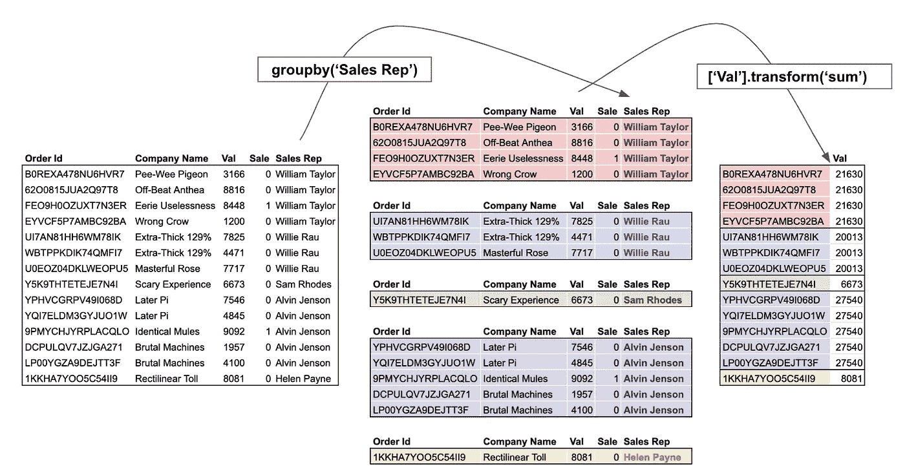
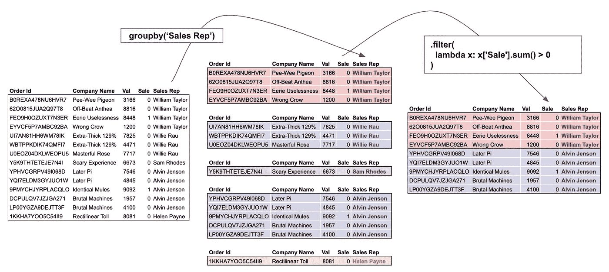
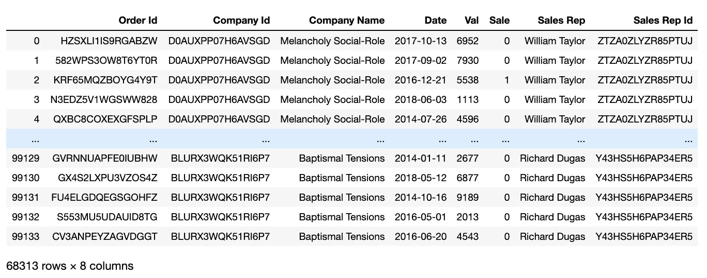
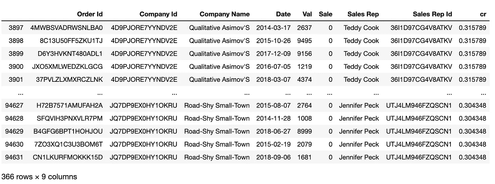

# 熊猫小组详细解释了

> 原文：<https://towardsdatascience.com/pandas-groupby-aggregate-transform-filter-c95ba3444bbb?source=collection_archive---------0----------------------->

## 熊猫终极指南

## 了解如何掌握所有 Pandas 的 groupby 功能，如聚集、转换和过滤——这是一份附有大量示例的代码指南


[Source](https://www.economist.com/china/2016/09/08/survival-of-the-cutest)

写关于熊猫的文章是最好的。我最喜欢的部分是当我在网上搜索可爱的熊猫图片的时候。Cmon 你怎么能不爱熊猫呢？还有成群的熊猫，更好！反正我跑题了…

# 介绍

andas 的 groupby 无疑是熊猫带来的最强大的功能之一。然而，**大多数用户只利用了** `**groupby**`的一小部分功能。

`Groupby`允许对数据集采用拆分-应用-组合的方法。这种方法通常用于对数据进行分割，以便数据分析师可以回答特定的问题。

## 在高级分组上，by 允许:

1.  根据列/条件将数据分成组；
2.  对所有组应用函数/变换，并将结果组合成输出

## 在本文中，我们将讨论以下主题:

1.  [加载数据](#08dc)
2.  [分组依据—拆分数据](#3a1f)
3.  [应用并组合—](#d6c9) `[apply](#d6c9)` [，](#d6c9) `[agg(regate)](#d6c9)` [，](#d6c9) `[transform](#d6c9)` [，](#d6c9) `[filter](#d6c9)`

你可以在这里找到完整的 Jupyter 笔记本。但是我强烈建议您亲自完成这些步骤。毕竟，熟能生巧。

# ①加载数据


Photo by [NASA](https://unsplash.com/@nasa?utm_source=medium&utm_medium=referral) on [Unsplash](https://unsplash.com?utm_source=medium&utm_medium=referral)

我们将使用一个假设的销售部门的数据。数据集由虚构的销售代表、订单线索、可能达成交易的公司、订单价值和线索日期等列组成。

```
order_leads = pd.read_csv(
    '[https://raw.githubusercontent.com/FBosler/Medium-Data-Exploration/master/order_leads.csv'](https://raw.githubusercontent.com/FBosler/Medium-Data-Exploration/master/order_leads.csv'),
    parse_dates = [3]
)
sales_team = pd.read_csv(
    '[https://raw.githubusercontent.com/FBosler/Medium-Data-Exploration/master/sales_team.csv'](https://raw.githubusercontent.com/FBosler/Medium-Data-Exploration/master/sales_team.csv'),
    parse_dates = [3]
)df = pd.merge(
  order_leads,
  sales_team,
  on=['Company Id','Company Name']
)df = df.rename(
  columns={'Order Value':'Val','Converted':'Sale'}
)
```



100k rows of order lead data

# ②分组依据——拆分数据


Photo by [Chris Child](https://unsplash.com/@chris23?utm_source=unsplash&utm_medium=referral&utm_content=creditCopyText) on [Unsplash](https://unsplash.com/s/photos/splitting-wood?utm_source=unsplash&utm_medium=referral&utm_content=creditCopyText)

调用 groupby 的默认方法是通过显式提供一个列名来拆分数据集。但是，还有一点不太为人所知，那就是您也可以将一个系列传递给 groupby。唯一的限制是序列的长度与数据帧的长度相同。
能够传递一个序列意味着您可以根据一个列的处理版本进行分组，而不必为此创建一个新的帮助列。

## 按销售代表分组

首先，让我们创建一个分组的数据框架，即将数据集拆分。

```
**IN:**
grouped = df.groupby('Sales Rep')
grouped**OUT:** <pandas.core.groupby.generic.DataFrameGroupBy object at 0x12464a160>**IN:** type(grouped)**OUT:** pandas.core.groupby.generic.DataFrameGroupBy
```

我们现在已经创建了一个`**DataFrameGroupBy**`对象。让我们进一步调查:

## 显示所有组

在分组对象上调用`groups`会返回每个组的索引列表(因为每一行都可以通过其索引唯一地标识)

```
**IN:** grouped.groups**OUT:** {
**'Aaron Hendrickson'**: Int64Index(
[25612, 25613, 25614, 25615, 25616, 25617, 25618, 25619, 25620, 25621,..., 25894, 25895, 25896, 25897, 25898, 25899, 25900, 25901, 25902, 25903], dtype='int64', length=292
),**'Adam Sawyer'**: Int64Index(
[67140, 67141, 67142, 67143, 67144, 67145, 67146, 67147, 67148, 67149, ..., 67454, 67455, 67456, 67457, 67458, 67459, 67460, 67461, 67462, 67463], dtype='int64', length=324
),**...****'Yvonne Lindsey'**: Int64Index([20384, 20385, 20386, 20387, 20388, 20389, 20390, 20391, 20392, 20393, 20394, 20395, 20396, 20397, 20398, 20399, 20400, 20401, ... , 20447, 20448, 20449, 20450], dtype='int64', length=67)
}
```

## 选择特定的组

通过用组名调用`get_group`，我们可以返回各自的数据子集。

```
grouped.get_group('Aaron Hendrickson')
```



‘Aaron Hendrickson’ group

为了演示一些高级分组功能，我们将通过`size`方法使用 apply 步骤的最简单版本(并计算每个组中的行数)。我们这样做是为了将重点放在 groupby 操作上。

我们将在文章的第 2 部分更详细地讨论应用方法。

## 计算每组中的行数

```
**IN:** grouped.size()**OUT:** Sales Rep
Aaron Hendrickson    292
Adam Sawyer          324
Adele Kimmel         115
Adrian Daugherty     369
Adrianna Shelton      37
                    ... 
Willie Lin            44
Willie Rau            95
Willie Sanchez       309
Yvonne Jones          74
Yvonne Lindsey        67
Length: 499, dtype: int64
```

## 按销售代表的名字分组

下面是第一个例子，我们根据一个现有列的变化进行分组。我发现这比一直创建助手列有了很大的改进。它只是让数据更干净。

在这个例子中，我们使用一个字符串访问器来检索名字。你可以在这里阅读访问器。

```
**IN:**
df.groupby(
  df['Sales Rep'].str.split(' ').str[0]
).size()**OUT:** Sales Rep
Aaron        292
Adam         324
Adele        115
Adrian       369
Adrianna      37
            ... 
Wesley       144
Wilbert      213
William     1393 ***# Plenty of Williams***
Willie       448
Yvonne       141
Length: 318, dtype: int64
```

## 根据代表姓名中是否有“William”进行分组

我们看到似乎有很多 Williams，让我们将所有名字中有 William 的销售代表分组。

```
**IN:** df.groupby(
  df['Sales Rep'].apply(lambda x: 'William' in x)
).size()**OUT:** Sales Rep
False    97111
True      2889
dtype: int64
```

## 按随机系列分组(仅供说明)

不可否认，这个例子很傻，但是它说明了你可以很好地按照任意序列进行分组。

```
**IN:** df.groupby(
    pd.Series(np.random.choice(list('ABCDG'),len(df)))
).size()**OUT:** A    19895
B    20114
C    19894
D    20108
G    19989
dtype: int64
```

## 通过三个均匀切割的“Val”桶进行分组

在下面的例子中，我们首先将`qcut`应用于一个数字列。`qcut`将数据平均分配到固定数量的箱中。

```
**IN:**
df.groupby(
  pd.qcut(
    x=df['Val'],
    q=3,
    labels=['low','mid','high']
  )
).size()**OUT:** Val
low     33339
mid     33336
high    33325
dtype: int64
```

## 按定制大小的“有值”存储桶分组

像前面的例子一样，我们将数据分配到桶中。然而，这一次我们也指定了容器的边界。

```
**IN:**
df.groupby(
  pd.cut(
    df['Val'],
    [0,3000,5000,7000,10000]
  )
).size()**OUT:** Val
(0, 3000]        29220
(3000, 5000]     19892
(5000, 7000]     20359
(7000, 10000]    30529
dtype: int64
```

# `pd.Grouper`

`**pd.Grouper**`重要！这个方法花了我很长时间才学会，因为它在处理时间序列数据时非常有用。

## 按年份分组

在下面的例子中，我们将使用`pd.Grouper(key=<INPUT COLUMN>, freq=<DESIRED FREQUENCY>)`根据指定列的指定频率对数据进行分组。在我们的例子中，频率是`'Y'`，相关列是`'Date'`。

```
**IN:**
df.groupby(
  pd.Grouper(
    key='Date',
freq='Y')
).size()**OUT:** Date
2014-12-31    19956
2015-12-31    20054
2016-12-31    20133
2017-12-31    20079
2018-12-31    19778
Freq: A-DEC, dtype: int64
```

## 按四分之一或其他频率分组

代替`'Y'`，我们可以使用不同的标准频率，如`'D','W','M', or 'Q'`。有关不常用频率的列表，请查阅[文档](http://pandas.pydata.org/pandas-docs/stable/user_guide/timeseries.html#offset-aliases)。
我发现`'SM'`的半月末频率(15 日和月末)是一个有趣的频率。

```
**IN:**
df.groupby(pd.Grouper(key='Date',freq='Q')).size()**OUT:** Date
2014-03-31    4949
2014-06-30    4948
2014-09-30    4986
2014-12-31    5073
2015-03-31    4958
2015-06-30    4968
2015-09-30    5109
2015-12-31    5019
2016-03-31    5064
2016-06-30    4892
2016-09-30    5148
2016-12-31    5029
2017-03-31    4959
2017-06-30    5102
2017-09-30    5077
2017-12-31    4941
2018-03-31    4889
2018-06-30    4939
2018-09-30    4975
2018-12-31    4975
Freq: Q-DEC, dtype: int64
```

## 按多列分组

到目前为止，我们只按一个列或转换进行了分组。当我们想要通过多个列或转换进行分组时，同样的逻辑也适用。我们要做的就是传递一个列表给`groupby`。

```
**IN:**
df.groupby(['Sales Rep','Company Name']).size()**OUT:** Sales Rep          Company Name               
Aaron Hendrickson  6-Foot Homosexuals             20
                   63D House'S                    27
                   Angular Liberalism             28
                   Boon Blish'S                   18
                   Business-Like Structures       21
                                                  ..
Yvonne Jones       Entry-Limiting Westinghouse    20
                   Intractable Fairgoers          18
                   Smarter Java                   17
Yvonne Lindsey     Meretricious Fabrication       28
                   Shrill Co-Op                   39
Length: 4619, dtype: int64
```

随机的名字，我发誓！

# ③应用并组合— `apply`、`agg(regate)`、`transform`和`filter`


Photo by [andrew welch](https://unsplash.com/@andrewwelch3?utm_source=unsplash&utm_medium=referral&utm_content=creditCopyText) on [Unsplash](https://unsplash.com/s/photos/glue-together?utm_source=unsplash&utm_medium=referral&utm_content=creditCopyText)

在前面的章节中，我们讨论了如何根据各种条件对数据进行分组。本节讨论在将它们组合成最终结果之前，我们可以应用于这些组的可用函数。

## 本节围绕如何使用

🅐 `apply`、
🅑 `agg(regate)`、
🅒 `transform`、
🅓 `filter`

如果你在我开始使用 groupby 时和我一样，你可能正在使用🅐和🅑的组合，大致如下:

```
grouped = df.groupby('GROUP') and then:
- group.apply(mean)
- group.agg(mean)
- group['INTERSTING COLUMN'].apply(mean)
- group.agg({'INTERSTING COLUMN':mean})
- group.mean()
```

其中`mean`也可以是另一个函数。

好消息是，它们全都有效。大多数时候，结果会和你预期的差不多。

坏消息:apply 和 agg 都有值得深究的细微差别。

此外，更重要的是，两个鲜为人知的强大功能可以用在一个分组对象上，`filter`和`transform`。

## 🅐·阿普申:让我们把阿普申弄清楚

Apply 有点令人困惑，因为我们经常谈论应用函数，而实际上也有应用函数。但是请原谅我。`apply`函数沿数据帧的轴应用一个函数。应用程序可以是按列或按行的。
`apply`严格来说并不是一个只能在 groupby 上下文中使用的函数。您还可以在完整的数据帧上使用`apply`，如下例所示(我们使用`_`作为抛弃变量)。

```
_ = pd.DataFrame(
    np.random.random((2,6)),
    columns=list('ABCDEF')
)
_
```



Random DataFrame with six columns

```
**IN:**
_.apply(sum, axis=0) ***# axis=0 is default, so you could drop it*****OUT:** A    0.620289
B    0.818850
C    0.672706
D    1.269064
E    1.156606
F    0.934941
dtype: float64**IN:** _.apply(sum, axis=1)**OUT:** 0    2.868145
1    2.604311
dtype: float64
```

但是`apply`也可以用在 groupby 上下文中。这很有意义，因为每个组本身就是一个更小的数据框架。请记住，该函数将应用于整个数据帧。将该函数应用于整个数据帧通常意味着您想要选择使用函数的列。我们将把它留在下面的两个例子中，而是集中在`agg(regation)`上，这是聚合组的“预期”方式。

```
**IN:**
df.groupby(
    pd.Grouper(key='Date',freq='Y')
)['Sale'].apply(sum)**OUT:** Date
2014-12-31    3681
2015-12-31    3800
2016-12-31    3881
2017-12-31    3068
2018-12-31    2478
Freq: A-DEC, Name: Sale, dtype: int64**IN:** df.groupby(
    pd.Grouper(key='Date',freq='Y')
)['Val','Sale'].apply(sum)**OUT:** Date       Val       Sale
2014-12-31 100422394 3681
2015-12-31 101724648 3800
2016-12-31 101789642 3881
2017-12-31 101957784 3068
2018-12-31 100399962 2478
```

## 🅑·阿格(雷加特)

请注意`agg`和`aggregate`可以互换使用。`agg`更短，所以我将继续使用它。



Visualization of a typical split-apply-combine process with multiple aggregations functions that are being applied to each group individually

总的来说，聚合是其中最强大的。让我们仔细分析上面的图像，主要关注这个过程的右边部分。下面的代码片段创建了上图的放大版本。

```
df.groupby('Sales Rep').agg({ 
    'Order Id':'size',
    'Val':['sum','mean'],
    'Sale':['sum','mean']
})
```

我们将一个字典传递给聚合函数，其中键(即`Order Id`、`Val`、`Sale`)是列，值(`'size'`、`['sum','mean']`、`['sum','mean']`)是应用于各个列的函数。

请注意，函数可以是单个函数，也可以是函数列表(所有函数都将被应用)。另外，请注意`agg`可以使用函数名(即字符串)或实际函数(即 Python 对象)。在这里可以找到功能的非详尽列表[。我最常用的是:](https://pandas.pydata.org/pandas-docs/stable/getting_started/basics.html#descriptive-statistics)

*   `**'size'**` **:** 统计行数
*   `**'sum'**` **:** 向上对列求和
*   `**'mean'/'median'**` **:** 列的平均值/中值
*   `**'max'/'min'**` **:** 列的最大值/最小值
*   `**'idxmax'/'idxmin'**` **:** 列的最大值/最小值索引。获取最小值或最大值的索引有助于映射其他列，例如，每个销售代表的最大交易的公司名称是什么
*   `**pd.Series.nunique**` **:** 统计唯一值。注意，与前面的函数不同，这是一个实际的函数，而不是一个字符串。

## 警察。NamedAgg

现在，当以这种方式将多个聚合函数应用于多个列时，一个问题是结果会变得有点混乱，并且无法控制列名。在过去，我经常发现自己聚集了一个数据帧，然后直接重命名结果。我总觉得那有点低效。

像这样的情况正是`pd.NamedAgg`派上用场的时候。`pd.NamedAgg`是在 Pandas 版本 0.25 中引入的，允许指定目标列的名称。

```
def cr(x):
    return round(np.mean(x),2)**# Long Form: Explictly specifying the NamedAgg**
aggregation = {
    'Potential Sales': pd.NamedAgg(column='Val', aggfunc='size'),
    'Sales': pd.NamedAgg(column='Sale', aggfunc='sum'),
    'Conversion Rate': pd.NamedAgg(column='Sale', aggfunc=cr)
}**# Alternative: Since the NamedAgg is just a tuple, we can also pass regular tuples**
aggregation = {
    'Potential Sales': ('Val','size'),
    'Sales': ('Sale','sum'),
    'Conversion Rate': ('Sale',cr)
}df.groupby('Sales Rep').agg(**aggregation)
```

运行上面的代码片段会导致:



Result of aggregation with built-in renaming of columns

## 🅒 `transform`



Visualization of a typical split-apply-combine process with transform being applied to the ‘Val’ column. Transform sums up the column on a group level and assigns the summed value back to every row.

agg 返回输入的简化版本，而 transform 返回完整数据的组级转换版本的。新输出数据的长度与输入数据的长度相同。对于来自 SQL 的用户，可以将 transform 看作一个窗口函数。

一个典型的例子是通过除以组间总和来获得组总数的百分比。

```
**IN:**
df.groupby('Sales Rep')['Val'].transform(lambda x: x/sum(x))**OUT:** 0        0.004991
1        0.005693
2        0.003976
3        0.000799
4        0.003300
           ...   
99995    0.012088
99996    0.000711
99997    0.013741
99998    0.010695
99999    0.001533
Name: Val, Length: 100000, dtype: float64
```

与`agg`不同，`transform`通常通过将结果分配给新列来使用。在上面的例子中，我们可以:

```
df['%'] = df.groupby('Sales Rep')['Val'].transform(
  lambda x: x/sum(x)
)
```

查看这篇文章，学习如何使用`transform`来删除丢失的值。

[](/using-pandas-transform-and-apply-to-deal-with-missing-data-on-a-group-level-cb6ccf060531) [## 使用 Panda 的“转换”和“应用”在组级别处理缺失数据

### 了解当您不想简单地丢弃丢失的数据时应该怎么做。

towardsdatascience.com](/using-pandas-transform-and-apply-to-deal-with-missing-data-on-a-group-level-cb6ccf060531) 

## 🅓 `filter`



Visualization of a typical split-apply-combine process with the filter being applied to the ‘Sale’ column. The specified filter is used on a group level and will only leave groups with at least one Sale.

顾名思义，Filter 不以任何方式改变数据，而是选择数据的子集。对于来自 SQL 的用户，可以把 filter 看作 HAVING 条件。

例如，我们可以筛选所有至少赚了 20 万英镑的销售代表

```
**IN:** df.groupby('Sales Rep').filter(
  lambda x: (x['Val'] * x['Sale']).sum() > 200000
)
```



Filtered DataFrame — Condition: Realized Sales > 200k

或者转化率> 30%的所有销售代表:

```
**IN:**
**# Let's add this for verification**
df['cr'] = df.groupby('Sales Rep')['Sale'].transform('mean')df.groupby('Sales Rep').filter(lambda x: x['Sale'].mean() > .3)
```



# 结束语

在本文中，您学习了如何像真正的熊猫专家一样对数据帧进行分组。您学习了许多对数据进行分组的方法。你学会了区分`apply`和`agg`。您学习并应用了最常见的聚合函数。你已经看到了不常用的`transform`和`filter`派上了用场。

想聊天请登陆 [LinkedIn](https://www.linkedin.com/in/fbosler/) ！我很乐意和你谈谈，或者回答你可能有的任何问题。

另外，看看我在 Medium 上写的其他文章

干得好，感谢您的阅读！