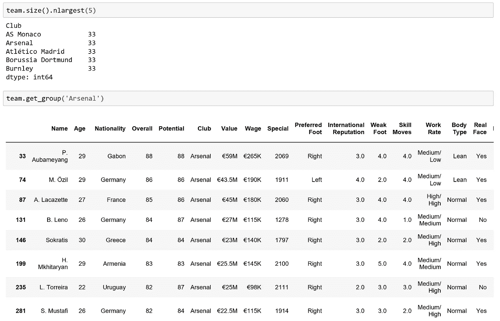
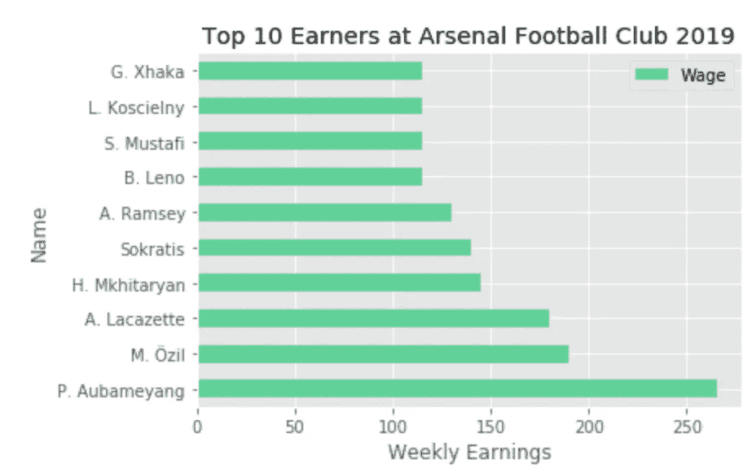
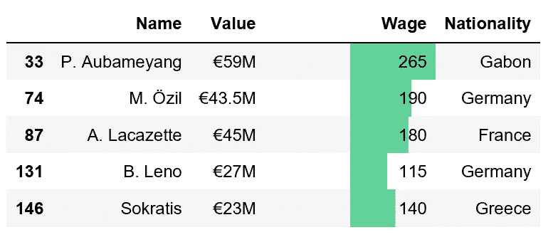
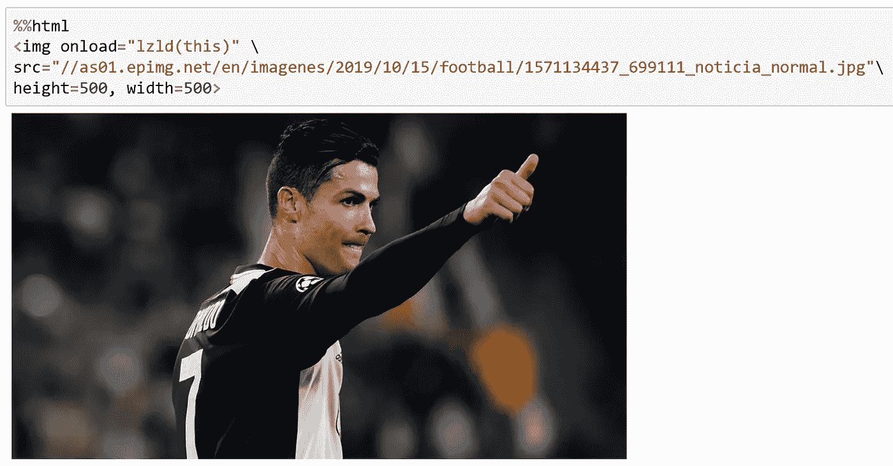

# 熊猫分组和数据处理技巧-国际足联球员数据

> 原文：<https://towardsdatascience.com/pandas-groupby-and-data-handling-tips-fifa-player-data-f37bd47c758a?source=collection_archive---------18----------------------->

# FIFA 19 完整球员数据集

Image Courtesy of [JESHOOTS.COM](https://unsplash.com/@jeshoots) via [Unsplash](https://unsplash.com/photos/eCktzGjC-iU)

## 进行分组并展示/使用这些数据

熊猫的分组代表了图书馆最强大的功能之一。它将简单性与效率结合在一起。这有助于减少回答数据科学问题时需要编写的代码量。这篇文章的目的是展示一些有用的特性，并结合一些同样有用的熊猫技巧。

## 像往常一样，我将使用一个足球的例子

这篇教程文章使用的数据集可以从 Kaggle 的以下[链接](https://www.kaggle.com/karangadiya/fifa19)获得，标题为“FIFA 19 完整球员数据集”。我已经包含了导入 pandas 和 matplotlib 的导入库代码，并删除了不必要的列。

此外，据我从 Kaggle 了解，这个数据帧将拥有超过 80 列。我将显示模块的 max_columns 属性设置为 90，这样在我读入的 fifa_19_players_df 数据帧的底部会出现一个滑动条。当处理包含大量列的数据帧时，我建议重新分配 columns 属性，以避免视图被截断，并更好地理解底层数据。

By re-assigning the max_columns attribute from the display method to encompass all the columns in a Dataframe, a better sense of the data can be gleaned!

## 1.创建 Groupby 对象

在 Pandas 中，groupby 方法直接在 Dataframe 对象上调用，在本例中是 fifa_19_players_data。在下面的示例中，返回的 groupby 对象基于“Club”列中的公共列值，并被赋予变量名“Team”。

这个团队变量代表分组数据帧的容器。该容器中的每个数据帧被分组在一个公共俱乐部上。

## 2.Groupby 对象方法

*size()和 get_group()*

为了演示 team 变量指向表示数据帧集合的 groupby 对象，有一个称为 get_group()的方便方法，可以在 groupby 对象上直接调用该方法。

为了最初访问组，可以在 groupby 对象上调用 size()方法，该对象返回一个序列。在这个系列中，俱乐部是索引，列是每个分组数据帧中的行数。

这里，我链接了方法来获得 5 个最大的数据帧。从这个命令输出，阿森纳有 33 名球员代表。要直接查看这些球员，我们可以在 team groupby 对象上调用 get_group 方法，将'阿森纳'作为字符串参数传递。

一旦这个数据帧被导出，我们就可以进行绘制，如所描绘的水平条形图。在本例中，我按照“工资”列对阿森纳数据帧中的值进行排序，将升序参数参数设置为 False，并在绘图前使用 head 方法获取前 10 个结果。

## 3.使用内置模板和用户定义的颜色选项定制绘图

“gplot”模板与“#61D199”颜色参数相结合，为横条图提供了很好的专业优势。ggplot 作为字符串从样式模块提供给 use 方法。奥巴姆扬显然是 2019 年数据集中收入最高的国家之一。

**#OzilOut** -with Ozil not playing and making a dent on Arsenal’s bottom line, is it time to say goodbye to the German?

## 4.熊猫 Styler 对象

*-包括水平杆*

使用上述数据框中的绘图方法生成的水平条形图很好地直观显示了周工资。通过调用熊猫 Styler 对象上的 bar 方法，也可以在数据框中直接传达这些信息。

举例来说，当我附加。style 放在我的数据框架的末尾，我从其中提取了 4 列作为列表，并将这个对象传递给 Python 的内置类型函数,*返回 Styler 对象*。

现在很容易在这个 Styler 对象上调用 bar 方法。Styler 对象有一个接受字符串列名或列名列表的子集参数。为了一致性，我传递了相同的颜色参数，如上面的水平图参数。如果 2 列被传递给子集参数，请注意 2 个不同的*颜色参数可以作为一个列表被传递给颜色参数。通过这种方式，可以灵活地调整最终 Styler 对象的用户定制。*

## 5.那个。groupby 对象的 agg()方法

agg 方法可以有效地在 groupby 对象上调用。为了举例说明一个用例，除了每个分组球杆的加速度和击球力量列之外，我还想知道总体列的平均值。

为了做到这一点，我在我的团队变量上调用 agg 方法，该方法指向之前创建的 groupby 对象，并将其传递给 Python 字典。

在本词典中，键是原始“fifa _ 19 _ players _ data”中作为字符串的列，值是我在聚合时想要使用的函数，聚合也是作为字符串传递的。我通过将升序参数设置为 False，按整体列从最高到最低对值进行排序，并查看前 10 个搜索结果。尤文图斯以平均 82.28 分名列榜首。

## 6.精度选项和设置

出于演示的目的，我经常改变浮点数的设置选项。要将 6 位小数的默认值更改为 2，我只需直接在 panasus 库(这里有 pd 的通用别名)上调用 set option 方法，然后再次运行该单元。给出的浮点数现在已经四舍五入到小数点后两位。

这种方法特别有用，因为它不改变底层数据，并保持精度。如果目的是导出数据，数字浮点数仍将保持其精度，精确到小数点后 6 位。

## 7.与每个团队的“最佳”玩家一起创建一个数据框架

从这个数据集，可以区分每家俱乐部的最佳足球运动员的指标是原始 fifa_19_players_data Dataframe 中的“总体”栏。

为了再次创建熟悉的 groupby 对象，我调用了 fifa_19_players_data 上的 groupby 方法，将 Club 列作为字符串传递。我将这个 groupby 对象分配给可变团队。

为了创建一个拥有每支队伍中最优秀的*球员的数据框架，我使用了数据框架构造方法，并且只传递了一个参数。此参数是 columns 参数的原始 fifa _ 19 _ players _ data Dataframe 的 columns 属性。这将创建一个空的数据帧，其列标题与 fifa_19_players_data 数据帧相同。我称这个数据框架最伟大。*

*然后，我使用 for 循环遍历我的 groupby 对象。我分配了两个临时变量，一个用于分组，一个用于与该分组相关的数据帧。对于分组中的每个数据框架(我已经为其分配了变量名数据)，我使用最大值方法，并从总体列中获取最高值。我把这一行分配给可变的最佳玩家。最后，在每次迭代中，我都会将这一行附加到 _ club _ players _ df 上。*

*然后，我按“整体”栏对最伟大的俱乐部球员进行排序，并首先查看最高的栏。毫不奇怪，葡萄牙的罗纳尔多和阿根廷的梅西分别是尤文图斯和巴塞罗那的顶级球员。*

**

*Still shot for my Jupyter Notebook. The replica code can be found in the Github gist above.*

## *总结提示*

*最后，让我们向最伟大的俱乐部球员数据框架中的整体一栏所确定的顶级球员致敬。*

*我将使用 Jupyter 笔记本中的一种细胞身体魔法，这种魔法可以整合一张图片。我写了 2 %的符号，然后是 html，然后是下面的 html 标签。我运行的细胞是“代码”细胞类型，现在这张来自[as.com](https://en.as.com/en/2019/10/15/football/1571134437_699111.html)的克里斯蒂亚诺·罗纳尔多的照片包含在笔记本中，可以用来通过代码更好地帮助讲述故事！*

**

*为熊猫干杯！*