# 对数据执行非常基本的 Pandas 操作

> 原文：<https://towardsdatascience.com/pandas-guide-with-python-example-ii-basic-pandas-operations-4cf9704fd062?source=collection_archive---------10----------------------->

## 在本指南中，您将学习使用 pandas 对数据执行的最基本操作。


image credit: [istockphoto](https://www.istockphoto.com/in/vector/checklist-browser-window-check-mark-white-tick-on-laptop-screen-choice-survey-gm954688868-260661708)

数据科学家花费大量时间清理数据集，并将它们转换成他们可以使用的形式。事实上，许多数据科学家认为，获取和清理数据的初始步骤构成了 80%的工作。

因此，如果您刚刚进入这个领域，能够处理混乱的数据是很重要的，这意味着缺少值、不一致的格式和格式错误的记录。

如果你刚刚开始接触熊猫，这里执行的操作是非常基础和重要的。

# **你会学到什么？**

您将学习在数据处理和数据分析过程中对数据执行的一些最基本的操作。

# **读取 CSV 文件:**

使用 pandas 读取带有任何扩展名的文件非常简单。只有两行代码，仅此而已。您可以读取不同的文件类型，如 ***CSV*** ， ***DOCS*** ， ***XLSV，******jpg***等等。在下面的例子中，我的 ***car_data.csv*** 文件包含 7 个不同类型的列，为了读取这个文件，我使用 pandas***read _ CSV(****‘filename _ with _ ext’)*。

当你输入上述代码并按下 ***回车*** 时，如果一切正常，它将显示下表作为输出。

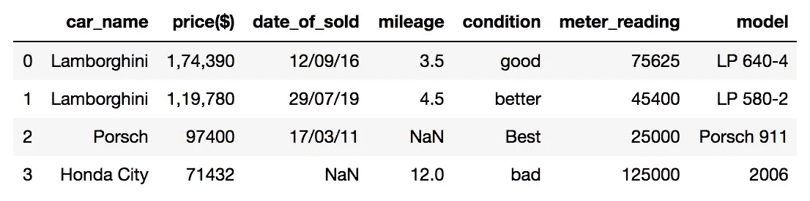

# **知道列数据类型:**

总是有必要知道数据集中的数据类型，以便对数据执行相应的操作，这给了你对数据的直觉。在你的笔记本上输入下面的命令。

```
df.dtypes
```

在下图中，它显示了表中每一列的数据类型。

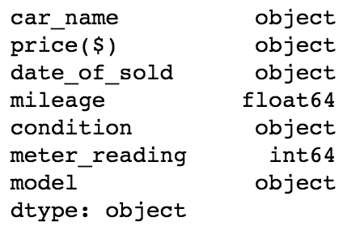

# ***头部()*和尾部()功能:**

当你有一个巨大的数据集，这意味着大量的行和列，那么数据科学家立刻可视化数据是严格的，这就是熊猫的 ***【头()*** 和 ***尾()*** 功能发挥作用的地方。 ***head()*** 函数仅显示吨行中的前 5 行，而 ***tail()*** 函数显示后 5 行。如果您想查看最上面的 50 行和最下面的 50 行，您只需要将整数作为参数传递给这些函数就可以了。如您所知， ***head()*** 函数默认情况下只显示前 5 行，而我的数据集只有 4 行，所以在下图中只显示了 4 行。同理 ***【尾巴()】*** 也是一样的道理。

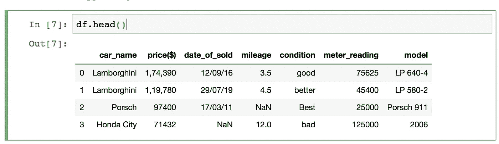

如果我们希望看到前 2 行，那么我们将在方法 ***head()* 中传递整数 2 作为参数。请看下图。**

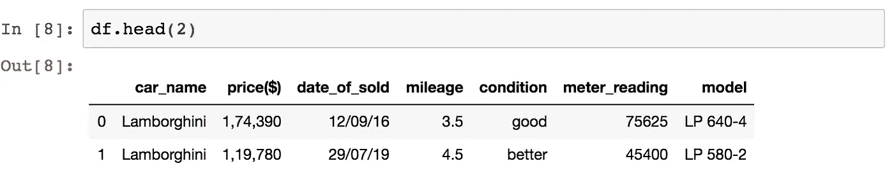

# **to_numpy():**

可能会出现这样一种情况，您有一个表格形式的数据集，称为数据框，而您的训练数据的机器学习功能希望数据采用数组形式。所以这里的 ***to_numpy()*** 方法帮助你做到这一点。它可以让您转换 numpy 数组中的数据帧。

```
df.to_numpy()
```

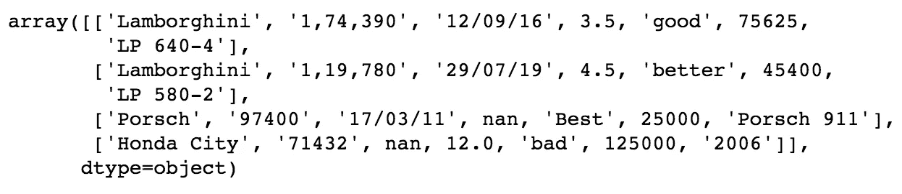

converted data frame into 2D array.

# **形容():**

这个 describe()函数显示了数据的快速统计摘要。

```
df.describe()
```

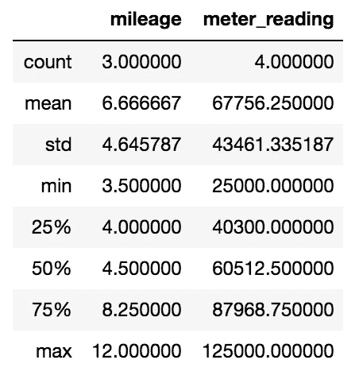

decribe()

正如您可能已经观察到的，我们的数据集中有七列，而它只显示了两列的统计数据，这是因为计算平均值、最小值、最大值和标准值等是没有意义的。对于字符串和日期时间等对象数据类型，这可能就是您所看到的。您应该可以看到整型和浮点型列的摘要信息。

# **sort_index():**

此方法带参数 ***axis=1*** 表示对列名进行排序，而***ascending = True***表示对行进行升序排序，即从小到大排序。看看下面给出的图片。

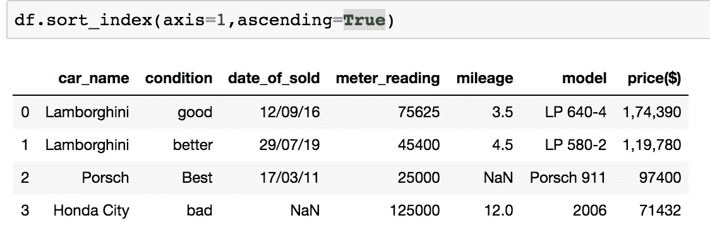

除了按轴排序，我们还可以按值排序。正如你在下面的函数中看到的，我传递了我们想要排序的列名，即 ***【价格($)*** 和 ***升序=False*** 表示从较小到较大的列价格值。


# **选择单个列:**

如果您想从数据框中选择特定的列，您可以很容易地完成。您可以将数据框对象与脚本结合使用，并传递列的名称。正如您在给定图像中看到的，我从我们的数据框中选择了“car_name”列

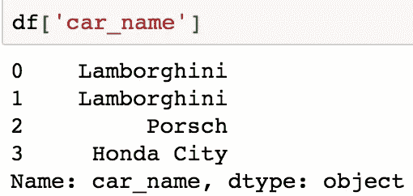

不使用脚本，我们可以用*()*我们的数据框对象上的操作符，即我的例子中的“df”。看看下面的图片。

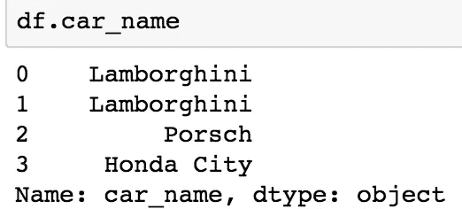

# **切片行:**

行切片根据起始和结束索引返回新的数据帧。看看下面的例子，我使用了旧的数据框对象，并传递了起始和结束索引来对行进行切片，新生成的数据框对象存储在 ***df2*** 中。当你打印 ***df2*** 的结果时，它会向你显示下面的数据表。

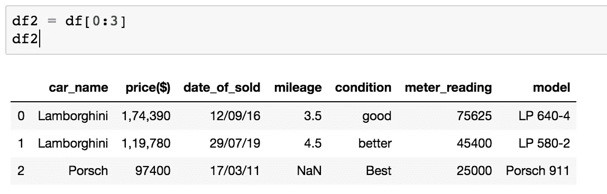

**注:**起始索引包含，结束索引不包含。

# **基于条件的结果:**

如果您想要在特定条件的基础上获得数据，那么您可以应用下面代码中解释的条件。

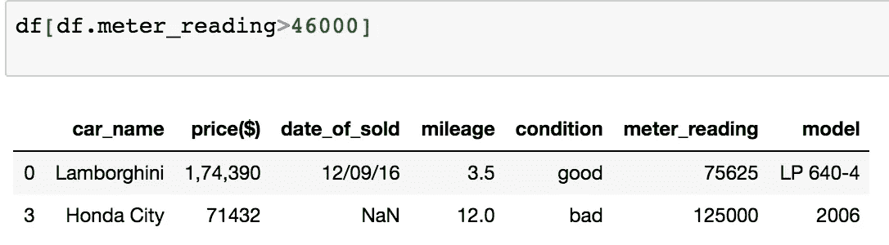

如上图所示，我们对我们的列***meter _ reading>46000***应用了 condition，这意味着它将返回所有大于 46000 行的行。

# **copy():**

pandas 的这个 ***copy()*** 函数非常简单，它用于复制整个数据帧并返回该数据帧的新引用。

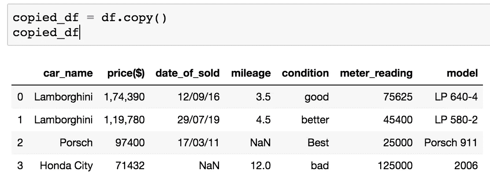

在上图中可以看到，现在整个数据都在***copy _ df****中。*

# **在数据框中添加新列:**

我正在我的数据集中添加名为“current_price($)”的新列以及一些值。使用下面的代码添加新列。

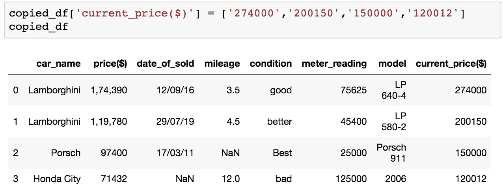

# **删除行:**

在下表中，我删除了那些包含 ***NaN*** *值的行。*如上图所示，总共有四行，其中两行有两个 ***NaN*** 值，因此这两行已从下表中删除。

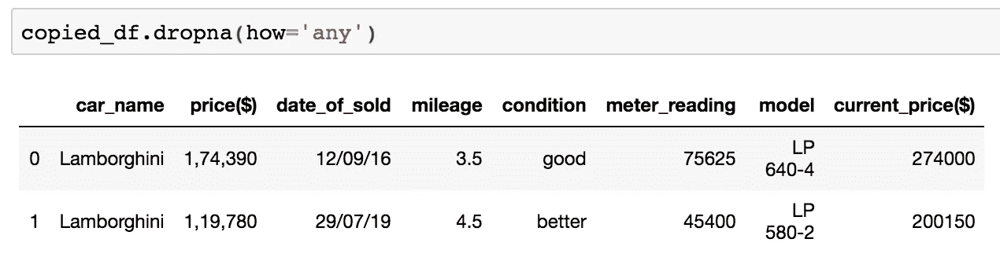

# **填充 NaN 值:**

可以看到 ***NaN*** 的值已经填成了下表中的值 5。

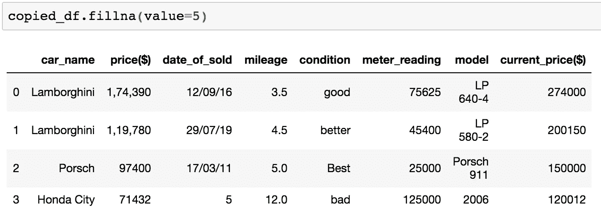

**注:**您可以通过选择特定的列来填写 ***NaN*** 值。

# **概要:**

*   我们已经看到了如何读取 CSV 文件和打印其中的数据。
*   如何在数据集中添加新列，以及如何从数据集中删除不必要的列。
*   复制数据框。
*   删除 NaN 值并用适当的值替换它们。

如果您有任何疑问、建议或任何误导，请随时联系我。我乐于倾听。谢谢

从 Github 页面[这里](https://github.com/himanshujbd/pandas_lib_part_2)下载我的 Jupyter 笔记本和 CSV 文件。

我希望你喜欢读这篇文章，你也可以访问我的 [**网站**](http://thehimanshuverma.com/) ，在那里我会定期发布文章。

编码快乐！！！

[**订阅**](https://mailchi.mp/b08da935e5d9/himanshuverma) 我的邮件列表，直接在您的收件箱中提前获得我的文章，或者关注我自己在 Medium 上发表的文章[**The Code Monster**](https://medium.com/the-code-monster)**来完善您的技术知识。**

# **了解你的作者**

**希曼舒·维尔马毕业于印度勒克瑙的 APJ 阿卜杜勒·卡拉姆大学博士。他是 Android & IOS 开发人员、机器学习和数据科学学习者、金融顾问和博客作者。**