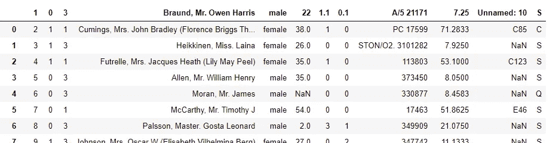
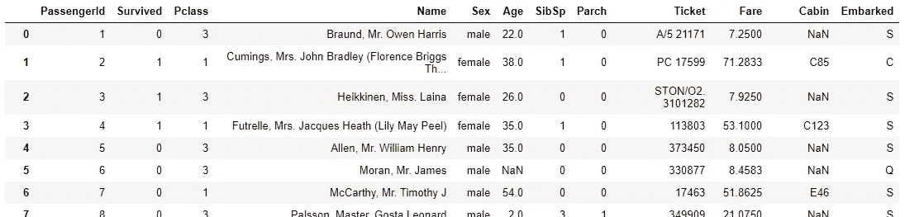

# 熊猫黑客:read_clipboard()

> 原文：<https://towardsdatascience.com/pandas-hacks-read-clipboard-94a05c031382?source=collection_archive---------23----------------------->

## 嗯，这不是一个黑客，但它节省了你很多时间。


我们都有过这样的经历:我们在 Kaggle、StackOverflow 或者 Google 第二页的某个不知名的网站上读到一段有趣的数据(yikes！)，它有足够的微光来激起我们的好奇心，引诱我们玩它，因为我们(酷的数据科学人)只是对他们甜蜜的数据见解感兴趣。我们准备好了我们的 Jupyter 笔记本，导入了我们最喜欢的 EDA 库，并准备好探索我们全新的数据集。

但是等等——我们犹豫了。我们意识到，我们必须经历下载数据、将数据保存到正确的文件夹，以及用正确的文件夹路径导入数据集的所有麻烦(哦，数据科学家的悲哀)！简单来说，没有人有那样的时间。嗯，我们有，但是如果我们对自己诚实，像这样的小障碍通常会让我们决定是否要做某事。幸运的是，有`pandas.read_clipboard()`来帮助我们。

## 例如

`pandas.read_clipboard()`方法听起来很简单:它读取复制粘贴的表格数据并将其解析到数据框中。例如，尝试在复制以下数据框后运行方法:

瞧啊。就这么简单。没有更多不必要的保存随机 csv 文件在您的计算机上。现在，您只需复制您的数据，并在几秒钟内开始挖掘！成为一名数据科学家是多么美好的时光。

## 还有几件事

在幕后，`pandas.read_clipboard()`方法将您复制的数据传递给`pandas.read_csv()`方法，这使得这个方法更加强大。这意味着您不必将自己局限于已经清理干净的数据。通过 read_csv 可以读取的内容，都可以通过 read_clipboard 读取。以下面这个 csv 文件为例，它来自于 [Kaggle 的 Titanic 数据集](https://www.kaggle.com/hesh97/titanicdataset-traincsv)，并且去掉了文件头:

```
1,0,3,"Braund, Mr. Owen Harris",male,22,1,0,A/5 21171,7.25,,S
2,1,1,"Cumings, Mrs. John Bradley (Florence Briggs Thayer)",female,38,1,0,PC 17599,71.2833,C85,C
3,1,3,"Heikkinen, Miss. Laina",female,26,0,0,STON/O2\. 3101282,7.925,,S
4,1,1,"Futrelle, Mrs. Jacques Heath (Lily May Peel)",female,35,1,0,113803,53.1,C123,S
5,0,3,"Allen, Mr. William Henry",male,35,0,0,373450,8.05,,S
6,0,3,"Moran, Mr. James",male,,0,0,330877,8.4583,,Q
7,0,1,"McCarthy, Mr. Timothy J",male,54,0,0,17463,51.8625,E46,S
8,0,3,"Palsson, Master. Gosta Leonard",male,2,3,1,349909,21.075,,S
9,1,3,"Johnson, Mrs. Oscar W (Elisabeth Vilhelmina Berg)",female,27,0,2,347742,11.1333,,S
10,1,2,"Nasser, Mrs. Nicholas (Adele Achem)",female,14,1,0,237736,30.0708,,C
11,1,3,"Sandstrom, Miss. Marguerite Rut",female,4,1,1,PP 9549,16.7,G6,S
12,1,1,"Bonnell, Miss. Elizabeth",female,58,0,0,113783,26.55,C103,S
13,0,3,"Saundercock, Mr. William Henry",male,20,0,0,A/5\. 2151,8.05,,S
14,0,3,"Andersson, Mr. Anders Johan",male,39,1,5,347082,31.275,,S
15,0,3,"Vestrom, Miss. Hulda Amanda Adolfina",female,14,0,0,350406,7.8542,,S
16,1,2,"Hewlett, Mrs. (Mary D Kingcome) ",female,55,0,0,248706,16,,S
17,0,3,"Rice, Master. Eugene",male,2,4,1,382652,29.125,,Q
18,1,2,"Williams, Mr. Charles Eugene",male,,0,0,244373,13,,S
19,0,3,"Vander Planke, Mrs. Julius (Emelia Maria Vandemoortele)",female,31,1,0,345763,18,,S
20,1,3,"Masselmani, Mrs. Fatima",female,,0,0,2649,7.225,,C
21,0,2,"Fynney, Mr. Joseph J",male,35,0,0,239865,26,,S
22,1,2,"Beesley, Mr. Lawrence",male,34,0,0,248698,13,D56,S
23,1,3,"McGowan, Miss. Anna ""Annie""",female,15,0,0,330923,8.0292,,Q
24,1,1,"Sloper, Mr. William Thompson",male,28,0,0,113788,35.5,A6,S
25,0,3,"Palsson, Miss. Torborg Danira",female,8,3,1,349909,21.075,,S
26,1,3,"Asplund, Mrs. Carl Oscar (Selma Augusta Emilia Johansson)",female,38,1,5,347077,31.3875,,S
27,0,3,"Emir, Mr. Farred Chehab",male,,0,0,2631,7.225,,C
28,0,1,"Fortune, Mr. Charles Alexander",male,19,3,2,19950,263,C23 C25 C27,S
```

如果您复制并运行 read_clipboard，您会注意到第一行的数据将被用作标题。



First Row of Data is Used as Header

就像我们在使用 read_csv 时一样，我们可以将`header=None`和`names=col_names`关键字参数传递给 read_clipboard，以便修复问题并提供标题。复制上面的 csv 文件后，运行以下代码:

```
import pandas as pdcolumns = [
    'PassengerId', 'Survived', 'Pclass', 'Name',
    'Sex', 'Age', 'SibSp', 'Parch', 'Ticket', 'Fare',
    'Cabin', 'Embarked',
]
pd.read_clipboard(header=None, names=columns)
```



That’s Better

从上面的图片中可以看到，第一行不再用于标题，我们的标题现在被正确命名了。很好。

## 最后的想法

使用`pd.read_clipboard()`有一个警告:它不适用于运行在云上的笔记本电脑或 [WSL](https://scotch.io/bar-talk/trying-the-new-wsl-2-its-fast-windows-subsystem-for-linux) (二进制抽泣)。所以对于那些远程使用 Jupyter 笔记本的人来说，我很抱歉地说，你现在必须坚持使用 read_csv。

除此之外，这是一种快速获得数据并立即展开争论的有用方式。这对任何数据科学家来说都是一个很好的补充。

# 关于阿德里安·佩雷亚

*兼职数据科学家，兼职科技写手，全职书呆子。我在教授机器学习和可管理的、* ***字节*** *大小的程序中找到乐趣。是的，我也很搞笑。咖啡上瘾者。数据可视化的吸盘。愿意为下一个最好的树状图付出我的 1 和 0。*

*关注我上*[*Twitter*](https://twitter.com/adrianmarkperea)*和*[*LinkedIn*](https://www.linkedin.com/in/adrian-perea/)*。*