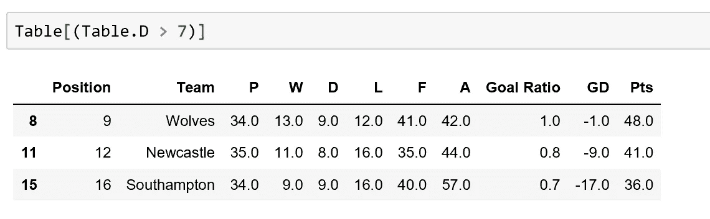

# 英超联赛中的熊猫

> 原文：<https://towardsdatascience.com/pandas-in-the-premier-league-78f1d0c21b4f?source=collection_archive---------5----------------------->

## 我们如何开始用熊猫进行数据分析

Image Courtesy of Emilio Garcia via [Unsplash](https://unsplash.com/photos/AWdCgDDedH0)

这是几年来最激烈的英超联赛冠军争夺之一——只剩下几场比赛了，本赛季谁将获得荣誉？争夺冠军联赛席位的竞争也非常激烈。

考虑到这一点，我想我将展示我们如何使用 Python Pandas 库来解析英超联赛表，并展示我们如何开始使用 Python 执行一些初步的探索性分析。

# **网页抓取**

Pandas 有一个内置函数， **read_html()** ，它使用 lxml 和 Beautiful Soup 库从 html 文件中自动解析出数据作为 DataFrame 对象。首先，需要安装一些 **read_html()** 使用的附加库。在终端中，键入:

pip 安装 lxml

pip 安装 beautifulsoup4 html5lib

pandas **read_html** 函数有许多自定义选项，但是默认情况下，它会搜索并尝试解析包含在< table >标签中的所有表格数据。这将产生一个 DataFrame 对象列表。

我导入 pandas 库，并使用 **read_html** 函数解析英超联赛表，并将其赋给变量 prem_table。这将返回一个列表；其中第一个元素指向 2019 年 4 月 20 日英国夏令时 22:00 的英超积分榜。因为很多焦点都集中在争夺前 4 名的位置上，所以我决定使用**来可视化这个表中的前 6 个条目。**方法头()。为了进一步确认一切正常，我使用了 shape 属性，它告诉我有 21 行 12 列。这是一个有用的技术，因为 Python 从索引 0 开始计算行数，有 20 支英超球队，因此我似乎多了一行。因为在我的数据帧的开头看起来不错，所以问题*必须*指向数据帧末尾的任何额外的行。

由于任务是开始一些探索性的分析，我最初想“清理”数据。似乎没有必要在数据帧中列出“未命名:1”。要删除一列，我使用 drop 方法，并传入关键字参数 axis=1 进行按列的*删除。*

# **数据帧中的数据类型**

数据帧中的每一列都可以看作一个系列，其中每一列都必须是相同的类型。然而，每一行可以是不同的类型。由于这项任务涉及执行一些探索性分析，我需要破译每个系列是什么类型。简单地看一下表，我就会知道“Team”列是一个 Python 字符串。相当于 Python 字符串的熊猫是熊猫对象。此外，通过视觉观察，我预计表示游戏次数的“P”列是 Python float 或 int。然而，撇开假设不谈，最好使用 **dtypes** 属性或 **info** 方法来确认这一点。

这里的输出告诉我该系列的 dtypes 是“objects”，即 Python 字符串。为了在不同的列之间进行数值计算，必须改变这些类型。谢天谢地，这在 Python 中是一个简单的任务，我们只需使用熊猫 **to_numeric** 方法。 **pandas.to_numeric()** 是 pandas 中的一个通用函数，用于将参数转换为数字类型。在这里，我将我认为可能需要分析的列更改为 Pandas float (float64)数据类型。为了确认，我可以检查我的数据帧数据类型:

# **清洁数据框**

形状属性早些时候告诉我，我有一个太多的列，当然假设 20 支球队仍然在英超联赛中竞争！当事情在我的数据帧的开头看起来很好的时候，问题一定存在于尾部。

显然，我有一些不必要的元数据和一些填充列的 NaN(不是数字条目)。同样，这次我可以使用 drop 方法，但重要的是我省略了 axis=1 参数。在这种情况下，我想删除一行，而不是一列。现在情况看起来好多了。我可以使用 shape 属性验证成功删除的行。

虽然事情看起来有所改善，但球队的联赛排名栏标题为“无名:0”似乎很奇怪。它不代表该列的内容。为了改变这一点，我使用了**Pandas data frame . rename()**方法、并传递 **inplace=True** ，如果为 True，则在原始数据帧中进行更改。

# **创建新列**

数据框现在已经设置好了。在这一点上，创建一些新的列并测试我之前创建的“字符串到浮点”转换是否有效可能是值得的！

我创建了一个名为“目标比率”的新栏目。这是用进球数除以失球数。要创建一个新列，我键入我的数据框架的名称，然后使用方括号符号，并在引号中输入我的*新*列标题。在等式的右边，我使用相同的技术从表数据框中选择我想要的列。这里，我将每一列“F”条目除以每一列“A”条目，并四舍五入到小数点后一位。默认情况下，创建的每个新列都追加到数据帧的末尾。

要对列进行重新排序，我只需更改列条目的顺序，将它们添加到一个列表中，并将其重新分配给表 Dataframe。“目标比率”栏现在更合适了。我还删除了“表格”一栏，使表格更整洁。

# **过滤数据帧**

该表设置得很好，并且可以进行修改以供分析。让我们先问一个简单的问题。哪些球队比对手少打了一场？由于球队要么打了 34 场比赛，要么打了 35 场比赛，我只需过滤打了 34 场比赛的球队(截至 2019 年 4 月 20 日),结果就会出现。为了过滤，我使用布尔索引。要了解如何做到这一点，请阅读我的文章如何[‘如何通过列值过滤熊猫数据帧的行’。](/using-regular-expression-in-genetics-with-python-175e2b9395c2)

现在让我们来决定谁的听牌次数最多。

南安普顿试图避免本赛季的下降，所有这些平局都是昂贵的吗？

最后，让我们创建两个新列，“进球/比赛”和“失球/比赛”，并使用 **sort_values** 方法对值进行排序。

由于哈德斯菲尔德和富勒姆已经受到谴责，卡迪夫的进球率、场均失球数和场均失球数排名第三。他们的净胜球也比最接近的保级对手布莱顿差。

卡迪夫的情况更糟，他们能挺过这次下跌吗？是他们的新兵没有足够的威胁，还是他们的防守太脆弱了？

有了 Python 的熊猫，我们就能一探究竟了！

# **结论**

本文展示了一些有助于使用 Pandas 进行入门分析的特性。我喜欢用熊猫来钻研英超联赛的统计数据。如果你想在 Instagram 上关注我以获得更多 Python 代码片段，请关注 exit_code_zero。

*最后*，一些建议。我正在解析这个表，同时游戏正在进行，结果正在到来。当我运行分析时，这给了我稍微不同的结果，这一开始让我很困惑！为了舒适的生活，不要进行分析，当游戏正在进行和结束时，把你的脚抬起来看游戏！