# 熊猫指数解释

> 原文：<https://towardsdatascience.com/pandas-index-explained-b131beaf6f7b?source=collection_archive---------0----------------------->

## 熊猫是数据科学家最好的朋友，索引是熊猫背后看不见的灵魂


index is like an address

在处理和理解我们的数据时，我们花了很多时间使用诸如 **loc、iloc、过滤、stack/unstack、concat、merge、pivot** 等方法，尤其是当我们处理一个新问题时。而这些方法都使用了指数，甚至我们面对的大部分**误差**都是指数误差。指数在**时间序列**数据中变得更加重要。可视化也需要很好的控制熊猫指数。

索引就像一个地址，这就是如何访问数据帧或数据系列中的任何数据点。行和列都有索引，行索引称为索引，列索引称为通用列名。

> **机器/深度学习**算法在预测精度方面有性能限制，就像它们的祖先统计模型一样，所以你如何获得显著更好的精度？为学习提供更好的数据。数据处理&特征工程是关键

熊猫有三种数据结构 **dataframe** ，**系列** & **面板**。我们主要使用数据框架和序列，它们都使用索引，这使得它们非常便于分析。

是时候退一步看看熊猫指数了。它让我们成为更好的数据科学家。

我们将使用 **UCI 机器学习成人数据集，**下面的****笔记本有下载数据的脚本。****

> ******业务** **问题**:分类(一个人收入 50k 以上或以下)**预测变量:**标签；预测因素:国家、年龄、教育、职业、婚姻状况等。****

****下面的笔记本非常简单，也有一些小技巧和窍门，可以让日常工作变得更好。****

```
**adult  = pd.read_csv("[https://archive.ics.uci.edu/ml/machine-    learning-databases/adult/adult.data](https://archive.ics.uci.edu/ml/machine-learning-databases/adult/adult.data)", names = ['age','workclass','fnlwgt', 'education',    'education_num','marital_status','occupation','relationship','race','sex','capital_gain','capital_loss', 'hours_per_week', 'native_country','label'], index_col = False)print("Shape of data{}".format(adult.shape))adult.head()**
```

****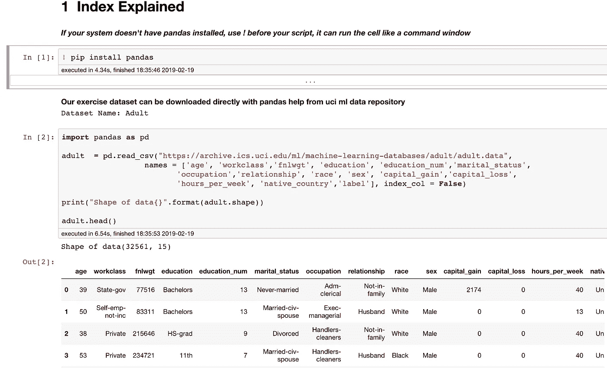****

****数据集有 32561 行和 15 个特征，最左边的系列 0，1 2，3 …是索引。让我们看看更多的信息。****

****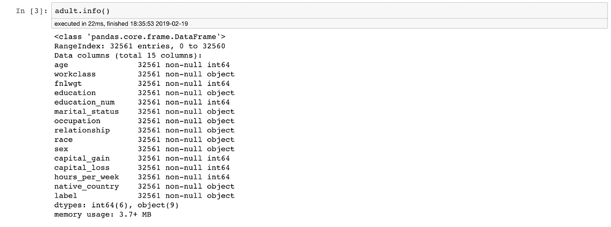****

****成人有 rangeindex 32561 个条目，是一个从 0 到 32560 的整数序列。****

## ****选择方法****

1.  ****df.loc 用于标签/名称****
2.  ****df.iloc 用于位置编号****

> ****例如，假设 Ram、Sonu 和 Tony 分别站在位置 1、2 和 3。如果你想打电话给 Ram，你有两个选择，要么你叫他的名字，要么他的职位号码。因此，如果您用 Ram 的名字“Ram”来称呼他，您将使用 df.loc，如果我们用他的职位号“1”来称呼他，我们将使用 df.iloc。****

****在我们进一步了解**loc****&****iloc**之前，我们先从我们的数据中抽取一个样本做进一步的分析。我们采用熊猫 df.sample 方法对 10000 个观测值进行抽样。****

****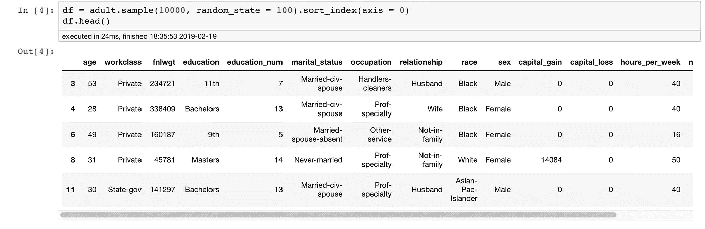****

****不错，现在我们有了一个数据集名 df，最左边的数列是 3，4，6，8，11……奇怪！****

> ****这是因为行将携带它们的原始(旧地址)索引或来自成人数据集的索引名****

****命名我们的指数将有助于我们一开始，它的指数来自成人数据集。
查看行和列的索引****

****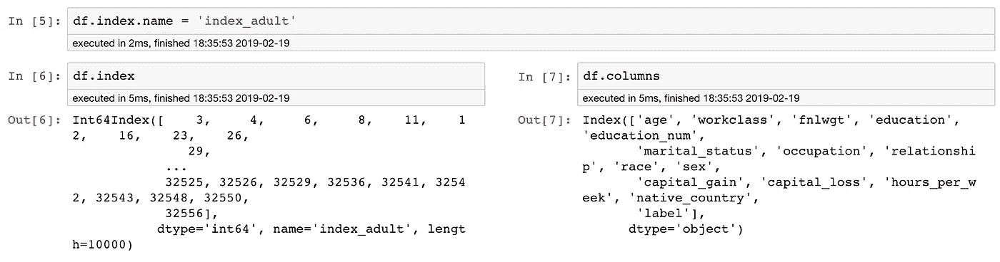****

> ****行和列都有索引，索引的名称为' **index_adult******

****让我们讨论几个关于 **loc & iloc** 方法的例子****

****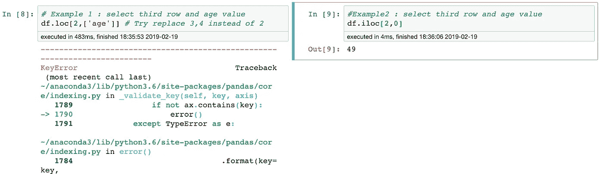****

****error on df.loc method****

****在**的第一个例子**中。loc，它给了我们一个错误****

> ****因为我们用过。loc 方法和 df 没有名称为“2”的行，行索引对我们来说看起来像一个数字，但它们是名称/标签。锁定方法****
> 
> ****试着用 3 或 4 代替 2，会有效，因为有名字' 3 '，' 4 '作为**位置名******

****在**的第二个例子**中，我们尝试用。iloc，它是一种基于**位置编号-** 的方法****

> ****“年龄”是第一列，因此我们将使用它的位置 0****
> 
> ****在 df 的最后一行之前将有位置 0，1，2，3，所以 2 将是第三行****

****为了我们的进一步分析，让我们只保留几个有趣的变量****

****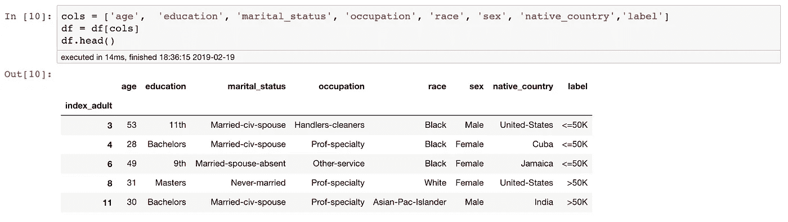****

****有些时候，很难在索引中使用随机数，这时，重置该索引将使其成为一列，并重新创建另一个默认索引****

> ****` **reset_index** ()`将在我们每次对相同数据运行时重新创建索引列
> `**drop = True**` paramater 不会在 dataframe 中创建该列，请查看以下两个数据集之间的差异****

****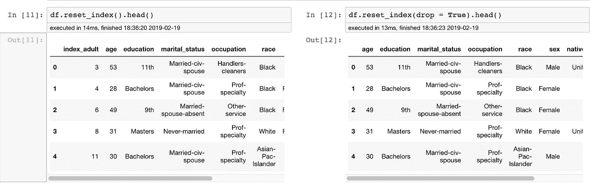****

****` **inplace = Tru** e `省得我们再把它赋值给 data
我们没有使用` **drop = True** `,现在 df 应该把它的最后一个索引作为一个列放在里面了****

****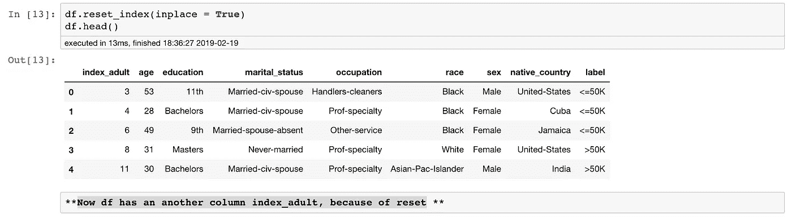****

> ****df 有另一栏 **index_adult** ，因为复位****

## ****过滤****

****过滤印度****

****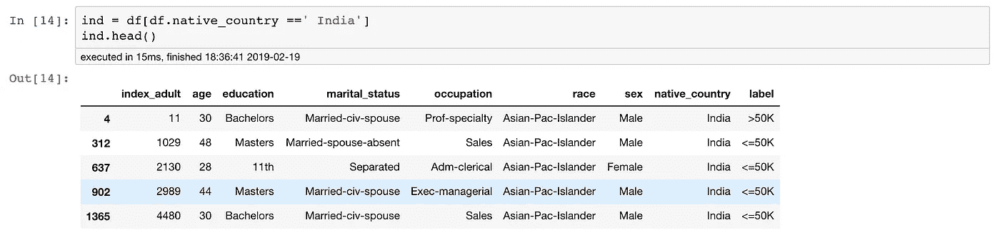****

****在重置我们的索引并对印度应用过滤器后，我们可以看到索引从 df 中保持自身，就像采样一样，现在行索引(4，312，637，902..)来自 df，index_adult 是这些行在成人中的索引****

****让我们来看看不同性别中收入超过 5 万英镑的人的观察结果****

****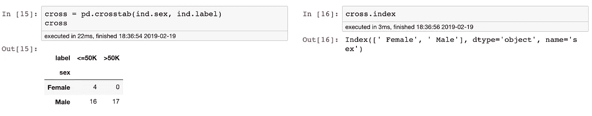****

> ****即使这个数据帧也有一个索引，很难通过查看数据帧来识别，并且单个项目可以像****

****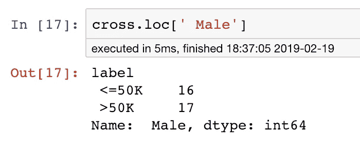****

****为收入超过 50K 的人筛选 ind 数据集****

****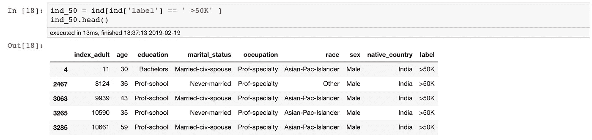****

> ****索引和它们的行是完整的，就像地址一样****

****非常令人印象深刻，这些人的收入真的很好，让我们试着了解他们的工作时间，因为我们在这个数据中没有“每周小时数”，我们将借助指数从*成年人*那里获得****

****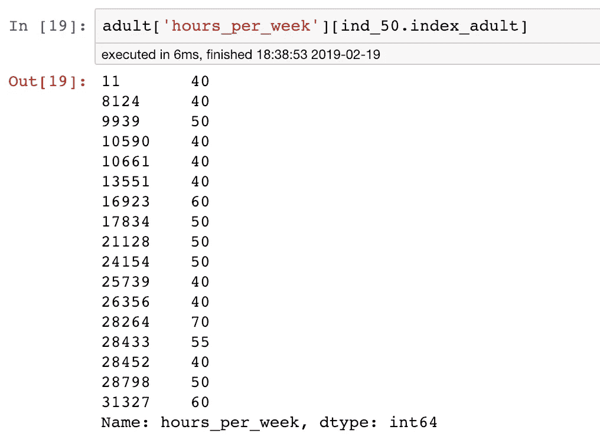****

> ****indexes 很容易带来更多的信息，上面的公式可以理解为过滤 ind_50 的地址 T27 上的成人['hours_per_week']****

****收入超过 5 万英镑的人每周平均工作时间****

****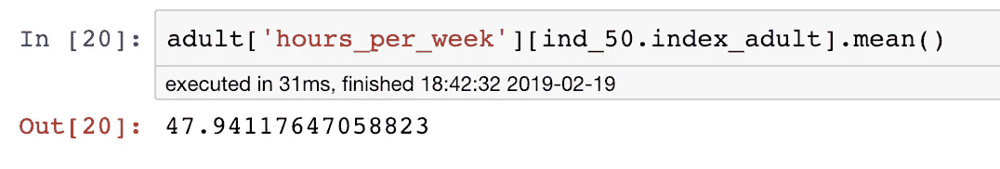****

****只需使用 index_adult，我们就可以轻松地获得另一个列的信息****

****索引使过滤变得非常容易，也给你在数据中向前和向后移动空间****

## ****这个索引在这个介绍练习中的最后一个用途****

****从数据中过滤出一个互补集，就像从整个数据集中训练和测试一样****

****我们将 ind 中不在 ind_50 中的那一部分进行切片，即收入低于 50k 的人****

****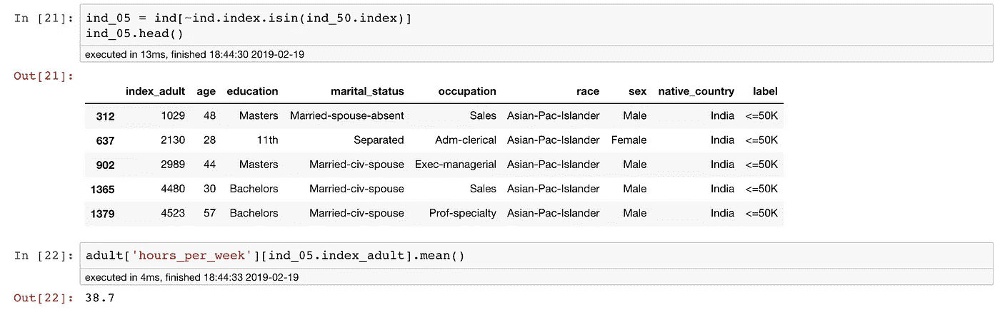****

> ****不错！在这个数据样本中，看起来收入在 50k 以上的人每周工作的时间更长****

****Jupyter nb 可以从这个 [Github-repo](https://github.com/manu007sharma/PandasAll) 下载。****

****只有当我们用多重索引和可视化来挖掘我们的数据时，熊猫索引的真正功能才能实现。访问我的下一个[练习](https://medium.com/@manusharma_66718/pandas-stack-unstack-pivot-table-crosstab-5cb9a16fe020)关于**栈/拆栈，透视表 _ 表&交叉表******

****感谢阅读。如果你喜欢这篇文章，你可能也会喜欢 [*熊猫支点&堆叠、*](https://medium.com/analytics-vidhya/pandas-stack-unstack-pivot-table-crosstab-5cb9a16fe020) [*缩放&变换时&*](/transformation-scaling-of-numeric-features-intuition-7f4436e8e074) *哪里*****

*   *****更多请关注我上的* [*中的*](https://medium.com/@manusharma_66718)****
*   *****我们连线上*[*Linkedin*](http://www.linkedin.com/in/data2datasciences/)****