# 熊猫。机器学习的系列方法

> 原文：<https://towardsdatascience.com/pandas-series-methods-for-machine-learning-fd83709368ff?source=collection_archive---------23----------------------->

## 了解它们及其实现


Photo by [Fotis Fotopoulos](https://unsplash.com/@ffstop?utm_source=unsplash&utm_medium=referral&utm_content=creditCopyText) on [Unsplash](https://unsplash.com/s/photos/programming-python?utm_source=unsplash&utm_medium=referral&utm_content=creditCopyText)

> 声明:这篇文章不会让你成为`***Pandas.Series***`方面的专家。这本身就是一篇文章要涵盖的非常广泛的主题。为此，我会推荐你阅读一本书或`***Pandas***` 文档。但是，我可以告诉你的是，这篇文章将让你在学习机器的[旅程中起航。](/journey-into-data-mining-3b5ccfa5343)

在这篇文章中，我们将谈论`[Pandas.series](/pandas-series-a-part-of-the-backbone-for-machine-learning-in-python-c6a5003836c7)`中提供的一些方法，在使用它们时要记住什么，以及如何有效地使用它们。一个`Series`对象有许多对**数据分析**有用的属性和方法。一般来说，*方法*返回一个新的`Series`对象，但是大多数返回新实例的方法也有一个`inplace`或`copy`参数。这是因为`Pandas`中的默认行为倾向于**不变性**，并且这些可选参数分别默认为`False`和`True`。在本帖中，我们将使用下面的例子`Series`。

```
songs_66 = pd.Series([3, None , 11, 9], 
    index=['George', 'Ringo', 'John', 'Paul'],
    name='Counts')songs_69 = pd.Series([18, 22, 7, 5],
    index=[ 'John', 'Paul', 'George', 'Ringo'],
    name='Counts')
```

> **输出**

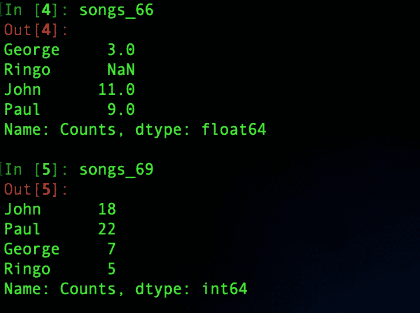

## 循环

→迭代 a `Series`迭代值:

```
for value in songs_66:
    print(value)
```

> **输出**

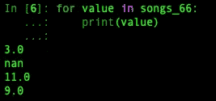

→有一个`.iteritems`方法循环遍历索引、值对:

```
for idx, value in songs_66.iteritems():
    print(idx, value)
```

> **输出**

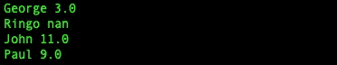

→还提供了一种`.keys`方法作为索引的快捷方式:

```
for idx in songs_66.keys():
    print(idx)
```

> **输出**

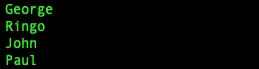

→不像 Python 字典的`.keys`方法，结果是有序的。

## 超载操作

以下列表包含系列对象的*重载*操作。对于 pandas 对象，这些操作以一种特殊的方式进行，可能不同于其他 Python 对象对这些操作的响应:

```
**Operation, Result (All return Series)** +, Adds scalar
-, Subtracts scalar
/, Divides scalar
//, Floor divides scalar
*, Multiply scalar
%, Modulus scalar
== / !=, Equality scalar
< / >, Greater / less than scalar
<= / >=, Greater / less than or equal scalar
^, Binary XOR
|, Binary OR
&, Binary AND
```

series 的常见算术运算被重载以处理标量和其他 series 对象。标量加法(假定序列中有数值)只是将标量值与序列值相加。给一个系列加一个标量叫做*播*:

```
songs_66 + 2
```

> **输出**

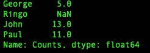

> 注意:广播是`NumPy`和`pandas`的功能。一个普通的`Python`列表支持前面表格中列出的一些操作，但是不像`NumPy`和`pandas`对象那样支持元素方式。当您将一个`Python`列表乘以 2 时，结果是一个元素重复的新列表，而不是每个元素乘以 2:

```
[1, 2, 3] * 2
```

> **输出**

```
[1, 2, 3, 1, 2, 3]
```

→当添加两个`Series`对象时，只有那些索引出现在两个`Series`中的项目才会被添加，否则`NaN`将被插入到仅在一个`Series`中找到的索引中。

```
songs_66 + songs_69
```

这里，“Ringo”在两者中都出现，但在`songs_66`中的值为`NaN`，因此结果也将是`NaN`。

> **输出**

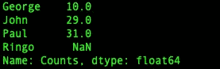

→上面这个案例可能有点问题，应该是“Ringo songs”的计数未知。要解决这个问题，我们可以用`.fillna()`的方法将`NaN`替换为`0`，得到一个更合适更好的答案。

```
songs_66.fillna(0) + songs_69.fillna(0)
```

> **输出**

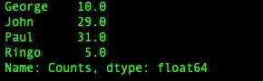

对于-、*和/，其他算术运算的行为类似。

## 获取和设置值

`series`对象允许通过索引操作(使用`[.loc](https://medium.com/swlh/indexing-best-practices-in-pandas-series-948ae3f44b08)`和`[.iloc](https://medium.com/swlh/indexing-best-practices-in-pandas-series-948ae3f44b08)`)和方便的方法访问值。获取和设置值的方法如下:

1.  `get(label, [default])` —如果找到，则返回一个标量(如果是重复索引，则返回`Series`),否则为默认值
2.  `get_value(label)` —返回一个标量(如果是重复的索引，则返回`Series`
3.  `set_value(label, value)` —返回一个插入(或更新)了标签和值的新`Series`

现在，让我们看看这些方法的实际应用:

```
songs_66['John']
songs_66.get('Fred', 'missing')
songs_66.get_value('John')
songs_66.John 
# dotted attribute access supported only for valid attribute names and no conflicts with pre-existing series attributes
```

> **输出**

```
11.0
missing
11.0
11.0
```

> 注意:有效的属性名是以字母开头，包含字母数字或下划线的名称。如果索引名包含空格，您不能使用带点的属性访问来读取它，但是索引访问可以很好地工作。

*如果找不到索引值，* `*.get_value()*` *方法会引发异常。*

```
# Inserting or updating the values
songs_66['John'] = 82
songs_66['John']
songs_66.John = 81
songs_66['John']
songs_66.set_value('John', 80) 
# The set_value method updates the series in place and returns a series
```

> **输出**

```
82.0
81.0
```

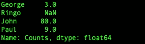

> 注意:如果您有非唯一索引，并且只想更新重复索引的一个值，则不能通过。设置值。在这种情况下，应该使用使用. iloc 的位置来执行更新。

## 重置索引

根据问题的上下文，更改索引的值可能是有用的。我们将了解一些重置索引、更改索引标签以及重命名索引标签的方法。第一个是`.reset_index`，它将把索引重置为从零开始单调递增的整数。默认情况下，`.reset_index`方法将返回一个新的`data frame`(不是一个`series`)。它将当前索引值移动到名为`index`的列中。

```
songs_66.reset_index()
```

> **输出**

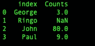

→为了获得一个`Series`输出，将`True`传递给`drop`参数，这将删除索引列。

```
songs_66.reset_index(drop=True)
```

> **输出**

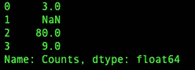

→如果需要特定的步进顺序，可将其传递给`.reindex`方法。新的索引值将具有可选参数`fill_value`的值(默认为 NaN)。

```
songs_66.reindex(['Billy', 'Eric', 'George', 'Yoko'])
```

> **输出**

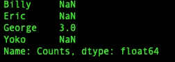

→或者，可以用`.rename`方法更新索引值。该方法接受将索引标签映射到新标签的字典，或者接受标签并返回新标签的函数。

```
songs_66.rename({'Ringo':'Richard'})songs_66.rename(lambda x: x.lower())
```

> **输出**

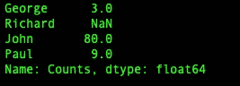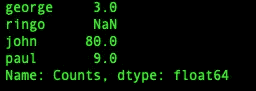

## 计数

这里我们将讨论如何获得在`Series`中找到的数据的概况。对于这一特定部分，我们将使用以下两个`series`。

```
songs_66 = pd.Series([3, None , 11, 9], 
    index=['George', 'Ringo', 'John', 'Paul'],
    name='Counts')scores_2 = pd.Series([67.3, 100, 96.7, None, 100],
    index=['Ringo', 'Paul', 'George', 'Peter', 'Billy'],
    name='test2')
```

→ `**.count()**` 提供条目的计数，多少是唯一的，多少是重复的。此方法返回非空项的数量。在`scores_2`系列中，有 5 个条目，但`.count()`只返回 4 个。

```
scores_2.count()
```

> **输出**

```
4
```

→直方图表格在熊猫身上很容易生成。如果您认为一个序列是索引键到值的有序映射，`.value_counts`返回这些值到它们的计数的映射，按频率排序:

```
scores_2.value_counts()
```

> **输出**

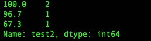

→要获得非 NaN 项目的唯一值或计数，分别使用`.unique`和`.nunique`方法。请注意。unique 包含了 nan 值，但是`.nunique`不算。

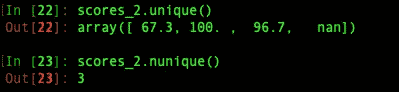

→使用`.drop_duplicates`方法删除重复值。由于比利和保罗得分相同，他将被淘汰。

```
scores2.drop_duplicates()
```

> **输出**

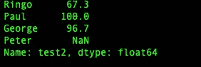

→要检索一个带有布尔值的序列，表明其值是否重复，使用`.duplicated`方法。

```
scores_2.duplicated()
```

> **输出**

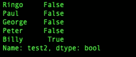

→删除重复的索引条目需要更多的努力。让我们创建一个`series`，`scores_3`，它在索引中有两次‘Paul’。如果我们使用`.groupby` 方法，并按索引分组，那么我们可以从每个索引标签的值中取出第一个或最后一个项目。

```
scores_3 = pd.Series([67.3, 100, 96.7, None, 100, 79],
    index=['Ringo', 'Paul', 'George', 'Peter', 'Billy','Paul'])scores_3.groupby(scores_3.index).first()
scores_3.groupby(scores_3.index).last()
```

> **输出**

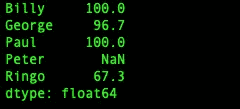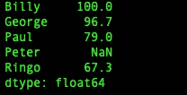

## 统计数字

→在一个`series`对象的方法中有许多基本的统计度量。其中最基本的是`sum`中的一个`series`值:

```
songs_66.sum()
```

> **输出**

```
23.0
```

→大多数执行计算的方法忽略`NaN`。有些还提供了一个可选参数— `skipna` —来改变这种行为。但实际上如果不忽略`NaN`，结果就是`nan`。

```
songs_66.sum(skipna=False)
```

> **输出**

```
nan
```

→计算 a `Series`的`mean`、`median`和`quantile`。

```
songs_66.mean()
songs_66.median()
songs_66.quantile() # 50% value the default
songs_66.quantile(.1) # 10th percentile
songs_66.quantile(.9) # 90th percentile
```

> **输出**

```
7.666666666666667
9.0
9.0
4.2
10.6
```

→为了对`series`有一个好的总体感觉，`.describe`方法提供了大量的汇总统计数据，并将结果作为`series`返回。它包括值的`count`，它们的`mean`、`standard deviation`、`minimum`和`maximum`值，以及`25%`、`50%`、`75%`、`quantiles`。如果您愿意，可以通过 percentiles 参数传递特定的百分点。

```
songs_66.describe()
songs_66.describe(percentiles=[.05, .1, .2])
```

> **输出**

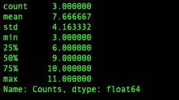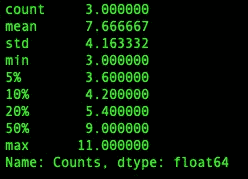

→该系列还有寻找最小值和最大值的方法，`.min`和`.max`。有一些方法可以得到最小和最大索引标签的索引位置，`.idxmin`和`.idxmax.`

```
songs_66.min()
songs_66.max()
songs_66.idxmin()
songs_66.idxmax()
```

> **输出**

```
3.0
'George'
11.0
'John'
```

→ **方差**可通过`.var`找到，而**标准差**可通过`.std`找到。对于离差，**平均绝对偏差**可使用`.mad`找到。

```
songs_66.var()
songs_66.std()
songs_66.mad()
```

> **输出**

```
17.333333333333329
4.1633319989322652
3.1111111111111107
```

## 转换类型

`series`对象能够调整它的值。序列中的数值可以通过`.round`方法进行四舍五入。`.astype`方法试图将值转换成传入的类型。但是，如果对转换后的字符串值调用方法，结果可能不是期望的输出。在这种情况下，`.max`现在返回字典序的最大值。

```
songs_66.round()
songs_66.astype(str)
songs_66.astype(str).max()
```

> **输出**

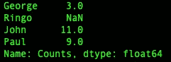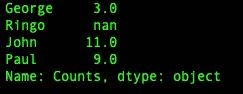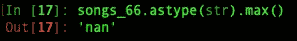

默认情况下，`to_*`函数如果不能强制，将会产生一个错误。在下面的例子中，`to_numeric`函数不能将 nan 转换成浮点型。

```
pd.to_numeric(songs_66.apply(str))
```

> **输出**

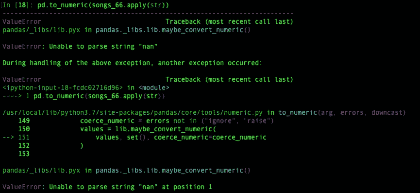

## 不处理任何问题

计算中通常忽略`NaN`值。有时，用另一个值填充它们是有用的。在这种情况下，`.fillna`方法将用一个给定值-1 来替换它们。`NaN`可使用`.dropna`从系列中删除数值。

```
songs_66.fillna(-1)
songs_66.dropna()
```

> **输出**

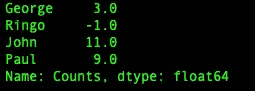

获取非 NaN 值的另一种方法是使用布尔掩码。`.notnull`方法给了我们布尔掩码。为了得到 NaN 值的掩码，我们可以使用`.isnull`方法。

```
val_mask = songs_66.notnull()
val_mask
songs_66[val_mask]nan_mask = songs_66.isnull()
nan_mask
songs_66[nan_mask]
```

> **输出**

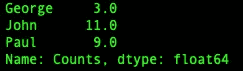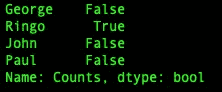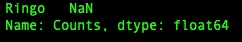

> 注意:我们可以通过应用 not 运算符(~)来翻转布尔掩码。

```
val_mask = ~(nan_mask)
```

## 矩阵运算

通过`.dot`方法可以计算点积。但是，如果`NaN`是系列的一部分，这个方法就失败了。去掉南会给`.dot`一个值。一个系列也有一个`.transpose`(或者`.T`)的方法。

```
songs_66.dot(songs_69)
songs_66.dropna().dot(songs_66.dropna())
songs_66.T
songs_66.transpose()
```

> **输出**

```
nan
211.0
```

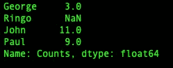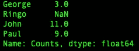

## **追加、组合和连接两个系列**

要将两个系列连接在一起，只需使用`.append`方法。这需要另一个`series`作为参数。默认情况下，此方法会创建重复的索引。但是，如果索引值重复，设置为`True`的可选参数`verify_integrity`会报错。

```
songs_66.append(songs_69)
songs_66.append(songs_69, verify_integrity=True)
```

> **输出**

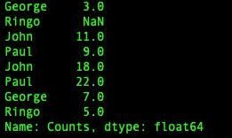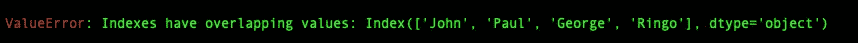

若要对序列执行基于元素的运算，请使用。组合方法。它接受另一个级数和一个函数作为它的参数。

```
def avg(v1, v2):
    return (v1 + v2) / 2.0songs_66.combine(songs_69, avg)
```

> **输出**

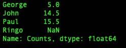

要更新一个系列的值，使用`.update`方法。

```
songs_66.update(songs_69)
songs_66
```

> **输出**

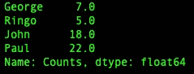

`.repeat`方法简单地重复每一个项目一个期望的数量。

```
songs_69.repeat(2)
```

> **输出**

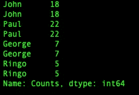

## 整理

→ `.sort_values` —该方法返回一个按值排序的新的`Series`。该方法还支持翻转排序顺序的`ascending`参数。

```
songs_66.sort_values()
songs_66.sort_values(ascending=False)
```

> **输出**

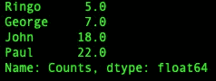

→类似的方法`.sort_index`可用于对`Series`的索引进行排序。它也提供类似的`ascending`参数。

→另一个有用的排序相关方法是`.rank`。该方法根据条目的值对索引进行排序。它为平局分配相等的权重。它还支持升序参数来反转顺序。

```
songs_66.rank()
```

> **输出**

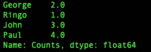

## **应用功能**

要修改、清理、检查或对`Series`应用任意函数，我们可以使用将函数/字典/序列作为参数的`.map`，并像`Python`一样将其应用于`Series`的每个元素。

```
def format(x):
    if x == 1:
        template = '{} song'
    else:
        template = '{} songs'
    return template.format(x)songs_66.map(format) # function as a parameterssongs_66.map({5: None,
              18: 21,
              22: 23})ongs_66.map({5: None,
              18: 21,
              22: 23}) # dictionary as a parametermapping = pd.Series({22.: 33})
songs_66.map(mapping) # series as a parameter
```

> **输出**

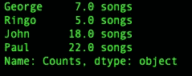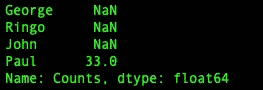

> 注意:series 对象上还有一个`.apply`方法。它的行为与`.map`非常相似，但它只适用于**函数(不适用于序列或字典)。**

## 字符串操作

具有字符串数据的系列可以通过*矢量化字符串操作*进行操作。要调用字符串操作，只需在序列的`.str`属性上调用它们。

```
names = pd.Series(['George', 'John', 'Paul'])
names.str.lower()
names.str.findall('o')
```

> **输出**

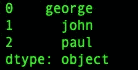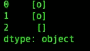

以下是可用的矢量化字符串方法，熟悉原生 Python 字符串方法的任何人都应该熟悉这些方法。

```
**Method, Result** contains, pattern matching boolean result
count, pattern occurrence count result
decode, decode a codec encoding
encode, encode a codec encoding
startswith, pattern matching for string start with boolean result
endswith, pattern matching for string end with boolean result
findall, find pattern in string
get, attribute access on items
join, join items with a separator into a string
len, total size of items
lower, convert items to lowercase
upper, convert items to uppercase
lstrip, removes whitespaces to the left of items
rstrip, removes whitespaces to the right of items
strip, removes whitespaces to both sides of items
repeat, repeat the string a certain number of times
replace, change/replace a particular part of string
slice, pull slices of string
split, split items by pattern
title, titlecase the items
```

我将免费赠送一本关于一致性的电子书。在这里获得你的免费电子书。

感谢阅读。我希望你喜欢这篇文章，并学到一些新东西。我知道这些不是图书馆提供的所有`Pandas.Series`方法，但它们是一个很好的起点。继续学习！

如果你喜欢阅读这样的故事，并想支持我成为一名作家，可以考虑[注册成为一名媒体会员](https://tarun-gupta.medium.com/membership)。每月 5 美元，你可以无限制地阅读媒体上的故事。如果你注册使用我的链接，我会赚一小笔佣金，不需要你额外付费。

[](https://tarun-gupta.medium.com/membership) [## 加入我的推荐链接-塔伦古普塔

### 作为一个媒体会员，你的会员费的一部分会给你阅读的作家，你可以完全接触到每一个故事…

tarun-gupta.medium.com](https://tarun-gupta.medium.com/membership) 

要阅读更多文章，请访问此处:

 [## 标记故事列表的快速链接—感谢您的访问

### 我也有一份以快节奏出版为目标的出版物。读书成为作家。

tarun-gupta.medium.com](https://tarun-gupta.medium.com/thank-you-for-visiting-my-profile-9f708062c75e)