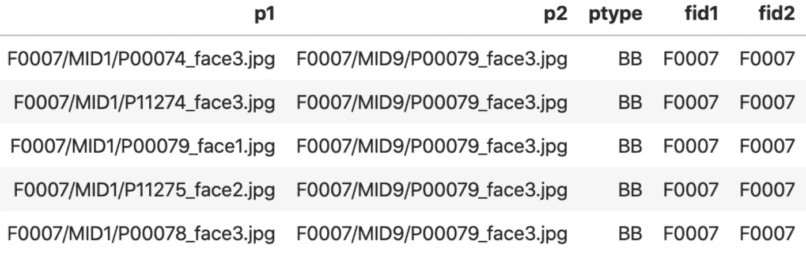

# 熊猫小贴士:需要速度

> 原文：<https://towardsdatascience.com/pandas-tips-tricks-need-for-speed-54e217cc6aa0?source=collection_archive---------22----------------------->

## 像 PYTHON 专家一样进行数据分析

## 个人最喜欢的一句俏皮话


Source: [Unsplash](https://unsplash.com/photos/dast7B6U2Aw).

# 概观

[我的上一篇文章](/demo-for-rfiw-2020-task-1-kinship-verification-8a8ed7081bcc)展示了一个评估一组人脸对以确定这两个人是否有血缘关系的简单过程。几个片段像*黑盒*一样被轻轻带过。让我们来看看其中的一个片段，一个简单的*单命令行程序*:我最近学习的 Python [熊猫](https://pandas.pydata.org/)特性，现在经常使用。

DataFrame 包含面对 *p1* 和 *p2* ( **图 1** )和特征(type **dict** )的列表，文件名作为关键字，面编码作为值。



***Fig. 1.***df_pairlist.[*head*](https://pandas.pydata.org/pandas-docs/stable/reference/api/pandas.DataFrame.head.html)*(5): top 5 of >100,000 rows. Notice samples are repeated, but pairs are unique (i.e., member 1 of family 7 is the bother of member 9 of family 7, each with various face samples paired. Specifically,* [*N*choose*(2*](https://www.mathsisfun.com/data/binomial-distribution.html)*) face pairs, where N is the total number of faces of the two relatives).*

原来你在这里！在短短一行代码中，我们对数百万对进行了评分，而没有考虑内存或速度问题，同时为配对创建了一个分数列，作为同一个[数据帧](https://pandas.pydata.org/pandas-docs/stable/reference/api/pandas.DataFrame.html)的一部分。

# 那又怎样？谁在乎呢。

在我们认识到这一点之前，让我们确保我们看到了问题。

首先，读取上面描述的数据结构。

Load lists of pairs and features for each face present in the list

请注意，有> 100，000 对，但有～10，000 个面:面以肯定、唯一和错误对的形式重复。

如何衡量所有配对的相似性(即每行计算一个分数)？

**胸围#1。一个人可以循环，这是使用熊猫或 [NumPy](https://numpy.org/) 的最不理想的方式之一。举个例子，**

```
60.61587691307068 seconds
```

这太慢了。太慢了！！！

我们没有充分利用 pandas 的优势，甚至没有充分利用 NumPy 的矢量化能力。点击了解更多[。](https://realpython.com/numpy-array-programming/)

那么我们还能做什么呢？

**胸围#2。我们可以将整个矩阵读入内存，但这不仅是多余的，因为通常有数百万对，每个元素是一个大小为 512(即 512 x 8 字节)的向量。因此， *I/O* 开销将会很慢，内存使用将不是最佳的，并且在大多数情况下，内存量不足。**

**解决方案。**我们可以将[字典对象的键](https://www.w3schools.com/python/python_dictionaries.asp)映射到一个面孔列表。然后，[对每一行应用](https://pandas.pydata.org/pandas-docs/stable/reference/api/pandas.DataFrame.apply.html)一个度量(即面 *A* 和面 *B* ，或者列 A 和 B)。因此，每一行都有各自配对的分数。

**因此，Python Pandas 提供了一个奇妙的解决方案。**

A 1 liner: map features from a list of strings as keys to a dictionary pointing to the feature vector and following a functional programming paradigm for optimal performance.

这里我们指定 *axis=1，*意味着跨列应用(即，逐行)。

```
3.53662109375 seconds
```

**几乎不费吹灰之力就实现了近 18 倍的速度提升！**请注意，加速比只会随着样本量的增加而增加。这里，只有 [FIW](https://web.northeastern.edu/smilelab/fiw/) 的一个子集用于演示目的。

这个有效的技巧可以推广到许多基于 ML 的问题中遇到的情况。

## 动机(又名 Spiel)

为了使一篇博客的长度与前一篇文章提供的信息量相匹配，一些值得强调的内容被跳过或略过。拉胡尔·阿加瓦尔对 ROC 曲线做了一个聪明的评论，这让我恍然大悟——没有提供分析或定义，只有实现。因此，我相应地进行了更新(参见 ROC 上的[部分)。然后，其他部分似乎值得额外的解释。这激发了我在这篇文章中最喜欢的一行代码上写这篇博客:一个狭窄的主题，一个快速的博客。](/demo-for-rfiw-2020-task-1-kinship-verification-8a8ed7081bcc#4d14)

作为一个新的博客作者，我计划继续学习、适应和提高。此外，我写信给的是你。因此，你的意见、回答和问题对我的这个新爱好来说是很有价值的。请分享任何积极和消极的想法。提问。提出改进建议，甚至提出自己的想法！

总而言之，我希望你喜欢它。敬请关注更多博客！

# 相关博客

*   Sofia Heisler ，[优化熊猫代码速度的初学者指南](https://engineering.upside.com/a-beginners-guide-to-optimizing-pandas-code-for-speed-c09ef2c6a4d6)
*   [Robbert van der Gugten](https://medium.com/u/ffd7e98955c4?source=post_page-----54e217cc6aa0--------------------------------) , [高级熊猫:优化速度和内存](https://medium.com/bigdatarepublic/advanced-pandas-optimize-speed-and-memory-a654b53be6c2)
*   [塞尔瓦拉塔姆·拉维南](https://medium.com/u/b7def7a159d6?source=post_page-----54e217cc6aa0--------------------------------)，[了解使用熊猫时的优化需求](/understanding-the-need-for-optimization-when-using-pandas-8ce23b83330c)