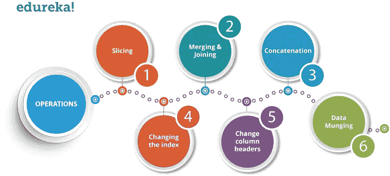
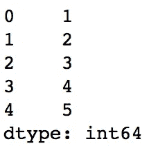
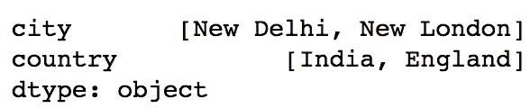
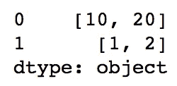
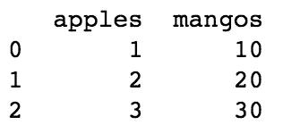

# 学习 Python 中两个最常用的熊猫数据结构

> 原文：<https://towardsdatascience.com/pandas-tutorials-a-complete-pandas-guide-i-c392ded87367?source=collection_archive---------19----------------------->

Pandas 是由 Wes McKinney 开发的高级数据操作工具。它建立在 Numpy 包之上，意味着 Pandas 需要 Numpy 来运行，它的关键数据结构被称为 DataFrame。数据帧允许您存储和操作观察行和变量列中的表格数据。



image by E[dureka](https://www.edureka.co/blog/python-pandas-tutorial/)

如果你已经知道熊猫，系列和数据框，那么你可以跳过这个博客，可以从[这里](https://medium.com/@himanshusoni501/pandas-guide-with-python-example-ii-basic-pandas-operations-4cf9704fd062)跟随它的第二部分。

# **熊猫装置**

要安装熊猫，只需在您的终端上键入以下命令。您可以使用以下方法之一安装 pandas。

```
# conda
conda install pandas# or PyPI
pip install pandas
```

# **为什么用熊猫？**

数据科学家使用熊猫有以下优势:

*   轻松处理缺失数据
*   一维数据结构使用**系列**，多维数据结构使用**数据帧**
*   它提供了一种有效的数据切片方法
*   它提供了一种灵活的方式来合并、连接或整形数据

# **系列**

序列是一维(1-D)数据结构，可以有任何数据结构，如整数、浮点和字符串等。当你想执行任何种类的计算或返回一维数组时，这是很有用的。一个系列不能有多列。

在上面显示的代码片段中，数据可以是:-

*   标量值可以是整数、浮点和字符串等类型。
*   字典可以有键和值对形式的数据
*   Ndarray 可以有 n 维数组

我们将逐一探讨上述每一个问题。我们将使用 Jupyter Notebook 运行我们的 python 代码，如果您还没有安装，请点击[此处](https://jupyter.org/install)进行安装

**使用 python 列表的系列:**以下代码片段使用 python 列表创建整数类型的系列。

当您运行上面的代码时，它将产生以下输出



**注**:索引默认从 0，1，2，…(n-1)开始，其中 n 为数据长度。

**系列使用 python 字典:**

上面的代码片段产生以下输出。



**系列使用 Ndarray:**

上面的程序产生如下输出。



# **数据帧**

数据帧是以行和列的形式存储数据的多维数组。数据帧是存储数据的标准方式。下图显示了如何使用 python 字典创建数据框。

上面代码的输出如下所示。



# **总结**

*   Pandas 是一个处理和分析数据的开源库。
*   Pandas 非常容易处理缺失值，并且它为我们提供了一种有效的数据切片方法。
*   Series 是一维数组，能够保存任何类型的值。
*   DataFrame 是以表格形式存储值的多维数组。

我希望你喜欢读这篇文章，你也可以访问我的 [**网站**](http://thehimanshuverma.com/) ，在那里我会定期发布文章。

如果你想给我任何建议，那么我很乐意听听你们的意见。永远欢迎你。

编码快乐！！！

[**订阅**](https://mailchi.mp/b08da935e5d9/himanshuverma) 我的邮件列表，直接在您的收件箱中提前获得我的文章，或者关注我自己在 Medium 上发表的文章[**【The Code Monster**](https://medium.com/the-code-monster)**】，以完善您的技术知识。**

# **了解你的作者**

**希曼舒·维尔马毕业于印度勒克瑙的 APJ 阿卜杜勒·卡拉姆大学博士。他是 Android & IOS 开发人员、机器学习和数据科学学习者、金融顾问和博客作者。**