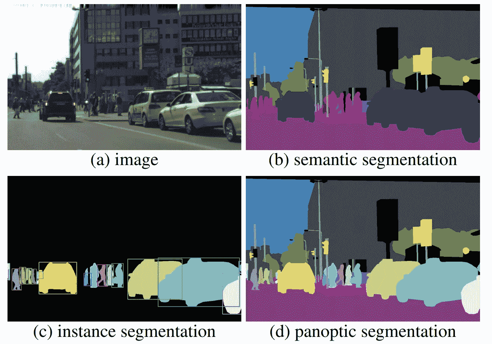
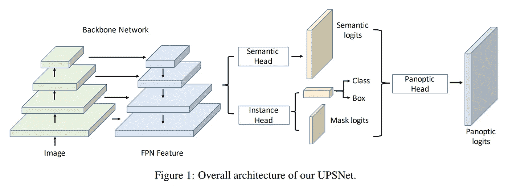
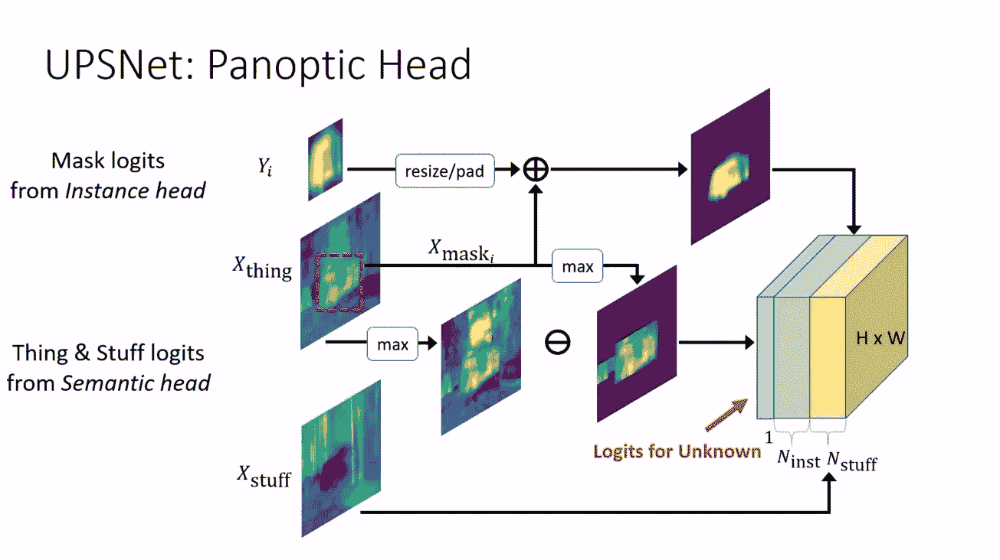
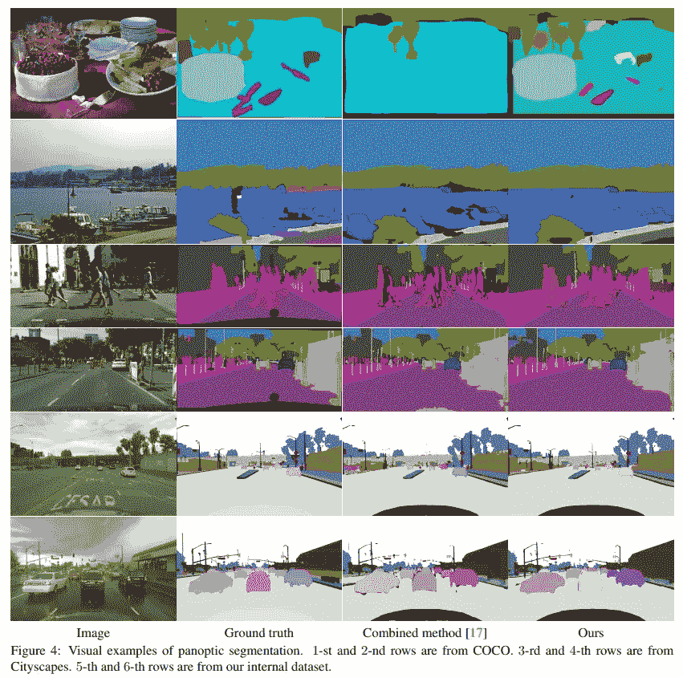

# 用 UPSNet 进行全景分割

> 原文：<https://towardsdatascience.com/panoptic-segmentation-with-upsnet-12ecd871b2a3?source=collection_archive---------17----------------------->

## 结合语义和实例分割的完整场景理解

计算机视觉社区已经提出了一个称为全景分割的新任务。全景分割要求一个场景不仅在语义上被分解，而且要求一个类的每个实例，比如一辆车或一个人，被唯一地标记。它需要一种算法来理解像天空和地面这样的无形的东西和像汽车和人这样的可计数的 T2 事物之间的区别。介绍该任务的论文中的以下图片清楚地显示了不同任务之间的差异:

虽然以前的方法侧重于使用启发式方法来组合输出以产生全景分割，但优步研究公司提出了一种统一的端到端可训练架构，称为 UPSNet，它利用语义和实例分割任务之间的互补性来提高准确性和性能。

架构使用与 [Mask R-CNN](https://arxiv.org/abs/1703.06870) (与 FPN 的 ResNet)相同的主干。在这个主干之上，有两个平行且独立的头部:语义头部和实例头部。最后，这两个头的输出进入另一个头，称为全景头。

实例头与 Mask-RCNN 中使用的实例头相同。虽然语义头是显着的使用可变形卷积，全景头是本文的主要贡献。全景头负责通过处理语义和实例结果来产生最终输出。它完全没有参数，因此不需要培训。这里发生的事情是，如果有像素没有实例输出，那么语义头的输出直接被这些像素接受。对于既有实例标签又有语义标签的像素，softmax 用于确定它是否应该被标记为该实例或语义类。

此外，作者还为“未知”类构建逻辑，以避免做出错误的预测。这背后的基本原理是，对于任何像素，如果来自语义头的“thing”类的 logit 的最大值大于来自实例头的 logit 的最大值(下图中的 max(X thing)- max(X stuff))，那么我们很可能遗漏了一些实例。因此，这些像素必须标记为未知。

这是本文的主旨。这是一个相当简单的想法，但结果是惊人的，我已经在生产中使用它们。我强烈推荐您尝试一下资源库[https://github.com/uber-research/UPSNet](https://github.com/uber-research/UPSNet)，我将留给您这篇论文的以下结果:

参考:
[UPSNet:一个统一的全景分割网络——余文雄，廖，赵恒双，，，尔辛尤默，拉克尔乌尔塔逊](https://arxiv.org/abs/1901.03784)