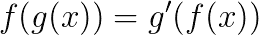
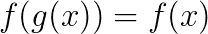
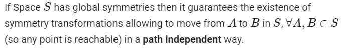
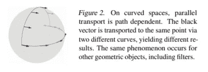
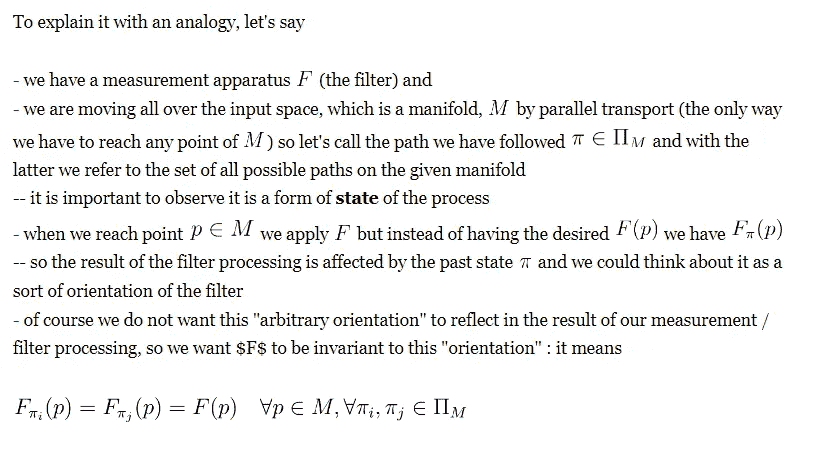
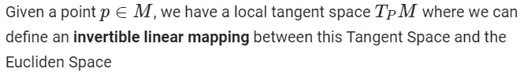
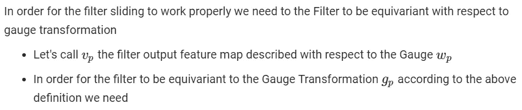

# [论文分析] —规范等变卷积网络和二十面体 CNN

> 原文：<https://towardsdatascience.com/paper-readthrough-gauge-equivariant-convolutional-networks-and-the-icosahedral-cnn-13e9d3d95b85?source=collection_archive---------8----------------------->

Photo by [Kevin Crosby](https://unsplash.com/@kfcrosby?utm_source=medium&utm_medium=referral) on [Unsplash](https://unsplash.com?utm_source=medium&utm_medium=referral)

# 概观

在这篇文章中，我将尝试总结这篇与几何深度学习相关的非常有趣的论文

原始文件

 [## 规范等变卷积网络和二十面体 CNN

### 对称变换的等方差原理使神经网络的理论基础方法成为可能。

arxiv.org](https://arxiv.org/abs/1902.04615) 

注意:在这个总结中，我已经最小化了对数学符号的使用(也因为 Medium 不是数学友好的)，所以如果你想更深入地了解形式主义，请参考 GitHub 版本(顺便说一下，GitHub 本身并不渲染数学，但至少你可以使用 Chrome 插件，如[Tex All Things](https://chrome.google.com/webstore/detail/tex-all-the-things/cbimabofgmfdkicghcadidpemeenbffn)

 [## 尼古拉·贝尔尼尼/论文分析

### 相关论文的分析、总结、备忘单- NicolaBernini/PapersAnalysis

github.com](https://github.com/NicolaBernini/PapersAnalysis/tree/master/Geometric_Deep_Learning/CNN/Gauge_Equivariant_Convolutional_Networks_and_the_Icosahedral_CNN) 

# 介绍

**卷积滤波器**是从域到共域的滤波器映射

在 CNN 的上下文中，

*   该滤波器基于卷积运算
*   结构域和共结构域都被称为**特征图谱**

**等方差**是关于滤波器及其应用领域的属性

*   当一个变换被应用于滤波器域并且它完全反映在滤波器输出上时，那么该滤波器被称为相对于该变换是等变的

Equivariance means the transformation propagates through the filter

*   如果该变换被滤波器完全吸收，使得在滤波器输出中没有其应用的痕迹，则该滤波器被称为相对于该变换是不变的

Invariance means the transformation gets abosrbed by the filter

**对称性**确定一组与特定空间相关的全局变换(它们不依赖于任何过滤器)，这些变换在不改变空间结构的情况下映射空间本身:它们依赖于特定空间的几何形状。

与作用于图像或更一般的平面特征地图的经典 CNN 层相关的基本思想是

*   为了能够使**过滤器在平面上滑动，特征属于**

或者等同地

*   在**下方滑动飞机**

因此，在用卷积滤波器一次又一次地处理它之前，更正式地使用**平面对称**(取决于它的几何形状)之一来转换平面本身

将这一过程推广到一般空间，我们希望

1.  一些以同样方式工作的东西，因此改变了空间本身以进行连续的处理
2.  卷积滤波器应该**可以独立地学习它在平面**上的特定位置(这通常被称为权重共享，它使得 CNN 处理位置独立)

就**空间推广**而言，让我们考虑流形 M，一个与欧几里得空间局部同胚的空间

使用流形的主要挑战是它们**不保证具有全局对称性**，但是它们具有**局部规范变换**:本文的目标是设计卷积滤波器，其目的不是与任何全局对称性等变(因为在这种情况下不可能假设它们存在)，而是与局部规范变换等变。

这是关键，因为

*   **我们最终想要获得的**是一个能够共享权重的**卷积滤波器，这意味着独立于输入特征图上的特定位置学习权重**
*   **如何**使其**等同于过滤器应用于输入空间中任意点的方式**
*   在存在全局对称的情况下，到达空间中任意点以应用滤波器的工具是通过输入空间的**全局对称变换**，例如在平面的情况下，这是移位操作
    理解这种“滑动”操作不能对学习产生影响是关键(否则学习的结果将取决于具体的操作细节)，这种操作仅允许**权重共享**。

因此，如果算子(例如卷积)在设计上与这种变换是等变的，那么它可以通过共享权重来学习，因为在学习过程中，滤波器通过对称变换应用于空间中的任何点，并且它不影响学习到的权重(事实上，在平面上的经典 CNN 中，卷积算子在平面上滑动的具体方式是不相关的)。

该论文中提出的挑战不是假设全局对称，而只是局部规范并研究相关的变换，以便设计能够通过权重共享来学习的卷积算子。

在缺乏整体对称性的情况下，我们遇到的第一个问题是如何到达空间中的任何一点(这是一个必需的特征)。一个可能的解决方案是[并行传输](https://en.wikipedia.org/wiki/Parallel_transport) rt，但是**并行传输实际上是路径相关的**。

From the paper

不用说，路径是完全任意的，事实上它定义了被称为**标尺**的**局部切线框架**，这意味着一个简单的过滤器会将这个任意的标尺选择传播到它的结果，影响学习。好的

因此，我们想要的是一个滤波器，它对于这个不可避免的任意局部规范选择是不变的，源于并行传输，使得输出特征图不受在输入特征图中选择的局部规范的影响。

# 细节

然后让我们介绍一下**规范**，它是流形切线空间和欧几里德空间之间的一个**位置相关的可逆局部线性映射**

因此，一个量规也在(映射欧几里得参考系)中定义了一个局部参考系

**量规变换**是局部框架的**位置相关可逆变化**

因此，潜在的想法是建立一个具有这种特性的过滤器，这取决于它必须处理的特定流形