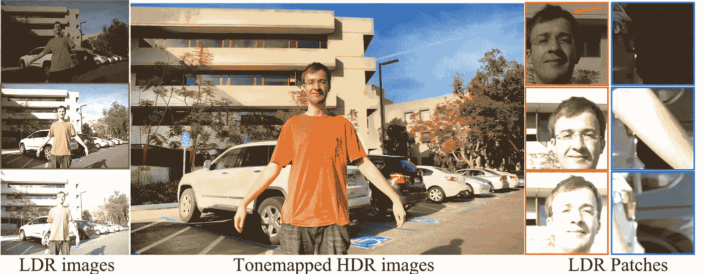
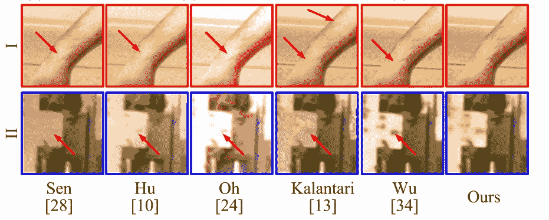
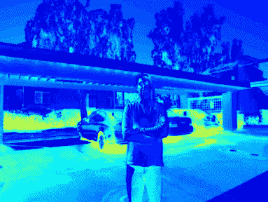
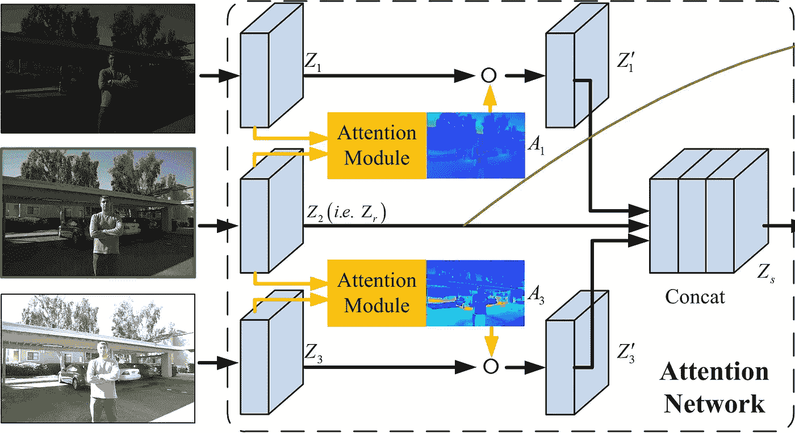
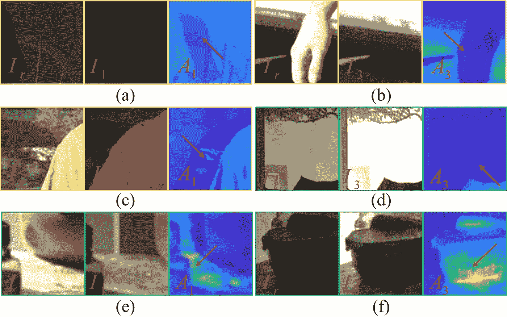
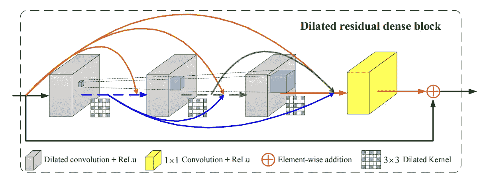
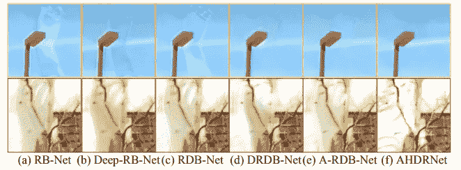
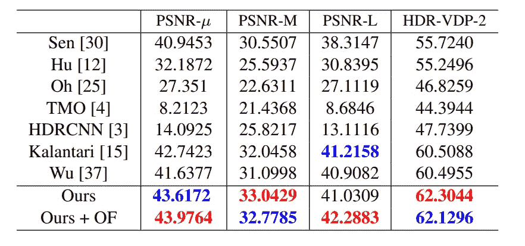

# “用于无重影高动态范围成像的注意力引导网络”(CVPR，2019)——论文综述

> 原文：<https://towardsdatascience.com/paper-review-attention-guided-network-for-ghost-free-high-dynamic-range-imaging-4df2ec378e8?source=collection_archive---------19----------------------->

## HDR 重建的最新进展

Source: [Attention-guided Network for Ghost-free High Dynamic Range Imaging (AHDRNet)](https://donggong1.github.io/ahdr)

> *“你只是想要关注，你不想要我的心”——查理·普斯*

# 关于报纸

*用于无重影高动态范围成像的注意力引导网络* (AHDRNet)是目前 HDR 使用包围曝光图像生成图像的最先进技术。它出现在 2019 年 CVPR，可以在这里阅读。第一作者，[董公](https://donggong1.github.io/)是阿德莱德大学的博士后研究员。他的兴趣包括机器学习和计算机视觉中的优化。

> ***注*** *:本帖使用的图片结果、网络表示、公式、表格均来源于* [*论文*](https://arxiv.org/abs/1904.10293) *。*

在我们开始之前，我建议你看看我播客中的一个片段，我们在这里讨论了计算摄影和 HDR 成像的现状。

# 埃尔问题 a

为了从多重曝光包围的 LDR 图像生成 HDR 图像，LDR 图像的对准对于具有帧内运动的动态场景非常重要。合并前未考虑未对准，导致重影(以及其他)伪像。已经有几次成功的(几乎)尝试通过使用光流估计来补偿帧之间的这种运动。事实证明，基于流量的方法的缺点并没有很好地服务于 HDR 事业。

这可以从[卡兰塔里等人的一次尝试中看出。al](https://cseweb.ucsd.edu/~viscomp/projects/SIG17HDR/) ，其中不考虑饱和图像区域中的精确空间重建，对于具有严重运动的输入帧，可以观察到对准伪像。这可以从 AHDRNet 的作者在下图中提供的结果中看出。专门针对高度动态的的重建的另一个尝试包括输入( [Wu et .al](https://arxiv.org/pdf/1711.08937.pdf) )声称利用 CNN 架构在学习失调和补偿鬼影伪像方面的明显实力。然而，以下结果表明仍有改进的余地。

# 注意营救

作者建议使用注意机制来解决这一双面问题，即通过使用注意机制来减少对准伪影+精确的 HDR 重建。如果你想一想，注意力网络只是堆叠在一起的几个 Conv 层，然后(通常)是一个 sigmoid 激活，允许网络专注于重要的和相关的应用程序。

这里，注意力网络被用于抑制对准伪影，并且通过关注括号中的图像相对于参考图像的空间动态，集中于将曝光更好的图像区域注入到生成的图像中。对应于参考图像的区域被突出显示，而具有严重运动和饱和度的区域被抑制。我们将会看到注意力信息矩阵是如何被处理和实现的，就其背后的数学而言。

网络的注意力部分集中于决定哪些图像区域对网络输出的准确性有更好的贡献。接下来是一个基于注意力输出的合并网络，试图从 LDR 输入中创建 HDR 内容。注意力机制越好，对合并网络的输入就越好，从而允许它利用输入的更相关部分中的信息。使用扩展的密集残差块开发了合并网络，这改进了梯度流、分层学习和收敛。整个网络以端到端的方式被训练，因此两个子网络相互影响，并且一起学习。

# 履行

Overview

## 预处理

非线性 LDR 输入( *I1，I2，I3* )通过应用逆 CRF(这里是伽马校正)并除以它们相应的曝光时间而被转移到线性域。

γ = 2.2

线性和非线性输入( *Ii，Hi* )沿着信道维度被连接以形成 *Xi* 。 *X1* 、 *X2* 和 *X3* 馈入网络产生相应的 HDR 输出。

*H* is the generated image, *f* (.) represents the AHDRNet network and *θ* the network parameters

当网络拥有可供其支配的线性化输入信息时，它表现得更好。这已在 [Kalantari 等人的研究中得到观察和利用。艾尔](https://cseweb.ucsd.edu/~viscomp/projects/SIG17HDR/)以及[吴等人。艾尔](https://arxiv.org/pdf/1711.08937.pdf)。

# 体系结构

整个网络由两个子网络组成——注意网络和融合网络。

Attention network

如上所述，注意力网络通过突出显示和使用来自与参考图像相对应的相邻图像(非参考图像)中的区域的信息，有助于避免对准伪影。它通过以下方式实现。

注意力不是从连接的图像对中提取的，而是直接应用于连接的图像对。首先将 *Xi* 通过 Conv 层提取 64 通道特征图*子*。

然后，参考特征图( *Z2* 或 *Zr* )连同相邻图像特征图( *Z1* 和 *Z3* )被馈送到关注模块，该关注模块参照 *Zr* 生成关注图来标记非参考特征图中的重要区域。

这是对两对( *Z1* 、 *Z2* )和( *Z3* 、 *Z2* )进行的。这在上面的网络表示中可以看得很清楚。

在我们进入注意力模块做什么之前，让我们看看如何处理生成的注意力地图。生成的注意力图本质上是一个包含[0，1]之间的值的 64 通道矩阵。该矩阵用作一种权重矩阵，其中每个元素表示相邻图像的特征矩阵中相应元素的重要性，参考 *Z2* 。这是通过使用从( *Z1* ， *Z2* )生成的注意力图，通过进行注意力图和 *Z1* 的逐元素乘法来获得*Z’1*来实现的。

该操作导致 *Z1* 中的重要特征(关注度更接近 1)获得较高的数值，而不太重要的特征获得相应的较低值。这仅表现在来自 *Z1* 的重要图像区域，其在网络中前进以对最终的 HDR 输出做出贡献。同样的事情发生在( *Z3* ， *Z2* )之间得到*Z’3*。

现在我们有了所有与构建 HDR 图像最相关的输入片段，我们沿着通道维度将它们连接起来，如下所示

## 注意模块

我们来看看这些注意力地图是如何产生的。本文中使用的注意模块由 2 个 Conv2d 层组成，输出 64 通道矩阵，之后分别是 ReLU 和 sigmoid 激活。它将相邻和参考图像(2×3 = 6 个通道)的连接特征向量作为输入。最终，sigmoid 激活用于将输出包含在[0，1]范围内。

## 关注结果

Attention map examples from the paper. ( a ) to ( c )— Alignment attention; ( d ) to ( f ) — Exposure attention

在(a)至(c)中，从上述结果可以观察到，非参考图像中具有运动差异的区域是如何被抑制的(深蓝色区域)，而与参考图像具有对应关系的区域被突出显示(较亮的蓝绿色)。在(d)到(f)中，在相邻帧中曝光较好的区域被突出显示，而饱和区域被抑制。

# 合并网络

级联的特征图( *Zs* )作为输入被提供给合并网络。作者所用的归并网络是张等人提出的剩余稠密网络。艾尔。代替传统的 Conv 操作，作者使用了扩张卷积来传播更大的感受野，因此称之为扩张残余致密块(DRDB)。在合并网络中有 3 个这样的块，它们由基于密集级联的跳跃连接和剩余连接组成，已经证明它们对于 CNN 在解决梯度消失方面非常有效，允许更好的反向传播、分级学习，并因此帮助和改善收敛性能。在建议的 AHDRNet 网络中，每个 DRDB 包括 6 个 Conv 层，增长率为 32。

DRDB

作者还采用了局部和全局剩余跳跃连接，将低级特征旁路到高级特征。局部残差学习在 DRDBs 内实现，而全局残差学习用于将包含*纯*信息的浅层特征图从参考图像转移到后面的阶段。这一点以及其他网络规格可以在合并网络图中观察到。

# 损失函数

就像[卡兰塔里 et 一样。al](https://cseweb.ucsd.edu/~viscomp/projects/SIG17HDR/) ，在 *μ* 定律色调映射生成的图像和色调映射的地面真实图像之间计算损失。所有实验的 *μ* 都被设置为 5000。 *μ* 定律可以定义为

*μ*-law

L1 损失也是如此。定量比较 PSNR 和 HDR-VDP-2 分数在本文中提出传达 L1 损失更好地重建更好的细节相比，L2 损失。

## 实施规范

该架构是使用 PyTorch 实现的。规格和超参数是-

*   重量初始化:Xavier
*   优化器:ADAM
*   学习率:1 X10–5
*   批量:8 个
*   GPU: NVIDIA GeForce 1080 Ti
*   一幅图像(1500x1000)的推断时间:0.32 秒

## 结果

这些网络在 Kalantari et 提供的数据集上进行了训练和测试。艾尔。作者提供了定量和定性的比较之间的几个变量的网络，在 PSNR 和 HDR-VDP-2 评分。

*   ahdr net—ahdr net 的完整模型。
*   DRDB 网络(即无注意事项的 AHDRNet)
*   RDB 网(即没有膨胀的阿德尔网)
*   RDB 网络(即没有注意力和扩张的 AHDRNet)
*   RB-Net(即 AHDRNet，不包含注意、扩张和密集连接)。RBs 取代 DRDBs。
*   深 RB 网。使用更多的 RBs。

结果显示了 AHDRNet 的每个组件对于整个网络的功效是如何重要的，即注意力是重要的，扩展卷积是重要的，密集连接是重要的，剩余学习是重要的。

Visual results, from the paper

与最先进技术的比较

与当前最先进的方法(基于学习和不基于学习)的比较揭示了 AHDRNet 如何击败现有的方法。最接近的竞争对手显然是 [Kalantari et。al](https://cseweb.ucsd.edu/~viscomp/projects/SIG17HDR/) 的实现仅次于 AHDRNet。作者还提供了使用光流对齐图像(AHDRNet + OF)的 AHDRNet 变体的结果。

视觉结果显示了网络在生成的 HDR 输出中注入细致细节的功效，即使在剧烈运动的情况下也不会产生任何对准伪影。这是从论文中摘录的一些结果-

# 结论

AHDRNet 是第一个解决 HDR 图像生成问题的基于注意力的方法。注意力机制的技巧已经被用于对齐输入的 LDR 图像。先前的图像对准尝试使用了基于光流的方法，这些方法具有一些不准确性，并且对于帧之间的剧烈运动表现不佳。然而，基于注意力的方法在 HDR 重建以及消除对准伪影方面表现得非常好。大量的实验揭示了 AHDRNet 如何在定性和定量上取代现有的方法，并且它已经成为 HDR 图像生成中新的最先进的技术。

# 参考

*   闫庆森，董工，施勤峰，安东·范·登·亨格尔，，伊恩·里德，，，[注意力引导网络无鬼高动态范围成像](https://arxiv.org/abs/1904.10293) (2019)，2019
*   名词（noun 的缩写）K. Kalantari 和 R. Ramamoorthi，[动态场景的深高动态范围成像](https://cseweb.ucsd.edu/~viscomp/projects/SIG17HDR/) (2017)，ACM Trans。图表
*   吴尚哲、许家瑞、戴宇荣、唐志强，[具有大前景运动的深高动态范围成像](https://arxiv.org/abs/1711.08937) (2018)，欧洲计算机视觉会议(ECCV)，2018 年 9 月