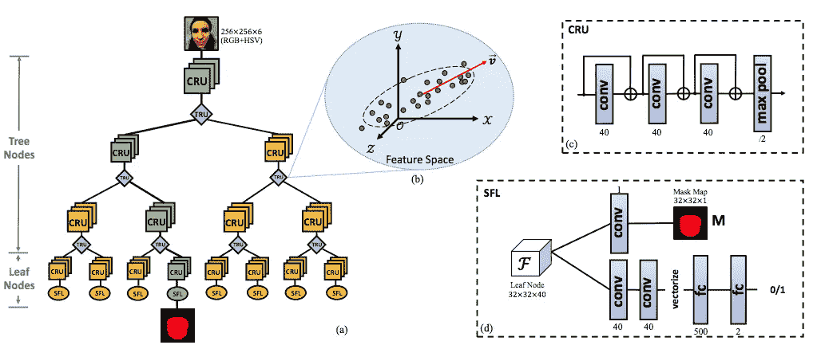

# 【反欺骗】零拍人脸反欺骗的深度树学习

> 原文：<https://towardsdatascience.com/paper-review-deep-tree-learning-for-zero-shot-face-anti-spoofing-b77350284fc6?source=collection_archive---------21----------------------->

Photo by [Joel Burgess](https://unsplash.com/@joelb?utm_source=unsplash&utm_medium=referral&utm_content=creditCopyText) on [Unsplash](https://unsplash.com/s/photos/face-spoofing?utm_source=unsplash&utm_medium=referral&utm_content=creditCopyText)

# 解决的问题

通常，人们会创建一种算法(或构建神经网络)来缓解特定的已知攻击。然而，在缓解技术和新攻击类型的创造之间有一场持续不断的竞赛。该论文认为，对于现实世界的应用程序来说，这是一个问题，并渴望建立一种方法来检测目前*未知的*欺骗攻击。

这里*未知的欺骗攻击*意味着算法设计者没有意识到的攻击，并且一个有经验的模型从未见过这种攻击的例子。由于已学习的模型从未见过这些当前未知的欺骗攻击的例子，因此本文将相应的检测&缓解技术归类为**零镜头人脸反欺骗。**

# 现有技术及其局限性

在全球范围内，该方法一直将此类*未知欺骗攻击*视为**异常检测问题。**

其他方法有 3 个主要缺点:

*   创建算法时考虑了有限的欺骗种类，更具体地说，只有**打印&重放**攻击
*   使用手工制作的特征来检测活体与非活体人脸
*   在构建新的算法和网络时，没有利用已知的攻击类型。论文强烈认为这是一个被忽视的有价值的信息。

# **主要贡献**

本文有三个主要贡献:

*   综合研究 13 种不同类型的欺骗攻击

Extracted from the paper

*   提出一种称为**深度树网络(DTN)** 的新网络架构，用于检测未知的欺骗攻击
*   创建新的数据集来训练和评估零镜头人脸反欺骗

# 关键见解

正如在现有技术及其局限性部分中提到的，作者假设应该利用现有欺骗类型的知识，因为新的欺骗类型可以与它们共享一些(如果不是全部)属性。这些共有的属性就是他们所谓的**同质特征**。

该论文认为，这些同质特征可以用于将未知的欺骗类型投射到一组已知的攻击类型中。

传统上，人们会尝试建立一个分类器来检测活体人脸和某一欺骗类型的欺骗人脸。这将是一个二元分类或多元分类的问题。这给使用监督学习机制设计网络带来了压力，因此需要标签。因为这里的目标是找到设计者目前未知的欺骗，所以他们将此作为**无监督学习**问题(在监督块的帮助下，如后所述)。

基于树的机器学习算法专门以分层的方式分离特征。他们设想了一种神经网络，可以使用树状结构的属性来帮助以无监督的方式分离特征(即不需要标签)。

# 它是如何工作的？

第一个重要的目标是建立一个树状结构。作者从 ICCV 2015 年题为 [**用于形态感知人脸识别的条件卷积神经网络**](https://www.cv-foundation.org/openaccess/content_iccv_2015/papers/Xiong_Conditional_Convolutional_Neural_ICCV_2015_paper.pdf) 的论文中获得灵感，以创建所需的树架构&借用**形态感知投影树**的概念(从精神上来说)，然而他们发现了该论文提出的**路由函数**的缺点，因此提出了一个新的路由函数(如下所述)。

Extracted from the paper

深度树网络(如上所示)由 3 种类型的单元组成:

*   **卷积残差单元**。这里没什么特别的，3 个有身份连接的卷积层和一个最大池层。
*   **树状路由单元(TRU)** 。网络中最有趣和最重要的部分，因为它是将欺骗样本投射(模态感知投射)到子类别之一的部分。
*   **监督特征学习(SFL)** 。该单元或块由二进制分类器(实况对欺骗)和使用逐像素掩码回归的回归器组成。

使用多个损失项对网络进行端到端训练，以帮助学习上述各种单元的参数。

总体而言，有两个部分— **非监督损失&监督损失**，如下式所示

Extracted from the paper

路由(由 TRU)确实是最有趣的方面。在这里，他们定义了一个新的路由函数，使用最大方差的概念(类似于 PCA)来帮助分离样本。这最终转化为寻找最大的**特征向量。**对应于上述损失函数中所示的 **L(路线)**。

**L(唯一)**术语负责平衡每个叶片的子组。报纸解释说，我在这里逐字引述

> 为了使每个叶子有一个平衡的子组，我们将实时数据的响应抑制为零，以便所有实时数据可以均匀地划分到子节点。同时，我们还抑制了没有访问该节点的欺骗数据的响应，使得每个节点都模拟了唯一的欺骗子集的分布

损失函数的监督部分很容易理解，在上面我描述了 3 种类型的单元。

# 假设是如何被证明的

假设在欺骗类型中存在同质特征，并且使用模态感知投影技术，他们能够将欺骗样本分类到子类别之一。

他们通过使用**留一测试协议**来证明这一点。本质上，他们会使用 12 种(共 13 种)欺骗攻击来训练他们的深度树网络(DTN ),然后使用剩下的一种来测试它。简单地说，剩下的一种类型从未被他们的网络看到，因此被认为是一种*未知的恶搞类型！*

# 杂项说明和文件的非目标

解决方案是**而不是**试图确定“恶搞类型”。最后，目标本质上是二元的，也就是说，它是一张恶搞的或真实的脸。

DTN 图像中所示的叶节点并不对应于欺骗类型，而是样本将根据与欺骗类型的相似性而被投射到的潜在类别。

# 各种链接和详细信息

## 论文有开源实现吗？

是的。请看这里—[https://github . com/Yaojie Liu/cvpr 2019-deeptreelingforzeroshotfacespoofing](https://github.com/yaojieliu/CVPR2019-DeepTreeLearningForZeroShotFaceAntispoofing)

他们用的是 Tensorflow 2.0。考虑到多个损失函数和各种单元的交替优化步骤，因此使用定制的训练循环，训练有点棘手。

但是，如果没有签署所需的协议，数据集就不可用。

## 这篇论文是在一次会议上发表的吗？

是的。这篇论文在 CVPR2019 上被接受，是最佳论文奖的决赛选手之一。

[https://arxiv.org/abs/1904.02860](https://arxiv.org/abs/1904.02860)

## 有解释论文的视频吗？

这篇论文也参加了 CVPR 2019 年的口试。下面是作者解释这个概念的视频链接。

[https://youtu.be/j7A83F6PRAE?t=3976](https://youtu.be/j7A83F6PRAE?t=3976)

注意——CVPR 口述的时间非常有限，但作者在阐述要点方面做得很好。我喜欢！

# 我的观点、问题和要点

*   我真诚地感谢对新攻击媒介和缓解技术之间持续战争的认可。当然，还有解决问题的尝试。
*   起初，我对他们的假设感到困惑，即各种类型的电子欺骗有一些相同的特征。老实说，我仍然怀疑，即使他们确实用留一法从经验上证明了他们的假设。
*   我真的很喜欢参考论文( [**用于模态感知人脸识别的条件卷积神经网络**](https://www.cv-foundation.org/openaccess/content_iccv_2015/papers/Xiong_Conditional_Convolutional_Neural_ICCV_2015_paper.pdf) )解释的模态感知投影的整个概念，以及本文对它的巧妙利用和提炼。可能在不久的将来会写一篇评论。
*   如果叶节点对应于已知的欺骗类型(即这里的监督方法)会怎样？了解欺骗类型也有助于了解给定部署中的攻击面。
*   GAN 构建的数字面孔似乎没有被考虑在内。在我看来，他们应该被认为是假的，可能是第 14 种欺骗类型。
*   最后，该论文非常全面，可读性强，并对许多消融研究进行了尽职调查。

希望你喜欢这个摘要，我可能误解/曲解了论文的某些部分，因此，如果有的话，错误是我的，而不是原论文作者的。