# 论文综述:dense net-密集连接的卷积网络

> 原文：<https://towardsdatascience.com/paper-review-densenet-densely-connected-convolutional-networks-acf9065dfefb?source=collection_archive---------4----------------------->

## CVPR 2017，**最佳论文奖**获得者

在我们进入 DenseNets 之前，这里有一本免费的**实用自然语言处理**书籍，你可能会喜欢

More information in video description.

Dense connections

> **“简单的模型和大量的数据胜过基于更少数据的更复杂的模型。”彼得·诺维格**

# 关于报纸

**密集连接的卷积网络**在 IEEE 计算机视觉和模式识别大会上获得**最佳论文奖**(**CVPR**)**2017**。论文可以在这里[阅读](https://arxiv.org/pdf/1608.06993.pdf)。

第一作者， [**黄高**](http://www.gaohuang.net/) 曾在康乃尔大学做博士后，目前在清华大学做助理教授。他的研究重点是计算机视觉的深度学习。

# 我是如何看到这张纸的？

我在研究专注于通过重建提高图像质量(在分辨率或动态范围方面)的神经网络实现时，看到了这篇论文。虽然这篇论文展示了该体系结构在图像分类方面的能力，但密集连接的思想已经激发了许多其他深度学习领域的优化，如图像超分辨率、图像分割、医疗诊断等。

# DenseNet 架构的主要贡献

*   缓解**消失渐变问题**
*   更强的**特征传播**
*   **特征重用**
*   **减少参数**计数

> **阅读前:**
> 理解这篇帖子需要对深度学习概念有一个基本的了解。

# 论文评论

本文首先讨论**消失梯度问题，即**随着网络越来越深，梯度如何不能充分地反向传播到网络的初始层。随着梯度向后移动到网络中，梯度变得越来越小，结果，初始层失去了学习基本低级特征的能力。

已经开发了几种架构来解决这个问题。这些包括—资源网、高速公路网、分形网、随机深度网。

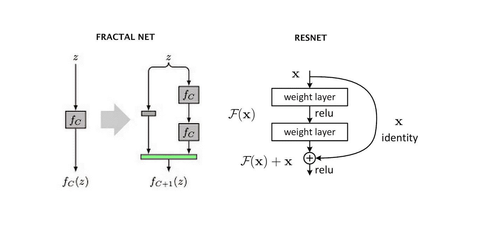

不管这些网络的架构设计如何，它们都试图为信息在初始层和最终层之间的流动创建通道。出于同样的目的，DenseNets 在网络的各层之间创建路径。

# 相关作品

*   高速公路网络(使更深层次模型的训练变得容易的最初尝试之一)
*   ResNet(通过使用标识映射求和来绕过连接)
*   随机深度(在训练期间随机丢弃层)
*   GoogLeNet(初始模块——增加网络宽度)
*   分形网络
*   网络中的网络
*   深度监督网络
*   梯形网络
*   深度融合网络

# 密集连接

根据网络的前馈特性，密集块中的每一层都从所有前面的层接收要素地图，并将其输出传递给所有后面的层。从其他层接收的特征地图通过**连接**进行融合，而不是通过求和(如在 ResNets 中)。

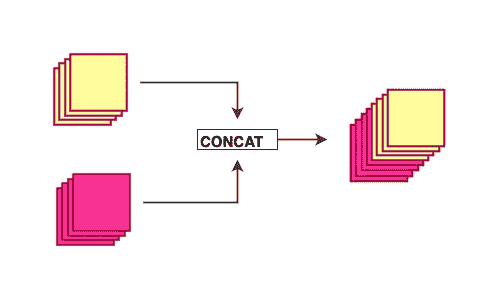

Concatenation of feature maps

这些连接形成了密集的路径回路，让**有更好的梯度流动**。

Dense connections

> 每一层都可以直接访问损失函数的梯度和原始输入信号。

由于这些密集的连接，该模型需要更少的层，因为不需要学习冗余的特征地图，允许重复使用**集体知识**(由网络集体学习的特征)。所提出的架构具有窄层，其为低至 12 个通道特征图提供了最先进的结果。更少更窄的层意味着模型需要学习的参数更少，更容易训练。作者还谈到了作为串联特征图结果的层输入变化的重要性，这防止了模型过度拟合训练数据。

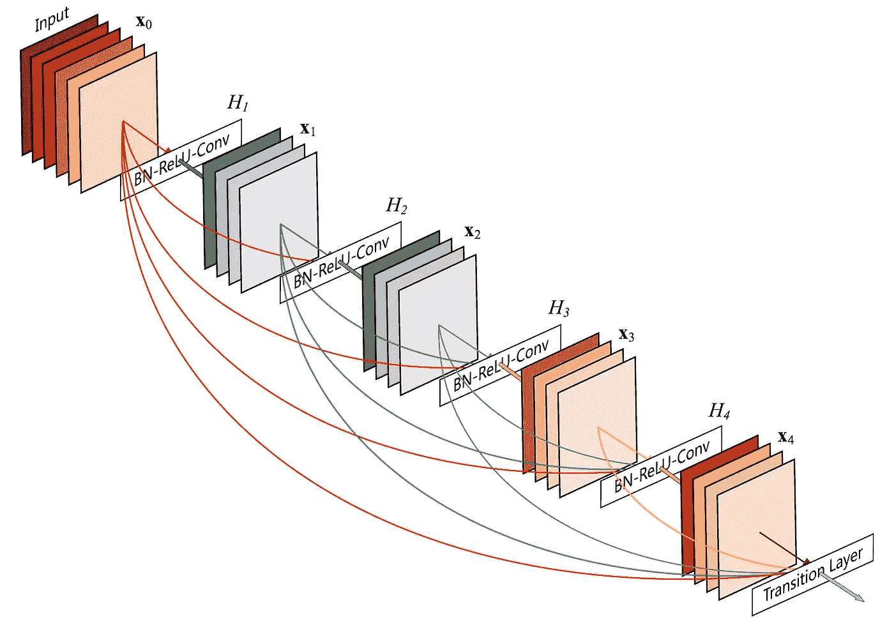

DenseNet 模型的许多变体已经在论文中提出。我选择用他们的标准网络(DenseNet-121)来解释这些概念。

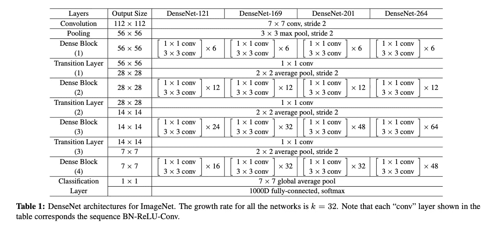

Some of the variants of the DenseNet architecture

# 复合函数

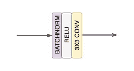

Composite function

*论文(和博客)中网络表述的每个 CONV 块对应于一个操作—

**BatchNorm→ReLU→Conv***

# 密集块

密集连接的概念已经在密集块中描述。一个密集块包括 *n* 个密集层。这些密集层使用密集电路连接，使得每个密集层接收来自所有先前层的特征地图，并将其特征地图传递给所有后续层。特征的尺寸(宽度、高度)在密集块中保持不变。

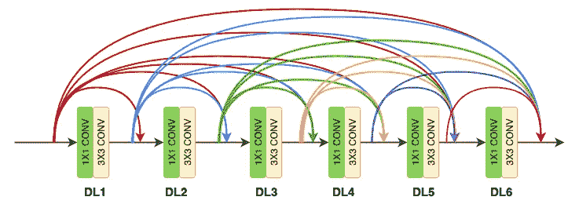

**Dense block (DB) with six Dense Layers (DL)**

# 致密层

每个密集层由两个卷积运算组成

*   **1×1 CONV**(用于提取特征的常规 conv 操作)
*   **3 X 3 CONV** (降低特征深度/通道数)

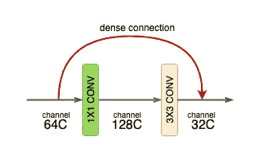

**Dense layer of DB-1**

DenseNet-121 在致密块中包含 6 个这样的致密层。每个致密层的输出深度等于致密块体的生长速度。

# 增长率(k)

这是一个你会在报纸上经常遇到的术语。基本上就是一个密集层输出的通道数( *1x1 conv → 3x3 conv* )。作者在实验中使用了一个值 *k = 32* 。这意味着密集层( *l* )从前一密集层( *l-1* )接收的特征数量是 32。这被称为增长率，因为在每一层之后，32 个通道特征被连接并作为输入馈送到下一层。

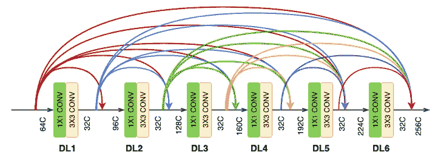

Dense block with channel count (C) of features entering and exiting the layers

# 转变层

在每个密集块的末尾，特征图的数量累积到一个值— *输入特征+(密集层数 x 增长率)。*因此，对于进入增长率为 32 的 6 个密集层的密集块的 64 个通道特征，在块的末端累积的通道数将是—
64+(6×32)= 256。为了减少这个通道数，在两个密集块之间增加了一个**过渡层**(或块)。过渡层包括-

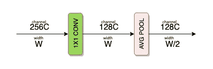

**Transition layer/block**

*   **1 X 1 CONV** 操作
*   **2×2 AVG 池**操作

**1 X 1 CONV** 操作将通道数减半。
**2 X 2 AVG 池**图层负责根据宽度和高度对特征进行下采样。

# 全网络

从下图中可以看出，作者为三个密集区块中的每一个选择了不同数量的密集层。

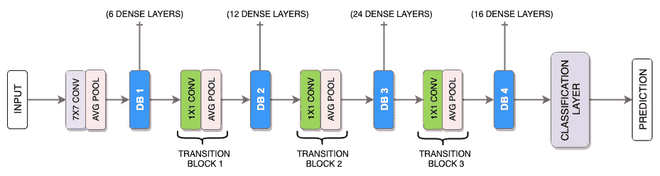

**Full DenseNet architecture**

# 与 DenseNet 的比较

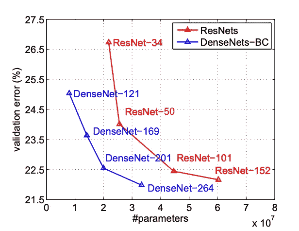

ResNet DenseNet comparison

我们可以看到，即使参数数量减少，DenseNet 模型的验证误差也比参数数量相同的 ResNet 模型低得多。这些实验是在具有更适合 ResNet 的超参数的两个模型上进行的。作者声称，DenseNet 在广泛的超参数搜索后会表现得更好。

> 具有 20M 参数的 DenseNet-201 模型与具有超过 40M 参数的 101 层 ResNet 产生类似的验证误差。

# 检查代码

我相信仔细阅读代码会更容易理解这种架构的实现。研究论文(在深度学习的背景下)可能很难理解，因为它们更多地是关于驱动神经网络设计决策的因素。检查代码(通常是网络/模型代码)可以降低这种复杂性，因为有时我们感兴趣的只是实现。有些人喜欢先看到实现，然后试图找出网络设计决策背后的原因。不管怎样，在之前或之后阅读代码总是有帮助的。

DenseNet 实现的代码可以在这里找到。由于我对 PyTorch 更熟悉，我将试着解释这个模型的 PyTorch 实现，它可以在[这里](https://github.com/gpleiss/efficient_densenet_pytorch)找到。最重要的文件是 **models/densenet.py** ，它保存了 densenet 的网络架构。

代码被分成这些类，其中每种类型的块由一个类表示。

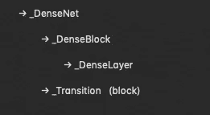

Class hierarchy in code

# 致密层

**_DenseLayer** 类可用于初始化密集层的组成操作——

**巴特诺姆→雷卢→ Conv (1X1) →巴特诺姆→雷卢→ Conv (3X3)**

**_bn_function_factory()** 函数负责将前几层的输出连接到当前层。

# **DenseBlock**

_ **DenseBlock** 类包含一定数量的**_ dense layer**(*num _ layers*)。
该类由 **DenseNet** 类初始化，取决于网络中使用的密集块的数量。

# 过渡块

# **DenseNet**

由于这部分代码有点太大，不适合写在这篇博客里，所以我将只使用一部分代码，这将有助于理解网络的要点。

我在网上找到了这张图片，它帮助我更好地理解了网络。

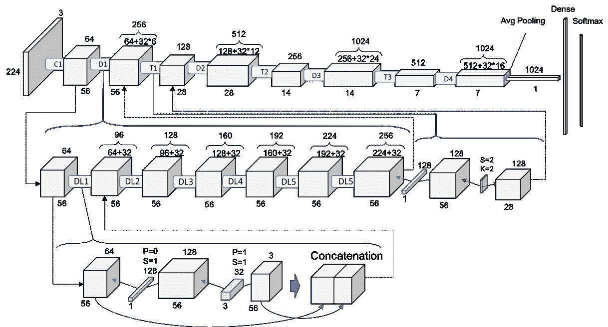

[Source](/understanding-and-visualizing-densenets-7f688092391a)

# 受本文启发的其他作品

*   [图像超分辨率残差密集网络](https://arxiv.org/abs/1802.08797) (2018)

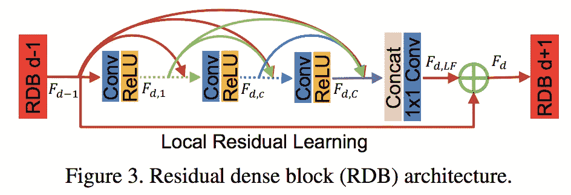

*   [用于图形到序列学习的密集连接图形卷积网络](http://www.statnlp.org/research/lg/zhijiang_zhangyan19tacl-gcn.pdf) (2019)

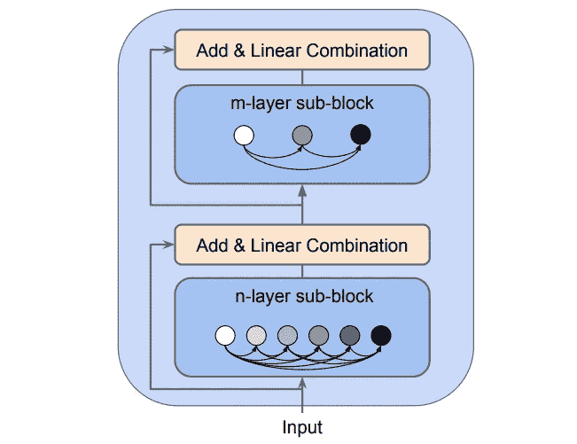

# 结论

DenseNet 是一个网络，它描述了在使用密集块的网络中拥有密集连接的重要性。这有助于特征重用、更好的梯度流、减少的参数计数和跨网络更好的特征传输。这样的实现可以帮助使用更少的计算资源和更好的结果来训练更深的网络。

为了了解更多关于机器学习和数据科学领域的信息，请查看并订阅[深度神经笔记本播客](https://www.youtube.com/channel/UC66w1T4oMv66Jn1LR5CW2yg)，在这里，我采访了专家和从业者，了解他们的专业状态、他们迄今为止的旅程以及未来的道路。

也可以在所有主要的播客流媒体平台上使用，包括 [**苹果播客**](https://podcasts.apple.com/in/podcast/deep-neural-notebooks/id1488705711) 、 [**Spotify**](https://open.spotify.com/show/2eq1jD7V5K19aZUUJnIz5z) 和 [**谷歌播客**](https://podcasts.google.com/?feed=aHR0cHM6Ly9hbmNob3IuZm0vcy8xMDZkYzIzOC9wb2RjYXN0L3Jzcw&episode=aHR0cHM6Ly9hbmNob3IuZm0vZGVlcC1uZXVyYWwtbm90ZWJvb2tzL2VwaXNvZGVzL0tub3dsZWRnZS0tVGVjaC0tTGVhZGVyc2hpcC0tS25vd2xlZGdlV2hhcnRvbi0tSW50ZXJ2aWV3LXdpdGgtTXVrdWwtUGFuZHlhLWVicXM0aw&ved=0CAIQkfYCahcKEwjQx9n87bDoAhUAAAAAHQAAAAAQAQ) 。