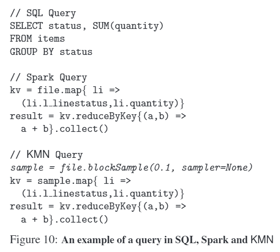
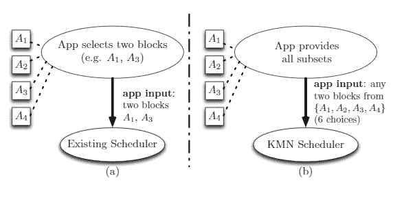
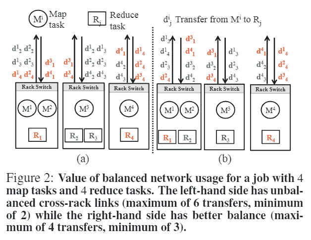

# 论文综述:数据感知集群调度中选择的力量

> 原文：<https://towardsdatascience.com/paper-review-the-power-of-choice-in-data-aware-cluster-scheduling-7292b13e10f5?source=collection_archive---------18----------------------->

在本帖中，我们将介绍一个名为 [KMN](https://www.usenix.org/system/files/conference/osdi14/osdi14-paper-venkataraman.pdf) 的调度器，该调度器旨在解决 Spark 或 MapReduce 等分布式计算框架中 I/O 密集型任务的调度问题。这个调度器不同于我们之前讨论的调度器，因为它强调数据感知调度，我们将在本文中讨论。

**背景**

在当今的批处理计算框架中，如 Hadoop 和 Spark，它们为每个构建成 DAG(有向无环图)依赖图的作业运行许多阶段和任务。如果我们假设这些任务中有很大一部分是 I/O 密集型的，那么调度器的任务就是尽量减少任务读取数据的时间。然而，在大型多租户集群中，具有数据局部性的完美节点可能经常不可用。

今天的数据应用程序和算法也可以选择只选择源数据的子集来逼近答案，而不是需要完整的数据集。

Spark & MapReduce 框架通常有读取源数据的输入任务和将数据从输入任务转发到进一步处理的中间任务。对于任务调度器，它可以为输入任务优化的是尝试将任务放置在更靠近源数据的地方(位置)。对于中间任务，调度程序将进行优化，以最小化来自输入任务的网络传输。集群内网络带宽的一个主要瓶颈是跨机架链接饱和。作者模拟了使用过去的脸书跟踪实现网络争用和数据局部性的情况，并估计性能提高了 87.6%。

**KMN 调度**

KMN 调度器在 Spark 中实现，它提供了一个应用程序接口，允许用户选择查询将选择的输入数据比率(1–100%)。

KMN 调度程序将基于所有可用的 N 个输入和局部性选择，选择在具有内存局部性的 K 个可用块的随机样本上启动输入任务(一对一传输)。

对于进行多对一传输的中间任务，作者发现的主要见解是，避免跨机架网络带宽偏斜的关键是允许启动 K 个以上的输入任务(M 个任务)，因为这允许从下游任务传输数据的更多选择，从而可以避免偏斜。虽然找到任务的最佳机架位置是一个 NP-hard 问题，但作者建议，在他们的设置中，要么使用最适合小型任务的贪婪搜索，要么使用大型任务的循环调度的变体。

这里一个重要的决定当然是我们应该启动多少额外的任务。过多的任务将导致更长的作业等待时间(也考虑到掉队者)，但是过少的额外任务可能会导致网络不平衡问题。找到平衡点可以让你最大化两者之间的平衡。这里的一个策略是，调度程序可以决定在启动下游任务之前，等待上游任务启动和完成的时间，因此当您遇到掉队的任务时，您不必等待样本中的所有任务都完成。

**思绪**

当我与几家运营大型本地集群的公司聊天时，跨机架网络拥塞仍然是一个现实问题。虽然随着时间的推移，数据位置的重要性正在降低，这使得云中的[速度更快](https://aws.amazon.com/blogs/aws/the-floodgates-are-open-increased-network-bandwidth-for-ec2-instances/)，但我认为跨 AZ 和网络拥塞仍然是我看到的公司在云中经常遇到的问题。

当然，我们可以看到，在制定任务和分布决策时，所有分布式数据框架都开始意识到集群资源瓶颈。