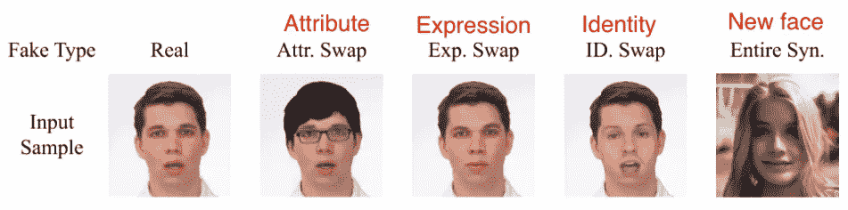
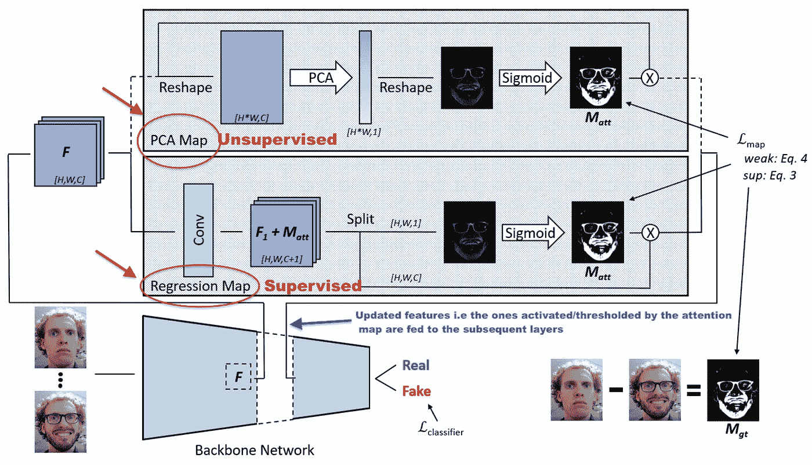
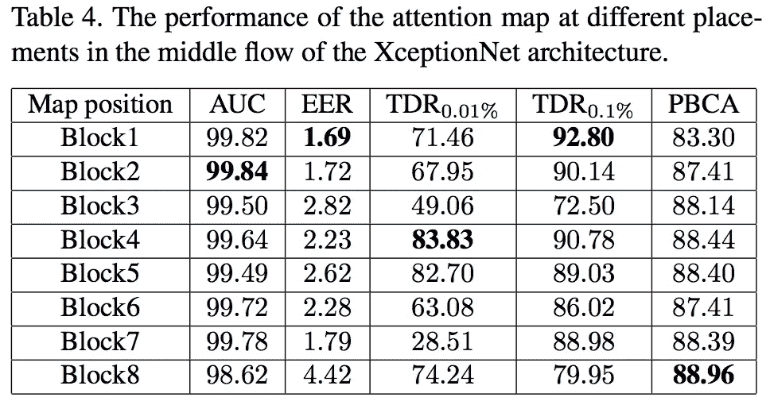

# 【反欺骗】关于检测数字人脸操纵

> 原文：<https://towardsdatascience.com/paper-summary-on-the-detection-of-digital-face-manipulation-5127e184f81?source=collection_archive---------44----------------------->

Photo by [Claudia Ramírez](https://unsplash.com/@makuph?utm_source=unsplash&utm_medium=referral&utm_content=creditCopyText) on [Unsplash](https://unsplash.com/s/photos/face-spoof?utm_source=unsplash&utm_medium=referral&utm_content=creditCopyText)

# 解决的问题

使人脸识别成为现实的技术(即机器学习)也使攻击者有可能欺骗它。使用先进的合成人脸生成和处理方法，更复杂类型的攻击正在被创造出来。

大致来说，假面攻击分为三类:

*   物理欺骗
*   对抗性的面部攻击
*   数字操纵攻击

本文仅针对第三类攻击，即 ***数字操纵攻击*** 。这种攻击类型被进一步分为四个子类别，如下图所示。

Extracted from the paper and annotated by me for clarification of types

这里的目的是不仅要确定输入图像是真实的还是伪造的，而且要定位图像被操纵的部分。

> 定位图像的虚假部分的好处是有助于算法的可解释性，从而(潜在地)理解操纵的类型、幅度和意图。

# 现有技术及其局限性

到目前为止，数字图像操作的检测已经使用两种方法完成— **图像分割&重复应用利用滑动窗口的二进制分类器。**这两种类型都主要依赖于需要额外监督的多任务学习。

该论文认为，上述两种方法都没有“直接”提高最终的图像分类性能。

# 关键见解

论文为利用**注意力图**解决检测(分类)&定位的任务提供了坚实的案例。

**那么注意力地图是什么意思呢？将“注意力”的概念理解为“焦点”。当我们人类看一幅画或一个场景时，我们通过观察某些特定的线索来形成对它的看法。这些线索，无论多么微小，常常告诉我们整个故事，更重要的是，通过忽略不相关的方面，帮助我们快速做出决定。**

请看这张狗的图片。这里的线索显示在边界框中。如果我们没有这些，那么就不可能确定它是狗还是人。

阅读本文[https://lilian Weng . github . io/lil-log/2018/06/24/attention-attention . html](https://lilianweng.github.io/lil-log/2018/06/24/attention-attention.html)对神经网络中所有“注意”的事物进行深入的处理。

该论文认为，图像处理通常只在某些部分进行，如果我们能够只关注(注意)这些部分，我们最终可能会提高最终的分类性能。

> 他们假设，与人们可以从数字图像的高频信息中留下的“指纹”来确定相机型号的事实非常相似，对部分图像的处理提供了检测其高频信息中的异常(由于算法处理)的机会。

简而言之，这项任务归结为找到描述这些异常的图像碎片。找到这些补丁的行为也导致了本地化属性。

# 主要贡献

*   一种新的提高分类性能的注意层&产生指示被操作脸部的注意图
*   一个全面的假脸数据集包括由不同的人脸修改方法生成的 0.8M 真实人脸和 1.8M 假脸，以及伴随的评估协议。
*   一种新的度量，称为逆交集非包容(IINC)，用于评估注意力图，产生比现有度量更一致的评估
*   与强基线网络相比，人脸操作检测的最新性能。

# 它是如何工作的？

现在应该很明显，主要目标是学习生成所需注意力地图的过滤器。本文考虑了标签数据(假零件与真实图像)甚至不可用的可能性，因此提供了两种主要方法。

两种方法是:

*   自我注意 PCA(主成分分析)投影。这将用于无监督(即标记数据不可用)设置。由于其本质，这是一个无参数的方法。
*   方向回归。他们在前一个卷积层中增加一个通道，以生成大小为 F ∈ R B×H×W×(C+1)的特征图。f 可以拆分成 F1 ∈ R B×H×W×C 和 Matt ∈ R B×H×W×1。具有 sigmoid 函数的最后一个通道用作注意图

Extracted from paper and then annotated by me

对于任一类型的方法(PCA 或回归),它们应用 sigmoid 激活函数，然后执行与输入特征(F)的逐通道乘法，并将仅由输入特征的激活/阈值化部分组成的结果提供给后续层。

他们将注意力地图生成(PCA 或回归)、sigmoid 操作和通道乘法封装为一个层，并将其称为**基于注意力的层，从而使设置非常模块化。**

对于基于直接回归的方法，即监督方法，如果基础事实注意力图可用，他们在他们制定的指标上实现最佳准确性(参见上面的主要贡献部分)。否则，PCA 是更好的方法。

**那么我们应该在哪里插入这一层呢？**作者通过在基于 XceptionNet 的主干的不同位置注射注意力基础层进行了广泛的消融研究。他们的结果表明，不同的放置选项有利于不同的准确性指标(如下表所示)

Extracted from the paper

上述结果表明，在早期层之后插入导致较低的 EER，而后期放置提高了分类精度。他们的结论是，中间位置(第 4 块之后)在所有指标上都表现出强劲的性能，没有明显的下降。

**这个关注层是 XceptionNet 特有的吗？没有。作者将它与 VGG16 和一个定制的网络主干一起使用。在所有 3 个案例中，注意层的插入提高了错误检测的准确性。不过，层次的放置和注意力地图方法的使用(PCA 或回归)似乎确实与主干的类型有一些联系。**

# 各种链接和详细信息

## 论文有开源实现吗？

号码

## 这篇论文是在一次会议上发表的吗？

没有。预印本可以在这里找到【https://arxiv.org/pdf/1910.01717.pdf 

## 有解释论文的视频吗？

号码

# 我的观点、问题和要点

*   由于注意力地图的概念(本文使用的主要技术)，我可以理解如何处理以下类别的图像部分——属性、表情和身份交换，但它在第四类(图像完全是合成的)中的应用不太清楚。请注意，他们也确实在这些合成图像上测试了他们的实验，也就是说，他们没有忽略它们，但是对我来说，注意力地图在这一类别上的应用并没有被很好地理解。
*   独特的，聪明的和智能的使用视觉注意力的假货检测问题。
*   我特别喜欢将它模块化的方法，并欣赏对可解释性方面的关注。
*   我对他们创造的度量标准“逆交集非包容(IINC)”没有太多关注，所以请阅读该论文以了解详细信息。
*   最后，该论文非常全面，可读性强，并对许多消融研究进行了尽职调查。

希望你喜欢这个摘要，我可能误解/曲解了论文的某些部分，因此，如果有的话，错误是我的，而不是原论文作者的。