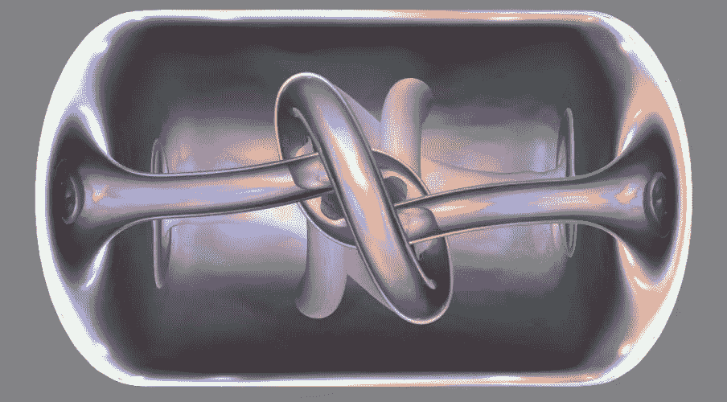
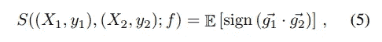
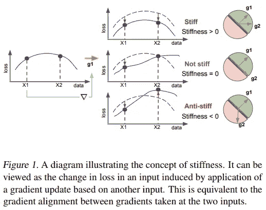
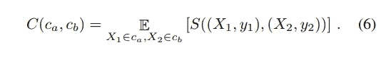
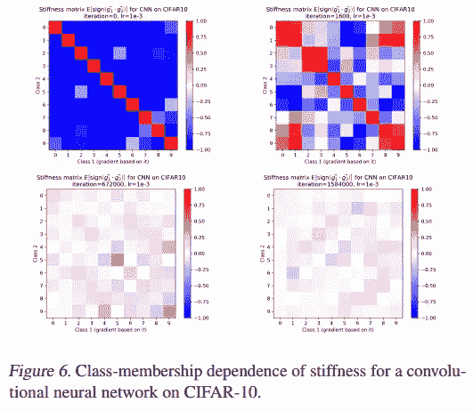
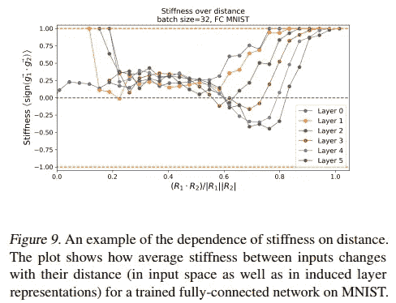
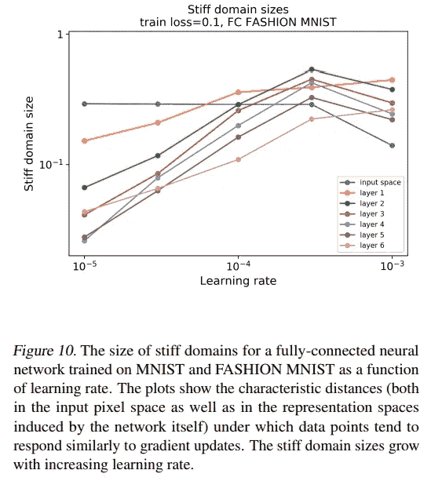

# 论文总结。刚度:神经网络泛化的新视角

> 原文：<https://towardsdatascience.com/paper-summary-stiffness-a-new-perspective-on-generalization-in-neural-networks-25f4995eb317?source=collection_archive---------23----------------------->

[Source](http://alpha.math.uga.edu/~topology/2001/index.html)

这是对[刚度的总结:神经网络泛化的新视角](https://arxiv.org/pdf/1901.09491.pdf) (01/2019)。

# 僵硬？

本文旨在从*刚度*的角度提高我们对神经网络如何泛化的理解。刚度背后的直觉是一个点上的梯度更新如何影响另一个点:

> *【它】描述了由于基于其中一个应用梯度更新而导致的两个损失变化之间的相关量。(4.1、结果和讨论)*

刚度表示为梯度的预期符号`g`:

改善 X1 和 X2 损失的权重更新是刚性的，如果损失有益于其中一个点而无助于另一个点，则该权重更新被描述为反刚性的。

现在的问题是我们如何选择 X1 和 X2。作者探索了两种方法:按类成员或按距离。

# 基于类成员的刚度

我们可以看看 A 类中一个点的梯度更新如何影响属于 b 类的另一个点的损失。在本文中，他们制作了一个*类刚度矩阵`，这是按类分组的每个点之间的平均刚度:

该矩阵的对角线表示模型的类内泛化能力。你可以在训练阶段的不同阶段找到一个刚度等级矩阵的例子:

在早期阶段，同一类成员之间的刚度较高(因此出现红色对角线)。大多数单元提高它们的刚度，直到达到过度拟合点:刚度达到 0。

# 刚度作为距离和学习率的函数

然后通过距离透镜研究刚度，它们区分两种距离:像素方向(在输入空间)和层方向(在表示空间)。

> *图 9 中可见的一般模式是存在一个临界距离，在该距离内，输入数据点倾向于在梯度更新下一起移动，即具有正刚度。这适用于网络中的所有层，更深的层倾向于具有更小的硬磁畴尺寸。*

作者将刚性区域定义为“当应用梯度更新时一起移动的数据空间区域”。

我们可以看到，较高的学习率增加了僵硬区域的大小，这表明较高的学习率有助于泛化。

# tldr

*   硬度量化了一组点上梯度更新对另一组点的影响程度
*   僵硬与概括紧密相连
*   当系统过度拟合时，刚度趋于 0
*   更高的学习率增加了点一起移动的区域

补充资源:

*   流形混合:通过内插隐藏状态更好的表现——[https://arxiv.org/abs/1806.05236](https://arxiv.org/abs/1806.05236)(文章引用)

*原载于 data-soup.github.io/blog/*