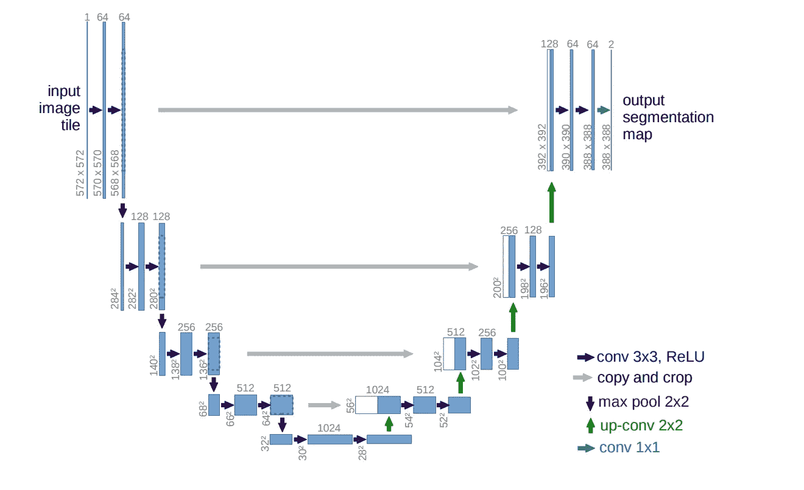
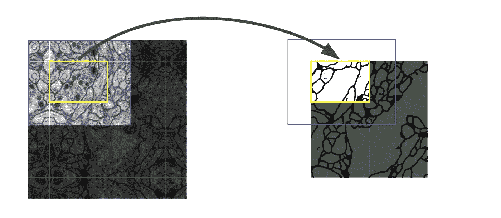

# 论文摘要:U-Net:生物医学图像分割的卷积网络

> 原文：<https://towardsdatascience.com/paper-summary-u-net-convolutional-networks-for-biomedical-image-segmentation-13f4851ccc5e?source=collection_archive---------12----------------------->

U-nets 在医学成像中产生了更好的图像分割。 [U-Net:卷积网络用于生物医学图像分割](https://arxiv.org/abs/1505.04597)论文发表于 2015 年。

## 问题

人们普遍认为，深度网络的成功训练需要成千上万个带注释的训练样本。该论文提出了一个网络和训练策略，该策略依赖于对数据扩充的大量使用，以更有效地使用可用的带注释的样本。

卷积网络的典型应用是分类任务，其中图像的输出是单个类别标签。然而，在许多视觉任务中，特别是在生物医学图像处理中，期望的输出应该包括**定位**，即应该给每个像素分配一个类别标签。此外，成千上万的训练图像通常在生物医学任务中是遥不可及的。

## 解决办法

U-Net 架构建立在完全卷积网络的基础上，并在某种程度上进行修改，以便在医学成像中产生更好的分割。该论文通过对可用的训练图像应用弹性变形来使用过度的数据扩充。这允许网络学习对这种变形的不变性，而不需要在带注释的图像语料库中看到这些变换。

## 体系结构

u-net 由两部分组成:编码器/压缩路径(左侧)和解码器/扩展路径(右侧)。

**收缩路径**由一个 3×3 卷积(无填充)的重复应用组成，每个卷积之后是一个 ReLU 和一个 2×2 最大合并操作，步长为 2，用于下采样。在每个下采样步骤中，我们将特征通道的数量增加一倍。这通过一个紧凑的特征图捕获了**上下文**。

**扩展路径**包括特征图的上采样，随后是将特征通道数量减半的 2x2 卷积(“上卷积”)，与来自收缩路径的裁剪后的特征图的级联，以及 3x3 卷积，随后是 ReLU。完成特征维度的上采样以满足与左侧要连接的块相同的大小。

扩展增加了“什么”,这有助于获得更多的特征，但是丢失了本地化，本地化信息是从收缩路径连接的。

由于每次卷积都会丢失边界像素，因此裁剪是必要的。在最后一层，使用 1x1 卷积将每个 64 分量的特征向量映射到期望数量的类别。在这种情况下，它是 2，因为输出特征地图有 2 个类；细胞和细胞膜。

## 本文的主要贡献在于

**a .重叠平铺策略**

黄色区域中分割的预测需要蓝色区域中的图像数据作为输入。缺失的输入数据通过镜像进行外推，这用于预测图像边界区域中的像素。

b .通过对训练图像应用弹性变形来进行数据扩充。

这允许网络学习对这种变形的不变性，而不需要在带注释的图像语料库中看到这些变换。这在生物医学分割中是重要的，因为变形是组织中最常见的变化，并且可以有效地模拟真实的变形。

**c .同类相触物体的分离。**

这是使用加权损失来完成的，其中在接触的细胞之间的分离背景标签在损失函数中获得大的权重。这迫使网络学习接触细胞之间的小分隔边界**。**

## 这种贡献的真实世界应用

成千上万的训练图像在生物医学任务中是遥不可及的，需要专家和花费大量时间来注释。这可以使过程自动化，从而降低成本和注释时间。

这也可以应用于其他领域，如质量控制、检验和制造。

本文将该技术应用于电镜记录的神经元结构分割、光镜图像的细胞分割和微分干涉显微镜记录的 HeLa 细胞。

## 参考

*[1]罗内贝格，o .，菲舍尔，p .，&布罗克斯，T. (2015，10 月)。生物医学图像分割的卷积网络。*

感谢阅读！*跟随*[*@ itsmuriuki*](https://twitter.com/itsmuriuki)*。*

回归学习！