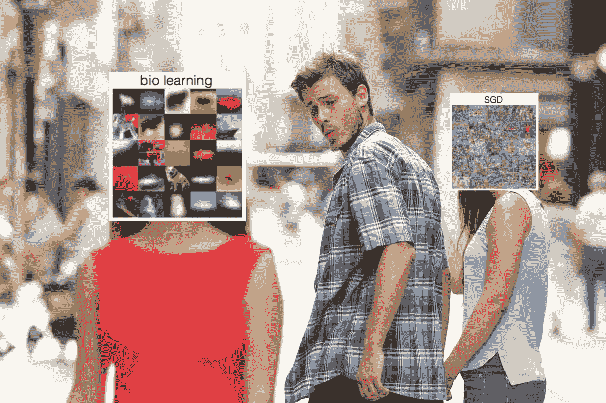
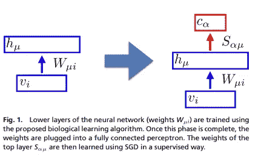
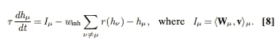
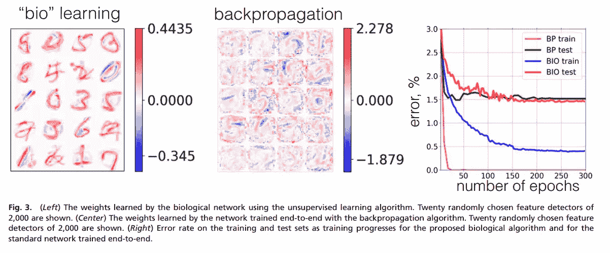
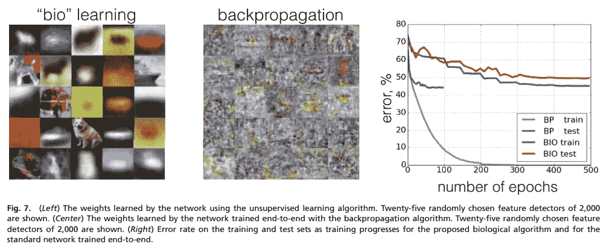

# 论文总结。竞争隐藏单元的无监督学习

> 原文：<https://towardsdatascience.com/paper-summary-unsupervised-learning-by-competing-hidden-units-ac74bc6d8b4a?source=collection_archive---------32----------------------->

## [竞争隐单元无监督学习综述](https://www.pnas.org/content/pnas/116/16/7723.full.pdf)。

This gem was found in [twitter.com/evolvingstuff/status/1012517941030502401](https://twitter.com/evolvingstuff/status/1012517941030502401)

关于作者:

*   麻省理工学院，IBM 公司，普林斯顿大学
*   [约翰·j·霍普菲尔德](http://pni.princeton.edu/john-hopfield)普林斯顿神经科学研究所

他们之前在同一篇论文中工作过[密集联想记忆对敌对的输入具有鲁棒性](https://arxiv.org/abs/1701.00939)。

介绍了一种新的无监督学习技术。(几乎)没有反向传播，模型也不是为特定任务而训练的。两位作者来自神经科学和计算机科学背景，他们的工作基于两项生物学观察:

1-突触变化是局部的:

> *在生物学中，突触更新取决于突触前细胞和突触后细胞的活动，或许还取决于一些全局变量，如任务执行得如何。(第 1 页)*

用反向传播训练的 A 和 B 之间的单元的权重不仅取决于 A 和 B 的活动，还取决于前一层的活动和训练标签。所以它不依赖于 A，B 的活动，而是依赖于网络中的其他神经元。这是受 [Hebb](https://en.wikipedia.org/wiki/Hebbian_theory) 的创意启发。

2-动物在没有标记数据和比用反向传播训练的神经网络更少的数据的情况下学习:

> *其次，高等动物需要丰富的感官经验，才能将早期的[…]视觉系统调整为成年系统。这种体验被认为主要是观察性的，很少或没有标签，因此没有明确的任务。(第 1 页)*

# 无监督的本地训练

作者成功地在 MNIST 和 CIFAR-10 上训练了他们的模型，只有前向传递，这意味着:—这项技术的计算要求较低，其计算复杂性与反向传播中前向传递的计算复杂性相当([来源](https://youtu.be/4lY-oAY0aQU?t=1581))。—不需要针对给定任务训练模型来根据数据进行有意义的表示。

Figure 01

蓝色的矩形是作者的“生物学习算法”。首先，数据通过它，没有任何标签或任何关于它将用于什么任务的指示。一旦被训练，一个完全连接的网络被附加到它的顶部，以便专门化模型并做出期望的预测。使用反向传播来训练该部分。

通常为了计算隐藏层`hμ`的活动，我们通过将输入`vi`乘以矩阵`Wμi`来将输入`vi`投影到隐藏层上，然后应用非线性。在这种新技术中，通过求解这个微分方程来计算`hμ`活动:

Equation 08

*   `μ`是我们要更新的隐藏层的索引
*   `τ`是流程的时间刻度
*   `Iμ`是输入电流
*   第二项，所有其他隐藏层的总和，引入了神经元之间的竞争。较强的单位会抑制较弱的单位。没有它，所有的神经元都会在输入信号出现时被激活。注意，该术语引入了单元之间的横向连接，因为同一层内的单元可以彼此连接。
*   `r`是一个 ReLU，`winh`是一个超参数常数。

由于训练是局部的，只需要向前传递，这种结构不同于自动编码器。

# 在活动

在一个关于 MNIST 和 CIFAR-10 的实验中，作者使用他们的生物技术训练了 2000 个隐藏单元来寻找矩阵`Wμi`:

*   隐藏单元用正态分布初始化
*   隐藏的单位被训练(同样，没有明确的任务或标签)
*   这些单元然后被冻结并连接到感知器上
*   使用 SGD 训练感知器权重

在下图最右边的图中可以看到 MNIST 的训练误差(BP 代表反向传播，BIO 代表提出的方法)。我们可以看到，尽管训练误差较高，但测试误差非常接近端到端训练的模型。

Figure 03

在 MNIST 上，我们可以看到，由提出的生物学习算法(左图)学习的特征不同于用反向传播(中图)训练的特征。

> *网络通过多个隐藏单元学习数据的分布式表示。然而，这种表示与由端到端训练的网络学习到的表示非常不同，这从图 3 的左侧和中间的比较中可以清楚地看出。*

类似地，对于 CIFAR-10:

Figure 07

# tldr

> *没有自上而下的信息传播，仅使用自下而上的信号学习突触权重，并且算法不知道网络最终必须在顶层解决的任务(第 8 页)*

*   一种新的无监督训练技术，其中没有定义任务，训练集通过模型进行训练，没有反向传播。一个完全连接的感知器被附加在上面，用反向传播进行训练，较低的无监督子模型被冻结。
*   这种技术在 MNIST 和 CIFAR 上显示出较差但接近艺术概括状态的性能。
*   没有向前/向后，每个单元都可能与其他单元相连，包括在它自己的层上。

补充资源:

*   麻省理工学院的一位作者的视频演示。
*   [Github](https://github.com/DimaKrotov/Biological_Learning/blob/master/Unsupervised_learning_algorithm_MNIST.ipynb) 进行繁殖。
*   [在 IBM 的博客上发表博文](https://www.ibm.com/blogs/research/2019/04/biological-algorithm/)。

*最初发表于*[data-soup.github.io/blog/](https://data-soup.github.io/blog/)