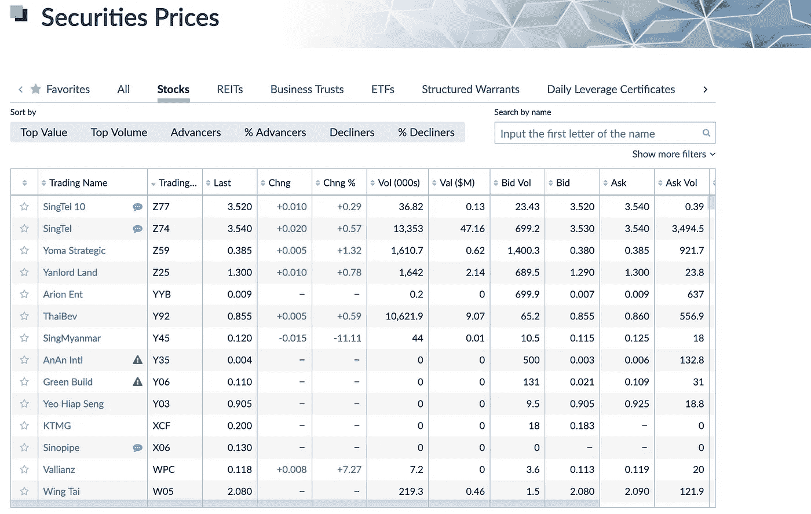
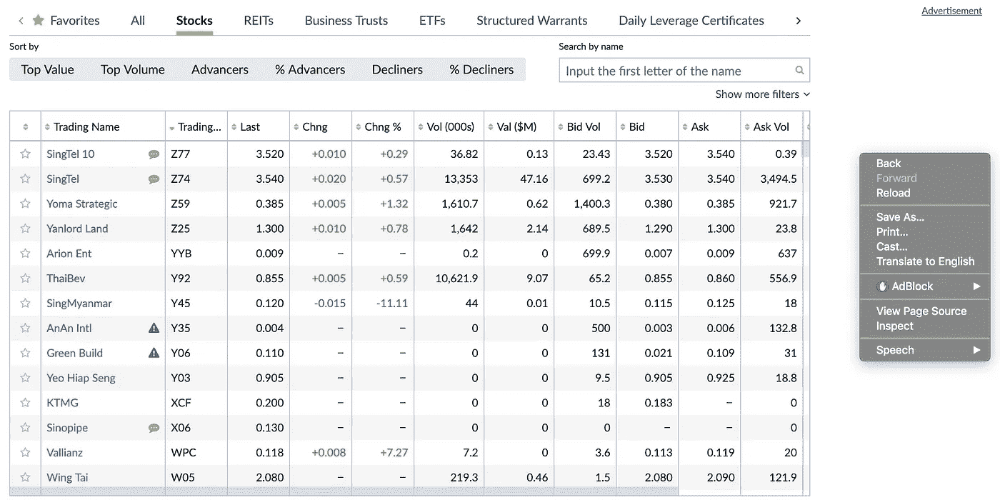
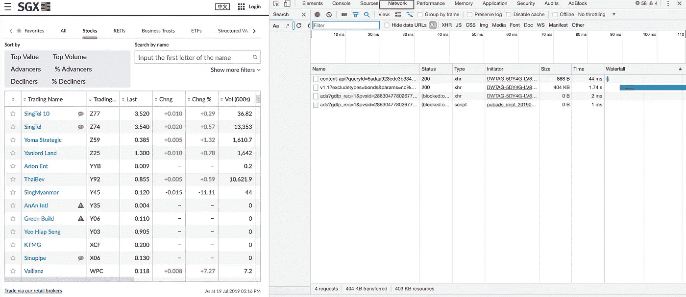
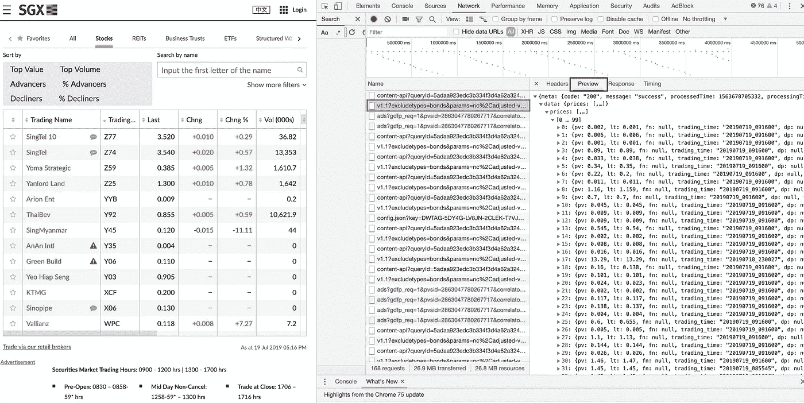
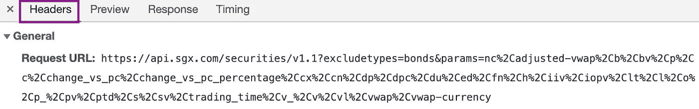
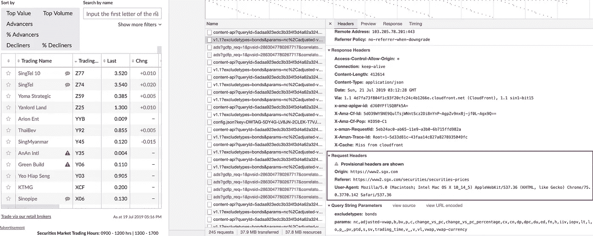
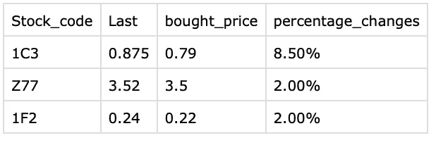

# 如何在 5 分钟内创建一个自动化的票据交易系统

> 原文：<https://towardsdatascience.com/paper-trading-get-rid-of-boring-stuff-using-python-part-1-914ab3b04724?source=collection_archive---------15----------------------->

## 5 秒钟搞定！

## **使用 Python 摆脱无聊的东西(第 1 部分)**


> 你厌倦了重复做同样的事情吗？
> 
> 感觉你的生活只是一遍又一遍的做着同样的事情？

事情是这样的，今天我要介绍一个工具来自动化你枯燥的东西——**Python。Python 可能是最容易学习的语言。因为你掌握了 Python 技能，你不仅能够提高你的生产力，还能专注于你更感兴趣的工作。**

**使用 Python 摆脱无聊的东西**是一个系列，所以点击这个[链接](https://towardsdatascience.com/tagged/getridboringstuff)查看整个系列！

我们开始吧！

我将用新加坡股票市场的**票据交易**来说明自动化是如何实现的。纸上交易可以让你在投入真钱之前练习用虚拟货币投资或交易。这是证明你的策略是否有效的好方法。

**这是我将要分享的议程:**

**第一部分** **—** 在文本文件中输入您想要交易的股票代码和数量。

**第 2 部分—** 如何独自完成网络抓取，全程。

第三部分— 整理数据并制成表格。

**第 4 部分** —将结果输出到 csv 或 excel 文件中。

跟随整个旅程，你会发现让你无聊的事情自动化并在 5 秒内更新你的价格是多么简单。

# 第 1 部分—在文本文件中输入您想要交易的股票代码和数量。

启动一个新的文本文件，输入股票代码和特定股票的买入价格，用逗号分隔。


selected.txt

启动一个新的文本文件，输入股票代码和特定股票的买入价格，用逗号分隔，如图所示

# **第二部分——如何自己进行网络抓取，全程**

这是 SGX 网站的快照。



Snapshot 1

我将举例说明如何抓取这个表中包含的所有交易信息。打开谷歌浏览器，右键点击网站，你将能够看到下面的快照。



Snapshot 2

点击 **inspect** 按钮，然后点击 network 选项卡(下图右上角突出显示的**紫色括号**)。



Snapshot 3

接下来，点击紫色框中突出显示的行，然后选择**预览**，如突出显示的绿色框所示，两者都显示在下面的快照 4 中。



Snapshot 4

所以你可以从预览中看到，所有的数据都包含在 JSON 格式中。接下来，单击快照 5 中的紫色框(标题)。



Snapshot 5

我现在正在做的是检查我应该放入什么元素来从这个页面抓取数据。从上面的快照 5 中，您将能够看到**请求 URL** ，这是您稍后需要放入请求部分的 URL。由于编码问题，请求 URL 中的“**% 2c”**将被编码为“**”。**如果您对编码感兴趣，请查看此[链接](http://www.greentea.markschwing1.com/unico.html?fbclid=IwAR2YXx1yEO1HKxL7YnSjN3k2ZLAU0kvLYti-fXgwJEyHzZ0B3Jm9RTC48mk)了解更多信息。

现在，让我们准备必要的信息，以便向服务器发送适当的请求。

第 1 部分请求 Url

把所有的 **"%2c"** 改成**"，"**之后，请求的 url 就会变成下面这个链接。

```
[https://api.sgx.com/securities/v1.1?excludetypes=bonds&params=nc,adjusted-vwap,b,bv,p,c,change_vs_pc,change_vs_pc_percentage,cx,cn,dp,dpc,du,ed,fn,h,iiv,iopv,lt,l,o,p_,pv,ptd,s,sv,trading_time,v_,v,vl,vwap,vwap-currency](https://api.sgx.com/securities/v1.1?excludetypes=bonds&params=nc,adjusted-vwap,b,bv,p,c,change_vs_pc,change_vs_pc_percentage,cx,cn,dp,dpc,du,ed,fn,h,iiv,iopv,lt,l,o,p_,pv,ptd,s,sv,trading_time,v_,v,vl,vwap,vwap-currency)
```

第 2 部分标题

请求头是网络数据包的一部分，由浏览器或客户端发送到服务器，以**请求**Web 服务器上的特定页面或数据。



Snapshot 6

参考快照 6 中的紫色框，这是当你抓取网站时应该放入的标题部分。

```
{"User-Agent": "Mozilla/5.0 (Windows NT 6.1; Win64; x64) AppleWebKit/537.36 (KHTML, like Gecko) Chrome/54.0.2840.71 Safari/537.36",
 "Origin": "[https://www2.sgx.com](https://www2.sgx.com)",
 "Referer": "[https://www2.sgx.com/securities/securities-prices](https://www2.sgx.com/securities/securities-prices)"}
```

现在让我们按照下面的要点把所有的东西放在一起。

# 第 3 部分—干净的数据


到目前为止，您将得到 **JSON** 格式的响应。我们将使用 [Python 熊猫库](https://pypi.org/project/pandas/)来清理数据。

首先，加载您之前填写的股票代码并清除它。

```
with open('selected.txt') as f:     
     selected_sc = f.readlines()  
selected_sc = [x.replace('\n', '') for x in selected_sc]
portfolio = {x.split(',')[0]: float(x.split(',')[1]) for x in selected_sc}
```

然后，将抓取的数据加载到 **JSON** 对象中，然后将其更改为 python pandas 对象。

```
data = json.loads(req.text)['data'] 
df = pd.DataFrame(data['prices']) 
```

接下来，重命名列名，使其更容易理解。

```
df = df.rename(
    columns={'b': 'Bid',                  
             'lt': 'Last',
             'bv': 'Bid_Volume',                  
             'c': 'Change',                  
             'sv': 'Ask_volume',                  
             'h': 'High',                  
             'l': 'Low',                  
             'o': 'open',                  
             'p': 'Change_percent',                  
             's': 'Ask',                  
             'vl': 'Volume',                  
             'nc': 'Stock_code'})
```

最后，过滤你想投资或交易的感兴趣的股票代码，然后计算差价。

```
df = df[df['Stock_code'].isin(portfolio.keys())][['Stock_code', 'Last']] df['bought_price'] = df['Stock_code'].map(portfolio) df['percentage_changes'] = (df['Last'] - df['bought_price'])*100 df['percentage_changes'] = df['percentage_changes'].apply(                                 lambda x: '{0:.2f}%'.format(x))
```

# **第 4 部分** —将结果输出到 csv 或 excel 文件中。

将数据保存到 csv 文件并🎉我们正式结束了！🎉

```
df.to_csv('reseult.csv', index=False)
```

下面是 csv 文件的快照:



完整的代码可以在[这里](https://github.com/M140042/sgx)找到。

**快乐编码！**

# 最终想法

我目前是一名数据科学家，我可以通知你的是，爬行仍然非常重要。

感谢你阅读这篇文章。欢迎在下面留下你感兴趣的话题的评论。我将会发布更多关于我的经历和项目的帖子。

# 关于作者

[低魏宏](https://www.linkedin.com/in/lowweihong/?source=post_page---------------------------)是 Shopee 的数据科学家。他的经验更多地涉及抓取网站、创建数据管道，以及实施机器学习模型来解决业务问题。

他提供爬行服务，能够为你提供你所需要的准确和干净的数据。你可以访问[这个网站](http://datainfinite.strikingly.com/?source=post_page---------------------------)查看他的作品集，也可以联系他获取抓取服务。

你可以在 [LinkedIn](https://www.linkedin.com/in/lowweihong/?source=post_page---------------------------) 和 [Medium](https://medium.com/@lowweihong?source=post_page---------------------------) 上和他联系。

[](https://medium.com/@lowweihong) [## ●伟鸿-中等

### 在媒体上阅读低纬鸿的作品。Shopee 的数据科学家。每天，低伟鸿和其他成千上万的…

medium.com](https://medium.com/@lowweihong)