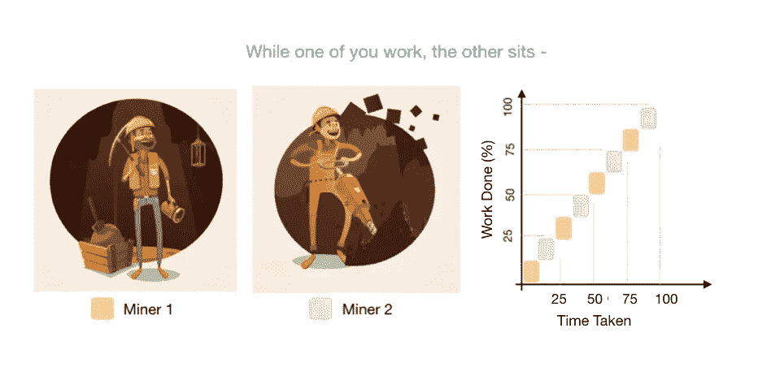
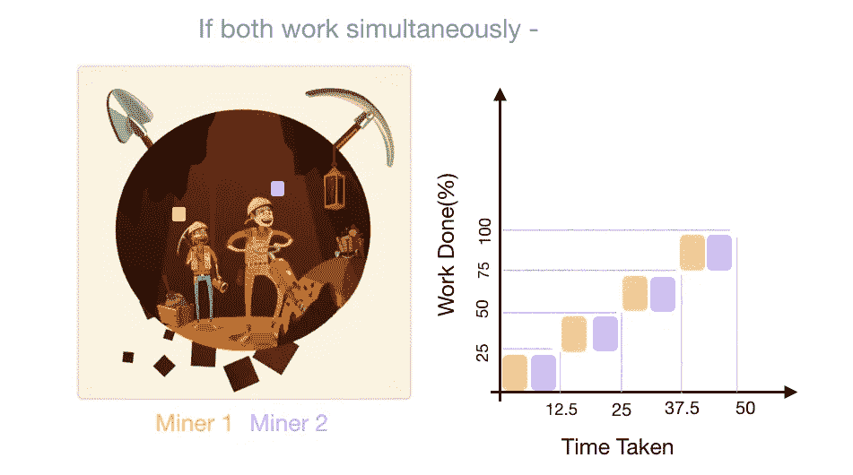
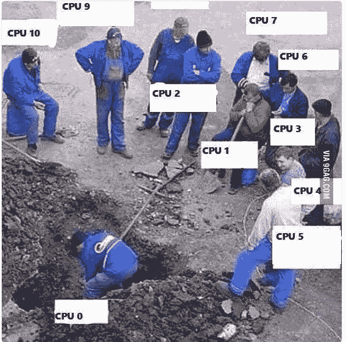

# 并行化您的 Python 代码

> 原文：<https://towardsdatascience.com/parallelising-your-python-code-85b59c558f97?source=collection_archive---------7----------------------->

Illustration designed by Macrovector / [Freepik](http://www.freepik.com)

卷入一个游戏存在中，你和你的朋友是 T2 矿工。是的，手里拿着黄帽子和铲子。任务-在一定时间内挖一个洞，以便能够提取一些闪闪发光的钻石！所以你的朋友建议你和他们 ***轮流*** 挖…

让我们说，你需要 100 分钟来完成这个任务时，做了转智。

Illustration designed by Macrovector / [Freepik](http://www.freepik.com)

但是，如果你们两个可以一起努力，同时完成工作-

Illustration designed by Macrovector / [Freepik](http://www.freepik.com)

这会导致-

*   更少的时间
*   效率更高
*   不浪费可用资源
*   少流汗！

同样的情况也发生在你的计算机上，连续给两个进程分配 CPU 时间基本上会让等待的进程*饿死*直到给定一个 CPU 周期，这是对可能使用的资源的浪费。

> **这篇文章是关于如何克服这个问题的。**

让我们*钻研*并行编程吧！

并行计算/编程本质上是组合使用≥ 2 个处理器/内核/计算机来解决单个问题。它是一种计算体系结构，其中几个处理器通过在处理器之间分配工作负载来同时进行计算。

## 如何让您的代码为您并行工作！

在 python 中，我们有一个由 GIL 领导的怪物——字面上叫做“GIL ”,它代表着“全局”。

*   它是一个互斥体{ [互斥](https://searchnetworking.techtarget.com/definition/mutex) }，保护同一个线程同时访问 Python 对象。
*   它还防止多个线程同时执行 Python 字节码。

> ‘多重处理’→我们的 GIL 救星！

python 中的多处理 [*包*](https://www.learnpython.org/en/Modules_and_Packages) 类似于线程*模块；“Pool”类是一个很好的例子，它提供了非常方便的方法来并行执行不同输入值的函数。*

Pool 类将允许我们创建一个进程/工作者池，它可以同时处理分配给它们的任务。例如，采用一个函数，假设我们将该函数的调用分布在所有/部分可用的内核/处理器上，每个处理器将负责我们处理的问题子集的一部分，我们可以有另一个函数来串行运行所有这些事情，并最终比较多处理如何有助于处理大量 IO 密集型计算。

>要检查 CPU 内核的数量，您可以使用以下命令:

**现在让我们得到 *cod-in***

简单地使用 for 循环遍历用户给定的所有值。

在下面的要点中，我们看到简单地将相同的函数传递给。“地图”方法使这一切变得轻而易举！

**注意** -在‘Pool()’中，一个可选的参数让我们定义我们希望程序使用的处理器数量，缺省值是最大值。

**还有另一个注意事项**——使用 [*这个*](https://gist.github.com/aananya27/4e871859c7cc90d9cd546c8859c2b245) 小代码查看可用的 CPU 数量

还有其他牛逼的映射方法，查看一下 python 中多处理包的官方文档*。*

***又一个无耻的注释**——你一定注意到了，在尝试上面的代码时，非并行执行对于少量的输入给出了更好的结果，而对于大量的输入， ***并行才是正确的选择*** ！*

*一定要测试一下这个，然后 [*评论*](https://twitter.com/aananya_27)——并行性在多少个值上比并发性表现得更好！*

*希望这是一个有趣的阅读足以让你*挖掘*到*金矿*的 ***多重处理*** ！！*

**

***就是这样！你很适合并行编程。如果您有任何问题，请随时向我发** [**推文。**](https://twitter.com/aananya_27)*

*[**关注我**](https://medium.com/@aananya_27) **随时更新我的帖子。祝您愉快！🎉***