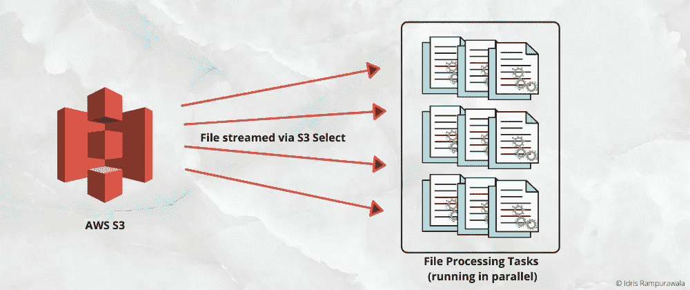
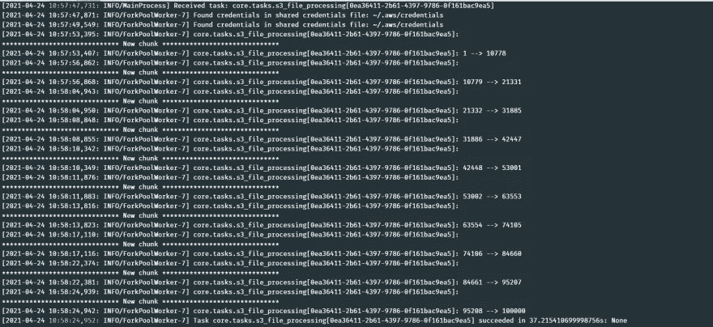
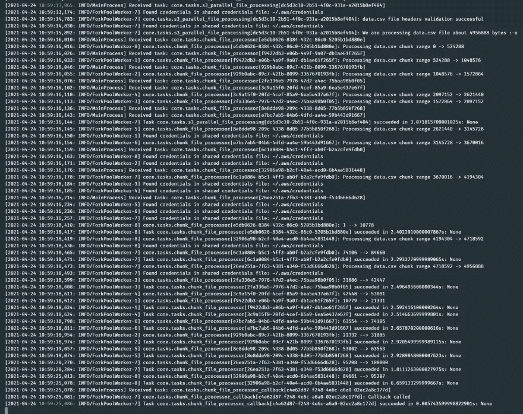

# 并行处理大型 AWS S3 文件

> 原文：<https://towardsdatascience.com/parallelize-processing-a-large-aws-s3-file-d43a580cea3?source=collection_archive---------19----------------------->

## 这篇文章展示了使用 AWS S3 选择将一个大的 AWS S3 文件(可能有数百万条记录)处理成可管理的并行块的方法



**Parallel Processing S3 File Workflow |** Image created by Author

在我的[上一篇文章](/efficiently-streaming-a-large-aws-s3-file-via-s3-select-85f7fbe22e46)中，我们讨论了通过 S3 选择来提高处理大型 AWS S3 文件的效率。处理过程有点顺序，对于一个大文件来说可能需要很长时间。那么，我们如何在多个单元之间并行处理呢？🤔嗯，在这篇文章中，我们将实现它，并看到它的工作！

📝*我强烈推荐通过 S3 查看我在* [*上的上一篇文章——选择*](/efficiently-streaming-a-large-aws-s3-file-via-s3-select-85f7fbe22e46) *来设置这篇文章的背景。*

我总是喜欢把一个问题分解成解决它所必需的小部分(分析方法)。让我们试着用三个简单的步骤来解决这个问题:

# 1.找出 S3 文件的总字节数

与我们上一篇文章的第一步非常相似，这里我们也尝试先找到文件大小。下面的代码片段展示了将对我们的 S3 文件执行 HEAD 请求并确定文件大小(以字节为单位)的函数。

```
# core/utils.py

def get_s3_file_size(bucket: str, key: str) -> int:
    """Gets the file size of S3 object by a HEAD request

    Args:
        bucket (str): S3 bucket
        key (str): S3 object path

    Returns:
        int: File size in bytes. Defaults to 0 if any error.
    """
    aws_profile = current_app.config.get('AWS_PROFILE_NAME')
    s3_client = boto3.session.Session(profile_name=aws_profile).client('s3')
    file_size = 0
    try:
        response = s3_client.head_object(Bucket=bucket, Key=key)
        if response:
            file_size = int(response.get('ResponseMetadata').get('HTTPHeaders').get('content-length'))
    except ClientError:
        logger.exception(f'Client error reading S3 file {bucket} : {key}')
    return file_size
```

# 2.创建一个芹菜任务来处理一个块

这里，我们将定义一个 celery 任务来处理一个文件块(稍后将并行执行)。这里的整个处理过程如下所示:

*   接收这个块的`start`和`end bytes`作为参数
*   通过 S3 获取 S3 文件的这一部分——选择并将其存储在本地的一个临时文件中(在本例中为 CSV)
*   读取这个临时文件并执行任何需要的处理
*   删除这个临时文件

📝我将这个任务称为文件块处理器。它处理文件中的一个块。运行多个这样的任务可以完成整个文件的处理。

```
# core/tasks.py

@celery.task(name='core.tasks.chunk_file_processor', bind=True)
def chunk_file_processor(self, **kwargs):
    """ Creates and process a single file chunk based on S3 Select ScanRange start and end bytes
    """
    bucket = kwargs.get('bucket')
    key = kwargs.get('key')
    filename = kwargs.get('filename')
    start_byte_range = kwargs.get('start_byte_range')
    end_byte_range = kwargs.get('end_byte_range')
    header_row_str = kwargs.get('header_row_str')
    local_file = filename.replace('.csv', f'.{start_byte_range}.csv')
    file_path = path.join(current_app.config.get('BASE_DIR'), 'temp', local_file)

    logger.info(f'Processing {filename} chunk range {start_byte_range} -> {end_byte_range}')
    try:
        # 1\. fetch data from S3 and store it in a file
        store_scrm_file_s3_content_in_local_file(
            bucket=bucket, key=key, file_path=file_path, start_range=start_byte_range,
            end_range=end_byte_range, delimiter=S3_FILE_DELIMITER, header_row=header_row_str)

        # 2\. Process the chunk file in temp folder
        id_set = set()
        with open(file_path) as csv_file:
            csv_reader = csv.DictReader(csv_file, delimiter=S3_FILE_DELIMITER)
            for row in csv_reader:
                # perform any other processing here
                id_set.add(int(row.get('id')))
        logger.info(f'{min(id_set)} --> {max(id_set)}')

        # 3\. delete local file
        if path.exists(file_path):
            unlink(file_path)
    except Exception:
        logger.exception(f'Error in file processor: {filename}')
```

# 3.并行执行多个 celery 任务

这是这个流程中最有趣的一步。我们将通过 [celery Group](https://docs.celeryproject.org/en/stable/userguide/canvas.html#groups) 创建多个并行运行的 Celery 任务。
一旦我们知道了 S3 中一个文件的总字节数(来自步骤 1)，我们就为这个块计算`start`和`end bytes`，并通过 celery 组调用我们在步骤 2 中创建的任务。`start`和`end bytes`范围是文件大小的连续范围。可选地，我们也可以在所有处理任务完成后调用回调(结果)任务。

```
# core/tasks.py

@celery.task(name='core.tasks.s3_parallel_file_processing', bind=True)
def s3_parallel_file_processing_task(self, **kwargs):
    """ Creates celery tasks to process chunks of file in parallel
    """
    bucket = kwargs.get('bucket')
    key = kwargs.get('key')
    try:
        filename = key
        # 1\. Check file headers for validity -> if failed, stop processing
        desired_row_headers = (
            'id',
            'name',
            'age',
            'latitude',
            'longitude',
            'monthly_income',
            'experienced'
        )
        is_headers_valid, header_row_str = validate_scrm_file_headers_via_s3_select(
            bucket=bucket,
            key=key,
            delimiter=S3_FILE_DELIMITER,
            desired_headers=desired_row_headers)
        if not is_headers_valid:
            logger.error(f'{filename} file headers validation failed')
            return False
        logger.info(f'{filename} file headers validation successful')

        # 2\. fetch file size via S3 HEAD
        file_size = get_s3_file_size(bucket=bucket, key=key)
        if not file_size:
            logger.error(f'{filename} file size invalid {file_size}')
            return False
        logger.info(f'We are processing {filename} file about {file_size} bytes :-o')

        # 2\. Create celery group tasks for chunk of this file size for parallel processing
        start_range = 0
        end_range = min(S3_FILE_PROCESSING_CHUNK_SIZE, file_size)
        tasks = []
        while start_range < file_size:
            tasks.append(
                chunk_file_processor.signature(
                    kwargs={
                        'bucket': bucket,
                        'key': key,
                        'filename': filename,
                        'start_byte_range': start_range,
                        'end_byte_range': end_range,
                        'header_row_str': header_row_str
                    }
                )
            )
            start_range = end_range
            end_range = end_range + min(S3_FILE_PROCESSING_CHUNK_SIZE, file_size - end_range)
        job = (group(tasks) | chunk_file_processor_callback.s(data={'filename': filename}))
        _ = job.apply_async()
    except Exception:
        logger.exception(f'Error processing file: {filename}')

@celery.task(name='core.tasks.chunk_file_processor_callback', bind=True, ignore_result=False)
def chunk_file_processor_callback(self, *args, **kwargs):
    """ Callback task called post chunk_file_processor()
    """
    logger.info('Callback called') # core/utils.py

def store_scrm_file_s3_content_in_local_file(bucket: str, key: str, file_path: str, start_range: int, end_range: int,
                                             delimiter: str, header_row: str):
    """Retrieves S3 file content via S3 Select ScanRange and store it in a local file.
       Make sure the header validation is done before calling this.

    Args:
        bucket (str): S3 bucket
        key (str): S3 key
        file_path (str): Local file path to store the contents
        start_range (int): Start range of ScanRange parameter of S3 Select
        end_range (int): End range of ScanRange parameter of S3 Select
        delimiter (str): S3 file delimiter
        header_row (str): Header row of the local file. This will be inserted as first line in local file.
    """
    aws_profile = current_app.config.get('AWS_PROFILE_NAME')
    s3_client = boto3.session.Session(profile_name=aws_profile).client('s3')
    expression = 'SELECT * FROM S3Object'
    try:
        response = s3_client.select_object_content(
            Bucket=bucket,
            Key=key,
            ExpressionType='SQL',
            Expression=expression,
            InputSerialization={
                'CSV': {
                    'FileHeaderInfo': 'USE',
                    'FieldDelimiter': delimiter,
                    'RecordDelimiter': '\n'
                }
            },
            OutputSerialization={
                'CSV': {
                    'FieldDelimiter': delimiter,
                    'RecordDelimiter': '\n',
                },
            },
            ScanRange={
                'Start': start_range,
                'End': end_range
            },
        )

        """
        select_object_content() response is an event stream that can be looped to concatenate the overall result set
        """
        f = open(file_path, 'wb')  # we receive data in bytes and hence opening file in bytes
        f.write(header_row.encode())
        f.write('\n'.encode())
        for event in response['Payload']:
            if records := event.get('Records'):
                f.write(records['Payload'])
        f.close()
    except ClientError:
        logger.exception(f'Client error reading S3 file {bucket} : {key}')
    except Exception:
        logger.exception(f'Error reading S3 file {bucket} : {key}')
```

就是这样！😎现在，我们不是一个字节一个字节地传输 S3 文件，而是通过并发处理数据块来实现并行处理。没那么难，不是吗？😅

📌您可以[查看我的 GitHub 库](https://github.com/idris-rampurawala/s3-select-demo)以获得这种方法的完整工作示例。

# 🔍比较处理时间

如果我们用这种方法比较我们在上一篇文章中处理的同一个文件的处理时间，处理速度大约比**快 68%**(使用相同的硬件和配置)。😆

```
╔═════════════════╦═══════════════════╦════════════════════════════╗
║                 ║ **Streaming S3 File** ║ **Parallel Processing S3 File**║
╠═════════════════╬═══════════════════╬════════════════════════════╣
║ **File size** ║ 4.8MB             ║ 4.8MB                      ║
║ **Processing time** ║ ~37 seconds       ║ ~12 seconds                ║
╚═════════════════╩═══════════════════╩════════════════════════════╝
```



**Streaming S3 File** **Logs** | Image by the Author



**Parallel Processing S3 File Logs |** Image by the Author

# ✔️这种方法的好处

*   包含数百万条记录的非常大的文件可以在几分钟内得到处理。我在生产环境中使用这种方法已经有一段时间了，它非常令人愉快
*   计算和处理分布在分布的工作人员中
*   工作池的可用性可以调整处理速度
*   不再有内存问题

# 📑资源

*   [我的 GitHub 库展示了上述方法](https://github.com/idris-rampurawala/s3-select-demo)
*   [AWS S3 选择 boto3 参考值](https://boto3.amazonaws.com/v1/documentation/api/latest/reference/services/s3.html#S3.Client.select_object_content)
*   [AWS S3 选择用户指南](https://docs.aws.amazon.com/AmazonS3/latest/userguide/selecting-content-from-objects.html)

*原发布于 2019 年 1 月 22 日*[*https://dev . to*](https://dev.to/idrisrampurawala/parallelize-processing-a-large-aws-s3-file-8eh)*。*