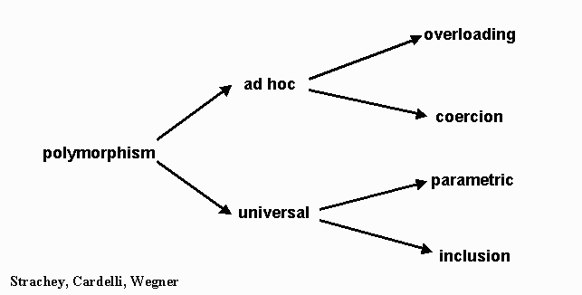
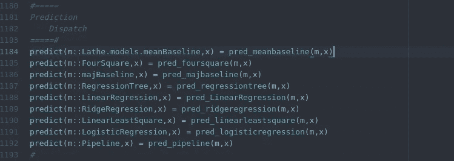

# 参数多态真的很酷

> 原文：<https://towardsdatascience.com/parametric-polymorphism-is-really-cool-e6ac25f0fa53?source=collection_archive---------13----------------------->

## 永远塑造了函数式编程的概念。

参数多态性是多态性的一个子集，它是一个有趣的通用编程概念，通常与函数式编程联系在一起。这很有趣，因为通常多态性和可变性不是函数式编程范式的属性，而是面向对象编程范式的属性。不久前，我向我的一位导师询问了这个问题，得到了一个简单的解释:

> 你说得对，严格来说这更像是面向对象。但它是第一个在 ML(元语言)中，一种基础的函数式编程语言，使用它漂亮的类型推理系统。
> 
> 所以直接的答案可能是——传统！而只是历史的趋势，事情就像过去的事情。
> 
> “

所以是的，虽然从逻辑上来说，参数多态的属性当然更符合面向对象编程的特性，而不是函数式编程。有趣的是，函数式语言通常更关注这种通用概念。这仅仅是因为函数式语言是第一个采用和利用这个概念的语言。

# 这是什么？

知道多态性在编程范式中的位置是很好的，但是如果我们不知道它是什么，或者如何使用它，那就没有用了。参数多态性允许创建具有通用数据结构的通用函数，以确保静态性，并处理相同的值，而不依赖于它们的类型。

使用参数多态性，您可以将泛型函数应用于构造函数，这允许更快的计算和一致的数据。当然，这对统计计算和函数式编程非常重要。

像 Julia 和 R 这样的语言中的参数多态性允许我们将给定的函数应用于通过方法传递的特定类型。这很好，因为它使函数或动作可变，同时仍然保持构造函数的属性。本质上，任何需要采用泛型类型的显式导入的泛型方法都可以采用所述泛型类型。在上面的例子中，我在一个通用的 predict 方法中使用了构造的模型，该方法被保存为所述结构的属性。然后，这将给定的构造类型插入到一个带有返回的预测函数中。

一个巨大的好处是**可变性**。“预测”函数是完全可变的，可以根据为它传递的结构而改变。当显式导入时，还可以修改该函数来捕获和处理任何类型。换句话说，假设这个代码在一个包中，最终用户仍然可以在会话中远程操作它。

# 一些快速历史

因为参数多态性并不真正属于一个特定的范式，因为许多现代语言，无论是哪种类型，都实现了某种形式的多态性，参数多态性的历史，以及它创建的目的仍然是为了今天最常用的东西。参数多态性将当今互联网上的大量大数据管道结合在一起，是统计计算中一个极其重要的概念。

这个概念的历史就是这样开始的，在 1975 年首次引入 ML 语言。此后又被实现成了[标准 ML](https://en.wikipedia.org/wiki/Standard_ML) 、 [OCaml](https://en.wikipedia.org/wiki/OCaml) 、 [F#](https://en.wikipedia.org/wiki/F_Sharp_(programming_language)) 、 [Ada](https://en.wikipedia.org/wiki/Ada_(programming_language)) 、 [Haskell](https://en.wikipedia.org/wiki/Haskell_(programming_language)) 、 [Mercury](https://en.wikipedia.org/wiki/Mercury_(programming_language)) 、 [Visual Prolog](https://en.wikipedia.org/wiki/Visual_Prolog) 、 [Scala](https://en.wikipedia.org/wiki/Scala_(programming_language)) 、 [Julia](https://en.wikipedia.org/wiki/Julia_(programming_language)) 、 [Java](https://en.wikipedia.org/wiki/Java_(programming_language)) 、 [C#](https://en.wikipedia.org/wiki/C_Sharp_(programming_language)) 等语言。参数多态性的一些实现也更加微妙，并与其他特别的概念混合，就像 C++的情况一样。

多态性是现代计算的一个非常重要的特性。对于任何一种形式，无论是 prenex 多态性、Rank-k 前多态性还是 Rank-n 多态性，都有许多语言支持这一概念。总的来说，对于函数式编程来说，参数多态性无疑对整个统计计算产生了巨大的影响。