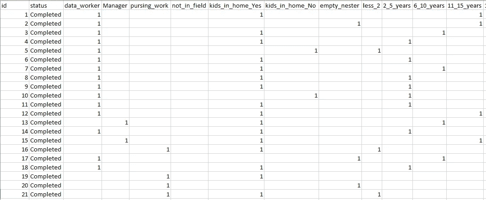
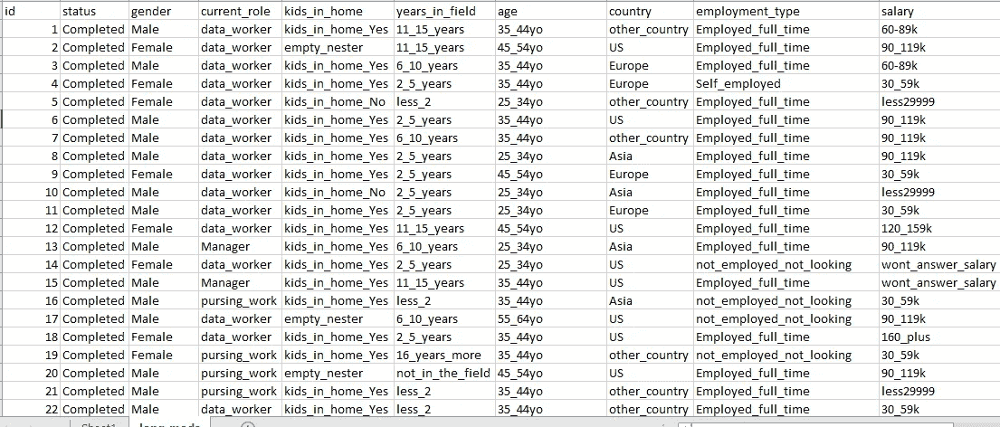
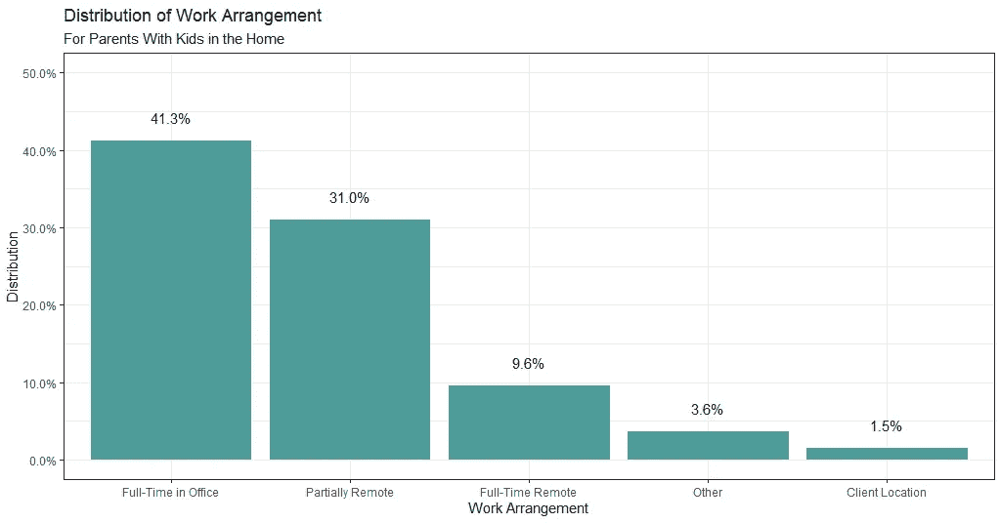

# 数据科学家长调查— R 代码—数据让我感动

> 原文：<https://towardsdatascience.com/parents-of-data-science-survey-r-code-data-moves-me-f2e191cf18e8?source=collection_archive---------31----------------------->

几周前，Kate Strachnyi 和我在社交媒体上发布了一项调查，试图在数据科学领域收集人口统计数据和父母的经历。可以在这里看到原调查问题:[调查](http://survey.constantcontact.com/survey/a07egckvkz0jvyimhdl/a01tmjy3nwegt/questions)

共有 332 名受访者。如果您曾经从 Survey Monkey 下载过. csv 格式的调查数据，您会发现您下载的是“宽”格式的数据。这意味着调查中每个潜在的*响应*都有一个指标变量。对于数据分析和创建图表，我们更喜欢“长”格式的数据。长格式是每个问题有一个单独的栏目。

下面是一个来自 Survey Monkey 的原始数据的. csv 图像(一小部分数据，我已经编辑了一些列名，但您已经明白了):



下图是我们想要的长格式，调查中的每个问题都有一栏:



如果你想下载 wide 格式的数据来跟随 R 中的代码，你可以在这里加入我的电子邮件列表[，数据集将被发送到你的电子邮件地址。你可以随时退订。](https://datamovesme.com/2019/07/14/parents-of-data-science-survey-r-code/#mailing-list)

在将数据从宽数据改为长数据之前，我做的第一件事是更改宽数据集中的列。调查中的一些问题是“是/否”问题。这意味着在我的原始数据中，我有多个名为“是”或“否”的列。我需要清理这些问题，使列名更直观，这样我就知道每个回答与哪个问题相关，并且每个列名需要是唯一的。

推荐文章:如果我们即将进入的代码不太清楚，但是你很想学习 R，这个 R 课程绝对不可思议:[这里](https://datamovesme.com/2019/06/08/my-favorite-r-programming-course/)。

首先，我加载 tidyverse，读入我的数据，并检查数据集中的列名:

```
**library**(tidyverse)  ### specifically we'll be using dplyr and ggplot2
**library**(plyr) ## for use of the revalue function
theme_set(theme_bw()) ## setting the theme for graphs## read in the data
mods <- read_csv("[your file path]/mods_data.csv")### checking out my column names
names(mods)
```

接下来，我指定了一个名称来存储我将要创建的长数据集，我将其命名为“Long_mods”。然后，我将宽数据集传递给它，并通过管道(%>%)将其传递给聚集函数。这个聚集函数是直观的。在这里，我收集了“男性”、“女性”和“非二进制”列，并创建了一个名为“性别”的新列。

```
###  Converting a single column from wide to long:
Long_mods <- mods %>%  
  gather(key = gender, value = "value", 
         Female, 
         Male, 
         non_binary, na.rm = TRUE) %>%
    select(-value)
```

你会注意到我有 na.rm = TRUE，这意味着当(例如)male = 1 时，我们保留它，但如果 male = na，因为这个人不是男性，它会被删除。这允许我们始终保持相同的行数。对于每个 gather 语句，都会创建一个名为“value”的新列。这将为我们所有的行设置为 1，因为我们删除了 na。

重塑数据可能需要大量的工作。为了演示，下面是将这个数据集(最初有 80 多列)转换为长格式的剩余代码。我必须收集每个问题的回答，为这个回答集合设置一个新的变量名，然后删除每个收集的“value”列。

下面是重塑整个数据集的代码。如果你跟着做，你可以复制粘贴这个。一旦你运行它，你将得到如上图所示的“长”数据集:

```
Long_mods <- mods %>%  
  gather(key = gender, value = "value", 
         Female, 
         Male, 
         non_binary, na.rm = TRUE) %>%
    **select**(-value)  %>% 
  gather(key = current_role, value = "value", 
         data_worker,
         Manager,
         pursing_work,
         not_in_field, na.rm = TRUE) %>%
    **select**(-value)  %>% 
  gather(key = "kids_in_home", value = "value", 
         kids_in_home_Yes, 
         kids_in_home_No, 
         empty_nester, na.rm = TRUE) %>%
    **select**(-value)  %>% 
  gather( key = "years_in_field", value = "value", 
          less_2, 
          '2_5_years' ,
          '6_10_years', 
          '11_15_years', 
          '16_years_more'
           ,not_in_the_field, na.rm = TRUE) %>%
    **select**(-value)  %>% 
  gather(key = "age", value = "value", 
         '18_24yo', 
         '25_34yo', 
         '35_44yo', 
         '45_54yo', 
         '55_64yo' ,
         prefer_no_answer, na.rm = TRUE) %>%  
    **select**(-value)  %>% 
  gather(key = "employment_type",  value = "value", 
         Employed_full_time, 
         Employed_part_time,
         Self_employed ,                 
         not_employed_not_looking,
         Student,
         Military , 
         Homemaker ,
         prefer_not_to_answer_jobtype, na.rm = TRUE) %>%  
    **select**(-value)  %>% 
  gather(key = "salary",  value = "value",  
         less29999 , 
         '30_59k', 
         '60-89k', 
         '90_119k' , 
         '120_159k' , 
         '160_plus', 
         wont_answer_salary, na.rm = TRUE) %>%  
    **select**(-value)  %>% 
  gather(key = "parental_leave_pay", value = "value", 
         full_paid, 
         not_paid, 
         partially_paid, 
         other_materity_leave, na.rm = TRUE) %>%  
    **select**(-value)  %>% 
  gather(key = "parental_leave_length",  value = "value", 
         no_leave, 
         less_2weeks ,
         '3_5weeks', 
         '6_8weeks', 
         '9_12weeks', 
         '13_16weeks',
         '17_weeks_6_months', 
         '6_month_plus', na.rm = TRUE) %>%    
    **select**(-value)  %>% 
  gather(key = "country", value = "value", 
         US , 
         Europe ,
         Asia , 
         other_country , na.rm = TRUE) %>%
    **select**(-value)  %>% 
  gather(key = "wish_parental_leave_longer",  value = "value", 
         Yes_wish_longer , 
         No_wish_longer,
         Not_sure_longer_leave, 
         Other_leave, na.rm = TRUE) %>%
    **select**(-value)  %>% 
  gather(key = "ever_declined_promotion",  value = "value", 
         Yes_declined_promotion , 
         No_declined_promotion, 
         Other_declined_promotion, na.rm = TRUE) %>%
    **select**(-value)  %>% 
  gather(key = "ever_declined_travel", value = "value",  
         Yes_declined_trip_or_conference, 
         No_declined_trip_or_conference,
         never_asked_trip_conference ,
         Other_trip_conference , na.rm = TRUE) %>%
    **select**(-value)  %>% 
  gather(key = "voicing_needs_difficult", value = "value",  
         Yes_voicing_needs_difficult,
         No_voicing_needs_difficult ,
         Other_voicing_needs_difficult , na.rm = TRUE) %>%  
    **select**(-value)  %>% 
  gather(key = "have_support", value = "value",  
         Yes_network_help, 
         No_network_help, 
         Other_network_help , na.rm = TRUE) %>%
    **select**(-value)  %>% 
  gather(key = "equal_partnership", value = "value", 
         partner_handles_more ,
         partner_handles_less,single, 
         equal_partnership , na.rm = TRUE) %>%
    **select**(-value)  %>% 
  gather(key = "treated_unfairly_at_work", value = "value", 
         Yes_unfairly_treated, 
         No_unfairly_treated , 
         Other_unfairly_treated, na.rm = TRUE) %>%
    **select**(-value)  %>% 
  gather(key = "changed_company_balance",  value = "value", 
         Yes_changed_companies,
         No_changed_companies ,
         Other_changed_companies, na.rm = TRUE) %>%  
    **select**(-value)  %>% 
  gather(key = "remote_work", value = "value",  
         Fully_remote , 
         Partially_remote, 
         Fully_in_office,
         client_location,
         Other_workplace_arrangement , na.rm = TRUE) %>%
    **select**(-value)  %>%   
      arrange(id)
```

现在我们有了长数据集，我们可以开始可视化数据了。以下是调查中其中一个问题的情节截图。因为我在上面设置了主题，所以情节看起来很干净。然后，我只需输入特定的十六进制代码，以匹配我在列中的品牌颜色。



从图表中我们可以看出，最流行的工作安排是全职呆在办公室。我希望这是因为他们真的喜欢呆在办公室里。

为了创建这个图，我创建了一个新的 tibble，它只包含我想在我的图中使用的数据。这是一个“工作安排”变量，我希望能够筛选出那些至少在工作周的一部分时间里有孩子在家的父母。虽然这是一项针对父母的调查，但也有一些受访者不是父母，或者在工作时间没有孩子在家。

```
work_arrangement_tbl <- Long_mods %>% 
  ## **using** only the relevant **variables**
  select(remote_work, kids_in_home) %>%
  ## filtering for parents that have kids in the home during the work week.
  filter(kids_in_home == "kids_in_home_Yes") %>% 
  ## grouping by remote work for the calculation
  group_by(remote_work) %>%
  ## getting the proportion of each category out of the total
  dplyr::summarize(distribution = n()/nrow(Long_mods)) %>%
  ungroup()
```

我还想对这些因素进行重新编码，使它们更具美感。我想把“全职”改为“全职”。为此，我使用了 plyr 包中的重估函数:

```
work_arrangement_tbl$remote_work <- 
  revalue(work_arrangement_tbl$remote_work, 
c("Fully_remote" = "Full-Time Remote", 
"Partially_remote" = "Partially Remote", 
"Fully_in_office" = "Full-Time in Office",
"client_location" = "Client Location",
"Other_workplace_arrangement" = "Other"))
```

现在我们已经获得了创建图表所需的正确格式的数据，我们可以继续创建图表了。我对每一步都进行了注释，以描述我们的数据在每一步都发生了什么:

```
work_arrangement_plot <- work_arrangement_tbl %>%
  ## changing remote work to be a factor **variable** and ordering the proportions from largest to smallest
  mutate(remote_work = remote_work %>% as_factor() %>% fct_reorder(desc(distribution))) %>%
  ggplot(aes(remote_work, distribution)) +
  ## giving the columns the desired color
  geom_col(fill = "#4F9C98") +
  ## We want labels as a percent rather than a decimal
  scale_y_continuous(labels=scales::percent)  +
  ## I also wanted the labels above the columns
  geom_text(aes(label = scales::percent(distribution)), 
            vjust = -1.5) +
  ## Setting y-axis to go to 50% for aesthetics
  expand_limits(y = 0.5) +
  ## Creating labels and subtitles
  labs(x = "Work Arrangement", y = "Distribution", title = "Distribution of Work Arrangement",
       subtitle = "For Parents With Kids in the Home")
```

然后运行“work_arrangement_plot”对象，瞧！你得到了一个漂亮的工作安排变量图，上面有每个因素的分布百分比，各列按百分比从大到小排列。

我祝你在重塑数据和进行分析方面取得成功！

推荐文章:如果你正在寻找进一步的 R 技能，你可以在这里阅读我最喜欢的 R 编程课程[。](https://datamovesme.com/2019/06/08/my-favorite-r-programming-course/)

很快，我将为我用这些数据构建的闪亮应用程序撰写文章，并发布来自该数据集的见解和有趣的花絮。同时，你已经可以在我的网站[上查看这个闪亮的应用了。](https://datamovesme.com/data4data-nerds/)

*原载于 2019 年 7 月 15 日*[*https://datamovesme.com*](https://datamovesme.com/2019/07/14/parents-of-data-science-survey-r-code/)*。*