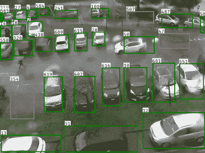
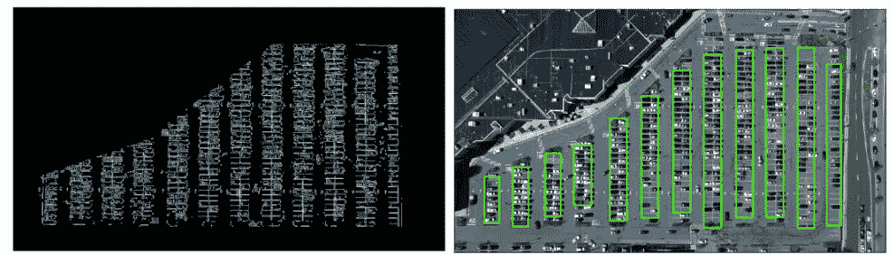
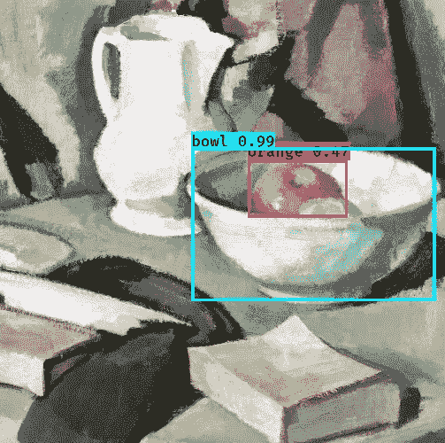
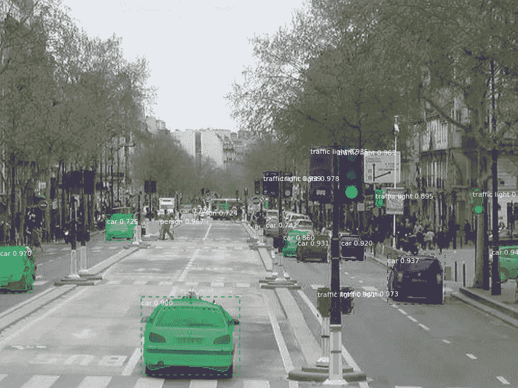
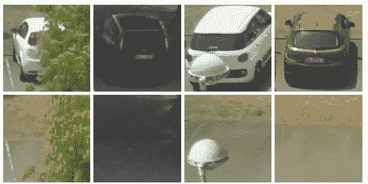
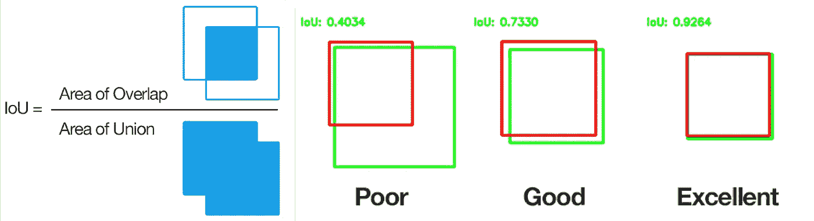
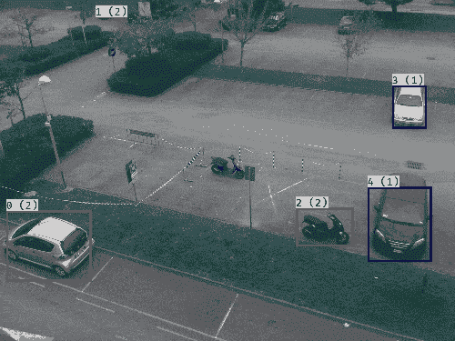
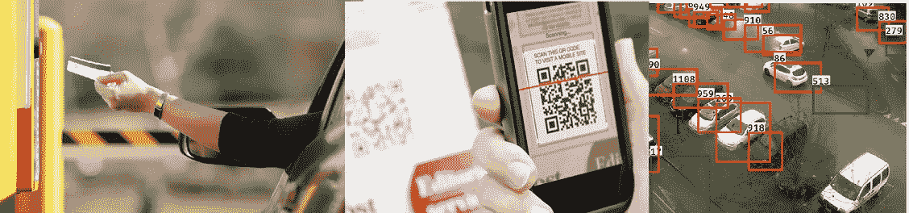
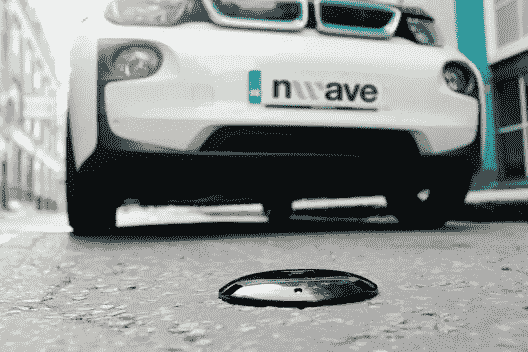

# Alexa 给我找个停车位。人工智能能引导你找到一个空车位吗？

> 原文：<https://towardsdatascience.com/parking-occupancy-detection-de25cc0966ef?source=collection_archive---------9----------------------->

## 使用深度学习从安全监控录像中检测停车场占用率

Empty or Occupied Parking Slot?

在停车场找一个空位是一个棘手的问题。如果输入流量变化很大，管理这些流量甚至会很困难。现在哪些位置是空的？我们什么时候需要更多的空位？通勤者是否发现很难到达某个特定的位置？哪辆车停在哪里？谁停了车？

我们使用地面安装的占位传感器网络或工作人员来确定这些问题的答案。传感器是有效的，但是需要维护，并且在单元+安装中每个节点的成本约为 40-80 美元。

对于工作人员来说，这是一项繁琐且容易出错的工作。即使工作人员得到栅栏和售票控制台的帮助，最多也只能给出一个基础广泛的关于地面上实际占用情况的猜测。

解决这个问题的一种方法可以是使用安全摄像机镜头，通过深度学习来实时检测停车占用率。(*文末链接完整代码)*

# 方法和架构

标记停车位占用情况是一个两步过程。首先，我们必须在视野范围内找到停车位。其次，我们必须检测插槽是否被占用。

一种方法是强行解决问题，手动标记所有插槽。然而，每次移动、摇摄或缩放摄像机时，都必须为摄像机的新位置重复这一费力的过程。

Parking Slot from Drone image [(Github](https://github.com/priya-dwivedi/Deep-Learning/tree/master/parking_spots_detector))

第二种方法可能是使用停车场的白线作为插槽的指南。我们可以使用 canny 过滤器和 hough 变换来检测多边形。然而，并不是所有的停车场都是白色车道。即使是在车道上，距离地面约 6 米的摄像机镜头也会被停放的汽车遮挡。因此，除非我们使用无人机从顶部捕捉镜头，否则这也不会有多大帮助。

我们可以使用静止的汽车本身来发现停车位。在几天的停车场录像中，我们可能会发现所有的车位在某个时间点都被车占满了。在镜头中检测静止的汽车是实际停车位位置的良好预测。当然，当赛车进入/退出插槽时，会有运动。但是我们可以忽略这些噪音。

一旦确定了停车位，剩下的就是检测在新的帧中是否存在汽车。这是一个简单的分类问题。我们可以在接收相机流的台式机上实时运行它(大约 1 秒)。

## 检测停车位

对于问题的第一部分，我们需要一个对象检测器，它将为每个停车位提供一个边界框。YOLO 和美国有线电视新闻网可以帮助我们。

**YOLO** 是一种灵活而精确的算法，它给出了每个检测到的物体的边界框，以及它们的分类和可能性的估计。早期的物体检测算法用不同的边界框大小多次扫描一个场景，并试图寻找行进中的候选者。这花费了很长的时间和计算资源。 [YOLO](https://pjreddie.com/darknet/yolo/) 使用 CNN 图层使其成为一次性问题。一旦网络经过训练，检测就可以在计算机上进行，甚至可以在手机上使用更小的网络和优化。

Still Life with a Jug and a Bowl of Apples [Samuel Peploe](https://www.wikiart.org/en/samuel-peploe) 1924

在风格不同的情况下(比如上面的这幅画)，YOLO 确实做出了合理的估计(碗、橙子)，但有时也会失误(书、壶)。

**MaskRCNN** 除了物体检测还有一个图像分割算法。MaskRCNN 将每个像素分类为属于一个对象的实例。这是一项极其困难的任务。MaskRCNN 通过排列感兴趣的区域来构建 FCNN 网络。这个[视频](https://www.youtube.com/watch?v=g7z4mkfRjI4&t=184s)将帮助你掌握核心概念。

Cityscape Dataset

在 GPU MaskRCNN 上运行需要大约 200 毫秒来处理 1 帧，所以它的速度大约是 Yolo 的六分之一，Yolo 在 GPU 上可以达到 30 Fps。但另一方面，MaskRCNN 需要大约 20 帧才能给出合理的结果，而 YOLO(它遗漏了小物体)需要大约 5 倍的时间。选择一个 MaskRCNN 更有意义，让它连续两天每小时捕捉 20 帧以上。YOLO 将需要大约五倍的帧数，但会错过一些时隙。

# 专门化网络

在非常接近物体的情况下，例如检测沿着道路行进的所有人，YOLO 有其弱点。它将一个场景划分为网格，并且可以在每个网格中检测一定数量的对象。在停车场的情况下，停在第一排的车很可能会被遗漏。我试图将网络专门化，只检测汽车。性能略有提高。

使用 RESNET(或任何其他分类器)完成最终检测。我把它专门用在汽车上。我使用了 CNRPARK 提供的数据集，因为它有我们通常在安全摄像头中找到的汽车方向的图像。我使用了 FastAI 的 [fit_one_cycle](https://github.com/fastai/fastai/blob/master/fastai/train.py#L14) ，在 10 个历元内可以在验证集上获得超过 99.7%的准确率。令人惊讶的是，一旦你有了一个训练好的模型，所需的数据和计算资源是如此之少。

Empty | Occupied dataset from National Research Council (Cnr) Italy

# 检测停车位

一旦我们有了专门的权重，我们就开始检测停车位的实际任务。在自动驾驶汽车中，你需要在多个帧之间跟踪一个对象。在停车位检测中，我们需要在逐帧移动时跟踪停车位。汽车来来去去，它们的大小会改变，边界框也会改变。

## 逐帧映射时隙

并集上的交集(IOU)在这类问题中是一个很好的度量。对于每个槽，我们在后续图像中检测与前者具有最高 IOU 的对应槽，并对其进行分配。IOU 低于阈值的空位很可能是已经到来并占用了该停车位的新车辆。

在运行了几个帧之后，也有必要在一个帧内合并不同的边界框，因为一些零星的条目可能会导致堆积。在此步骤中，选择较高的 IOU 阈值，以获得稳定的结果。

Blue Detection for the first time | Red Occupied | Green Vacant

## 移除瞬时动作

一些帧将捕捉瞬时运动，如汽车进入停车场。必须拒绝这些边界框的实例。根据一段时间内停车场被占用的实例数量运行拒绝，可以让我们控制这些零星的条目。

这将为我们提供一个停车位列表:坐标和培训期间的典型占用模式。

# 检测时隙内的占用率

检测非常简单。我们将图像裁剪到上一步中边界框所定义的位置。我们现在要做的就是分类这辆车是存在还是不存在。我们使用我们调优的 RESNET，它给我们一个合理的结果。

# 限制

这个系统还没有达到标准。让我们再一次把它分成两部分，检测插槽和检测占用率。

> ***你不能察觉你看不见的东西*它也不能**

树木和阴影限制了探测范围。部分遮挡(有树冠)在某些情况下有效，但在其他情况下无效。类似地，地面摄像机(< 6 米)停车场内的大多数汽车将隐藏在画面前面的几辆汽车后面。只有在前面的停车场是空的一些帧中，后面的停车场才会被检测到。

对于非常小的物体，马斯克 CNN 和 YOLO 很难挑选插槽。这可能是一帧中大约 1–5%的停车位。然而，这可以通过人类花费不到一分钟的时间来提供正确的边界框来校正。相比之下，如果他必须注释所有的槽，则需要花费 1-2 个小时。

这将我们带到第二部分:检测插槽的状态。分类器看起来确实工作得很好。然而，小图像、怪异的视角、黑暗和障碍物再次限制了这一步

那么这一切是怎么回事呢？停车检测不能扩展到所有使用情况。在大多数地下停车场，你不可能把摄像机安装在离地面 9 米的地方。在许多地方，树木、柱子等会阻碍视野。

它有它的缺点，也许现有的检测占用的方法也有缺点。如果我们能把它们结合起来，就能创造出一个更有效率的系统。

# 从中可以延伸出什么

Parking Ticket | QR Code | Vacant Slots

我们可以用这个系统指引通勤者去停车场的空位。现有的停车票可以带有一个二维码，然后使用该系统将消费者引向空地。这减少了该步骤中所需的手动干预的数量。

将车牌识别与占用检测结合起来，我们可以跟踪哪辆车占用了哪个车位。通过同样的方法，我们还可以跟踪谁停了车。

Ground-based sensors effective but costly

通过与地面系统协同工作，设施管理者可以实时了解停车场的库存水平。未来扩充决策可以基于真实的历史数据。它还可以通过捕捉停车者的快照来检测谁停了车。

代码和指令[https://github.com/visualbuffer/parkingslot](https://github.com/visualbuffer/parkingslot)

[点击观看视频](https://www.youtube.com/watch?v=lbYx3ZUc9EU&list=PLJbKVET8HawYvKSVhpnv0i-Qzw1QDsQDC)

参考资料:

1.  意大利比萨 CNR 研究区【http://cnrpark.it/ 
2.  [https://github.com/qqwweee/keras-yolo3](https://github.com/qqwweee/keras-yolo3)。基于 KERAS 的启动代码。
3.  [https://github.com/matterport/Mask_RCNN](https://github.com/matterport/Mask_RCNN)基于火炬的启动码

人工智能正在消除障碍，让人们以微不足道的成本获得洞察力。你正在开发一个我们可以合作的机器学习应用吗？请在我的 [Linkedin](http://bit.ly/copilot-linkedin) 上留言。