# 第 1 部分:打破谜！让我们检测物体

> 原文：<https://towardsdatascience.com/part-1-breaking-enigma-lets-detect-objects-269ab175632c?source=collection_archive---------34----------------------->

## 现在，让我们开始寻找一个鲁棒和准确的对象检测算法。

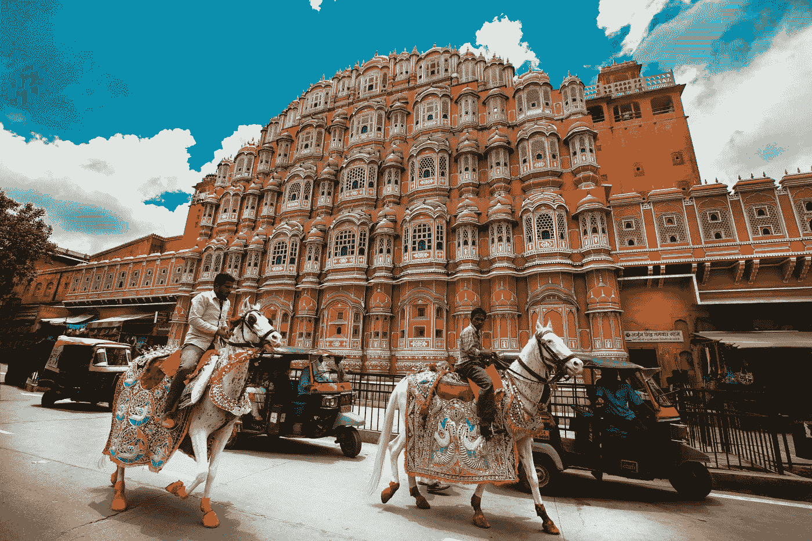

Hawa Mahal Road, Jaipur, Rajasthan (Image Source: [unsplash](https://unsplash.com/photos/6rDbvXzIVpQ))

大家好！我是尼特莱普尔的巴拉特。我在印度蒂鲁帕蒂印度理工学院计算机视觉实验室第四学期结束后的研究实习期间。我的导师给了我一个任务，找到并实现一个健壮而准确的目标检测算法，这将有助于他们正在进行的研究工作。

## 1)对象检测:

对象检测是一种与计算机视觉和图像处理相关的计算机技术，用于检测某一类语义对象(如人、建筑物、汽车等)的实例。)在数字图像和视频中。

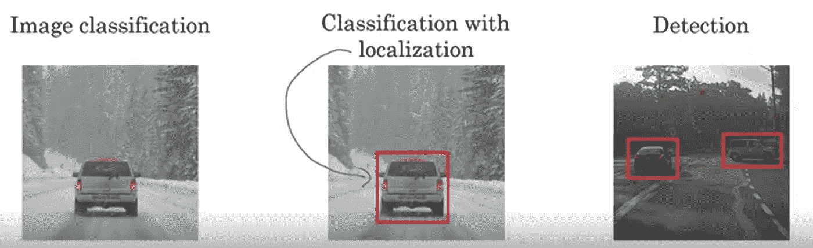

Fig.2 Machine Learning: Stanford University- Coursera

## **2)物体探测器类型:**

> **A .)基于区域的对象检测器或两阶段方法:**解决这个问题的一个简单方法是从图像中提取不同的感兴趣区域，并使用 CNN 对该区域内对象的存在进行分类。

使用一些其他的计算机视觉技术提取建议，然后调整大小为分类网络的固定输入，分类网络充当特征提取器。然后训练一个 SVM 来在对象和背景之间进行分类(每个类别一个 SVM)。此外，一个边界框回归器被
训练，输出一些建议框的校正(偏移)。总体思路如图 3 所示。这些方法非常精确，但计算量很大(低 fps)。

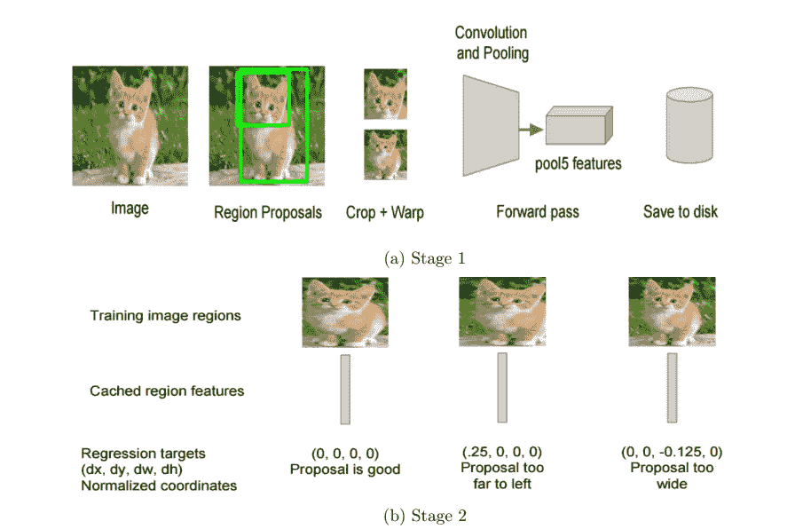

Fig.3 Google Search Pixel

**主要技术有:**

***1 >滑动窗口***

***2 > R-CNN***

***3 >快速 R-CNN***

**4>更快 R-CNN**

***5 > FPN…..等等。***

> **B .)单镜头物体检测器或统一方法:**这里的区别是，不是产生提议，而是预先定义一组盒子来寻找物体。
> 使用来自网络后续层的卷积特征图，在这些特征图上运行另一个网络，以预测类别分数和边界框偏移。

步骤如下:
1。用回归和分类目标训练 CNN。
2。从后面的层收集激活，以推断全连接或卷积层的分类和位置。
3。在训练期间，使用“Jaccard 距离”将预测与实际情况联系起来。
4。在推断过程中，使用非最大值抑制来过滤同一对象周围的多个框。

**主要技术有:**

> 单一激活图:

**1>**[**YOLO:**](https://arxiv.org/abs/1506.02640)**你只看一次:统一、实时的物体检测**

**2>**[**yolo 9000**](https://arxiv.org/abs/1612.08242)**:更好、更快、更强**

> 多重激活图:

**1>**[**SSD**](https://arxiv.org/abs/1512.02325)**:单发多盒探测器**

**2>**[**yolov 3**](https://pjreddie.com/media/files/papers/YOLOv3.pdf)**:增量改进**

**3>**[**DSSD**](https://arxiv.org/abs/1701.06659)**:解卷积单次检测器**

*使用多种比例有助于更好地检测图像上不同尺寸的物体，从而获得更高的地图(平均精度
)。* ***因此在这个项目/博客中使用的技术是 YOLO(单激活地图)和 YOLOv3(多激活地图)。***

## **3)你只看一次:统一的、实时的物体检测(YOLO)——**

**YOLO** 模特(**“你只看一次”**； [Redmon 等人，2016](https://www.cv-foundation.org/openaccess/content_cvpr_2016/papers/Redmon_You_Only_Look_CVPR_2016_paper.pdf) )是构建快速实时物体探测器的第一次尝试。因为 YOLO 不经历区域提议步骤，并且仅在有限数量的包围盒上进行预测，所以它能够超快速地进行推断。这里是在 keras 中实现经过训练的 YOLO 的 **GitHub** [**库**](https://github.com/tarahb2103/Object_Dtection-YOLO) 。

**3.1)网格单元:**

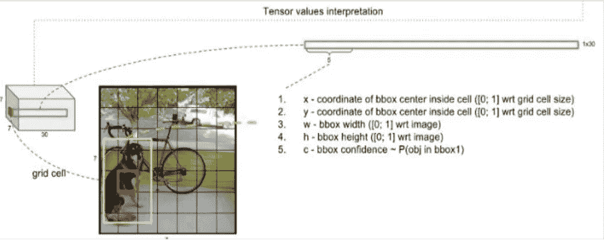

Fig.4 YOLO Official Paper

YOLO 将输入图像分成一个 **S** × **S** 网格。每个网格单元只预测**一个**物体。例如，下面的红色网格单元试图预测中心落在网格单元内的“狗”对象。

**3.2)它是如何工作的？:**

*   使用整个图像的特征来预测每个边界框。
*   同时预测图像所有类别的所有边界框。
*   将输入图像划分为一个 s*s 网格。如果对象的中心落入网格单元，则该单元负责检测该对象。
*   每个网格单元预测 B 边界框和这些框的置信度得分。
*   每个网格还预测 C 条件(以包含对象的网格单元为条件)分类概率。

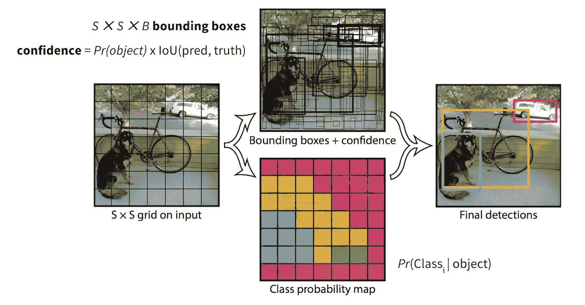

*Fig.5 The workflow of YOLO model. (Image source:* [*original paper*](https://www.cv-foundation.org/openaccess/content_cvpr_2016/papers/Redmon_You_Only_Look_CVPR_2016_paper.pdf)*)*

它将图像划分为一个 S × S 网格，每个网格单元预测 B 边界框、这些框的置信度和 C 类概率。这些预测被编码为 S×S×(B∫5+C)张量。

**3.3)特性:**

*   工具？—单个神经网络、统一的体系结构(24 个卷积层、4 个最大池和 2 个全连接层)
*   框架？— Darknet —最初的实现是在 C 和 CUDA 中。
*   技术背景？—相关方法速度慢、非实时且缺乏推广能力。

**3.4)网络架构:**

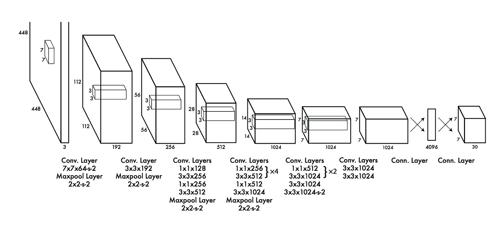

Fig. 6 The Architecture — Detection Network has 24 conv layers and 2 fully connected layers which
are converted into feature map of S * S*(B*5 +C). *(Image source:* [*original paper*](https://www.cv-foundation.org/openaccess/content_cvpr_2016/papers/Redmon_You_Only_Look_CVPR_2016_paper.pdf)*)*

**3.5)术语和公式:**

*   **置信度得分:**

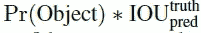

反映了对盒子包含一个对象的置信度+盒子的准确度。

*   **条件类概率:**

>以包含一个对象的网格单元为条件。

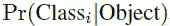

>在测试时，我们将条件类概率和单个盒子置信度预测相乘。

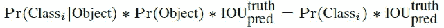

*   **总损失函数:定位+置信度+分类损失:**

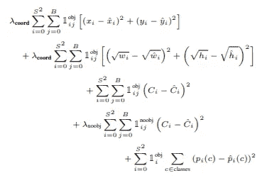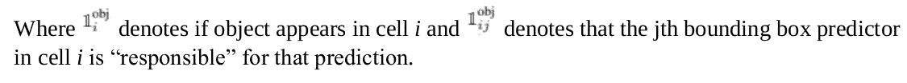

*   **非最大抑制:**

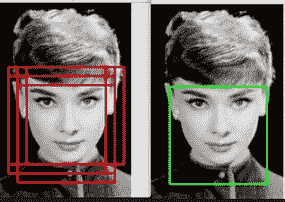

Fig.7 Non-Max Suppression (Image source [Blog](https://www.google.co.in/url?sa=i&source=images&cd=&cad=rja&uact=8&ved=2ahUKEwiZ7sfMtOjgAhUG5o8KHWWZCqwQjhx6BAgBEAM&url=https%3A%2F%2Ftowardsdatascience.com%2Fgoing-deep-into-object-detection-bed442d92b34&psig=AOvVaw0hoQNIUYYBgx8nlVqoH6Ec&ust=1551786292803339))

在预测期间，使用非最大值抑制来过滤每个对象的多个框，这些框可以如图所示进行匹配。

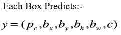

*   丢弃所有 pc <0.6
*   Pick the box with largest pc. Output that as a prediction.

Discard any remaining box with IOU > = 0.5 的盒子，并输出上一步的盒子。

**3.5)结果:定性分析-**

**>真检测**

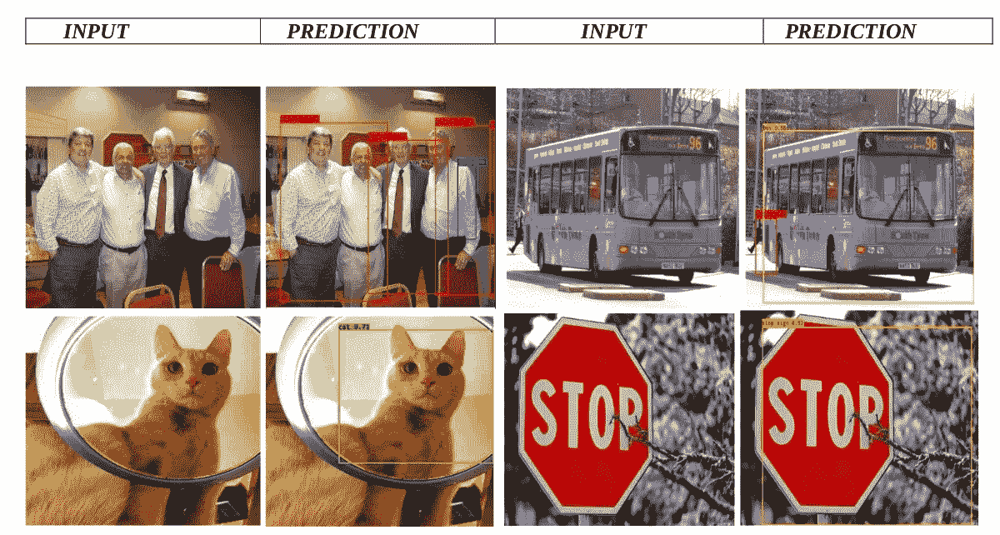

Table 1: Predicted output results from MS-COCO datasets.

**>错误或变异检测:**

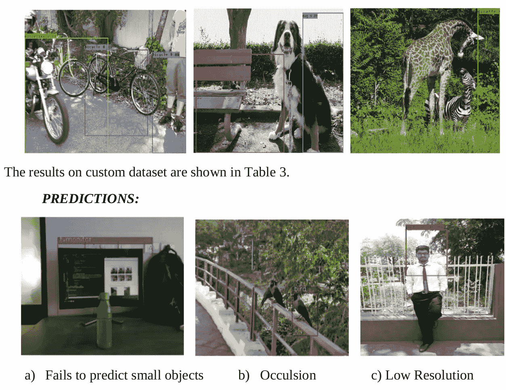

Table 2: False Detections and Table 3: False Detections on custom images

**3.6)观察到的问题:**

*   当与小物体一起出现时，较大物体占优势，如图 a 所示
*   遮挡给检测带来了问题。如图 b 所示，被遮挡的鸟没有被正确检测到。
*   图像的分辨率必须很高，否则边界框可能会偏离其位置。
*   如图 c 所示。为了解决上述问题，继 YOLO 之后出现了许多统一的检测方法:

> 1.)YOLO9000:更好更快更强
> 2。)SSD —单次多盒检测器。
> 3。)DSSD-去卷积单触发多盒检测器。
> 4。)YOLOv3:增量改进。

## 在下一部分，我将把 YOLOv3 描述为一项重大改进。

喀拉斯 YOLO 的 Github 知识库。

# 谢谢你。