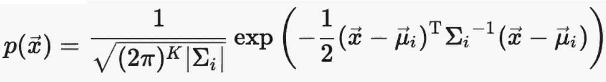
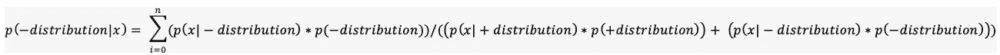

# 你的工具箱中的一个新工具，KL Divergence at Work

> 原文：<https://towardsdatascience.com/part-2-a-new-tool-to-your-toolkit-kl-divergence-736c134baa3d?source=collection_archive---------10----------------------->

## 最后，将 KL 散度应用于真实数据集

在我的[上一篇](/part-i-a-new-tool-to-your-toolkit-kl-divergence-5b887b5b420e)中，我们对[熵](https://en.wikipedia.org/wiki/Entropy)、[交叉熵](https://en.wikipedia.org/wiki/Cross_entropy)、 [KL 散度](https://en.wikipedia.org/wiki/Kullback%E2%80%93Leibler_divergence)有了一个直观的了解，也通过实例计算了它们的值。如果你错过了，请[在进入最后一集之前再看一遍](/part-i-a-new-tool-to-your-toolkit-kl-divergence-5b887b5b420e)。

在本帖中，我们将应用这些概念，并在真实的数据集中检查结果。此外，它将为我们提供良好的直觉，告诉我们如何在建模各种日常机器学习问题时使用这些概念。那么，我们开始吧。

# 1.分析数据集

数据集包括两个潜在特征‘f1’和‘F2’以及数据点所属的类，即正类或负类。

Dataset

## 数据集可视化

Visualizing the Data with a scatterplot

Code used for Visualisation

因此，我们的数据点有两个潜在特征，“f1”和“f2”。数据点属于'+'类(红色)和'-'类(蓝色)。

# 2.定义目的

我们的目的是为数据集的正负类定义一个理想的分布。到目前为止，我们还不知道它会是什么样子，它的概率密度函数会是怎样的，但是我们可以定义一些好的性质。

## 理想分布的性质

1.  正类的分布应该使得任何数据点属于正类的概率应该是 1，而负类的概率应该是 0。
2.  负类的分布应该使得任何数据点属于正类的概率应该是 0，负类的概率应该是 1。

# 3.如何估计上述理想分布

现在好戏开始了。如何估计理想分布。这是一个开放式的问题，可以尝试许多技术。但是对于这个博客的帖子，我将保持事情简单，不会偏离原始主题太多，将 KL 散度应用于日常的机器学习问题。

## 高斯/正态分布救援

估计分布的一种方法是使用高斯分布。我们将尝试为正类拟合一个高斯，为负类拟合另一个高斯。有可用的软件包可以为我们找到这些拟合的高斯函数的适当参数。但是，如果你有兴趣了解它是如何做到的，那么你可以在这里阅读更多关于它的[。一种叫做](http://www.aishack.in/tutorials/expectation-maximization-gaussian-mixture-model-mixtures/)[期望最大化](https://en.wikipedia.org/wiki/Expectation%E2%80%93maximization_algorithm)的算法被用于此。也许，我会在另一篇博文中写下它。让我们使用 python 中可用的 GaussianMixture 包来拟合发行版。

PDF of a multivariate Gaussian Distribution

Fitting the Distribution and visualizing the results

Fitted Gaussians for the positive and negative class

从视觉上看，在完成分配的任务时，分配看起来很好。一个高斯模型适合正类，另一个适合负类。接下来，我们将计算每个数据点属于正负类分布的概率。

# 4.寻找每个数据点的概率(可选)

在这一部分中，我们将看到，一旦完成了正类和负类的多元高斯拟合，如何计算每个数据点的最终概率。这将是一个数学密集型和可选的。它可以作为黑箱，得到最终的概率。但是万一，你有兴趣了解背后的数学，你可以按照章节 else 跳到下一个。

对于任何数据点' x ',属于分布概率由下式给出

使用上面的公式，我们可以找到可能性，

Probability of datapoint given + distribution

Probability of datapoint given - distribution

接下来，我们可以找到类概率或先验，

Probability of + distribution

Probability of - distribution

其中 n 是数据点的总数。

一旦我们有了可能性和先验，最后一步就是找到后验，即数据点的概率。我们可以用[贝叶斯定理](https://en.wikipedia.org/wiki/Bayes%27_theorem)来计算。

Probability of datapoint belonging to the + distribution

Probability of datapoint belonging to the - distribution

我们可以利用上面的后验，求出每个数据点属于+ve 或-ve 分布的概率。

# 5.评估拟合优度

现在，一旦我们拟合了分布，并且计算了每个数据点属于正负分布的概率。我们可以看到这个拟合的分布与我们的理想分布有多大的不同。

我们如何检查呢？当然，使用我们最喜欢的度量标准， [KL 散度](https://en.wikipedia.org/wiki/Kullback%E2%80%93Leibler_divergence)(kull back–lei bler 散度)。

只是重申，KL 散度只是拟合分布和实际分布之间的差异，即交叉熵和熵之间的差异。还可以看出这两种分布有多大差异。

## 计算 KL 散度

KL Divergence

其中 H(p，q)是交叉熵，H(p)是系统的熵，其中 *pᵢ* 是第*个*事件的实际概率，q *ᵢ* 是第 I 个事件的估计概率。

## 重申我们理想分布的性质

1.  正类的分布应该使得任何数据点属于正类的概率应该是 1，而负类的概率应该是 0。
2.  负类的分布应该使得任何数据点属于正类的概率应该是 0，负类的概率应该是 1。

*pᵢ* 是来自理想分布特性的事件的实际概率。q *ᵢ* 是事件的估计概率，使用拟合/估计分布计算。我们用这些概率来寻找 KL 散度。

Calculating the probabilities and KL Divergence

KL 散度出来是 **5.74** ，这表示拟合的分布非常接近理想值。但是我们能做得更好吗？

# 6.努力接近理想的分布

每类一条高斯曲线可能不足以模拟整个分布。我们可以拟合高斯混合分布，看看结果。有多少高斯人？直到我们的 KL 散度接近 0，即理想分布和拟合分布之间没有差异或差异最小。让我们试试那个。

Try fitting more than one Gaussian per Class

## 结果

KL Divergence on increasing the number of Gaussians per Class

1 Gaussian per Class, KL Divergence = 5.74

2 Gaussian per Class, KL Divergence = 3.18

3 Gaussian per Class, KL Divergence = 1.81

4 Gaussian per Class, KL Divergence = 0.77

5 Gaussian per Class, KL Divergence = 0.20

## 外卖食品

每类四个高斯分布就足够了，并且非常接近地模拟了 KL 散度几乎为 0 的理想分布。下面的情节也清楚地表明了这一点。

4 Gaussian per Class, KL Divergence approaches 0

# 7.结论

我们选择了一个包含两个不同类的数据集。我们想找到这两个类的基本分布。所以，我们首先定义了什么是好的，有理想分布的性质，并且能够非常接近地模拟理想分布。这样，我们总是可以尝试找到数据的基本分布，并使用 KL 散度来查看拟合度。希望它为这个主题带来了所需的清晰度，并为其在日常机器学习工作中的应用带来了新的视野。

***我的 Youtube 频道获取更多内容:***

 [## 阿布舍克·蒙戈利

### 嗨，伙计们，欢迎来到频道。该频道旨在涵盖各种主题，从机器学习，数据科学…

www.youtube.com](https://www.youtube.com/channel/UCg0PxC9ThQrbD9nM_FU1vWA) 

写一篇清晰易懂的好文章需要很多努力。我会继续努力做好我的工作。在 [**中**](https://medium.com/@mungoliabhishek81) 关注我，查看我以前的帖子。我欢迎反馈和建设性的批评。任务的完整代码可以从[这里](https://github.com/samread81/KL-Divergence)获得。

# 8.参考

1.  [https://en.wikipedia.org/wiki/Probability_density_function](https://en.wikipedia.org/wiki/Probability_density_function)
2.  https://en.wikipedia.org/wiki/Entropy
3.  【https://en.wikipedia.org/wiki/Cross_entropy 
4.  [https://en . Wikipedia . org/wiki/kull back % E2 % 80% 93 lei bler _ divergence](https://en.wikipedia.org/wiki/Kullback%E2%80%93Leibler_divergence)
5.  [https://scikit-learn.org/stable/modules/mixture.html](https://scikit-learn.org/stable/modules/mixture.html)
6.  [https://towards data science . com/part-I-a-new-tool-to-your-toolkit-KL-divergence-5b 887 b5 b420 e](/part-i-a-new-tool-to-your-toolkit-kl-divergence-5b887b5b420e)
7.  [https://towards data science . com/demystifying-entropy-f2c 3221 e 2550](/demystifying-entropy-f2c3221e2550)
8.  [https://towards data science . com/demystifying-cross-entropy-e 80 e 3 ad 54 a 8](/demystifying-cross-entropy-e80e3ad54a8)
9.  [http://www . ai shack . in/tutorials/expect-maximization-Gaussian-mixture-model-mixtures/](http://www.aishack.in/tutorials/expectation-maximization-gaussian-mixture-model-mixtures/)
10.  [https://en . Wikipedia . org/wiki/Expectation % E2 % 80% 93 最大化 _ 算法](https://en.wikipedia.org/wiki/Expectation%E2%80%93maximization_algorithm)
11.  [https://brilliant.org/wiki/gaussian-mixture-model/](https://brilliant.org/wiki/gaussian-mixture-model/)
12.  [https://en.wikipedia.org/wiki/Bayes%27_theorem](https://en.wikipedia.org/wiki/Bayes%27_theorem)
13.  [https://en . Wikipedia . org/wiki/kull back % E2 % 80% 93 lei bler _ divergence](https://en.wikipedia.org/wiki/Kullback%E2%80%93Leibler_divergence)