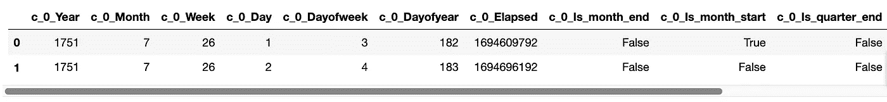
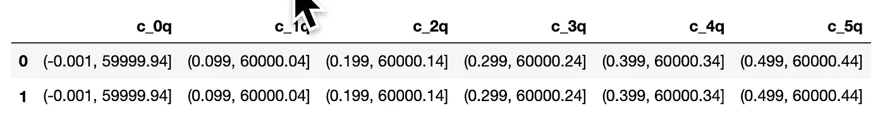
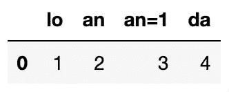
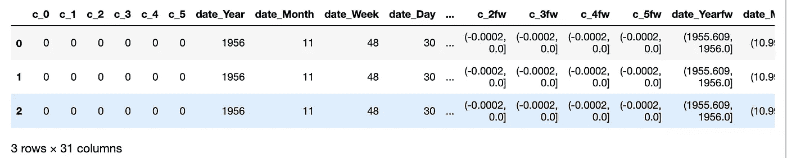

# 为您的机器或深度学习项目提供更多不常见的数据清理器

> 原文：<https://towardsdatascience.com/part-2-more-uncommon-data-cleaners-for-your-machine-or-deep-learning-project-b30f862b2d81?source=collection_archive---------17----------------------->

## 帕索项目

## 我将介绍类型和格式转换数据清理器。


几乎所有的 **paso** ，包括这里讨论的所有函数，都要求 **paso** 数据清理步骤(如删除空值和 NA 值)已经完成。

这些数据清理器在以下文章中有详细介绍:

[](/uncommon-data-cleaners-for-your-real-world-machine-or-deep-learning-project-f926d8ecb258) [## 用于真实世界机器或深度学习项目的不寻常的数据清理器

### 介绍

towardsdatascience.com](/uncommon-data-cleaners-for-your-real-world-machine-or-deep-learning-project-f926d8ecb258) 

# 背景故事

在我们以前的项目中，我们发现自己大部分时间都在用非常相似或略有不同的数据清理器清理数据。

在第一个项目中，我们在数据清理开发上花费了大量时间。以至于在第二个项目开始时，项目管理将数据清理分为三类:相同、差异小于 33%和差异大于 33%。

这些类别定义了两个重要原因:

*   作为一个团队，随着数据清理器需求的确定，我们能够消除大量的“*重新编码车轮”*，并向我们的数据清理器包添加超过 33%的不同类别。
*   我们的开发时间估计变得更加精确。

两年半之后，我们开始了第八个项目，并且发现，到目前为止，不到十分之一的数据清理器属于第三类，即花费开发人员更多时间的类别。更重要的是，我们从开发到生产的时间是前两个项目的一半。我们现在可以将大部分时间花在寻找足够好的机器学习(有时是深度学习)解决方案上。

您的体验可能会有所不同，因为我目前的领域是用于资产配置、平衡和风险的固定收益金融数据。(好吧，是的，一些我在这里不会提到或使用的其他晦涩的东西。)

现在你可能会问我为什么要讲这个故事。因为随着我们沿着这条路走下去，我从一个机器学习科学家进化成了一个软件架构师和软件工程师。

我现在负责修复一个生产服务，并完成最初的架构设计工作和代码开发。我喜欢从开发到生产。有时我会写下并分享我们的一些成就。

我真诚地希望你能使用我们的一些工作。这里使用的函数的所有代码都可以在[https://github.com/bcottman/paso/toutil.py](https://github.com/bcottman/paso/toutil.py)找到。

# 故事已经够多了。你能做什么？给我看看！

使用不同组合的清洗策略(管道)是 **paso** 的一个重要目标。

讨论将分为以下几个主要部分:

*   首先，我们创建可以改变的数据集。
*   接下来，通过对创建的数据集进行操作来演示每个清理器。
*   然后我们展示了一个与管道很好地混合的调用功能:链接掉 **pandas** DataFrame 实例。这是我们熟悉的 **R** 开发模式。我们发现编码 paso 链比编码 sklearn 管道要容易得多。我们甚至认为链式管道比传统管道更容易检查和理解。
*   最后，我们总结一下 **paso 的**数据清理器，以及我们对未来文章和 **paso** 版本的计划。

本课的代码在[这里](https://github.com/bcottman/paso/blob/master/lessons/)和[这里](https://github.com/bcottman/paso/blob/master/paso/pre/toutil.py)文件中给出。获得整个 **paso** 包的最好方法是 *git 克隆*base。`pip`将不起作用，因为此包中有您需要的基于文本的文件(描述)。

# 目标实用程序:目标数据框架

```
paso.pre.toutil.toDataFrame(X: pd.DataFrame,
    columns: List = None, 
    inplace: bool = True, 
    verbose: bool = True) 
    -> pd.DataFrame:

Parameters:
    X: DataFrame
        Attempt to convert python datatype argument into 
        pandas dataframe.

    columns:     
        The column names to  be used for new DataFrame. 
        If a number of column names given is less than a number 
        of column names needed, then they will be generared 
        as c_0...c_(n-1), where n is the number of missing
        column names.

    verbose: default: True) Logging is on.

    Returns: DataFrame
```

该功能基于`willmcginnis's convert_input()`。

paso 是一个包，其中所有的功能和方法都需要一个数据框架。

由于 **paso** 函数和方法只消耗 **pandas** 数据帧，我们需要一个函数来转换各种 python 数据类型，同时还提供 **paso 的**基本服务。这个功能就是`paso.to_util.toDataFrame`。

此函数是" **paso** *规则的例外。第一个参数是 DataFrame* "规则，因为它将一维或二维列表、元组、csr_matrix、numpy 数组或 1d **pandas** 系列转换为 **pandas** DataFrame。

你也有`paso.to_util.isDataFrame(X) -> bool`来检查对象是否是一个`pandas.DataFrame`。

如果不需要 **paso 的**服务，比如日志记录和缓存，可以使用方法`pandas.DataFrame`。我建议你*不要这样做*，但是你可以选择这样做。

一个好的做法是在管道的开始制作类型为`DataFrame`的数据集。由 **paso** 函数所做的更改将被保存在 DataFrame 实例的状态中(`inplace=True`)。在您的实验运行的整个管道中，就地将会发生，以最大化完成速度和最小化内存使用。

如果您需要引用原始数据帧，那么您可以执行类似以下操作:

```
<dataset_name>_original = <dataset_name>.copy()
```

但是，系统会警告您，保留原件会消耗一些电脑内存。

由您决定是否保留原始数据集的副本。

几乎总是从本地文件或通过 URL 寻址的非本地文件输入原件，因此，您可能不需要在计算机内存中保留副本。

您可以通过以下方式查看任何对象的大小(以字节为单位):

```
from sys import getsizeof
getsizeof(pd.DataFrame())=> 24
```

这表明空数据帧的大小为 24 字节。

# 创建一个我们可以使用的数据集

现在，我们创建一个人工数据集`df_of_ints`，一个由`int`组成的数组

```
from paso.base import raise_PasoError  
from paso.pre.toutil import toDataFrame
arr = np.ndarray(shape=(1000000,6), dtype=int, order='F')
df_of_ints = toDataFrame(arr)
```

日志输出[=>]:

```
2019-12-12 13:29:08.164 | INFO     | paso.pre.toutil:toDataFrame:112 - toDataFrame  with 
column names: Index(['c_0', 'c_1', 'c_2', 'c_3', 'c_4', 'c_5'], dtype='object')
```

`toDataFrame(arr, columns=['a','b'])` 可以为新的 DataFrame 指定前两个列名。

```
df_of_ints = toDataFrame(arr, columns=['a','b'])
df_of_ints.shape
```

日志输出[=>]:

```
2019-12-12 13:29:22.981 | INFO     | paso.pre.toutil:toDataFrame:112 - toDataFrame  with 
column names: Index(['a', 'b', 'c_2', 'c_3', 'c_4', 'c_5'], dtype='object')
```

输出[=>]:

```
(1000000, 6)
```

请注意，前两个列名是如何给出的，`toDataFrame`检测到这一点，并创建了所需的接下来的四个列名。

这次我们调用`toDataFrame`，同时保持 **paso** 注销。只有在调用的函数范围内，日志记录才会被关闭。

```
df_of_ints = toDataFrame(arr, columns=['X','yyyyyy'],verbose=False)
df_of_ints.columns
```

输出[=>]:

```
Index(['X', 'yyyyyy', 'c_2', 'c_3', 'c_4', 'c_5'], dtype='object')
```

# to _ util:to 类别

```
paso.pre.toutil.toCategory(
    X: pd.DataFrame,
    bool_: bool = True,
    int_: bool = True,
    object_: str = True,
    inplace: bool = True,
    verbose: bool = True,
) -> pd.DataFrame:

Parameters:
    X: dataFrame

    bool_: default: True - convert to category type.

    int_: default: True - convert to category type.

    object_: default: True - convert to category type.

    inplace: default:
        True - change DataFrame arg "in-place"
        False:  return new resulting DataFrame

    verbose: default: True - Logging is on.

Returns: resulting DataFrame
```

该函数将一个 **pandas** DataFrame 实例的任何布尔值、对象值或整数值转换为类别类型值。

例外情况是连续(浮点或日期时间)值，它返回未转换的值。

如果要将连续或日期时间类型转换为类别，则在 **paso** toCategory 之前使用 ContinuoustoCategory 或 DatetimetoComponents。

注: **paso** 数据清理步骤(如删除空值和 NA 值)已在此步骤之前完成。

`datetime`特征应在此步骤之前调用`toDatetimeComponents()`，以便`datetime`组件(类型为`int`)转换为`category`。

该步骤的行为不是将`datetime`转换为`category`。

```
from paso.base import raise_PasoError  
from paso.pre.toutil import toCategory
df_cat = toCategory(df_of_ints,inplace=False)
```

日志输出[=>]:

```
2019-12-12 13:36:58.748 | INFO     | paso.pre.toutil:toCategory:197 - toCategory integer feature converted : X
2019-12-12 13:36:58.768 | INFO     | paso.pre.toutil:toCategory:197 - toCategory integer feature converted : yyyyyy
2019-12-12 13:36:58.786 | INFO     | paso.pre.toutil:toCategory:197 - toCategory integer feature converted : c_2
2019-12-12 13:36:58.802 | INFO     | paso.pre.toutil:toCategory:197 - toCategory integer feature converted : c_3
2019-12-12 13:36:58.814 | INFO     | paso.pre.toutil:toCategory:197 - toCategory integer feature converted : c_4
2019-12-12 13:36:58.824 | INFO     | paso.pre.toutil:toCategory:197 - toCategory integer feature converted : c_5
```

看起来`df_of_ints`没变，这就是我们在本例中想要的，`inplace=False`。

```
df_of_ints.dtypes
```

输出[=>]:

```
X         int64
yyyyyy    int64
c_2       int64
c_3       int64
c_4       int64
c_5       int64
dtype: object
```

现在看来，`df_of_ints`的所有值都是从类型`int`转换为类型`category`并带有 `inplace=True`。

```
df_of_ints.toCategory(inplace=True)
df_of_ints.dtypes
```

日志输出[=>]:

```
2019-12-12 09:39:37.193 | INFO     | paso.pre.toutil:toCategory:197 - toCategory integer feature converted : X
2019-12-12 09:39:37.214 | INFO     | paso.pre.toutil:toCategory:197 - toCategory integer feature converted : yyyyyy
2019-12-12 09:39:37.233 | INFO     | paso.pre.toutil:toCategory:197 - toCategory integer feature converted : c_2
2019-12-12 09:39:37.251 | INFO     | paso.pre.toutil:toCategory:197 - toCategory integer feature converted : c_3
2019-12-12 09:39:37.269 | INFO     | paso.pre.toutil:toCategory:197 - toCategory integer feature converted : c_4
2019-12-12 09:39:37.282 | INFO     | paso.pre.toutil:toCategory:197 - toCategory integer feature converted : c_5
```

输出[=>]:

```
X         category
yyyyyy    category
c_2       category
c_3       category
c_4       category
c_5       category
dtype: object
```

# 链接

我猜有些读者(不是你)对`df_of_ints.toCategory(inplace=True)`有点困扰。如果是这样的话，你会更加为此烦恼:

```
toDataFrame(arr, columns=['a','b']).toCategory(verbose=False).dtypes
```

日志输出[=>]:

```
2019-12-12 09:39:37.359 | INFO     | paso.pre.toutil:toDataFrame:112 - toDataFrame  with column names: Index(['a', 'b', 'c_2', 'c_3', 'c_4', 'c_5'], dtype='object')
```

输出[=>]:

```
a      category
b      category
c_2    category
c_3    category
c_4    category
c_5    category
dtype: object
```

如果您对这种大惊小怪不感到困扰甚至困惑，那是因为您知道 DataFrame 可以是一个`python`类实例，并且您在一个类实例上调用方法。你甚至可以*链*方法。也就是说，你可以一个接一个地调用方法。

在这种情况下，我*链接了`toDataFrame`输出的 DataFame 实例的两个方法`.toCategory().dtypes`。*

**paso** 的`Cleaners`类和`toutils`函数的所有方法都要求第一个参数是 DataFrame 实例。Dataframe 作为第一个参数，通过使用基于包 **pandas-flavor** 的重构装饰器，使它们成为 DataFrame 的方法。

链接可以使它非常容易理解，因为操作是从左到右调用的。这和你阅读(英语和许多其他语言)的方式是一样的。

有些人更喜欢链而不是使用 **sklearn 的管道**。你会注意到我们的链接在语法上与 sklearn 的管道链接略有不同。

我们的链接非常接近`R`的外观。从现在开始，我们将使用这两种调用方法。

# to_util: toContinuousCategory

```
def toContinuousCategory(
        X: pd.DataFrame,
        features:List=[],
        drop: bool = True,
        inplace: bool = True,
        verbose: bool = True,
        integer: bool = True,
        floaty: bool = True,
        quantile: bool = True,
        nbin: int = 10,
    ) -> pd.DataFrame:

    Parameters:
        X:pd.DataFramedrop: default:True
            do not keep original features.integer: default:True
            set integer=False if not continuous and not to 
            transform into category.floaty: default:True
            set floaty=False if not continuous and not to 
            transform into category.quantile: default: True
            use quantile bin.
            Quantile is similar to v/(maxy-miny), works on any scale.
            False, use fixed-width bin. miny,maxy arguments are ignored.nbin:int (default: 10)Returns: DataFrameRaises:
        TypeError('"ContinuoustoCategory:inplace: requires boolean type.")
```

# util:today time components

```
paso.pre.toutil.toDatetimeComponents(
    X: pd.DataFrame,
    drop: bool = True,
    components: list = [],
    prefix: bool = True,
    inplace: bool = True,
    verbose: bool = True) -> pd.DataFrame:

Parameters:

    X: DataFrame

    drop: default: True
        If True then the datetime feature/column will be removed.

    components:: default: []
        list of column(feature) names for which datetime components
        are created.

    prefix: default: True
        If True then the feature will be the prefix of the 
        created datetime component features. The postfix will be
       _<component> to create the new feature column
        <feature>_<component>.

        if False only first _PREFIX_LENGTH_ characters of feature
        string will be used to create the new feature
        name/column<featurename[0:_PREFIX_LENGTH_]>_<component>.

    components:list default:
        ['Year', 'Month', 'Week', 'Day','Dayofweek'
        , 'Dayofyear','Elapsed','Is_month_end'
        , 'Is_month_start', 'Is_quarter_end'
        , 'Is_quarter_start', 'Is_year_end', 'Is_year_start']

        or set components to one or component names in a list
        Must be components names from default list.

    inplace: default: True
        True: change DataFrame arg in-place"

        False: return new resulting dataframe

    verbose: default: True Logging is on.

Returns:DataFrame
        toDatetimeComponents transformed into datetime
        feature components.
```

为什么要将一个日期时间分解成单位成分？这导致了一种高级的编码策略，在论文[分类变量的实体嵌入](https://`arxiv.org/pdf/1604.06737.pdf)中有详细的讨论

[](/understanding-entity-embeddings-and-its-application-69e37ae1501d) [## 理解实体嵌入及其应用

### 最近，在被指派研究一个预测问题后，我读了很多关于实体嵌入的文章。

towardsdatascience.com](/understanding-entity-embeddings-and-its-application-69e37ae1501d) 

以下条款指出:

> `"Categorical variables are known to hide and mask lots of interesting information in a data set and many times they might even be the most important variables in a model. A good data scientist should be capable of handling such variables effectively and efficiently. If you are a smart data scientist, you’d hunt down the categorical variables in the data set, and dig out as much information as you can."`

出于多种原因，所有这些都会产生更好的预测能力，您可以将一个`datetime`分解成`int`个组件。您可以更进一步，将`datetime` `int`组件转换成分类类型的组件。

你可能已经明白这是怎么回事了。如果我有一些非分类特征，比如一列`datetimes`，我将需要一个函数把日期时间转换成分类特征。

我将在下一篇文章中介绍如何使用分类特征作为嵌入向量。

您可以通过`datetimeComponents`查看哪些日期时间组件可用。我们的版本基于 **fast.ai** 包中的一个函数。

```
from paso.pre.toutil import datetimeComponents
datetimeComponents()
```

输出[=>]:

```
['Year',
 'Month',
 'Week',
 'Day',
 'Dayofweek',
 'Dayofyear',
 'Elapsed',
 'Is_month_end',
 'Is_month_start',
 'Is_quarter_end',
 'Is_quarter_start',
 'Is_year_end',
 'Is_year_start']
```

我首先创建一个 DataFrame 实例来展示`toDatetimeComponents`的功能。

```
from datetime import datetime, timedeltarc = 94598; cc = 1; acc =13
darr = np.arange(datetime(1751,7,1),
                 datetime(2010,7,1),
                 timedelta(days=1)).reshape(rc,cc)
from paso.pre.toutil import toDatetimeComponents
toDataFrame(darr,columns = []).toDatetimeComponents(inplace=False).head(2)
```

日志输出[=>]:

```
2019-12-12 09:39:37.601 | INFO     | paso.pre.toutil:toDataFrame:112 - toDataFrame  with column names: Index(['c_0'], dtype='object')
2019-12-12 09:39:37.609 | INFO     | paso.pre.toutil:toDatetimeComponents:346 - datetime feature component added: c_0_Year
2019-12-12 09:39:37.614 | INFO     | paso.pre.toutil:toDatetimeComponents:346 - datetime feature component added: c_0_Month
2019-12-12 09:39:37.621 | INFO     | paso.pre.toutil:toDatetimeComponents:346 - datetime feature component added: c_0_Week
2019-12-12 09:39:37.627 | INFO     | paso.pre.toutil:toDatetimeComponents:346 - datetime feature component added: c_0_Day
2019-12-12 09:39:37.633 | INFO     | paso.pre.toutil:toDatetimeComponents:346 - datetime feature component added: c_0_Dayofweek
2019-12-12 09:39:37.640 | INFO     | paso.pre.toutil:toDatetimeComponents:346 - datetime feature component added: c_0_Dayofyear
2019-12-12 09:39:37.794 | INFO     | paso.pre.toutil:toDatetimeComponents:346 - datetime feature component added: c_0_Elapsed
2019-12-12 09:39:37.800 | INFO     | paso.pre.toutil:toDatetimeComponents:346 - datetime feature component added: c_0_Is_month_end
2019-12-12 09:39:37.805 | INFO     | paso.pre.toutil:toDatetimeComponents:346 - datetime feature component added: c_0_Is_month_start
2019-12-12 09:39:37.812 | INFO     | paso.pre.toutil:toDatetimeComponents:346 - datetime feature component added: c_0_Is_quarter_end
2019-12-12 09:39:37.816 | INFO     | paso.pre.toutil:toDatetimeComponents:346 - datetime feature component added: c_0_Is_quarter_start
2019-12-12 09:39:37.822 | INFO     | paso.pre.toutil:toDatetimeComponents:346 - datetime feature component added: c_0_Is_year_end
2019-12-12 09:39:37.828 | INFO     | paso.pre.toutil:toDatetimeComponents:346 - datetime feature component added: c_0_Is_year_start
2019-12-12 09:39:37.837 | INFO     | paso.pre.toutil:toDatetimeComponents:351 - datetime feature dropped: c_0
```

输出[=>]:



Resulting DataFrame from toDatetimeComponents

在这种情况下，`datetimeComponents`将每个日期时间值转换成十三个`int`组件。然后它将这些`int`类型转换成`category`类型。

如果 X[[dt_features]]不是日期时间类型(如`object`类型)，那么**不会试图将 X[[dt_features]]强制转换为`datetime`类型。**

最好将原始数据字段作为`datetime`而不是`object`读取/输入。您可以使用以下方法将 dataframe 列转换为 datetime:

```
X[feature] = pd.datetime(X[feature])
```

我们可以进行自动转换，但是我们发现对于一些较大的数据集(> 1 亿行)，转换速度太慢。使用数据帧列作为`datetime`而不是`object`来启动管道要快得多。

# toutil: toContinuousCategory

```
paso.pre.toutil.toContinuousCategory(
    oX: pd.DataFrame,
    features: list = [],
    drop: bool = True,
    int_: bool = True,
    float_: bool = True,
    quantile: bool = True,
    nbin: int = 10,
    inplace: bool = True,
    verbose: bool = True,
) -> pd.DataFrame:*Parameters:
    X: dataset

Keywords:

    features:  default: []
        The column  names to  be transform from continuous
        to category.

    drop: default: True)
        If True then the datetime feature/column will be removed.

    int_: Default: True
        set integer=False if not continuous and not to 
        transform into category.

    float_: Default: True
        set floaty=False if not continuous and not to transform
        into category.* *quantile: Default: True use quantile bin.
        quantile is simular to v/(maxy-miny), works on any scale.
        False, use fixed-width bin. miny,maxy arguments are ignored.

    nbin: default: 10
        Alternately ``nbins`` can be integer for number of bins.
        Or it can be array of quantiles, e.g. [0, .25, .5, .75, 1.]
        or array of fixed-width bin boundaries i.e. [0., 4., 10., 100].

    verbose: Default True
        True: output
        False: silent

    inplace: Default: True
        True: replace 1st argument with resulting dataframe
        False:  (boolean)change unplace the dataframe X

Returns: pd.DataFrame

Raises:
        TypeError('" requires boolean type.")*
```

`toContinuousCategory`将任何连续的浮点数，或 **pandas** DataFrame 的整数值分组到 bin 中，转换为类别值。

宁滨，也称为量化，用于将连续的数字特征(`np.number`类型)转换为`category`类型。

每个容器代表一系列连续的数值。

宁滨数据的具体策略有固定宽度(`quantile=False`)和自适应宁滨(`quantile = True`)。

无论输入数据集的类型如何，它都将作为`DataFrame`返回。如果要设置功能名称，在此功能之前调用`toDataFrame`。

固定宽度的宁滨只对基于树的模型的数据集有效，*没有缩放*，例如 **random forest、xgboost、lightgbm、catboost** 等。非树基模型，如线性、对数、**、神经网络等。，不会正确工作，因为它们依赖于值的大小。**

****线性宁滨的统计问题。****

**宁滨增加 I 型和 II 型误差；(简单的证明是，随着箱数趋近于无穷大，那么信息损失趋近于零)。此外，改变容器数量将改变容器分布形状，除非分布均匀*平坦*。**

****分位数宁滨与单一数据集一起使用。****

**如果你有一个训练和测试数据集，基于百分位数(*分位数*)将连续特征转换成类别特征是*错误的*。分位数基于数据集，除非每个数据集的分布形状相同，否则分位数会有所不同。在极限中，只有两个箱，然后几乎没有关系可以建模。我们主要是在做 t 检验。**

****如果特征之间存在非线性甚至非单调关系****

**如果你需要线性宁滨，而不是分位数，使用`quantile=False`。**

****如果你想要分位数——宁滨。****

**尽管有上述警告，您的用例可能需要分位数宁滨。
在这种情况下，将分位数宁滨应用于合并的训练和测试数据集，然后再将它们分开。**

**基于分位数的宁滨是用于自适应宁滨的一个相当好的策略。分位数是将要素的连续值分布划分为离散的连续箱或区间的特定值或分界点。因此，q-分位数将数值属性划分为 q 个相等(百分比-宽度)的分区。**

**这些箱变成分类特征。你可能想这样做的年龄，体重，温度，工资，价格等特征..**

**分位数的众所周知的例子包括 2 分位数，中位数，将数据分布分为两个相等(百分比宽度)的二进制数，4 分位数，标准四分位数，四个相等的二进制数(百分比宽度)和 10 分位数，十分位数，十个相等宽度(百分比宽度)的二进制数。**

**您应该注意到，新要素是由分位数宁滨附加 q 产生的，而新要素是由固定宽度宁滨附加 w 产生的**

**将连续浮动功能转换为类别并删除原始列:**

```
from paso.pre.toutil import toContinuousCategory
nc = 6
nr = 1000000
delta = 0.1
farr = np.arange(0,(nr*delta*nc),delta, dtype=float).reshape(nr,nc)
toDataFrame(farr).toContinuousCategory(drop=True).head(n=2)
```

**日志输出[=>]:**

```
2019-12-12 15:27:27.638 | INFO     | paso.pre.toutil:toDataFrame:112 - toDataFrame  with 
column names: Index(['c_0', 'c_1', 'c_2', 'c_3', 'c_4', 'c_5'], dtype='object')
2019-12-12 15:27:28.204 | INFO     | paso.pre.toutil:toContinuousCategory:533 - toContinuousCategory features:: Index(['c_0', 'c_1', 'c_2', 'c_3', 'c_4', 'c_5'], dtype='object')
```

**输出[=>]:**

****

**将连续浮动要素转换为固定宽度的类别箱，并保留原始列。**

```
toDataFrame(farr).toContinuousCategory(quantile=False,nbin=3,drop=False)\
.head(n=2)
```

**日志输出[=>]**

```
2019-12-12 09:39:38.578 | INFO     | paso.pre.toutil:toDataFrame:112 - toDataFrame  with column names: Index(['c_0', 'c_1', 'c_2', 'c_3', 'c_4', 'c_5'], dtype='object')
2019-12-12 09:39:38.896 | INFO     | paso.pre.toutil:toContinuousCategory:533 - toContinuousCategory features:: Index(['c_0', 'c_1', 'c_2', 'c_3', 'c_4', 'c_5'], dtype='object')
```

**输出[=>]:**

****

**DataFrame resulting in quantile binning**

# **toutil: toColumnNamesFixedLen**

```
def toColumnNamesFixedLen(
    oX: pd.DataFrame,
    column_length: int = 1,
    col_separator: str = "_",
    inplace: bool = True,
    verbose: bool = True,
) -> pd.DataFrame:

    Parameters:
    X: dataset

Keywords:

    column_length:  Default: 3
        Character length for which to truncate all columns.
        The column separator value and number for duplicate
        column name does not contribute. Therefore, if all
        columns are truncated to 10 characters, the first
        distinct column will be 10 characters and the
        remaining will be 12 characters (assuming a column
        separator of one character).

    col_separator: Default: "_"
        The separator to append plus incremental Int 
        to create unique column names. Care should be 
        taken in choosing non-default col_separator 
        so as to create legal pandas column name.

    verbose: Default: True
        True: output
        False: silent

    inplace: Default: True
        True: replace 1st argument with resulting dataframe
        False:  (boolean)change unplace the dataframe X

Returns: A pandas DataFrame with truncated column lengths.
```

**将列名截断到特定长度。如果列长度较短，则列长度保持不变。**

**`toColumnNamesFixedLen`会将所有列截断到给定的长度，并附加给定的分隔符和重复列的索引，第一个不同的列名除外。**

```
toDataFrame([[1,2,3,4]],columns=[
 “long_name”,
 “another_long_name”,
 “another_longer_name”,
 “data”,
]).toColumnNamesFixedLen(column_length=5)
```

**日志输出[=>]:**

```
2019-12-12 09:39:39.051 | INFO     | paso.pre.toutil:toDataFrame:112 - toDataFrame  with column names: Index(['long_name', 'another_long_name', 'another_longer_name', 'data'], dtype='object')
2019-12-12 09:39:39.052 | INFO     | paso.pre.toutil:toColumnNamesFixedLen:669 - toColumnNamesFixedLen features:: ['lo', 'an', 'an=1', 'da']
```

**输出[=>]:**

****

**Resulting DataFrame from toColumnNamesFixedLen**

# **函数式编程——用链接创建可读管道**

**在这一节。我将展示 python 中的函数式编程风格。这种风格也被称为*链式*，使用 **R** 的人应该非常熟悉。**

**我将创建一个数据框架，这样我们就可以显示我们的一些清洁链(管道)。**

```
arr = np.ndarray(shape=(1000000,6), dtype=int, order='F')
dataset = toDataFrame(arr)
dataset['date'] = pd.to_datetime('11/30/1956')
```

**日志输出[=>]**

```
2019-12-12 09:46:58.614 | INFO     | paso.pre.toutil:toDataFrame:112 - toDataFrame  with column names: Index(['c_0', 'c_1', 'c_2', 'c_3', 'c_4', 'c_5'], dtype='object')
```

```
dataset.toDatetimeComponents(inplace=False)\
.toColumnNamesFixedLen(column_length=12)\
.toContinuousCategory(quantile=False,nbin=10,drop=False)\
.head(n=3)
```

**日志输出[=>]**

```
2019-12-12 10:18:49.817 | INFO     | paso.pre.toutil:toDatetimeComponents:346 - datetime feature component added: date_Year
2019-12-12 10:18:49.861 | INFO     | paso.pre.toutil:toDatetimeComponents:346 - datetime feature component added: date_Month
2019-12-12 10:18:49.920 | INFO     | paso.pre.toutil:toDatetimeComponents:346 - datetime feature component added: date_Week
2019-12-12 10:18:49.962 | INFO     | paso.pre.toutil:toDatetimeComponents:346 - datetime feature component added: date_Day
2019-12-12 10:18:50.013 | INFO     | paso.pre.toutil:toDatetimeComponents:346 - datetime feature component added: date_Dayofweek
2019-12-12 10:18:50.060 | INFO     | paso.pre.toutil:toDatetimeComponents:346 - datetime feature component added: date_Dayofyear
2019-12-12 10:18:50.092 | INFO     | paso.pre.toutil:toDatetimeComponents:346 - datetime feature component added: date_Elapsed
2019-12-12 10:18:50.139 | INFO     | paso.pre.toutil:toDatetimeComponents:346 - datetime feature component added: date_Is_month_end
2019-12-12 10:18:50.182 | INFO     | paso.pre.toutil:toDatetimeComponents:346 - datetime feature component added: date_Is_month_start
2019-12-12 10:18:50.236 | INFO     | paso.pre.toutil:toDatetimeComponents:346 - datetime feature component added: date_Is_quarter_end
2019-12-12 10:18:50.280 | INFO     | paso.pre.toutil:toDatetimeComponents:346 - datetime feature component added: date_Is_quarter_start
2019-12-12 10:18:50.327 | INFO     | paso.pre.toutil:toDatetimeComponents:346 - datetime feature component added: date_Is_year_end
2019-12-12 10:18:50.368 | INFO     | paso.pre.toutil:toDatetimeComponents:346 - datetime feature component added: date_Is_year_start
2019-12-12 10:18:50.477 | INFO     | paso.pre.toutil:toDatetimeComponents:351 - datetime feature dropped: date
2019-12-12 10:18:50.478 | INFO     | paso.pre.toutil:toColumnNamesFixedLen:669 - toColumnNamesFixedLen features:: ['c_0', 'c_1', 'c_2', 'c_3', 'c_4', 'c_5', 'date_Year', 'date_Month', 'date_Week', 'date_Day', 'date_Dayofwe', 'date_Dayofye', 'date_Elapsed', 'date_Is_mont', 'date_Is_mont_1', 'date_Is_quar', 'date_Is_quar_1', 'date_Is_year', 'date_Is_year_1']
2019-12-12 10:18:51.112 | INFO     | paso.pre.toutil:toContinuousCategory:533 - toContinuousCategory features:: Index(['c_0', 'c_1', 'c_2', 'c_3', 'c_4', 'c_5', 'date_Year', 'date_Month',
       'date_Week', 'date_Day', 'date_Dayofwe', 'date_Dayofye', 'date_Elapsed',
       'date_Is_mont', 'date_Is_mont_1', 'date_Is_quar', 'date_Is_quar_1',
       'date_Is_year', 'date_Is_year_1'],
      dtype='object')
```

**输出[=>]**

****

**Resulting DataFrame from chaining**

# **摘要**

**从 Python 3.6 (PEP 484)开始，引入了类型提示。类型提示(注意:不是强类型检查)使得用下游工具对 Python 代码进行静态类型检查成为可能。**

**使用类型提示，`toutil`函数调用签名被总结如下:**

```
# 1
paso.pre.toutil.toDataFrame(
        X: pd.DataFrame,
        columns: List = None, 
        inplace: bool = True, 
        verbose: bool = True) -> pd.DataFrame:
#2
paso.pre.toutil.toCategory(
    X: pd.DataFrame,
    bool_: bool = True,
    int_: bool = True,
    object_: str = True,
    inplace: bool = True,
    verbose: bool = True) -> pd.DataFrame:
#3
paso.pre.toutil.toContinuousCategory(
    oX: pd.DataFrame,
    features: list = [],
    drop: bool = True,
    int_: bool = True,
    float_: bool = True,
    quantile: bool = True,
    nbin: int = 10,
    inplace: bool = True,
    verbose: bool = True,
) -> pd.DataFrame:

#4
 paso.pre.toutil.toDatetimeComponents(
    oX: pd.DataFrame,
    drop: bool = True,
    components: list = [],
    prefix: bool = True,
    inplace: bool = True,
    verbose: bool = True) -> pd.DataFrame:

#5
paso.pre.toutil.def toColumnNamesFixedLen(
    X: pd.DataFrame,
    column_length: int = 1,
    col_separator: str = "_",
    inplace: bool = True,
    verbose: bool = True) -> pd.DataFrame:
```

**本文的代码在这里给出[在这里给出](https://github.com/bcottman/paso/blob/master/lessons)和[在这里给出](https://github.com/bcottman/paso/blob/master/paso/pre/toutil.py)。**

**关于**帕索**的其他文章有:**

**[](https://medium.com/@dr.bruce.cottman/pasos-offering-of-logging-and-parameter-services-for-your-python-project-c3ae2fd6869a) [## paso 为您的 Python 项目提供日志记录和参数服务

### paso 为您的 Python 项目提供日志记录和参数服务

paso 为您的 Python Projectmedium.com 提供日志记录和参数服务](https://medium.com/@dr.bruce.cottman/pasos-offering-of-logging-and-parameter-services-for-your-python-project-c3ae2fd6869a) [](https://medium.com/@dr.bruce.cottman/part-1-balancing-and-augmenting-structured-data-4ade0df38662) [## 第 1 部分:平衡和扩充结构化数据

### 数据扩充很重要，因为它从我们当前现有的数据集生成(准确地)人工数据。的…

medium.com](https://medium.com/@dr.bruce.cottman/part-1-balancing-and-augmenting-structured-data-4ade0df38662) [](/uncommon-data-cleaners-for-your-real-world-machine-or-deep-learning-project-f926d8ecb258) [## 用于真实世界机器或深度学习项目的不寻常的数据清理器

### 介绍

towardsdatascience.com](/uncommon-data-cleaners-for-your-real-world-machine-or-deep-learning-project-f926d8ecb258) 

未来，我们将通过以下文章更深入地介绍 **paso** :

*   链接整个机器学习管道。
*   第 2 部分:平衡和扩充结构化数据的更多(更好)方法。
*   第 1 部分:分类特征的不同编码方法。
*   第 2 部分:分类特征的深度学习编码。

如果你有一个服务或功能，或者看到一个 bug，那么就把这个 **paso** 项目留给一个[注释](https://github.com/bcottman/paso/issues)。**