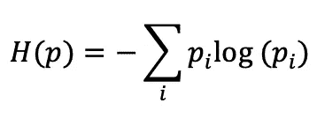
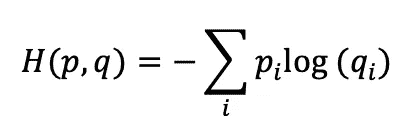
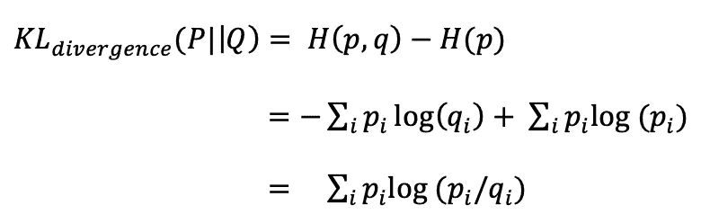

# 你的工具箱中的一个新工具，KL 散度介绍

> 原文：<https://towardsdatascience.com/part-i-a-new-tool-to-your-toolkit-kl-divergence-5b887b5b420e?source=collection_archive---------14----------------------->

## 以有趣且非常直观的方式揭开熵、交叉熵和 KL 散度的神秘面纱

[Image Source](https://www.shoezone.com/Boys/Size-Guide)

作为一名数据科学从业者，您在工作中多久使用一次 [KL 散度](https://en.wikipedia.org/wiki/Kullback%E2%80%93Leibler_divergence)的概念？你对[熵](https://en.wikipedia.org/wiki/Entropy)、[交叉熵](https://en.wikipedia.org/wiki/Cross_entropy)、或 [KL 散度](https://en.wikipedia.org/wiki/Kullback%E2%80%93Leibler_divergence)这些概念有多少清晰和把握？一点点，只是理论上的或者看过一次就忘了的类型。

不管是什么，都没关系。你一定在网上看过一些关于这个话题的文章，甚至我也看过，但是它太理论化和无聊了，以至于我们会随着时间而忘记。但是，等等，如果我提出一个完全不同的观点，这个观点使我很好地理解了这个概念，并使它成为我武器库中的一个强有力的武器。相信我，一旦你完成了这些，你就会知道如何在每个小的分类、聚类或其他日常机器学习问题中利用这些概念。

这篇文章之后会有另一篇文章。在这一部分，我们将从了解熵开始，然后是交叉熵，最后是 KL 散度。然后，我们将使用学到的概念，并将它们应用到一个数据集中，这将在下一篇文章中使事情变得非常清楚。我会尽我最大的努力让事情简单和直观，但请随时跳转到参考资料部分，并研究更多的主题。让我们开始旅程吧。

你也可以找到我在 Youtube 上的相同主题的视频。

My Youtube video on the same topic

# 1.理解熵

互联网上说熵是信息增益的数量。让我简单明了地说，熵就是与事件相关的无序、不确定性、惊奇或不可预测性的数量。这是什么意思？

举个例子，看到我预测的今天的天气，

1.  明天下雨的可能性为 50%。
2.  明天有 75%的可能性会下雨。

**哪个案例给了我们更多的信息增益或知识？**

当说到 50-50 的机会时，它意味着更多的不确定性，任何事情都有可能发生，因此有更多的随机性。而在第二种情况下，75%的下雨几率意味着下雨的可能性更大，随机性更小，或者获得新信息。因此，第一种情况比第二种情况具有更高的熵。

让我们再举一个例子，抛硬币的可能结果是什么，给定

1.  头部和尾部概率相等的无偏硬币，0.5
2.  正面概率为 0.75 的有偏硬币

和以前一样，在第一种情况下，有 50–50 的机会正面或反面。这意味着更多的不确定性，任何事情都有可能发生，因此有更多的随机性。而在第二种情况下，75%的正面机会意味着硬币的结果更有可能是正面，随机性更小，或新信息增益。因此，第一种情况比第二种情况具有更高的熵。

## 计算熵

系统“H(p)”的熵计算如下:

The entropy of the system

其中 *pᵢ* 是第 I 个事件的概率。

让我们计算上面例子的熵，并表明无偏硬币比有偏硬币具有更高的熵。

情况一:头部和尾部概率相等的无偏硬币的熵，0.5

=-0.5 * log(0.5)-0.5 * log(0.5)= 1.0

案例二:正面概率为 0.75 的有偏硬币的熵

=-0.75 * log(0.75)-0.25 * log(0.25)= 0.81

# 2.理解交叉熵

按照我的说法，交叉熵是拟合度，即预测分布与实际分布的接近程度。让我简化一下，

假设我们得到了一枚正面概率为 0.75 的有偏硬币。我们没有意识到硬币的偏见，所以

案例一:我们投掷硬币 100 次，得到 70 个正面和 30 个反面。我们的估计是硬币有偏差，正面概率为 0.70。

案例二:我们投掷硬币 100 次，得到 72 个正面和 28 个反面。我们的估计是硬币有偏差，正面概率为 0.72。

我们更接近情况 II 中的实际分布，因此情况 II 中的交叉熵比情况 I 中的更低。如果碰巧我们能够无任何误差地模拟真实分布，则交叉熵将与熵相同。因此，交叉熵总是大于或等于熵。

## 计算交叉熵

The Cross-Entropy of the system

其中 *pᵢ* 是第*个*事件的实际概率，q *ᵢ* 是第 I 个事件的估计概率。所用对数以 2 为底。

让我们计算上述示例的交叉熵，并显示情况 II 比情况 I 具有更低的交叉熵，因为它更接近实际分布。

情况一:发现硬币有偏差，头部概率为 0.70。

=-0.75 * log(0.70)-0.25 * log(0.30)= 0.820

情况二:发现硬币有偏差，正面概率为 0.72。

=-0.75 * log(0.72)-0.25 * log(0.28)= 0.814

显然，情况 II 的交叉熵小于情况 I，因为它更接近实际分布。

如果估计是，硬币偏向正面的概率是 0.75，

=-0.75 * log(0.75)-0.25 * log(0.25)= 0.811(最小，这里交叉熵与熵相同)

# 3.了解 KL 差异

KL 散度只是拟合分布和实际分布之间的差异，即交叉熵和熵之间的差异。还可以查看这两种分布有多大差异。

## 计算 KL 散度

KL Divergence

让我们举一个同样的例子，我们得到了一个偏向硬币，正面的概率是 0.75。我们没有意识到硬币的偏见，所以

案例一:我们掷硬币一百次，得到 70 个正面和 30 个反面。我们的估计是硬币有偏差，正面概率为 0.70。

KL = 0.75 * log(0.75/0.70)+0.25 * log(0.25/0.30)= 0.0088

案例二:我们投掷硬币一百次，得到 72 个正面和 28 个反面。我们的估计是硬币有偏差，正面概率为 0.72。

*KL-散度*= 0.75 * log(0.75/0.72)+0.25 * log(0.25/0.28)= 0.0032

显然，第二种情况下的距离比第一种情况下的距离小，因为第二种分布更接近实际分布。

如果估计是，硬币偏向正面的概率是 0.75，

*KL-Divergence*= 0.75 * log(0.75/0.75)+0.25 * log(0.25/0.25)= 0(熵与交叉熵相同)，所以两个分布没有区别。

# 4.结论

这是第一篇让我们彻底理解熵、交叉熵和 KL-散度的文章。我们也通过直观的方式和通过计算理解了这些术语，并通过例子看到了它们的价值。我希望这澄清了这个话题，给了它一个不同于传统互联网上的观点。在下一篇文章中，我打算在真实的数据集中使用这些概念。它将为每个人提供如何在每个小的分类、聚类或其他日常机器学习问题中利用这些学习到的概念的想法/直觉。不要错过它伙计们，记住我的话，它只会变得更好。

***我的 Youtube 频道更多内容:***

 [## 阿布舍克·蒙戈利

### 嗨，伙计们，欢迎来到频道。该频道旨在涵盖各种主题，从机器学习，数据科学…

www.youtube.com](https://www.youtube.com/channel/UCg0PxC9ThQrbD9nM_FU1vWA) 

写一篇清晰易懂的好文章需要很多努力。我会继续努力做好我的工作。在 [**中**](https://medium.com/@mungoliabhishek81) 关注我，查看我以前的帖子。我欢迎反馈和建设性的批评。

# 5.参考

1.  [https://en.wikipedia.org/wiki/Entropy](https://en.wikipedia.org/wiki/Entropy)
2.  [https://en.wikipedia.org/wiki/Cross_entropy](https://en.wikipedia.org/wiki/Cross_entropy)
3.  [https://en . Wikipedia . org/wiki/kull back % E2 % 80% 93 lei bler _ divergence](https://en.wikipedia.org/wiki/Kullback%E2%80%93Leibler_divergence)
4.  [https://towards data science . com/demystifying-entropy-f2c 3221 e 2550](/demystifying-entropy-f2c3221e2550)
5.  [https://towards data science . com/demystifying-cross-entropy-e 80 e 3 ad 54 a 8](/demystifying-cross-entropy-e80e3ad54a8)
6.  [https://towards data science . com/demystifying-KL-divergence-7 ebe 4317 ee 68](/demystifying-kl-divergence-7ebe4317ee68)