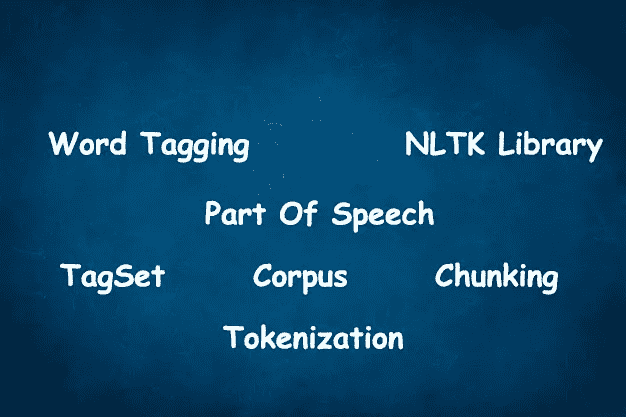
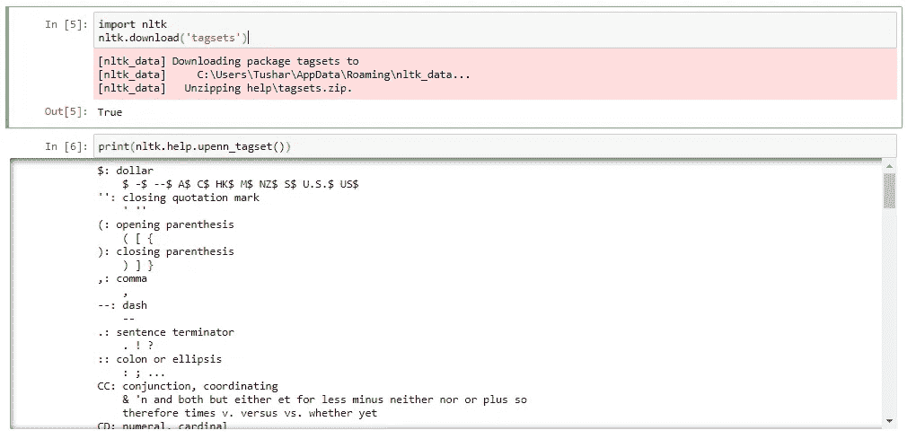
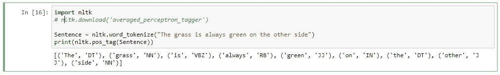
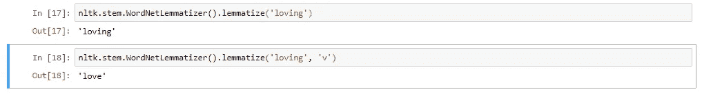
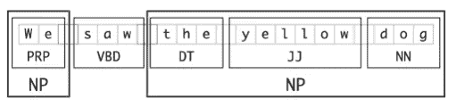
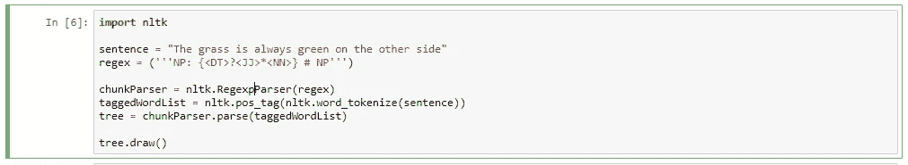
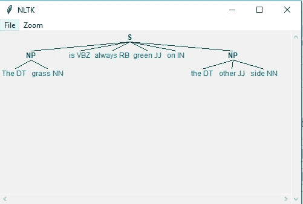

# 词性-单词标记

> 原文：<https://towardsdatascience.com/part-of-speech-word-tagger-c533e8ed1f51?source=collection_archive---------16----------------------->

将单词分类到它们的词性并相应地标记它们的过程被称为**词性标注**或**词性标注**，或简称为**标注**。

请查看 [GITHUB repo](https://github.com/TusharSri/MachineLearning/blob/master/NLP%20-%20Part%20Of%20Speech.ipynb) 的代码和其他酷项目

词类又称为**词类**或 [**词类**](https://en.wiktionary.org/wiki/lexical_category) 。

词性解释了一个词在句子中的用法。有八种主要的词类——名词、代词、形容词、动词、副词、介词、连词和感叹词。

用于特定任务的标签集合被称为**标签集**。

词性标注器，或称词性标注器，处理一系列单词，并给每个单词附加词性标签。

让我们首先运行下面的 coed，看看我们到底在谈论什么。

下面是输出。这是我们正在谈论的 POS 标签列表。

现在让我们试着输入我们自己的句子，看看 **NLTK 库**如何给每个单词添加 PosTag。

**注意**:为了得到词性，我们必须**对我们的句子进行分词。**

在下面的输出中，我们可以看到 POS 标签是如何被分配给每个单词的。

注意:如果你得到错误，那么你可以不注释第二行，这样就可以下载 averaged_perceptron_tagger。

下一个问题是这些位置是从哪里映射来的？？？
它们来源于语料库或统称为语料库。

语料库是用于语言研究和编写词典的书面语和/或口语的集合。

当我们提供输入时，在语料库中搜索这些单词以获得标记的位置。
NLTK 中包含的几个语料库已经标记了它们的词性
**事实:**文本到语音转换系统通常执行词性标记

如果语料库也被分割成句子，它将有一个 tagged_sents()方法，该方法将标记的单词分割成句子，而不是作为一个大列表呈现。

注意，词性标签已经转换成大写，自从 [**布朗语料库**](https://en.wikipedia.org/wiki/Brown_Corpus) **出版以来，这已经成为标准做法。**

因为我们对 POS 标记很熟悉，所以让我们看看如何使用它们，以及打电话后有什么好处。

在 Jupyter 笔记本中运行下面的例子。

在下面的例子中，我们可以看到在提供了“v”即“动词”标记后，我们得到了不同的输出。

如果没有 POS 标签，它会认为你输入的所有东西都是名词。所以这里它认为你在传递名词“爱”[(比如“甜蜜的爱”)](https://stackoverflow.com/questions/25534214/nltk-wordnet-lemmatizer-shouldnt-it-lemmatize-all-inflections-of-a-word/25535348#25535348)。

**春分？？？**

我们用它来检测句子中的实体。

看看下面的图片。

较小的方框显示单词级标记和词性标注，而大方框显示[更高级别的组块](https://www.nltk.org/book/ch07.html)。

组块工作在词性标注之上，它使用词性标注作为输入，并提供组块作为输出。
简单来说，这是一种标记的推广，其中一个连续的单词序列被分配一个标记
这也被称为浅层解析。由此产生的一组单词被称为“组块”
在浅层解析中，根和叶之间最多有一层，而深层解析包括不止一层。
浅层解析也叫轻解析或分块。

要创建块树，请在 Jupyter 笔记本中输入以下代码。

下面应该是代码和一个新的窗口将会打开，块树将会显示。

到目前为止，我们已经讨论了词性标注和组块。我们将在未来的帖子和实现中使用上述所有概念。

如果你发现文章有什么改进，请提出意见。