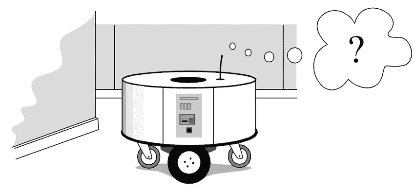

# 粒子滤波器:非线性和非高斯世界的英雄

> 原文：<https://towardsdatascience.com/particle-filter-a-hero-in-the-world-of-non-linearity-and-non-gaussian-6d8947f4a3dc?source=collection_archive---------2----------------------->

[粒子滤波](https://github.com/sharathsrini/Particle-Filter)技术在非线性、非高斯系统中的优越性决定了其广泛的应用范围。此外，粒子滤波器的多模态处理能力也是其被广泛应用的原因之一。在国际上，粒子滤波已经应用于各个领域。

*   在经济学领域，它被用于经济数据的预测。粒子滤波技术在非线性和非高斯系统中的优越性决定了它的广泛应用。此外，粒子滤波器的多模态处理能力也是其被广泛应用的原因之一。在国际上，粒子滤波已经应用于各个领域。数字无处不在，当它们被收集和记录时，我们称之为数据。机器学习是从数据中学习数学模型的科学。这样的模型，一旦从数据中学习
*   在军事领域，它已被应用于雷达跟踪空中目标、空对空、空对地被动跟踪
*   在交通控制领域，它被应用于汽车或人的视频监控。
*   在视觉分析领域，使用粒子滤波器开发了一种新的[模式识别模型，用于分割和跟踪视频序列中的嘴唇轮廓](http://users.isr.ist.utl.pt/~gcarneiro/publications/Icpr10_v2_sub.pdf)。
*   它也用于机器人的全球定位。

> 传统分析方法无法解决的问题现在正通过粒子模拟得到解决。

在动态系统的模型选择、故障检测和诊断中，出现了基于粒子的假设检验、粒子多模型、粒子似然比检测等方法。

在参数估计方面，通常将静态参数作为扩展状态向量的一部分，但由于参数是静态的，粒子会很快退化成一个样本。为了避免退化，常用的方法是人为地增加静态参数的动态噪声。

核平滑法，以及 Doucet 等人提出的点估计法，避免了对参数的直接采样，直接在粒子框架下使用最大似然估计(ML)和最大期望值(EM)算法对未知参数进行估计。

# 揭开神秘粒子滤波的神秘面纱

粒子滤波器(PF: Particle Filter)的思想基于*蒙特卡罗方法*，该方法使用粒子集来表示概率，可用于任何形式的状态空间模型。核心思想是通过从后验概率中提取随机状态粒子来表达其分布。它是一种序贯重要性抽样方法(序贯重要性抽样)。

[The breakdown of the concept](https://www.codeproject.com/Articles/865934/Object-Tracking-Particle-Filter-with-Ease)

简单来说，粒子滤波方法是指通过寻找一组在状态空间中传播的随机样本来近似概率密度函数，并用样本均值代替积分运算，从而得到状态最小方差分布的过程。

> 这里的样本指的是粒子，当样本数 N→∞时，可以近似任何形式的概率密度分布。

虽然算法中的概率分布只是真实分布的一种近似，但由于其非参数特性，可以摆脱求解非线性滤波问题时随机量必须满足高斯分布的约束，可以表达比高斯模型更广的分布。

它还具有更强的建模变参数非线性特性的能力。因此，粒子滤波能够准确表达基于观测和控制量的后验概率分布，可用于解决 SLAM 问题。

# 粒子滤波的发展

## 马尔可夫链蒙特卡罗**改进策略**

马尔可夫链蒙特卡罗(MCMC)方法通过构造具有良好收敛性的马尔可夫链从目标分布中产生样本。在 SIS 的每次迭代中，结合 MCMC 将粒子移动到不同的位置以避免退化，马尔可夫链可以将粒子推向更接近*概率密度函数* (PDF)。使样本分布更加合理。

## **无味粒子滤波(UPF)**

无迹卡尔曼滤波器(UKF)是由 Julier 等人提出的。EKF(扩展卡尔曼滤波器)使用一阶泰勒展开来逼近非线性项，并使用高斯分布来逼近状态分布。UKF 类似于 EKF，具有近似状态分布的高斯分布，但是没有线性化，仅使用了一些称为适马点的样本。

这些点通过非线性模型后，得到的均值和方差可以精确到非线性展开泰勒的二阶项，使得非线性滤波更加精确。Merwe 等人提出使用 UKF 来生成 PF 的重要性分布，称为无迹粒子滤波(UPF)。UKF 产生的重要性分布大于真实状态 PDF 的重叠，估计精度更高。

# 数据科学和机器人学中的粒子滤波

粒子滤波器现在广泛应用于金融市场模型的估计，特别是随机波动模型。

> 粒子滤波方法是递归贝叶斯滤波，当模型是非线性的并且噪声不是高斯的时，它提供了一种方便和有吸引力的方法来近似后验分布。

这些技术提供了许多问题的一般解决方案，其中线性化和高斯近似是难以处理的或者会产生太低的性能。非高斯噪声假设和对状态变量的约束的结合也可以以自然的方式进行。此外，粒子滤波方法非常灵活，易于实现，可并行化，并适用于非常普遍的设置。

## 基于粒子滤波器的机器人定位

An Indoor robot navigating its way inside a office

The lost robot on a map with the approximation of its location

粒子滤波器解决了应用机器人学中的许多问题。假设我们可能有想要追踪的移动物体。也许这些物体是战斗机和导弹，或者也许我们正在跟踪在田野里打板球的人。这其实并不重要。让我们考虑一下三维机器人问题的特点:

*   **多模态**:我们想同时跟踪零个、一个或多个物体
*   **遮挡**:一个对象可以隐藏另一个对象，导致多个对象的一次测量。
*   **非线性行为**:飞机受到风的冲击，球以抛物线运动，人们相互碰撞。
*   非线性测量:雷达给我们一个物体的距离。将其转换为(x，y，z)坐标需要平方根，这是非线性的。
*   **非高斯噪声:**当物体在背景上移动时，计算机视觉会将部分背景误认为是物体。
*   **连续:**物体的位置和速度(即状态空间)可以随时间平滑变化。
*   **多变量**:我们想要跟踪几个属性，比如位置、速度、转弯率等。
*   **未知流程模型**:我们可能不知道系统的流程模型

The initial assumption of the localized pose is noisy as we can see the points spread across the grid (map). As the robot moves further the particles converge which explains the convergence of the particles.

各种机器人表示，在仓库中导航的室内机器人可以使用粒子过滤器根据测距传感器的输入来定位自己，例如 2D 激光扫描仪或用于自动驾驶汽车的[粒子过滤器](https://github.com/sharathsrini/Particle-Filter)可以用于融合传感器输入并识别道路上的车道标志。无人驾驶飞机可以使用粒子过滤器来优化光流。

## **强化学习算法和粒子滤波器**

Reinforcement learning, in the context of artificial intelligence, is a type of dynamic programming that learns and perfects an algorithm using a system of reward and punishment.

基于粒子滤波器的强化学习(RL)算法在计算上是廉价的，且具有非常低的内存占用。包括基于粒子滤波器的直接全局策略搜索的 RL 算法将在由所选策略参数化定义的策略空间中执行搜索。

粒子过滤器可以是 RL 算法的核心概念，可以通过创建粒子来指导探索和开发，每个粒子代表一个整体策略。由于粒子滤波器执行全局搜索的能力，所得到的 RL 算法应该能够在策略空间中直接进行全局搜索，这是对传统的基于局部搜索的策略 RL 的显著改进。

这增加了价值，因为它继承了粒子过滤器的许多优点，其中包括:

*   它实现起来非常简单，可以很容易地在嵌入式系统中实现在线学习
*   它可以通过更改σ参数的值，根据可用资源(时间和 CPU 方面)使用自适应计算
*   它可以将 RL 探索的努力集中在策略空间的最重要部分，
*   通过改变初始噪声水平和衰减因子λ，它可以根据精度和时间的要求表现出自适应的收敛速度

# 粒子滤波的危害

虽然粒子滤波算法可以作为解决 SLAM 问题的有效手段，但是该算法仍然存在一些问题。主要问题是需要大量样本来近似逼近系统的后验概率密度。机器人面临的环境越复杂，描述后验概率分布需要的样本就越多，算法就越复杂。

因此，能够有效减少样本数量的自适应采样策略是算法的重点。此外，重新采样阶段会导致样本有效性和多样性的丧失，从而导致样本耗尽。如何保持粒子的有效性和多样性，克服样本的枯竭也是重采样算法的重点。

在强化学习中，粒子滤波作为全局搜索方法的一员，一般需要更多的尝试才能收敛，因为搜索的范围是最大可能的——整个策略空间。

粒子滤波器没有严格的收敛性证明。理论上，我们用全局搜索方法交换了“局部收敛的证明”,该方法没有全局收敛的证明，但至少保证不会陷入局部最优。