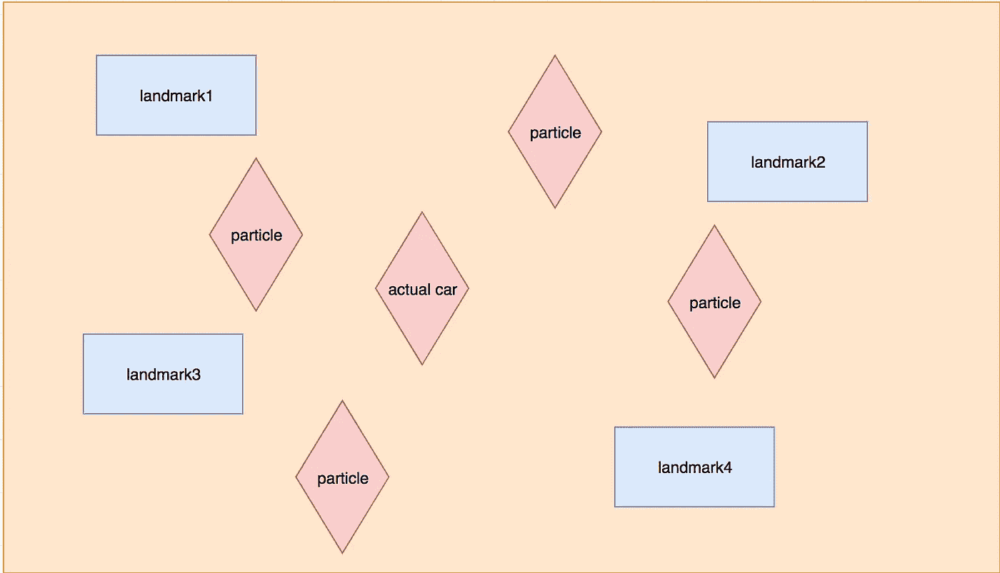
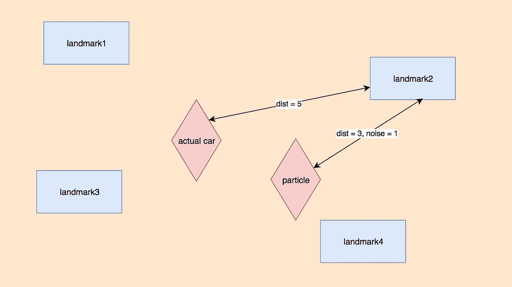
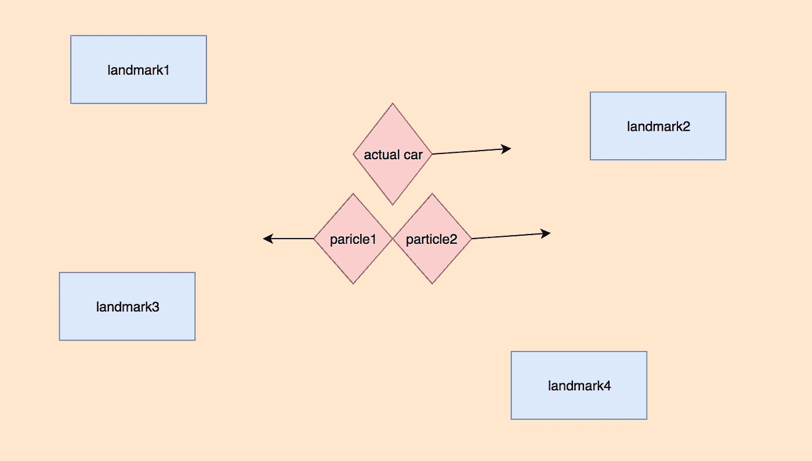

# 定位粒子滤波

> 原文：<https://towardsdatascience.com/particle-filter-on-localisation-9e0802282aaf?source=collection_archive---------16----------------------->

## 粒子滤波器在自动驾驶汽车上的应用概述

在之前的[帖子](/kalman-filter-3-localisation-in-continuous-state-space-1c979f6bde5b)中，我们谈到了卡尔曼滤波器在帮助自动驾驶汽车定位方面的作用。课程[在这里](https://classroom.udacity.com/courses/cs373/lessons/48704330/concepts/484805920923)介绍了另一种叫做粒子过滤器的定位方法，这很有趣，我认为它可以以某种方式被塞进一篇文章中，所以我将简要介绍粒子过滤器的概念并实现它。

# 直觉

顾名思义，粒子过滤器构建了许多粒子来代表我们对汽车位置的猜测。考虑一个场景，一辆自动驾驶汽车在一个有 4 个主要地标的世界中行驶:



汽车上的传感器能够粗略计算汽车和四个地标之间的距离，同时我们初始化大量粒子，每个粒子代表汽车潜在位置的猜测。**基于来自实际汽车的测量和来自虚拟汽车(粒子)的测量，我们应该能够生成每个粒子是实际汽车的后验概率**，并且随着汽车继续移动，不相关的粒子将被逐渐过滤掉。

所以一般来说，粒子过滤器包括 4 个步骤:

1.  生成一组粒子
2.  测量每个粒子成为实际汽车(机器人)的概率
3.  基于概率权重的重采样
4.  重复移动到接近方向

让我们一步一步来。

# 产生粒子

除了粒子是我们对汽车实际位置的猜测，它应该具有实际汽车的所有功能。

这里的代码指的是课程[。首先在这个 2D 世界中，一辆汽车被定义为 3 个基本元素`(x, y, orientation)`，所以在 init 函数中，它随机初始化这 3 个元素，这里的噪声是每个动作的不确定性。其次在`set`和`set_noise`功能中我们可以直接设置位置、方向和噪声。第三，汽车应该能够`sense`和`move`，而`sense`测量与每个地标的距离，`move`在汽车采取行动后返回新的状态。](https://classroom.udacity.com/courses/cs373)

现在让我们首先生成一辆真实的汽车:

```
[x=27.984 y=67.990 orient=4.0437]  # the real location of the car
```

然后生成随机猜测的粒子:

上面的代码生成了 1000 个粒子，每个粒子都有随机初始化，但噪声固定`(0.05, 0.05, 5.0)`。

```
[[x=89.958 y=44.058 orient=0.5153],
 [x=67.425 y=71.905 orient=3.0930],
 [x=11.044 y=60.100 orient=2.3018],
 [x=21.359 y=43.892 orient=4.0847],
 [x=6.6223 y=41.454 orient=0.8310]]
```

通过打印出初始化，我们可以看到每个粒子可以有非常不同的位置和方向。

# 测量概率

现在让我们让汽车行驶，获得每个粒子概率的想法是，通过使用来自实际汽车的测量值，并给出每个粒子的测量值，我们应该能够计算每个粒子成为实际汽车的可能性。让我们看下面的例子:



假设我们将仅基于地标 2 的距离测量来测量图中粒子的概率。粒子的距离为 3，噪声为 1，也就是说**测量服从高斯分布** `N(3, 1)`，**表示粒子可以用距离 4.2、3.2、5.1、1.2、…，以不同的概率测量自身。**现在问题来了，给定我们的汽车测量值`dist = 5`，这个粒子也测量距离 5 的自身的概率是多少？**答案是计算 5 给定分布的概率** `N(3, 1)`。

所以在`robot`类中，我们需要增加两个函数:

我们可以通过以下方式来衡量每个概率:

我们的 1000 个粒子每个都将采取与实际汽车相同的移动，之后，每个粒子将通过`rob.measurement_prob(Z)`计算其概率给定测量`Z`。

**经过概率计算，靠近实际位置的粒子概率较高，远离实际位置的粒子概率较低。**所以下一步要明确，对粒子进行采样，保留大概率的粒子。

# 重采样

现在每个粒子都被标注了不同的概率，我们希望保留高概率的粒子，在我们的下一轮迭代中使用它们。这样做的方法是基于概率权重进行重新采样。

这是一种相当原始的基于权重的采样方式，我并不完全理解。我猜`np.random.choice`也可以做到同样的效果，但是请记住，我们需要基于当前的概率权重重新采样一个相同大小的粒子列表。

# 找到方向

我们已经谈了很多关于距离和位置的问题。但是，即使我们能够得到最接近我们的汽车的位置的粒子，我们如何能够确定它的方向呢？

**事实上，我们可以通过汽车行驶到地标的距离来暗示方向。**考虑以下场景:



假设我们有两个粒子，粒子 1 和粒子 2，它们同样接近真实的汽车。然而，粒子 2 朝着我们汽车的同一个方向运动，而粒子 1 则相反。显然，随着时间的推移(更多轮次的迭代)，粒子 1 的概率将显著降低并最终被过滤掉，而粒子 2 更有可能存活下来。

所以定位方位的方法就是让车多做动作，走的更远。最后，我们需要将代码放入一个循环中:

最终，只有位置和方向最接近的粒子才能存活下来(完整实现[此处](https://github.com/MJeremy2017/Machine-Learning-Models/blob/master/Localisation/particle-filters.ipynb))。

**参考**:

1.  【https://classroom.udacity.com/courses/cs373 