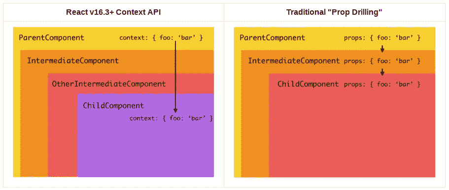

# 在 React 组件(父组件、子组件、兄弟组件)之间传递数据

> 原文：<https://towardsdatascience.com/passing-data-between-react-components-parent-children-siblings-a64f89e24ecf?source=collection_archive---------1----------------------->


React 是由 T2·脸书创建的一个 JavaScript 库。React 中的数据处理可能有点棘手，但并没有看上去那么复杂。我目前在 React 中编译了三种数据处理方法

1.  从父母到孩子使用道具
2.  使用回调从子进程到父进程
3.  兄弟姐妹之间:
    (一)结合以上两种方法
    (二)使用 Redux
    (三)使用 React 的上下文 API

这个博客主要包含了这些概念的实现的汇编，这对于任何试图一目了然地掌握事物的初学者来说肯定是有益的。

# **从父母到孩子使用道具**

让我们考虑这样的目录结构，即父组件在应用程序中呈现子组件。

```
App
└── Parent
    ├── Child1
    └── Child2
```

这是 React 中最简单的数据流方向，也是最基本的方向。

```
class Parent extends React.Component {state = { data : "Hello World" } 
render() {

        return (
            <div>
                 <Child1/>            //no data to send             
                 <Child2 dataFromParent = {this.state.data} />
            </div>
        ); }
}
//It is no compulsion to use the data to send as a state, simple vars or const variables could also be used to send data from Parent to Child.
```

只需使用 this.props.dataFromParent(只是一个用于发送 props 的变量)来访问从父节点发送到子节点的数据。

```
class Child2 extends React.Component {
render() {

        return (
            <div>
                The data from parent is:{this.props.dataFromParent}
            </div>
        );
    }
}
```

# 使用回调从子进程到父进程

让我们假设我需要从 Child1 向 Parent 发送一条消息——“嗨，Popsie，最近怎么样？”。为此，我需要遵循一系列步骤。

***第一步:*** 定义一个回调函数，该函数接受一个我们认为是从 Parent.js 中的 child 访问的参数
***第二步:*** 同样，将定义好的回调函数作为道具发送给 Child1.js

```
class Parent extends React.Component {state = { message: "" }callbackFunction = (childData) => { this.setState({message: childData})},render() {
        return (
            <div>
                 <Child1 parentCallback = {this.callbackFunction}/>
                 <p> {this.state.message} </p>
            </div>
        );}
}
```

***第三步:*** 在 Child1.js 中使用 this . props . callback(data to parent)发送数据

```
class Child1 extends React.Component{sendData = () => {
         this.props.parentCallback("Hey Popsie, How’s it going?");
    },render() { 
//you can call function sendData whenever you'd like to send data from child component to Parent component.
    }
};
```

# 兄弟姐妹之间

当我还是初学者时，我很难决定选择哪种方法在兄弟姐妹之间共享数据，我知道有三种方法在兄弟姐妹之间共享数据，它们都有自己的优缺点。
**方法一:** *将以上两种共享数据的方法结合起来。然而，这种方法不适用于复杂的目录结构，因为人们将不得不编写大量代码来在彼此相距甚远的组件之间发送数据。然后，数据将不得不通过每个中间层被推和拉。*


**方法 2:** *使用一个全局存储来维护所有子组件的状态，这些子组件需要从存储中交互和消费所需的数据—* ***Redux***


**方法 3:** *使用 React 的 Context API* 关于 React 为什么升级到 Context API 以及哪一个在哪些方面更好，已经有大量的文章和博客，这两篇文章将有助于理解这一切:

[](https://blog.bitsrc.io/react-context-api-a-replacement-for-redux-6e20790492b3) [## React 上下文 API——Redux 的替代品？

### 将使用 Redux 进行状态管理的 React 应用程序转换为使用 React 的新上下文 API

blog.bitsrc.io](https://blog.bitsrc.io/react-context-api-a-replacement-for-redux-6e20790492b3)  [## 你可能不需要 Redux

### 人们往往在需要之前就选择 Redux。“如果没有它，我们的应用无法扩展怎么办？”后来，开发商皱眉…

medium.com](https://medium.com/@dan_abramov/you-might-not-need-redux-be46360cf367) 

我使用过这种方法，并且已经稍微倾向于在 Redux 上使用这种方法。

> Context API 的主要优势在于它将开发者从钻柱中解救出来。(Prop-drilling 指的是将变量传递给子组件的技术。主要思想是函数式编程，将参数传递给下一个函数，依此类推)



Image source: Google

考虑目录结构，我们需要在 Child1 和 Child2 之间传递数据。[ Child1 必须发送消息—“SSup 兄弟？?"to Child2 ]
我们使用上下文 API 通过以下方法实现这一点:

```
App
├── Child1
└── Child2
```

**步骤 1:** *为两个孩子创建一个提供者组件。这个提供者维护状态(组件和一些用于操作状态的回调所使用的数据)并返回一个 contextObject。提供商 JSX 组件)*

**第二步:** *将状态和回调函数作为道具传递给 Provider 组件内部的所有子组件。*

```
export const MContext = React.createContext();  //exporting context objectclass MyProvider extends Component {state = {message: ""}render() { return ( <MContext.Provider value={ {   state: this.state, setMessage: (value) => this.setState({ message: value })}}> {this.props.children}   //this indicates that the global store is accessible to all the child tags with MyProvider as Parent </MContext.Provider>) }}
```

> 提供者是其子代的老板(所有状态和操作这些状态的回调函数的全局存储)。需要任何东西的人必须首先联系提供者才能访问对象。

(a)要通过 Child1 设置或操作消息，它必须访问提供者并设置提供者的状态。

(b)要按 Child2 查看/访问数据，它必须访问 Provider 以获取状态。

**第三步:** *使用 MyProvider 组件作为两个子组件——child 1、child 2——的父组件。*

```
class App extends React.Component {render() {
        return (
            <div>
                 <MyProvider> <div className="App"> <Child1/> <Child2/> </div> </MyProvider> </div>
        );
}
}
```

**第四步:***以同样的方式实现想要的结果，但是这一次，使用 ContextObject。消费者如下所述:*
两个孩子——孩子 1 和孩子 2 都是提供者的消费者。从今以后，它们在消费者标签中访问提供者。

```
import MContext
class Child1 extends React.Component {render() { return ( <div> <Mcontext.Consumer> {(context) => ( <button onClick={()=>{context.setMessage("New Arrival")}}>Send</button> )} </Mcontext.Consumer> </div> ) }}
```

现在 Child2 是如何接收数据的？
简单来说，就是使用消费者标签访问提供商。

```
import MContext
class Child2 extends React.Component {render() { return ( <div> <Mcontext.Consumer> {(context) => ( <p>{context.state.message}}</p>)} </Mcontext.Consumer> </div> )}}
```

我希望这为 React 中不同组件之间的数据传递提供了清晰的实现细节。
推荐:

[](https://medium.com/@wisecobbler/using-context-in-react-56a8e7da5431) [## 在 React 中使用上下文

### 我有机会在 React Conf 2018 上谈论 React 中使用上下文的新方法。这篇博文是一篇文字…

medium.com](https://medium.com/@wisecobbler/using-context-in-react-56a8e7da5431)