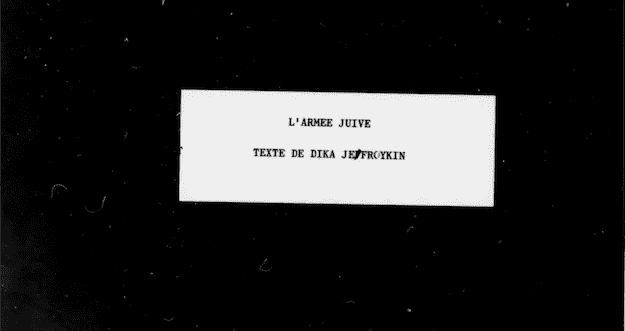

# 通过艾将纳粹浩劫的故事传递给年轻一代

> 原文：<https://towardsdatascience.com/passing-shoah-stories-onto-younger-generations-thanks-to-ai-69594b1fc237?source=collection_archive---------21----------------------->

## 数据科学如何支持大屠杀幸存者证词的传播？



JEWISH ARMY, TEXT OF DIKA JEFROYKIN

我的祖父朱尔斯·迪卡·杰弗罗金从来没有谈起过他在二战期间的岁月。我们只知道他是法国抵抗组织的一员。然而，我们不知道他在抵抗运动中做了什么，也不知道他参与的程度。

我一直想知道在战争年代我的家庭发生了什么，我不断地研究我的家族史。在某个时候，我放弃了，并停止了寻找，认为我再也找不到比他的一些朋友在乔治·洛因格的书*“Les réresistences juives pendant l ' occupation”*中发表的十行[传记](http://www.ajpn.org/personne-Jules-Jefroykin-2167.html)更多的东西了。

然后，上个月，我第一次去波兰进行了一次“寻根”之旅。这非常有力，提醒了我传承历史的重要性，尤其是在如今纳粹浩劫幸存者越来越少的时候。

> *“为了死者和生者，我们必须作证。”，* [*埃利·威塞尔*](https://en.wikipedia.org/wiki/Elie_Wiesel)

我一直有一种感觉，我需要发现我的家族历史，并为下一代做一个“目击者的目击者”。

所以参观完之后，我又开始寻找。一次偶然的机会，我在网上发现，在华盛顿 DC 的美国大屠杀纪念馆保存的一份文件中提到了我祖父的名字。我让他们寄给我，两天前我收到了。我惊奇地发现，这是我祖父关于他在法国抵抗运动中的作用的证词！他的故事的 26 页法文 PDF 草稿。

# 什么能帮助我？

我想清理这段文字，让每个人都更容易阅读，以传播和保存他的记忆，并能够出版它，以帮助下一代获得关于纳粹浩劫历史的洞察力和知识。我们生活在一个有趣的时代，随着人口的减少，越来越少的年轻人有机会听到幸存者的声音，但可以让年轻人接触幸存者的技术却在不断发展。

作为一名数据科学家，我一直试图利用我的技能做好事，我坚信人工智能可以成为社会变革的伟大工具。使用人工智能来帮助我分享我祖父的故事显然是下一步。

## PDF 转换为文本文档

为了能够纠正错误和他的手写笔记，我需要一个文本文档。我使用了基于深度学习的文本识别:基于 [LSTM](https://en.wikipedia.org/wiki/Long_short-term_memory) 的[谷歌的 OCR 引擎宇宙魔方](https://github.com/tesseract-ocr/tesseract)。

*为了重现下面的代码，你需要 pip 安装所有导入的包。此外，你需要安装宇宙魔方。*

## 词频

除此之外，我使用了一些 NLP 技术、方法、技术、算法来进行总结。下面是一些用 [nltk](https://www.nltk.org/) 和 [gensim](https://radimrehurek.com/gensim/) 提取摘要的例子。

```
**# Most frequent words** ['Juifs', 'Joint', "l'AJ", "l'Agence", 'Juive', "l'argent", 'jeunes', 'fait', 'France', 'fonds', '11', 'accord', 'Jefroykin', 'fallait', 'faire']*# '11' is an OCR mistake for 'Il'***# In English, powered by Google Translate** ['Jews', 'Joint', 'AJ', 'Agency', 'Jewish', 'money', 'young', 'made', 'France', 'funds', '11','agreement','Jefroykin','must','do']
```

所有文本中出现频率最高的词会直接给你主题。我们可以看到作者的名字' *Jefroykin* '，他合作过的两个组织' *Joint* '为 [American Joint](https://www.jdc.org/) 和' *L'AJ* '为 [Jewish Army](https://en.wikipedia.org/wiki/Arm%C3%A9e_Juive) ，他的组织。

## 摘录摘要

今天，人们的注意力持续时间很短，特别是在消费新闻和其他信息时，所以摘要是参与的关键部分。这就是为什么我使用一些 NLP 技术、方法、技术和算法来自动总结较长的文档。这里有一些用 [nltk](https://www.nltk.org/) 和 [gensim](https://radimrehurek.com/gensim/) 摘录的例子。

```
**# NLTK 2 Sentence Summary:** Il y a donc eu un accord confidentiel entre la Direction  européenne du Joint située à Lisbonne, et Dika Jefroykin, représentant du Joint et France, #'autorisant à récolter de     l'argent -remboursable après la guerre —  Le but du Passage en Espagne de Jefroykin était triple, D'abord, diriger un convoi "cobaye" après une longue interruption des passages. Deuxièmement, rétablir une liaison entre le Joint au Portugal sa représentation en Espagne et l'AJ en France, Troisièmement, assurer un accord avec l'Agence Juive pour que les jeunes qui souhaitaient rejoindre la Brigade Juive en Palestine puissent être assurés de pouvoir le faire,**# Gensim Summary:** Il y a donc eu un accord confidentiel entre la Direction  européenne du Joint située à Lisbonne, et Dika Jefroykin, représentant du Joint et France, #'autorisant à récolter de     l'argent -remboursable après la guerre —  Le but du Passage en Espagne de Jefroykin était triple, D'abord, diriger un convoi "cobaye" après une longue interruption des passages.
```

## 翻译

然后，我将这些摘要翻译成英文，让更多的人能够看到文本，这要感谢[谷歌云翻译 API](https://cloud.google.com/translate/docs/reference/libraries) 。

```
**# NLTK summary translated** There was therefore a confidential agreement between the European Directorate of the Joint located in Lisbon, and Dika Jefroykin, representative of the Joint and France, # authorizing to collect money-refundable after the war - The purpose of the Passage in Spain of Jefroykin was triple, First, to lead a convoy "guinea pig" after a long interruption of passages. Secondly, to re-establish a liaison between the Joint in Portugal its representation in Spain and the AJ in France, Third, to ensure an agreement with the Jewish Agency so that young people who wished to join the Jewish Brigade in Palestine can be assured of being able to do so ,**# Gensim summary translated** There was therefore a confidential agreement between the European Directorate of the Joint located in Lisbon, and Dika Jefroykin, representative of the Joint and France, # authorizing to collect money-refundable after the war - The purpose of the Passage in Spain of Jefroykin was triple, First, to lead a convoy "guinea pig" after a long interruption of passages.
```

这两个摘要都为我们提供了第一页的含义，即使一句话的摘要似乎已经足够好了。使用这些技术帮助我完成了一个文本文档，并理解了证词的关键部分。

# AI 为好

就像互联网和社交媒体一样，多年前，人工智能也应该被用来继续教育的重要工作——纳粹浩劫和其他过去的种族灭绝，以及今天仍在世界各地发生的暴行。

> 忘记过去的人注定要重复过去。”，温斯顿·丘吉尔。

此外，是时候将人工智能引入慈善和人类组织了。高科技工作者应该支持它，并为社会公益贡献他们的知识。我管理着一个名为 [Data For Good Israel](https://www.meetup.com/fr-FR/Data-for-Good-Israel/) 的组织，我们正试图利用人工智能的巨大力量来做到这一点。让我们传播这个消息吧！

*PS:如果你对见证感兴趣，我可以和你分享，给我发消息就好。*

我要感谢来自 Zencity 的同事和朋友，他们在这个项目中发挥了重要作用:Inbal Naveh Safir、Traci Siegel、Ori Cohen 和 Yoav Talmi。

[Samuel Jefroykin](https://www.linkedin.com/in/samueljefroykin/) 是 [Zencity.io](https://zencity.io/) 的一名数据科学家，他试图积极影响城市的生活质量。他还共同创立了 [Data For Good Israel，](https://www.dataforgoodisrael.org/)一个致力于利用数据的力量解决社会问题的社区。