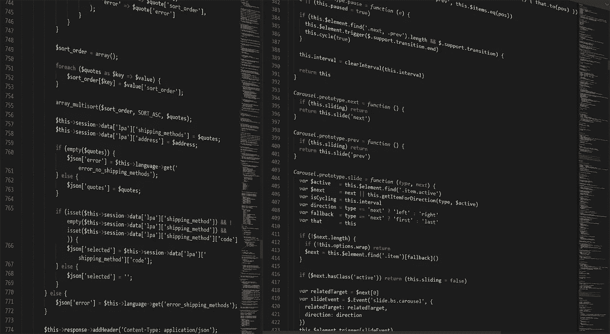

# 通过可怕的数据科学课后作业:2021 年更新

> 原文：<https://towardsdatascience.com/passing-the-dreaded-data-science-take-home-assignment-8ae5d55f256b?source=collection_archive---------6----------------------->

“这只需要你 3 到 5 个小时的时间。”

*“作为我们流程的一部分，接下来是简单的标准化带回家作业”*

*“应该不到 3 个小时(我们真的是这个意思)。”*

这些原话你见过多少次了？希望在你的数据科学面试过程中不会太多。但是，如果你是许多正在找工作的数据科学家中的一员，你可能会发现自己正在做一个数据科学带回家的作业，它是一个压缩文件，里面有一个长达 10 页的需求 pdf。

招聘人员承诺，你的任务有一个复杂的评分过程，不会超过几个小时。但是**突然到了凌晨 2:30，三天后，15 个小时**的编码疲劳开始了，你甚至没有想过尝试一下 GAM 模型，看看它是否能让你的模型的 F1 分数提高 3%。

是的，数据科学带回家的作业应该被**取缔，禁止，至少可能在你工作的时候得到补偿**，在你被干掉之前，这些工作可能真的会碰到招聘经理的垃圾邮件过滤器。是的，我表面上写了我在 T11 之前有多恨他们。但不幸的是，似乎不知何故，他们会留在这里。

> 有兴趣聘请一名数据科学家和机器学习工程师吗？不知道如何建立标准化的数据科学挑战？
> 
> [阅读更多关于我们如何帮助公司构建定制的数据科学招聘解决方案的信息](https://www.interviewquery.com/employer)

我甚至没有说这只是未经证实的初级候选人的过程的一部分。上个月在**几乎每一次我与** [**采访询问**](https://www.interviewquery.com/) **客户**的反馈会议中，他们提到了一次采访，在那次采访中，他们收到了一份带回家的作业，花了他们十几个小时才完成，结果得到的只是一封迅速拒绝的电子邮件。为什么这种事情还在继续发生？为什么公司浪费应聘者的时间，却没有任何反馈？

事实是，对于许多没有标准化面试流程的公司来说，这个流程就像是一个过滤器。开发技术面试问题需要数据科学团队的知识历史，而与软件工程师相比，这是不存在的。

所以如果你必须，不得不，并且没有其他选择的话，做一个带回家的作业。这里有几个步骤，以确保更顺利的过程。

> 想练习一系列数据科学带回家的挑战吗？退房 [**面试查询**](https://www.interviewquery.com/) 为你下次带回家做准备。

# **提前询问期望和未来反馈**

你至少应该从招聘人员或招聘经理那里了解三件事:

1.  如果有机会的话，除了做带回家的作业，是否还有其他选择。
2.  你会得到对你工作的反馈，而不是一封标准化的拒绝邮件。
3.  你了解你将被评分的标准和程度。

首先，仔细检查公司是否会给你提供技术筛选，而不是带回家的作业。如果替代方案意味着让候选人退出面试过程，许多公司都会这么做。数据科学现在炙手可热，我的许多朋友告诉我，他们选择上一个雇主是因为他们**在没有带回家的情况下，面试过程进行得更快。**

不过，这里还有一个检查，这家初创公司是否会向资深候选人提供技术筛选，然后只允许你为同一职位选择数据科学带回家的挑战？他们真的不应该，因为那是违法的。

第二，如果你提前征求反馈，但没有得到回应，或者不明白你将被评分的标准，**我会重新考虑面试过程**。为什么要经历自由工作的混乱，而没有至少一些反馈，也不知道别人会如何评价你？这就像是没有任何期望地去参加 SAT 考试

我知道很难去反对正在面试你或将要面试你的人或公司。但是要明白这是一种互利的关系。你们两个人都在这个过程中，他们面试你是因为他们想看到你成功，而不是他们希望你做些无脑的工作。

需要一个邮件模板来复制要求两个条件？这里有一个模板，欢迎你使用。

*你好，招聘人员姓名，*

谢谢你送来带回家的作业。我很高兴可以开始使用它，并且一定会在 X 天内将它和我完成的解决方案一起发送回来。

另外，我想知道是否可以给我一套关于作业评分的通用指南。我肯定要确保我专注并展示了带回家的正确技能，而不是不小心掉进兔子洞。

最后，如果在我提交了带回家的作业后，我能得到一些反馈，我会非常感激，不管我是否会继续面试。了解我做错了什么，或者我在技术成长方面做得好的地方，这真的意义重大。

*谢谢！*

# **提问并陈述假设**

数据科学的课后作业是一场冗长的单边面试。在一个典型的现场面试中，如果你的面试官是一个好人，你可以问一些关于提示的问题，他们会给出深思熟虑的回答。在数据科学带回家挑战中，你应该做同样的事情。

在接到带回家的任务后，试着立即列出一份你必须发给招聘人员/招聘经理的问题清单。即使你的问题得到了答案或者没有得到答案，也要确保在你的作业中陈述你的假设。我这么说是什么意思？

如果您决定仅使用简单的插补模型来填充缺失值，而不是使用高级技术，该怎么办？陈述一下。写在评论里吧。做一些事情，让他们明白你在这项任务上花费的时间有限。

如果您最终使用 XGboost 而不是 Tensorflow，因为您意识到您可以更快地迭代，即使它在性能上可能不太强大，会怎么样？陈述一下。在你的简历中告诉招聘经理。他们需要理解你为什么选择你所做的模型。

写下你认为需要让你的评分者知道的一切。招聘经理忘记了编写代码和构建模型需要多长时间。他们是经理。他们不写代码。

# **放入建模基线**

让我们假设数据科学的家庭作业更多的是建模挑战，而不是分析师挑战。系统会提示您从数据集创建模型。您直觉地知道，您必须清理、训练和验证数据集之外的模型，但是您能够并且实际上应该做多少呢？

这里有一个大概需要你至少三个小时的清单。

*   数据清理
*   最小特征选择
*   估算缺失值
*   创建分类管道
*   尝试使用几个 sci-kit 学习分类器进行训练
*   使用网格搜索调整超参数

嘣。现在，您的实现将达到他们期望的一般最低基线。根据你在功能选择上工作的时间长短，可能会多加或减两到三个小时。

同样，如果你不希望付出额外的努力，并希望评分者理解这一点，那么就把它写进去。让他们知道。

# **让你的代码可读**

没有什么比看着杂乱的代码更让数据科学招聘经理拒绝你的了。在你完成所有的数据清理和模型构建之后，记得**重构你的代码**。将你的任务分成不同的功能。不要让混乱的代码排在 main()函数的下面。试着换个角度看问题，或者问朋友他们是否能理解。

对于数据科学家来说，这是一个很好的代码组织和可读性指南。这是关于以一种容易理解的方式组织你的项目。我偶然发现了这个，但它完全有道理。 [Cookiecutter 数据科学框架](https://drivendata.github.io/cookiecutter-data-science/#cookiecutter-data-science)允许数据科学项目的标准化流程。直接取自他们的网站:

*   *更轻松地与您合作进行分析*
*   *从你对过程和领域的分析中学习*
*   *对分析得出的结论充满信心*

我会注意到，用完整的格式来组织你的项目肯定会花费你几个小时以上的时间。但话说回来，当你决定做带回家的作业时，你已经明白了成本。

# **编写测试和注释**

我有没有提到把你脑子里的一切都记录到纸上？这包括写评论和测试你的代码，如果它适用的话。可读性和代码的效率一样重要，如果你在每个函数上都写了很好的注释块，这将有助于传达你的代码应该如何运行，以及你为什么要这样重构它。遵循一般的 Python 惯例来确保你是可靠的。

# 用 500 字以下总结你的思维过程！

还记得高中英语的时候，所有的论文都是由引言、内容，然后是结论组成，结论重复了引言。做到这一点，但在 500 字以内。在一天结束时，最有可能的情况是，看你带回家作业的人会花总共五分钟的时间来理解它，然后继续浏览 Reddit。你要让他们尽可能容易地理解你的数据科学带回家的作业是有史以来最好的带回家的作业。

## 感谢阅读！

*   *想要顶级科技公司的数据科学面试问题和带回家的挑战吗？查看* [***面试查询***](https://www.interviewquery.com/)**和我们的* [*面试备考包*](https://www.interviewquery.com/pricing) *！**
*   ***订阅 Youtube 上的** [**我的频道**](https://www.youtube.com/channel/UCcQx1UnmorvmSEZef4X7-6g/) 获取数据科学[模拟面试](https://www.youtube.com/watch?v=e2LJ-6NagpE)，指南，以及技巧和窍门。*
*   *查看我的[数据科学面试终极指南](/notes-and-technical-questions-from-interviewing-as-a-data-scientist-in-2018-20e7e3ee4ab3?source=friends_link&sk=14b16c56e7b09490c5bef0863367f87c)以我自己的经验*