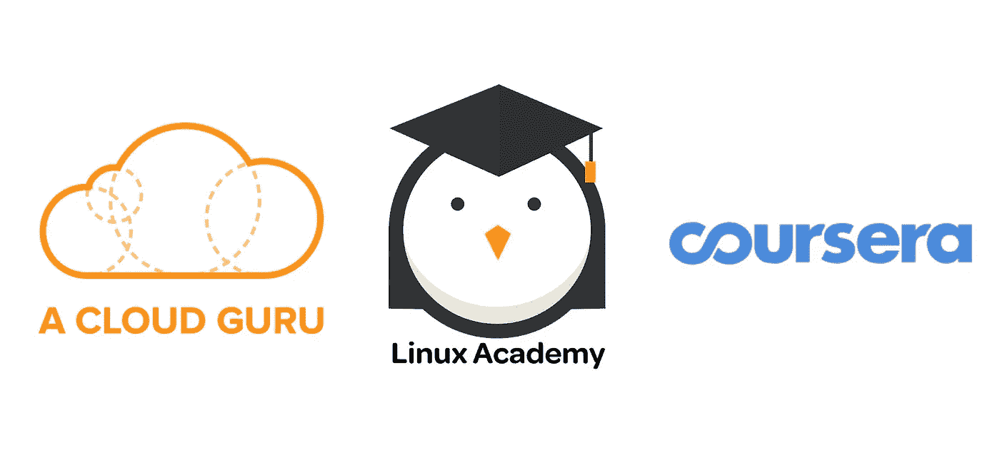
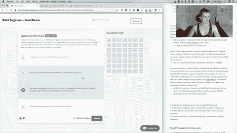

# 我是如何通过谷歌云专业数据工程师认证考试的

> 原文：<https://towardsdatascience.com/passing-the-google-cloud-professional-data-engineer-certification-87da9908b333?source=collection_archive---------0----------------------->

## 没有推荐的 3 年实践经验

Google hoodie: on. Game face: on. Photo from the video version of this article [on YouTube](https://youtu.be/bedzsHNSKnA).

****注:*** *本文献给 2019 年 3 月 29 日前的谷歌云专业数据工程师认证考试。在这个日期之后，有一些更新。我已经将这些包含在* ***临时演员*** *部分**

所以你想买一件和我在封面照片里的一样的新帽衫？

或者你一直在考虑获得[谷歌云专业数据工程师认证](https://cloud.google.com/certification/data-engineer)，你想知道如何去做。

在过去的几个月里，我一直在使用谷歌云参加课程，为专业数据工程师考试做准备。然后我就拿了。我通过了。几周后，我的连帽衫到了。证书来得更快。

这篇文章将列出一些你可能想知道的事情，以及我获得谷歌云专业数据工程师认证的步骤。

# 你为什么想做谷歌云专业数据工程师认证？

数据无处不在。人们需要知道如何建立能够处理和利用数据的系统。谷歌云提供了构建这些系统的基础设施。

你可能已经掌握了使用谷歌云的技能，但你如何向未来的雇主或客户展示这一点呢？两种方式。通过项目组合或认证。

一份证书对未来的客户和雇主说，“嘿，我有技能，我已经努力获得认证。”

谷歌的一句话总结了这一点。

> 展示您在谷歌云平台上设计和构建数据处理系统以及创建机器学习模型的熟练程度。

如果你还不具备这些技能，浏览认证的学习材料意味着你将学习如何在 Google Cloud 上构建世界一流的数据处理系统。

# 谁会想做谷歌云专业数据工程师认证？

你已经看过数据了。云在增长。它会一直留在这里。如果你还没有看到这些数字，请相信云正在增长。

如果你已经是一名数据科学家、数据工程师、数据分析师、机器学习工程师或正在寻找数据领域的职业转变，谷歌云专业数据工程师认证适合你。

能够使用云技术正成为任何一种以数据为中心的角色的要求。

# 做一个好的数据工程师/数据科学家/机器学习工程师需要*证书吗？*

号码

没有证书，你仍然可以使用谷歌云来处理数据解决方案。

证书只是现有技能的一种验证方法。

# 这要花多少钱？

参加认证考试需要 200 美元。如果你失败了，你将不得不再次支付重考费用。

准备课程和使用平台本身都有相关的成本。

平台成本是你使用谷歌云服务的费用。如果你是一个狂热的用户，你会很清楚这些。如果没有，并且您只是浏览了本文中的培训材料，您可以创建一个新的 Google Cloud 帐户，并在 Google 注册时提供的 300 美元积分内完成所有这些内容。

我们马上会谈到课程成本。

# 认证持续多长时间？

两年。之后，你需要再次参加考试。

由于 Google Cloud 每天都在发展，证书的要求很可能已经改变了(当我开始写这篇文章时，我发现情况就是这样)。

# 考试需要准备什么？

谷歌推荐 3 年以上的行业经验和 1 年以上使用 GCP 设计和管理解决方案的专业水平认证。

这两样我都没有。

更像是 6 个月一次。

为了补充这一点，我利用了在线培训资源的组合。

# 我学了什么课程？

如果你和我一样，没有推荐的要求，你可能想看看下面的一些课程来提升自己的技能。

以下课程是我用来准备认证的。它们是按照完成的顺序排列的。

我列出了通过认证考试的成本、时间表和帮助。

Some of the incredible online learning resources I used to upskill myself for the exam. In order, [A Cloud Guru](https://acloud.guru/), [Linux Academy](https://linuxacademy.com/), [Coursera](http://bit.ly/courserahome).

## [谷歌云平台上的数据工程 Cousera 上的专业化](http://bit.ly/courseraGoogleDataEng)

**费用:** $49 美元每月(7 天免费试用后)
**时间:**1-2 个月，每周 10+小时
**有用性:** 8/10

Coursera 上的[谷歌云平台数据工程是与谷歌云合作完成的。](http://bit.ly/courseraGoogleDataEng)

它分为五个子课程，每个子课程每周花费大约 10 个小时的学习时间。

如果你不熟悉谷歌云上的数据处理，这种专业化就像是 0 对 1。您将使用名为 QwikLabs 的迭代平台完成一系列实践练习。在此之前，将由谷歌云从业者就如何使用不同的服务，如谷歌 BigQuery，Cloud Dataproc，Dataflow 和 Bigtable 进行讲座。

## [云专家介绍谷歌云平台](https://acloud.guru/learn/gcp-101)

**费用:**免费
**时间:**1 周，4-6 小时
**有用性:** 4/10

不要把有用性分数低当成这门课没用。远非如此。它得分较低的唯一原因是它没有专注于专业数据工程师认证(这可以从标题中收集到)。

在完成 Coursera 专业化认证后，我将此作为复习，因为我只在少数专业用例中使用过谷歌云。

如果你来自另一家云服务提供商，或者以前从未使用过谷歌云，你可能想参加这个课程。这是对谷歌云平台整体的一个很好的介绍。

## [Linux Academy 谷歌认证专业数据工程师](https://linuxacademy.com/google-cloud-platform/training/course/name/google-cloud-data-engineer)

**费用:** $49 美元每月(7 天免费试用后)
**时间:**1-4 周，每周 4 小时以上
**有用性:** 10/10

完成考试后，回想我上过的课程，Linux Academy Google 认证专业数据工程师是最有帮助的。

这些视频，以及[数据档案电子书](https://www.lucidchart.com/documents/view/0ca44a63-4ea4-4d78-8367-2465512d21be/1)(课程附带的一个很棒的免费学习资源)和练习考试使这门课程成为我用过的最好的学习资源之一。

考试结束后，我甚至在一些笔记中向团队推荐了它。

> **Slack Notes**
> 考试中的一些内容是 Linux Academy 或云专家或 Google Cloud Practice 考试中没有的(预期)
> 1 个问题，其中包含数据点的图表以及对它们进行聚类所需的等式(例如 cos(X)或 X +Y )
> 了解数据流、Dataproc、数据存储、Bigtable、BigQuery、 Pub/Sub 以及如何使用它们是必须的
> 。考试中的两个案例研究与练习中的案例研究完全相同，尽管我在考试中根本没有阅读这些研究(问题提供了足够的洞察力)
> 了解一些基本的 SQL 查询语法非常有帮助，尤其是对于 BigQuery 问题
> 。Linux Academy 和 GCP 提供的练习考试与考试中的问题风格非常相似。 我会多次这样做，并使用它们来找出你的弱点
> 一点押韵来帮助 data proc:“**data proc**鳄鱼和 **Hadoop** 大象计划**点燃**一把火，煮一个**蜂巢**的**猪**”(data proc 处理 Hadoop，Spark， 蜂巢和猪)
> “**数据流**是流动的**光束**(数据流处理阿帕奇光束)
> “全世界的每个人**都能联想到一把**制作精良** **酸** **洗过的**扳手。” (Cloud Spanner 是一个完全为云设计的数据库，它符合 ACID 标准，全球可用)
> 。很容易知道关系和非关系数据库选项的名称(例如 MongoDB、Cassandra)
> 。IAM 角色对于每个服务略有不同，但了解如何将用户与设计工作流区分开来是有帮助的(例如数据流工作者角色可以设计工作流，但看不到数据)**
> 
> **这对现在来说可能足够了。每次考试的里程可能会有所不同。Linux 学院的课程将提供 80%的知识。**

## **[谷歌云 1 分钟视频](https://www.youtube.com/playlist?list=PLIivdWyY5sqIij_cgINUHZDMnGjVx3rxi)**

****费用:**免费
**时间:**1–2 小时
**有用性:** 5/10**

**这些都是在云专家论坛上推荐的。其中许多与专业数据工程师认证无关，但我挑选了一些我认可的。**

**在学习一门课程时，有些服务可能看起来很复杂，所以在一分钟内听到对某项服务的描述是很好的。**

## **[备考云专业数据工程师考试](http://bit.ly/preparingforGCPDataExam)**

****费用:** $49 认证或免费(无认证)
**时间表:**1-2 周，每周 6 小时以上
**有用性:**不适用**

**我在考试前一天发现了这个资源。由于时间限制，我没有这样做，因此缺乏有用性评级。**

**然而，在浏览课程概述页面后，它看起来像是一个很好的资源，可以将你在 Google Cloud 上学习的所有关于数据工程的东西汇集在一起，并突出任何弱点。**

**我把这个课程作为资源发给了我的一个准备认证的同事。**

## **[谷歌数据工程备忘单](https://github.com/ml874/Data-Engineering-on-GCP-Cheatsheet)作者[特立独行的林](http://mavericklin.com)**

****费用:**免费
**时间线:**不适用
**有用性:**不适用**

**这是我在考试后偶然发现的另一个资源。我看了一下，它既全面又简洁。另外，它是免费的。这可以用来在练习考试之间或者甚至在认证之后提醒你自己。**

## **获得李圣杰的谷歌云认证**

****费用:**每门课程 39 美元(共 3 门课程 49 美元)
**时间表:**自定进度
**有用性:**不适用**

**Sam 是一名大数据工程师和 web 开发人员，他将自己的 Google Cloud 知识融入到课程中。有三种不同的课程，包括[专业云架构师](http://bit.ly/gcpcertifiedcloudarchitect)、[专业数据工程师](http://bit.ly/gcpcertifieddataengineer)和[助理云工程师](http://bit.ly/gcpcertifiedassociate)。这是您需要的所有谷歌云认证的一站式商店。**

# **课后我做了什么？**

**在接近完成课程后，我提前一周预约了考试。**

**有一个截止日期是复习你所学内容的一个巨大动力。**

**我多次通过 Linux Academy 和 Google Cloud 的模拟考试，直到我每次都能以 95%以上的准确率完成它们。**

****

**Passing the Linux Academy practice exam with over 90% for the first time.**

**每个平台的测验都是相似的，但我发现复习我经常出错的答案，并写下为什么出错，有助于修复我的弱点。**

**我参加的考试使用了在 Google Cloud 上为两个案例研究设计数据处理系统作为主题(这是从 2019 年 3 月 29 日开始更改的)。从头到尾都是多项选择。**

**我花了大约两个小时。比我参加的任何模拟考试都要难 20%。**

**我怎么强调模拟考试的价值都不为过。**

# **如果再来一次，我会改变什么？**

**多练习考试。更实用的知识。**

**当然，你总是可以做更多的准备。**

**建议要求列出了使用 GCP 3 年以上的时间。但是我没有这个，所以我必须处理我所拥有的。**

# **临时演员**

**考试更新于 3 月 29 日。本文中的材料仍将为您提供一个良好的基础，但是，注意一些变化是很重要的。**

## **谷歌云专业数据工程师考试的不同部分([版本 1](https://cloud.google.com/certification/guides/data-engineer/) )**

**1.设计数据处理系统
2。建立和维护数据结构和数据库
3。分析数据和实现机器学习
4。为分析和优化建立业务流程模型
5。确保可靠性
6。可视化数据和倡导政策
7。安全性和合规性设计**

## **谷歌云专业数据工程师考试的不同部分([版本 2](https://cloud.google.com/certification/guides/data-engineer-2/) )**

**1.设计数据处理系统。建立和运行数据处理系统
3。操作化机器学习模型(大部分变化都发生在这里)**【新增】**
4。确保解决方案质量**

**版本 2 将版本 1 的第 1、2、4 和 6 部分合并为 1 和 2。它还将第 1 版的第 5 节和第 7 节合并为第 4 节。第二版的第三部分已经扩展到包括谷歌云的所有新的机器学习功能。**

**因为这些变化是最近才发生的，所以许多培训材料还没有机会更新。**

**然而，浏览本文中的材料应该足以涵盖您所需内容的 70%。我会将它与你自己对以下内容的一些研究结合起来(这些在考试的第二版中有介绍)。**

*   **[谷歌机器学习(ML)API](https://cloud.google.com/products/ai/)**
*   **[谷歌云机器学习引擎](https://cloud.google.com/ml-engine/)**
*   **[谷歌云 TPUs](https://cloud.google.com/tpu/) (谷歌专门为人工智能培训打造的定制硬件)**
*   **[谷歌 ML 术语表](https://developers.google.com/machine-learning/glossary/)**

**正如你所看到的，考试的最新更新非常关注谷歌云的 ML 功能。**

*****更新 29/04/2019:*** *来自 Linux 学院课程导师马修·乌拉森(Matthew Ulasien)的一段话。***

> **仅供参考，我们计划更新 Linux Academy 上的数据工程师课程，以反映五月中/下旬开始的新目标。**

*****更新 2019 年 1 月 6 日:****Linux Academy 课程导师马修·乌拉森的又一条消息。***

> **我们现在正处于计划阶段。我估计要花一个月的时间来完全更新它。**

# **考试后**

**当你完成考试时，你只会得到及格或不及格的结果。建议是至少要达到 70%,这就是为什么我在模拟考试中至少要达到 90%。**

**一旦你通过了测试，你将会收到一封电子邮件，里面有一个兑换码和你的官方谷歌云专业数据工程师证书。恭喜你！**

**你可以在一个专门的谷歌云专业数据工程师商店使用兑换代码，那里有很多赠品。有 t 恤，背包，帽衫(这些到了库存可能会有变化)。我选择了帽衫。**

**现在你已经通过了认证，你可以(正式地)展示你的技能，然后继续做你最擅长的事情，建筑。**

**两年后再见，重新认证。**

**PS 如果你有任何问题，或者想要澄清什么，你可以在 [Twitter](http://bit.ly/mrdbourketwitter) 和 [LinkedIn](http://bit.ly/mrdbourkelinkedin) 上找到我。在 YouTube 上也有这篇文章的视频版本。**

**PPS 非常感谢所有在上述课程中出色的讲师，以及 [Max Kelsen](http://www.maxkelsen.com) 为学习和准备考试提供的资源和时间。**