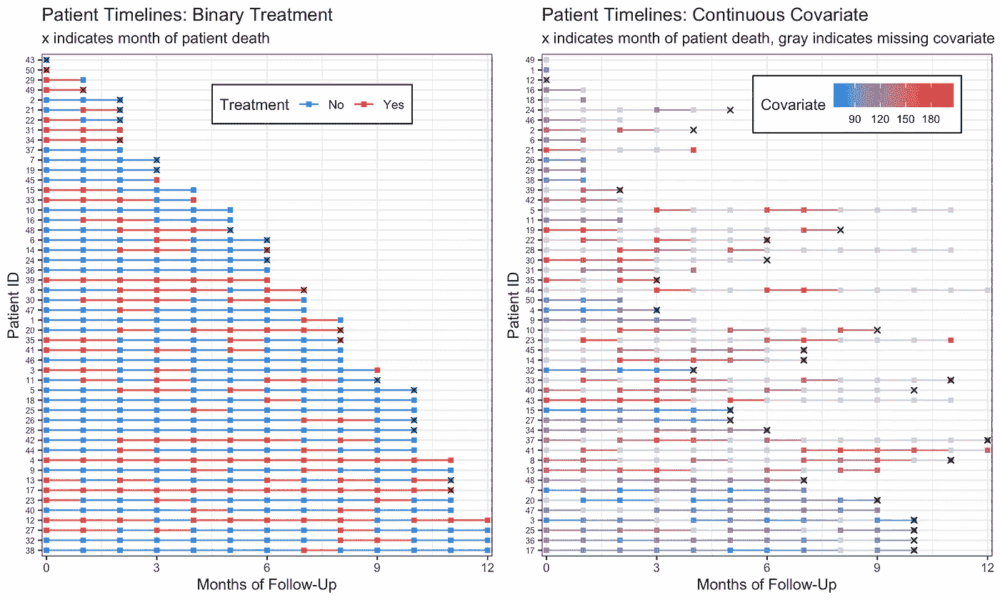
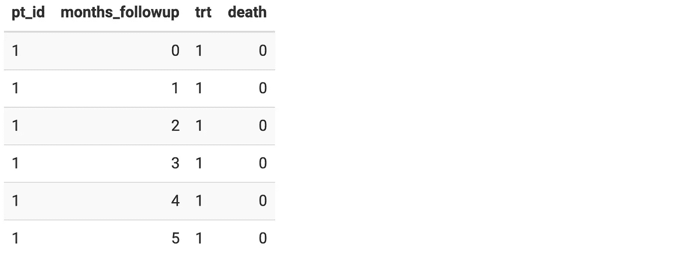
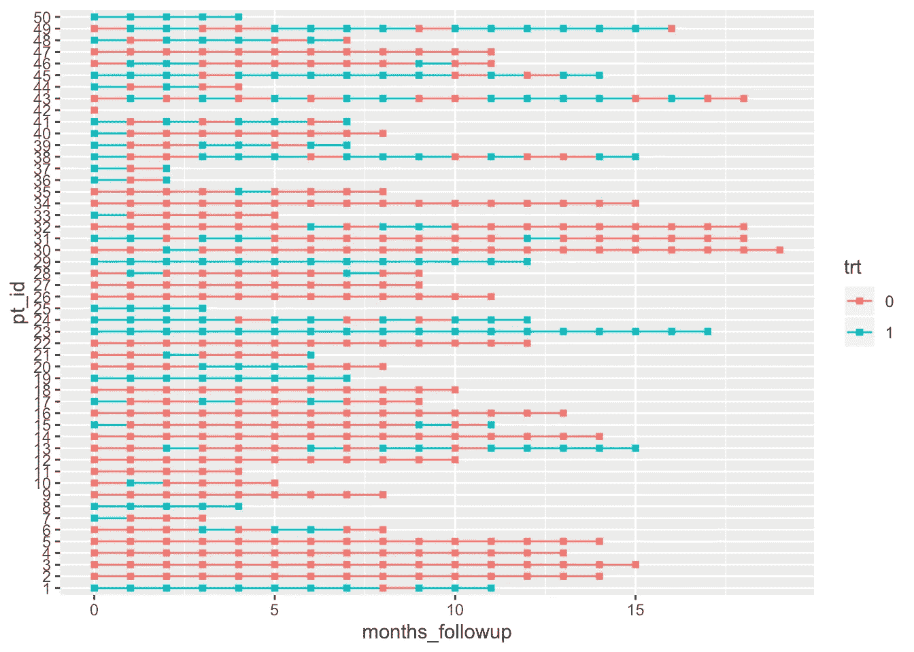
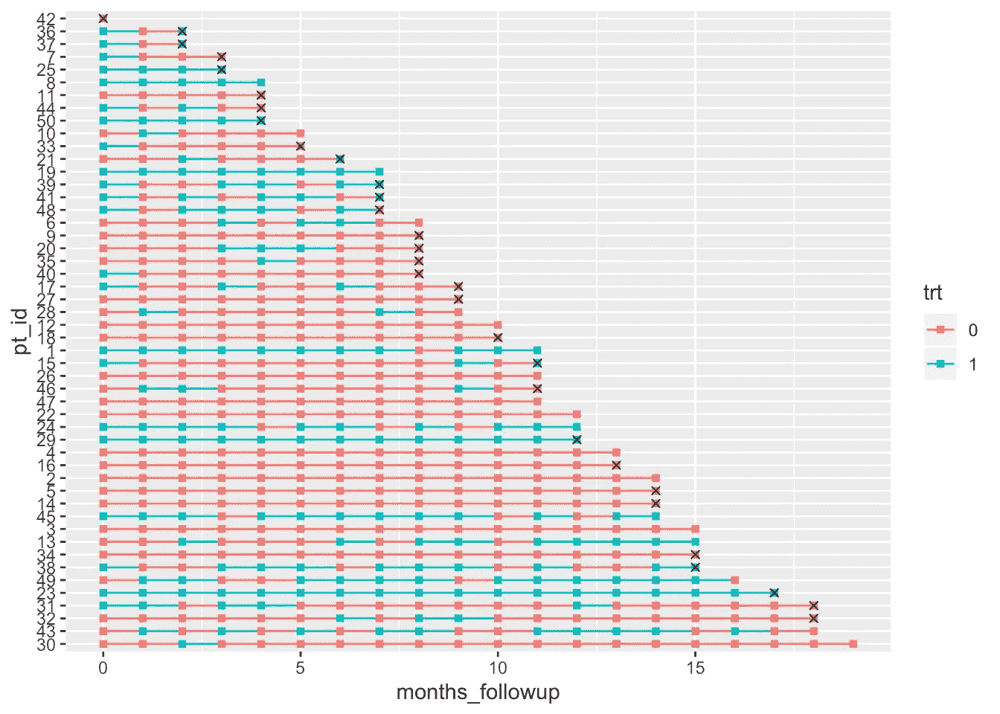
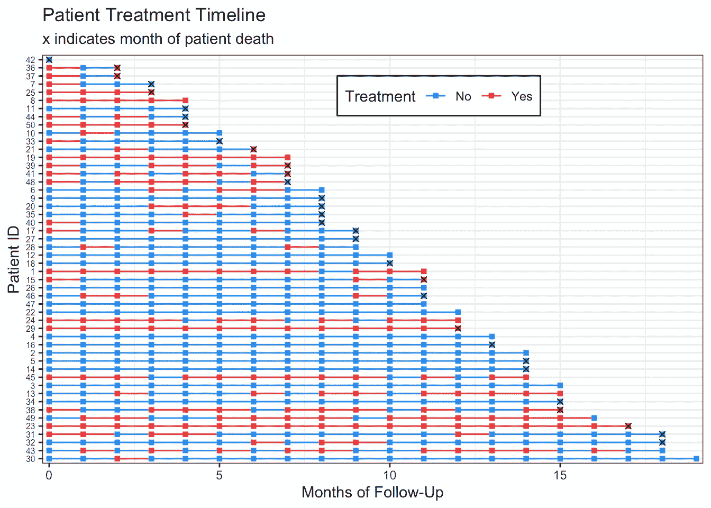
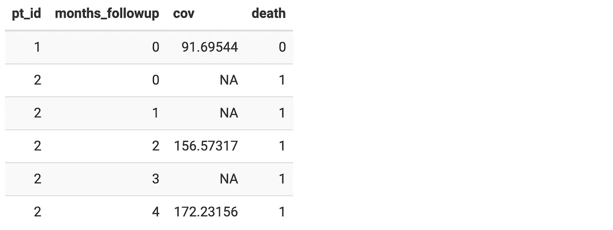
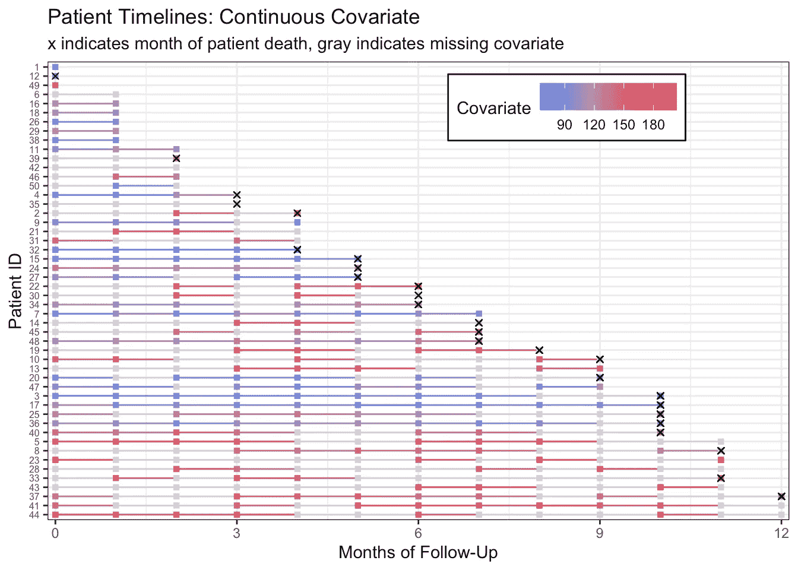
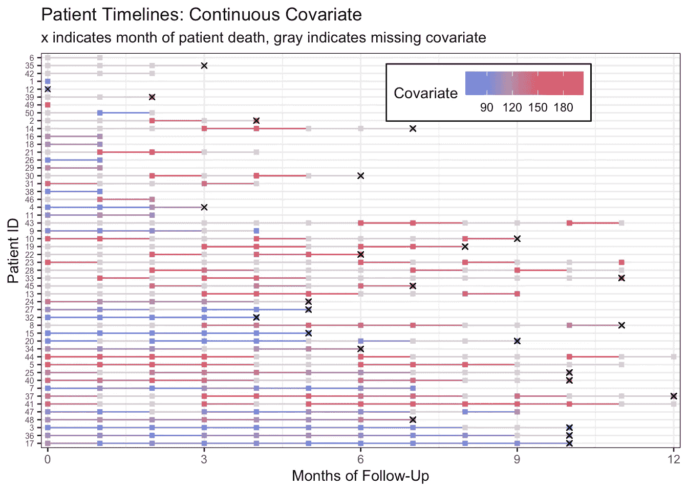
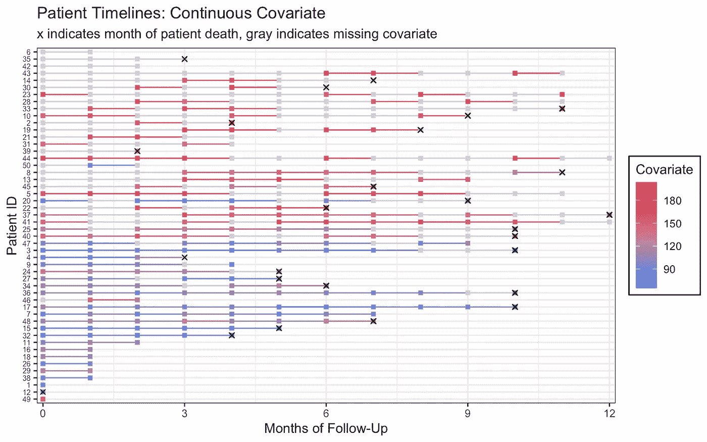

# 纵向生存数据的患者治疗时间表

> 原文：<https://towardsdatascience.com/patient-treatment-timelines-for-longitudinal-survival-data-81c65f5f3fba?source=collection_archive---------24----------------------->

我是一所研究型大学的生物统计学家，我经常发现自己在处理纵向生存数据。与任何数据分析一样，我需要检查我的数据的质量，然后再决定采用哪种统计方法。

这篇文章包含了一些可重复的例子，展示了我如何更喜欢直观地探索包含纵向暴露或协变量的生存数据。我为每个病人创建了一个“治疗时间表”,最终产品看起来像这样:



每条线代表一名患者，每个方块代表特定点的测量值。我发现这些图表有助于寻找随访时间、治疗和遗漏的模式或差异。它们还允许我在为我的分析进行不同的数据操作时验证我的编码是正确的。

对于下面的例子，我生成纵向生存数据集。我跳过了我是如何制作这些数据的，因为这不是这篇文章的重点，但是如果你对数据生成有疑问，请告诉我。总的来说，我试图从生存数据分析的角度出发，你已经计算了每个人的事件发生时间。

为了制作这些图表，我的第一步是加载包`tidyverse`，因为我使用了来自`dplyr`、`tidyr`、`forcats`和`ggplot2`的函数。

```
library(tidyverse)
```

下面是数据生成代码。如果你对我是如何制作的感兴趣，你可以查看评论，但如果不是，**我建议你复制并粘贴到你的** `**R**` **控制台来尝试绘图代码。**

```
set.seed(7)
# The data sets I make these visualizations for are typically 100-500 patients in size, but for space purposes I'll set my n to only 50.
n <- 50dat <-
  tibble(.rows = n) %>% # empty data frame / tibble with n rows
         mutate(pt_id = factor(row_number()), # patient ids are 1-n
         pt_trt_prob = runif(n,0,1), # randomly generate a treatment probability for each patient so we can see patterns
         months_followup = round(runif(n, 0, 20)), # randomly generate length of time in the study
         death = rbinom(n, 1, .5)) %>% # death randomly occurs at any time point. Obviously an unrealistic assumption. :)
  group_by(pt_id) %>% # group by patient so we can do more data manipulation
  complete(months_followup = full_seq(0:max(months_followup), 1)) %>% # add in all the months patients are in the study
  fill(pt_trt_prob, .direction = "up") %>% # fill in the treatment probability I made earlier so I can use this to add treatment for every time point
  ungroup() %>% # no longer need patients grouped 
  mutate(trt = factor(rbinom(row_number(), 1, pt_trt_prob^2)), # fill in treatment for everyone based on their treatment probability
  death = replace_na(death, 0)) %>% # also fill in death 
  select(pt_id, months_followup, trt, death) # remove leftover columns from data generation
```

我们来看数据。它是“长”格式的，在我的(假)研究中，每个患者的 ID 都是重复的。在每个月，我们都知道他们是否在接受治疗，以及他们是否在那个时间点死亡。第一个例子没有任何遗漏。

```
knitr::kable(head(dat))
```



我们现在可以用一种非常基本的方式来绘制我们的数据。我们真的只需要在`aes` thetics 中指定`x`-轴是时间，`y`-轴是主题 id，`col` or 应该对应治疗，*我们的线应该按照主题*与 `*group*` *连接在一起。别忘了最后一个！然后我们可以说我们希望`geom_line`为每个主题制作一个基本时间轴，时间轴上的点应该是正方形(`geom_point`映射函数中的`shape = 15`)。*

瞧啊！一个可爱的病人治疗时间表。

```
dat %>% ggplot(aes(x = months_followup, y = pt_id, group = pt_id, col = trt)) + geom_line() + geom_point(shape = 15)
```



好吧，不是*那个*可爱。但是那一点点代码真的是剧情的核心！如果你想添加死亡(或任何其他事件)的标记，并根据随访时间的长度重新排列，只需要一点额外的数据操作和一行额外的`ggplot2`代码。

```
dat %>%
 group_by(pt_id) %>% # make a new column with all patients last follow up visit
  mutate(last_month_followup = max(months_followup), # new variable for month that patients died, if they died 
  month_death = case_when(death == 1 ~ last_month_followup, TRUE ~ NA_real_)) %>% # reorder pt id by last month of follow up (highest to lowest)
# without fct_rev, chart is arranged in opposite direction (lowest to highest) 
  ungroup() %>%
  mutate(pt_id = fct_rev(fct_reorder(pt_id, last_month_followup))) %>%
  ggplot(aes(x = months_followup, y = pt_id, group = pt_id, col = trt)) +
  geom_line() +
  geom_point(shape = 15) + # add in a new mapping layer of points that correspond to death 
  geom_point(aes(x = month_death, y = pt_id), col = "black", shape = 4)## Warning: Removed 515 rows containing missing values (geom_point).
```



不要担心删除缺失值的警告—这是因为我们的`month_death`最多有`NA`个月，所以`geom_point`不知道在哪里放一个‘x’标记。

最后，让我们努力让情节看起来更好一点:

```
dat %>%
 group_by(pt_id) %>%
 mutate(last_month_followup = max(months_followup), month_death = case_when(death == 1 ~ last_month_followup, TRUE ~ NA_real_)) %>% 
 ungroup() %>% 
 mutate(pt_id = fct_rev(fct_reorder(pt_id, last_month_followup)), # make the treatment variable labels nicer
        trt = factor(trt, levels=0:1, labels=c("No","Yes"))) %>%
 ggplot(aes(x = months_followup, y = pt_id, group = pt_id, col = trt)) +
 geom_line() +
 geom_point(shape = 15) +
 geom_point(aes(x = month_death, y = pt_id), col = "black", shape = 4) +
 theme_bw() + 
 labs(x = "Months of Follow-Up", y = "Patient ID", col = "Treatment", title = "Patient Treatment Timeline", subtitle = "x indicates month of patient death") +
 # edit legend box and make patient ids small
 theme(axis.text.y = element_text(size=6), legend.position = c(.6, .9), legend.direction = "horizontal", legend.background = element_rect(linetype="solid", colour ="black")) + 
# remove extra space around timeline
 scale_x_continuous(expand=c(0.01,0.01)) + # set the color of the lines and points
 scale_color_manual(values=c("dodgerblue","firebrick1"))## Warning: Removed 515 rows containing missing values (geom_point).
```



我从来没有制作过这些情节中的一个用于出版，所以我不介意字幕包含图例信息。如果您希望图例中有`month_death`标记，您可以更改:

```
geom_point(aes(x = month_death, y = pt_id), col = "black", shape = 4)
```

收件人:

```
geom_point(aes(x = month_death, y = pt_id, shape = month_death), col = "black")
```

我们可以按照同样的步骤，为一个连续变量制作时间线。

同样，这是数据生成代码，因此您可以自己绘制这些图:

```
dat_cc <-
 tibble(.rows = n) %>%
 mutate(pt_id = row_number(),
        months_followup = round(runif(n, 0, 12)), # random months of follow up
        pt_cov_mean = runif(n, 80, 150), # random mean of a patient's covariate measures
        death = rbinom(n, 1, 0.5)) %>% # random death
 group_by(pt_id) %>%
 complete(months_followup = full_seq(0:max(months_followup), 1)) %>%
 fill(pt_cov_mean, death, .direction = "up") %>% 
 mutate(last_month_followup = max(months_followup),
        death_date = case_when(death == 1 ~ last_month_followup,
                               TRUE ~ NA_real_)) %>%
 ungroup() %>%
 mutate(cov = rnorm(row_number(),
        pt_cov_mean, 10)) # everyone's covariates are close to their original mean (use to see patterns later)
```

这一次，我在我的模拟协变量测量中纳入了患者水平的遗漏，以显示我们如何使用这些图来查看遗漏的潜在模式。

```
dat_cc_samp <-
 dat_cc %>%
 mutate(idx = row_number()) %>%
 sample_frac(.4, weight = pt_cov_mean^3) %>%
 # sample 40% of data, with weights for the sample determined by the patient's mean covariate. This would mean patients with a higher mean covariate measure are more likely to have missing data.
 pull(idx)dat_cc_miss <-
 dat_cc %>%
 mutate(cov = case_when(row_number() %in% dat_cc_samp ~ NA_real_,
                        TRUE ~ cov)) %>%
 select(pt_id, months_followup, cov, death)
```

再次查看我们将使用的数据:

```
knitr::kable(head(dat_cc_miss))
```



我们可以绘制数据，并用灰色的时间线点和线来观察这种缺失:

```
dat_cc_miss %>%
 group_by(pt_id) %>%
 mutate(last_month_followup = max(months_followup),
        month_death = case_when(death == 1 ~ last_month_followup,
                                TRUE ~ NA_real_)) %>%
 ungroup() %>%
 mutate(pt_id = fct_rev(fct_reorder(factor(pt_id), last_month_followup))) %>%
 ggplot(aes(x = months_followup, y = pt_id, group = pt_id, col = cov)) +
 geom_line() +
 geom_point(shape = 15) +
 geom_point(aes(x = month_death, y = pt_id), shape=4, col="black") + theme_bw() +
 labs(x = "Months of Follow-Up", y = "Patient ID", col = "Covariate", title = "Patient Timelines: Continuous Covariate", subtitle = "x indicates month of patient death, gray indicates missing covariate") +
 theme(axis.text.y = element_text(size=6), legend.position = c(.7, .9), legend.direction = "horizontal", legend.background = element_rect(linetype="solid", colour ="black")) +
 scale_x_continuous(expand=c(0.01,0.01)) +
 scale_color_gradient(low="dodgerblue", high="firebrick1", na.value = "lightgray", breaks=c(90, 120, 150, 180))## Warning: Removed 143 rows containing missing values (geom_point).
```



或者，我们可以通过创建一个包含`sum(!is.na(cov))`的新列，并根据该列重新排列我们的`pt_id`，根据我们对每个患者的`cov`变量的测量数量重新排列我们的时间线。

```
dat_cc_miss %>%
 group_by(pt_id) %>%
 mutate(last_month_followup = max(months_followup), # a column containing how many measures we have for each patient
        n_measures = sum(!is.na(cov))) %>%
 ungroup() %>%
 mutate(pt_id = fct_rev(fct_reorder(factor(pt_id), n_measures)), # reorder IDs by number of measures we have for each patient
        month_death = case_when(death == 1 ~ last_month_followup,
                                TRUE ~ NA_real_)) %>%
 ggplot(aes(x = months_followup, y = pt_id, group = pt_id, col = cov)) +
 geom_line() +
 geom_point(shape = 15) +
 geom_point(aes(x = month_death, y = pt_id), shape=4, col="black") +
 theme_bw() +
 labs(x = "Months of Follow-Up", y = "Patient ID", col = "Covariate", title = "Patient Timelines: Continuous Covariate", subtitle = "x indicates month of patient death, gray indicates missing covariate") +
 theme(axis.text.y = element_text(size=6),
       legend.position = c(.7, .9),
       legend.direction = "horizontal",
       legend.background = element_rect(linetype="solid", colour ="black")) +
 scale_x_continuous(expand=c(0.01,0.01)) +
 scale_color_gradient(low="dodgerblue",high="firebrick1",na.value = "lightgray", breaks=c(90, 120, 150, 180))## Warning: Removed 143 rows containing missing values (geom_point).
```



从该图中我们可以看出，缺失测量值较多的患者具有较高的协变量测量值。如果我们按照非缺失测量值的比例重新排列患者，这一点会变得更加清楚。

```
dat_cc_miss %>%
 group_by(pt_id) %>%
 mutate(last_month_followup = max(months_followup), # the proportion is the total number of measures divided by the total months of followup
        prop_measures = sum(!is.na(cov))/last_month_followup) %>%
 ungroup() %>%
 # reorder IDs by proportion of measures we have for each patient
 mutate(pt_id = fct_rev(fct_reorder(factor(pt_id), prop_measures)),
        month_death = case_when(death == 1 ~ last_month_followup,
                                TRUE ~ NA_real_)) %>%
 ggplot(aes(x = months_followup, y = pt_id, group = pt_id, col = cov)) +
 geom_line() +
 geom_point(shape = 15) +
 geom_point(aes(x = month_death, y = pt_id), shape=4, col="black") +
 theme_bw() +
 labs(x = "Months of Follow-Up", y = "Patient ID", col = "Covariate", title = "Patient Timelines: Continuous Covariate", subtitle = "x indicates month of patient death, gray indicates missing covariate") +
 theme(axis.text.y = element_text(size=6), # move legend to the side by removing legend location
       legend.background = element_rect(linetype="solid", colour ="black")) +
 scale_x_continuous(expand=c(0.01,0.01)) +
 scale_color_gradient(low="dodgerblue",high="firebrick1",na.value = "lightgray", breaks=c(90, 120, 150, 180))## Warning: Removed 143 rows containing missing values (geom_point).
```



如果这是我的真实数据，我会和我的研究合作者一起跟进，以获得更多关于遗漏机制的信息。

如果您对数据集有任何问题或建议，请告诉我。快乐治疗时间表绘制！

*原载于 2019 年 11 月 29 日*[*【https://www.khstats.com】*](https://www.khstats.com/blog/trt-timelines/trt-timelines/)*。*